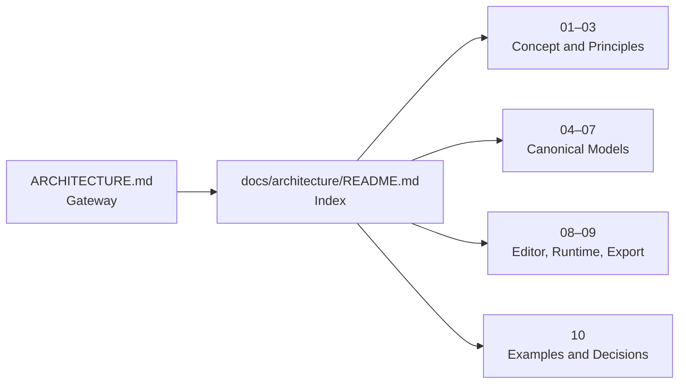

# Visual UI & Flow Builder Architecture Design

> Status: Draft / Architecture Baseline
>
> Canonical index: [Architecture Index](./docs/architecture/README.md)
>
> Split rationale and migration record: [Architecture Document Split](./ARCHITECTURE_SPLIT_PROPOSAL.md)

## Overview

本Architectureは、Visual UI & Flow BuilderのProduct Concept、Canonical Data Model、Editor、Runtime、Export、ValidationおよびRoadmapを定義する。

本文はReview Scopeと変更責務を明確にするため、Domain別の10ファイルへ分割している。章番号は既存の`1`〜`22`を維持し、各章内の`1.1`形式の見出しも変更していない。

## Documents

- [Architecture Index](./docs/architecture/README.md)
  - [01 Product Overview](./docs/architecture/01-product-overview.md) — Sections 1–2
  - [02 Core Principles](./docs/architecture/02-core-principles.md) — Section 3
  - [03 Technology and System Architecture](./docs/architecture/03-technology-and-system-architecture.md) — Sections 4–5
  - [04 Project Document Model](./docs/architecture/04-project-document-model.md) — Section 6
  - [05 UI and Responsive Model](./docs/architecture/05-ui-and-responsive-model.md) — Sections 7, 9
  - [06 Flow and Execution Model](./docs/architecture/06-flow-and-execution-model.md) — Sections 8, 15
  - [07 State, Command, and History](./docs/architecture/07-state-command-and-history.md) — Sections 10–11
  - [08 Editor, Preview, and Debugging](./docs/architecture/08-editor-preview-and-debugging.md) — Sections 12, 17
  - [09 Export, Validation, and Integration](./docs/architecture/09-export-validation-and-integration.md) — Sections 13–14, 16, 18
  - [10 Examples, Roadmap, and Decisions](./docs/architecture/10-examples-roadmap-and-decisions.md) — Sections 19–22

## Reading Guide

| Reader | Recommended path |
|---|---|
| Product / Design | [01 Product Overview](./docs/architecture/01-product-overview.md) → [02 Core Principles](./docs/architecture/02-core-principles.md) → [05 UI and Responsive Model](./docs/architecture/05-ui-and-responsive-model.md) |
| Data Model / Runtime | [02 Core Principles](./docs/architecture/02-core-principles.md) → [04 Project Document Model](./docs/architecture/04-project-document-model.md) → [05 UI](./docs/architecture/05-ui-and-responsive-model.md) → [06 Flow](./docs/architecture/06-flow-and-execution-model.md) → [07 State](./docs/architecture/07-state-command-and-history.md) |
| Editor implementation | [03 System Architecture](./docs/architecture/03-technology-and-system-architecture.md) → [08 Editor and Debugging](./docs/architecture/08-editor-preview-and-debugging.md) → [09 Export and Validation](./docs/architecture/09-export-validation-and-integration.md) |
| Planning / Decision review | [10 Examples, Roadmap, and Decisions](./docs/architecture/10-examples-roadmap-and-decisions.md) |

## Maintenance Rule

各定義のCanonical Sourceは、Architecture IndexからリンクされるDomain別本文ファイルとする。変更時は、同じ概念を複数ファイルへ複製せず、Ownerとなる本文を更新して相互参照を張る。
