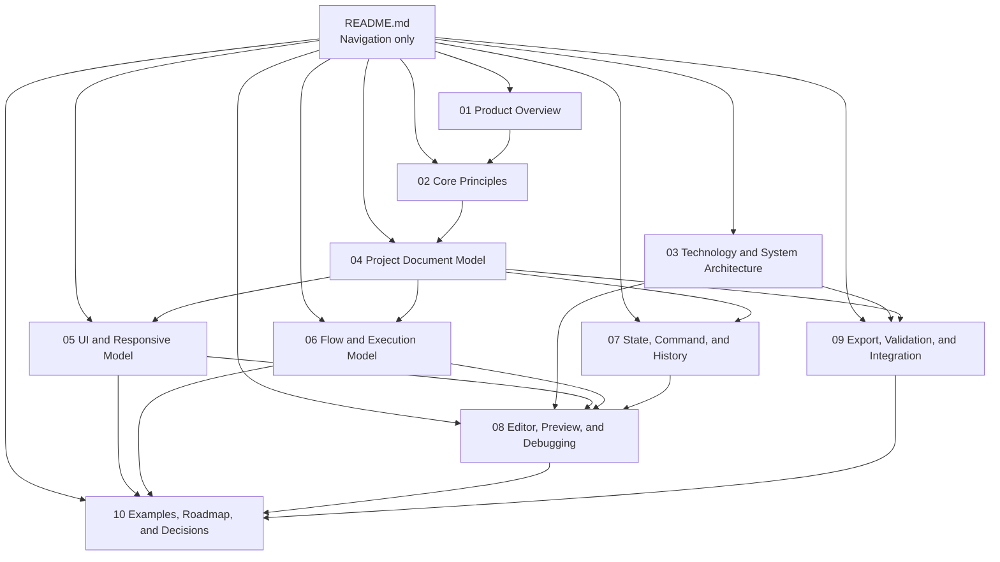
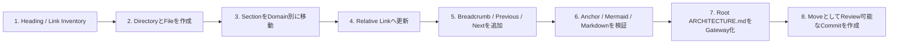

# Architecture Document Split Proposal

> Status: Implemented
>
> Target: `ARCHITECTURE.md`
>
> Result: Split into 1 index file + 10 content files
>
> Architecture index: [docs/architecture/README.md](./docs/architecture/README.md)

## 1. 結論

分割を推奨する。

現在の `ARCHITECTURE.md` は、Product Concept、Canonical Data Model、Runtime、Editor、Deployment、Example、Roadmapまでを1ファイルで扱っている。
章内Navigationは目次で改善できるが、Review Scope、変更差分、章間Ownership、並行編集の観点では単一ファイルが大きすぎる。

推奨構成は以下の11ファイルである。

- 1個の入口・索引ファイル
- 10個のDomain別本文ファイル

「約10ファイル」という粒度を維持しながら、Project / UI / FlowのCanonical Modelを独立してReviewできる。

## 2. 推奨Directory Structure

```text
docs/
└─ architecture/
   ├─ README.md
   ├─ 01-product-overview.md
   ├─ 02-core-principles.md
   ├─ 03-technology-and-system-architecture.md
   ├─ 04-project-document-model.md
   ├─ 05-ui-and-responsive-model.md
   ├─ 06-flow-and-execution-model.md
   ├─ 07-state-command-and-history.md
   ├─ 08-editor-preview-and-debugging.md
   ├─ 09-export-validation-and-integration.md
   └─ 10-examples-roadmap-and-decisions.md
```

Rootの `ARCHITECTURE.md` は削除せず、短いOverviewと上記IndexへのLinkを持つGatewayへ変更する。

## 3. Section Mapping

| File | Current Sections | Responsibility |
|---|---|---|
| `README.md` | Current Table of Contents | Reading Path、全File Index、主要DecisionへのShortcut |
| `01-product-overview.md` | 1〜2 | Purpose、Product Concept、Representative Application |
| `02-core-principles.md` | 3 | Source of Truth、Boundary、Invariant、Core Data Flow |
| `03-technology-and-system-architecture.md` | 4〜5 | Technology Boundary、High-Level Architecture、Runtime接続 |
| `04-project-document-model.md` | 6 | Project Schema、Stable ID、Reference、Migration、Validation |
| `05-ui-and-responsive-model.md` | 7、9 | UI Node、Layout、Slot、Surface、Drag、Responsive Override |
| `06-flow-and-execution-model.md` | 8、15 | Flow Graph、Expression、Runtime、Type、Error、Cancellation |
| `07-state-command-and-history.md` | 10〜11 | State Scope、Mutation、Command、Transaction、Undo / Redo |
| `08-editor-preview-and-debugging.md` | 12、17 | Editor Shell、Interaction Surface、Preview、Debug、Mock |
| `09-export-validation-and-integration.md` | 13〜14、16、18 | Export、Hosting、Security、Validation、Registry、Naming |
| `10-examples-roadmap-and-decisions.md` | 19〜22 | End-to-End Example、MVP、Roadmap、Decision Index、Summary |

## 4. Dependency Direction



Reference Directionは原則としてOverviewからDetail、Canonical ModelからEditor / Export、CoreからExampleへ向ける。
ExampleやEditorの都合からCanonical Modelを逆定義しない。

## 5. Split Rules

### 5.1 Canonical Definitionを1か所に置く

同じRuleを複数FileへCopyしない。

例:

- Stable IDの規範本文は `04-project-document-model.md`
- UI Nodeの規範本文は `05-ui-and-responsive-model.md`
- Flow Nodeの規範本文は `06-flow-and-execution-model.md`
- 他FileではRelative Linkで参照する

### 5.2 Section Number

初回分割では既存Section Numberを維持する。
番号をFile単位で振り直すと、既存のSection ReferenceとReview Commentが一度に壊れるためである。

分割後の例:

```markdown
See [Section 8.37 Subflow](./docs/architecture/06-flow-and-execution-model.md#837-subflowでbehaviorを再利用する).
```

将来、Link Migrationと同時にFile-local Numberへ変更することは可能。

### 5.3 File Navigation

各Fileの先頭と末尾に以下を置く。

```text
Architecture Index
Previous File
Next File
Related Canonical Sections
```

Browser Backだけに依存せず、順番読みとDomain読みの両方を可能にする。

### 5.4 Mermaid Diagram

Diagramは意味を定義するFileへ配置する。

- Cross-system Architectureは `03-technology-and-system-architecture.md`
- UI Layout / Surfaceは `05-ui-and-responsive-model.md`
- Flow Executionは `06-flow-and-execution-model.md`
- Editor / Previewは `08-editor-preview-and-debugging.md`
- End-to-End Diagramは `10-examples-roadmap-and-decisions.md`

同一Diagramを複数Fileへ複製しない。

## 6. Root ARCHITECTURE.md after Split

Root Fileは以下だけを保持する。

```text
Architecture Title / Status
      ↓
Short Product Summary
      ↓
Architecture Index Link
      ↓
Recommended Reading Paths
├─ First-time Reader
├─ Project / Schema Implementer
├─ UI / Editor Implementer
├─ Flow / Runtime Implementer
└─ Export / Security Reviewer
```

既存のFull Documentが必要な場合は、各Fileを順番に結合した `ARCHITECTURE_FULL.md` をGenerated Artifactとして作成できる。
Generated Full DocumentをCanonical Sourceにしない。

## 7. Migration Steps



File Moveと内容修正を同じCommitで大量に混ぜない。
最初のSplit Commitは移動とLink修正を中心とし、文言変更は後続Commitへ分離する。

## 8. Risks and Mitigations

| Risk | Mitigation |
|---|---|
| Relative Link切れ | Heading / Anchor / File Pathの自動検証を追加 |
| 同じRuleの重複 | Canonical FileをSection Mappingで固定 |
| 読む順番が不明 | READMEにRole別Reading Pathを用意 |
| Searchが分散 | Repository SearchとGenerated Full Documentを利用 |
| File MoveでDiffが読みにくい | Move CommitとRewrite Commitを分離 |
| Section Numberが不連続 | 初回は既存番号を維持し、Indexで補う |

## 9. Implementation Result

本Proposalに従い、次の分割を実施した。

1. `docs/architecture/` にIndex 1ファイルとDomain別本文10ファイルを作成した。
2. Sections 1〜22を重複なくDomain別本文へ移動した。
3. 各本文にIndex・Previous・Next Navigationを追加した。
4. Root `ARCHITECTURE.md` をGatewayへ変更した。
5. 既存のSection NumberとHeading Anchorを維持した。

今後のCanonical Sourceは[Architecture Index](./docs/architecture/README.md)から参照されるDomain別本文とする。Full Documentが必要な場合はCanonical Sourceを複製せず、本文10ファイルから生成する。
