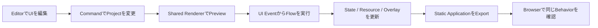
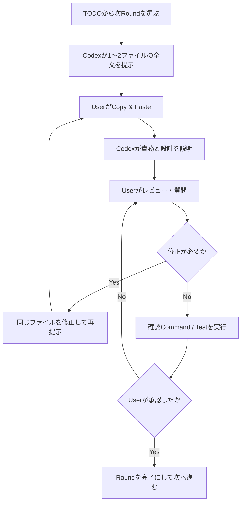

# FlagShip Implementation TODO

> Status: In progress
>
> Scope: MVP vertical slice
>
> Architecture: [Architecture Index](./architecture/README.md) / [Delivery Scope and Roadmap](./architecture/10-examples-roadmap-and-decisions.md#20-delivery-scope-and-roadmap)

## 1. Purpose

本書は、FlagShipのArchitectureを実装へ移すための順序、各Roundで提示するファイル、レビュー方法および完了条件を管理する。

MVPは、次のEnd-to-End経路を最小構成で成立させる。

## 2. Implementation and Review Policy

### 2.1 One Round, One or Two Files

- 1往復で提示する実装ファイルは1〜2個とする。
- 各ファイルはPathと省略のない全文を提示する。
- Userは提示内容をRepositoryへCopy & Pasteし、貼付完了を伝える。
- CodexはそのRoundの目的、責務、依存関係、Data Flow、設計判断、確認方法を説明する。
- Userは説明を確認し、不足・疑問・変更要求を提示する。
- 修正時は原則として同じファイルの全文を再提示し、未承認のまま次Roundへ進まない。
- Userが明示的に承認した後、このTODOの該当Roundを完了扱いにする。
- この方針が変更されない限り、Codexは実装ファイルをRepositoryへ直接作成しない。

`package-lock.json`、型生成物などToolが生成するファイルは手書きしない。生成Commandを提示し、Userが実行した結果をレビューする。生成物は「提示する1〜2ファイル」には数えないが、生成元と検証方法を同じRoundで明示する。

### 2.2 Round Flow

### 2.3 Required Explanation for Every Round

各Roundのレビューでは、少なくとも次を説明対象とする。

1. 各ファイルが持つ責務と持たない責務
2. Architecture上の対応Section
3. Input、Output、主要Data Structure
4. 他Moduleへの依存方向
5. 採用した実装方法と代替案のTrade-off
6. Error、Security、Browser Compatibility上の注意
7. Userが実行する確認Commandと期待結果

### 2.4 Definition of Done per Round

- 提示ファイル数が1〜2個である。
- TypeScript、Lint、Test等、その時点で利用可能な検証が成功する。
- 未使用のDependencyや暫定的なSecretを追加していない。
- Canonical ModelをDOM、Svelte State、Generated HTMLへ重複保持していない。
- Userからの質問と修正要求が解消している。
- Userが次Roundへの移行を明示的に承認している。

## 3. Status Legend

- `[ ]` Not started
- `[~]` Presented or under review
- `[x]` Approved and complete
- `[!]` Blocked; reason must be written under the item

## 4. Implementation Rounds

File Pathは現時点の計画であり、該当Roundの開始時に既存構成とArchitectureを照合して確定する。Pathを変更する場合も、1Roundの上限は維持する。

### Phase 0 — Development Environment and Minimal Editor Shell

#### [x] Round 01 — Container Development Environment

First files:

1. `Dockerfile`
2. `compose.yaml`

Purpose:

- Node.jsベースの再現可能な開発環境を提示する。
- Source bind mount、Dependency volume、Editor用Portを定義する。
- Application scaffoldが未作成でも、Environmentの責務と起動経路をレビュー可能にする。

Review focus:

- Base imageとNode.js versionの固定方針
- Container user、File permission、Working directory
- Port、Volume、Environment variable
- Development用ContainerとGenerated Application Runtimeの分離

Round 01ではApplication Dependencyがまだ存在しないため、最終的なDev Server起動確認はRound 02完了後に行う。

#### [x] Round 02 — Package and Container Context

Files:

1. `package.json`
2. `.dockerignore`

Purpose:

- Svelte 5、TypeScript、Vite、Test Toolの最小DependencyとScriptを定義する。
- Container build contextから不要Fileを除外する。

Verification:

- Container内でDependencyをInstallする。
- LockfileをToolで生成し、Dependency versionとInstall結果をレビューする。
- `docker compose up`でDev Server Commandが開始できることを確認する。

#### [x] Round 03 — TypeScript and Build Configuration

Files:

1. `tsconfig.json`
2. `vite.config.ts`

Purpose:

- Strict TypeScriptとSvelte 5のBuild境界を定義する。
- Editor Buildと将来のRuntime / Export Moduleを分離可能にする。

#### [x] Round 04 — Browser Entry

Files:

1. `index.html`
2. `src/main.ts`

Purpose:

- Editor ApplicationのBrowser Entryを作成する。
- DOM bootstrap以外のApplication LogicをEntryへ置かない。

#### [x] Round 05 — Minimal Svelte Editor Shell

Files:

1. `src/editor/App.svelte`
2. `src/editor/styles.css`

Purpose:

- Empty Editor Shellを表示する。
- Canvas、Tree、Inspector、Flow Editorの将来Regionを仮配置する。

#### [x] Round 06 — Test Bootstrap

Files:

1. `vitest.config.ts`

Purpose:

- DOMに依存しないCore Unit TestとBrowser-facing Testの基盤を用意する。

Phase 0 exit criteria:

- `docker compose up`からEditor Shellを表示できる。
- Type check、Build、Testの各CommandがContainer内で成功する。
- Generated ApplicationがNode.jsやSvelteをRuntime Requirementにしない方針が維持されている。

### Phase 1 — Canonical Project Model

Architecture reference: [Project Document Model](./architecture/04-project-document-model.md)

#### [x] Round 07 — Value and Reference Types

Files:

1. `src/core/model/value.ts`
2. `src/core/model/reference.ts`

#### [x] Round 08 — Initial UI Document Types

Files:

1. `src/core/model/ui.ts`
2. `src/core/model/ui.test.ts`

#### [x] Round 09 — Flow Document Types

Files:

1. `src/core/model/flow.ts`
2. `src/core/model/flow.test.ts`

#### [x] Round 10 — State and Resource Types

Files:

1. `src/core/model/state.ts`
2. `src/core/model/resource.ts`

#### [x] Round 11 — Project Document and Schema Version

Files:

1. `src/core/model/project.ts`
2. `src/core/model/schema-version.ts`

#### [x] Round 12A — UI Page and Content Tree

Files:

1. `src/core/model/ui.ts`
2. `src/core/model/ui.test.ts`

Purpose:

- UI Document、UI Page、UI Tree、Content Nodeを定義する。
- Content NodeがStateとSlotを持つことを定義する。
- ComponentのContent Treeが最大1つになる制約はComponent Model側で検証する。

#### [x] Round 12B — Flow Graph and Flow Node

Files:

1. `src/core/model/flow.ts`
2. `src/core/model/flow.test.ts`

Purpose:

- Flow Document、Flow Graph、Flow Nodeの永続Modelを定義する。
- RuntimeのFlow Executionを永続Modelへ含めない。
- Project共通GraphとComponent固有Graphで同じSchemaを使えるようにする。

#### [x] Round 12C — Component, Overlay Tree, and Trigger

Files:

1. `src/core/model/component.ts`
2. `src/core/model/component.test.ts`

Purpose:

- ComponentがContent Treeを0..1、Overlay TreeとFlow Graphを0..n持つ構造を定義する。
- Overlay TreeをTrigger Instance、Positioning Rule、Content Treeの組として定義する。
- Open Triggerが`null`のModalと、初期接続済みPopup Buttonを表現できることを検証する。

#### [x] Round 12D — State Ownership

Files:

1. `src/core/model/state.ts`
2. `src/core/model/state.test.ts`

Purpose:

- State DocumentをApplication共有Stateに限定する。
- Component Instance Stateの初期値とSchemaをContent Node側から利用できる型にする。
- Runtime Current ValueやFlow Execution Stateを永続Modelへ含めない。

#### [x] Round 12E — Project Composition and Component Instance

Files:

1. `src/core/model/project.ts`
2. `src/core/model/project.test.ts`

Purpose:

- UI PageへComponent Instanceを配置し、Component IDとVersionを参照する。
- Project共通Flow Graphと取り込み済みComponentをProject Documentへ統合する。
- UI PageまたはContent TreeがComponent Instanceを所有し、親・Slot・順序はChild Placementだけが保持する。
- Component Instance PathがComponent-local EntityのScopeになることを検証する。

#### [x] Round 12F — Stable ID and Structured Reference

Files:

1. `src/core/id.ts`
2. `src/core/model/reference.ts`

Purpose:

- UI Page、Component、Component Instance、Content Node、Overlay Tree、Flow Graph、Flow NodeのIDを区別する。
- Project共通Referenceと、Component Instance Path + Local IDによるComponent-local Referenceを表現する。

#### [x] Round 12G — Reference Resolution

Files:

1. `src/core/references.ts`
2. `src/core/references.test.ts`

Purpose:

- Component Instance Pathを明示するReferenceと、Current Component Instanceからの相対Referenceを解決する。
- Content Node、Overlay Tree、Flow Graph、State、ResourceのMissing Targetを検出する。

#### [x] Round 13 — Project Validation

Files:

1. `src/core/validation/validate-project.ts`
2. `src/core/validation/validate-project.test.ts`

#### [ ] Round 14 — Serialization and Migration

Files:

1. `src/core/serialization.ts`
2. `src/core/migration.ts`

Phase 1 exit criteria:

- Representative ProjectをJSONへRound-tripできる。
- Component Version、Stable ID、Reference切れ、Circular Reference、Schema Versionを検証できる。
- ComponentがContent Tree 0..1、Overlay Tree 0..n、Flow Graph 0..nの制約を満たす。
- Project ModelがSvelte、DOM、Editor-only Stateへ依存していない。

### Phase 2 — Command, Transaction, Normalization, and History

Architecture reference: [State, Command, and History](./architecture/07-state-command-and-history.md)

#### [ ] Round 15 — Command and Transaction Contracts

Files:

1. `src/core/commands/command.ts`
2. `src/core/commands/transaction.ts`

#### [ ] Round 16 — Project Store and History

Files:

1. `src/core/project-store.ts`
2. `src/core/history.ts`

#### [ ] Round 17 — Project Normalization

Files:

1. `src/core/normalization/normalize-project.ts`
2. `src/core/normalization/normalize-project.test.ts`

#### [ ] Round 18 — UI Structural Commands

Files:

1. `src/core/commands/ui-commands.ts`
2. `src/core/commands/ui-commands.test.ts`

Phase 2 exit criteria:

- UI変更をDirect MutationせずCommand / Transaction経由で実行できる。
- Undo / RedoがUser Intent単位で動作する。
- NormalizerがSlot、Component Instance、Explicit Container等のSemantic Boundaryを破壊しない。

### Phase 3 — Project Components and Shared Renderer

Architecture reference: [UI and Responsive Model](./architecture/05-ui-and-responsive-model.md)

#### [ ] Round 19 — Project Component Resolver

Files:

1. `src/runtime/components/component-resolver.ts`
2. `src/runtime/components/component-resolver.test.ts`

Purpose:

- Component InstanceからProjectへ取り込まれたComponent IDとVersionを解決する。
- Libraryの更新をRuntimeで自動取得しない。

#### [ ] Round 20 — Renderer and Render Surfaces

Files:

1. `src/runtime/renderer/shared-renderer.ts`
2. `src/runtime/renderer/render-surfaces.ts`

#### [ ] Round 21 — Layout Resolver

Files:

1. `src/runtime/layout/layout-resolver.ts`
2. `src/runtime/layout/layout-resolver.test.ts`

#### [ ] Round 22 — Container and Text Node Rendering

Files:

1. `src/runtime/renderer/container-renderer.ts`
2. `src/runtime/renderer/text-renderer.ts`

#### [ ] Round 23 — Button and Input Node Rendering

Files:

1. `src/runtime/renderer/button-renderer.ts`
2. `src/runtime/renderer/input-renderer.ts`

#### [ ] Round 24 — Card and Slot Rendering

Files:

1. `src/runtime/renderer/card-renderer.ts`
2. `src/runtime/renderer/slot-renderer.test.ts`

#### [ ] Round 25 — Overlay Tree Rendering

Files:

1. `src/runtime/renderer/overlay-renderer.ts`
2. `src/runtime/renderer/overlay-renderer.test.ts`

#### [ ] Round 26 — Built-in Component Assets and Renderer Test

Files:

1. `src/library/built-in-components.ts`
2. `src/runtime/renderer/shared-renderer.test.ts`

Purpose:

- Modal、Snackbar、Popup Buttonを専用Node TypeではなくComponent Assetとして用意する。
- ModalのOpen Triggerが未設定で、Popup ButtonだけがButton clickへ初期接続されることを検証する。

Phase 3 exit criteria:

- UI Page上のComponent InstanceからComponentを解決しReal DOMを導出できる。
- Vertical、Horizontal、Simple Grid、Named Slotを描画できる。
- ComponentのContent TreeとActive Overlay Treeを同じPageの各Render Surfaceへ描画できる。
- Modal、Snackbar、Popup ButtonをComponent Assetとして描画できる。

### Phase 4 — Flow Engine and Runtime Services

Architecture reference: [Flow and Execution Model](./architecture/06-flow-and-execution-model.md)

#### [ ] Round 27 — Execution Context and Expression Evaluator

Files:

1. `src/runtime/flow/execution-context.ts`
2. `src/runtime/flow/expression-evaluator.ts`

#### [ ] Round 28 — Flow Engine

Files:

1. `src/runtime/flow/flow-engine.ts`
2. `src/runtime/flow/flow-engine.test.ts`

#### [ ] Round 29 — State Store and Resource Client

Files:

1. `src/runtime/state/state-store.ts`
2. `src/runtime/resources/resource-client.ts`

#### [ ] Round 30 — UI Controller and Page Overlay Manager

Files:

1. `src/runtime/ui/ui-controller.ts`
2. `src/runtime/ui/page-overlay-manager.ts`

#### [ ] Round 31 — Trigger and Navigation Registries

Files:

1. `src/runtime/trigger/trigger-registry.ts`
2. `src/runtime/navigation/navigation-controller.ts`

#### [ ] Round 32 — Runtime Bootstrap and Integration Test

Files:

1. `src/runtime/create-runtime.ts`
2. `src/runtime/create-runtime.test.ts`

Phase 4 exit criteria:

- click、change、page.loadからFlowを開始できる。
- Condition、Resource Request、State Set、Overlay Activate/Deactivate、Navigateを実行できる。
- Component固有Flow GraphがCurrent Component Instance ScopeでLocal Content Node、Overlay Tree、Stateを解決できる。
- Error、Cancellation、Execution ContextがFlow間で混線しない。

### Phase 5 — Svelte Editor and Interaction Surface

Architecture reference: [Editor, Preview, and Debugging](./architecture/08-editor-preview-and-debugging.md)

#### [ ] Round 33 — Editor Adapter and Selection State

Files:

1. `src/editor/project-adapter.ts`
2. `src/editor/selection-state.ts`

#### [ ] Round 34 — Editor Shell Composition

Files:

1. `src/editor/components/EditorShell.svelte`
2. `src/editor/components/ResizableWorkspace.svelte`

Purpose:

- Headerの下へLayers、UI Canvas、Flow Canvasを横並びに配置する。
- Inspectorをその下へ配置する。
- Header以外の境界をResize可能にし、Console用の下段は実装時まで追加しない。

#### [ ] Round 35 — Canvas and Interaction Surface

Files:

1. `src/editor/components/Canvas.svelte`
2. `src/editor/components/InteractionSurface.svelte`

#### [ ] Round 36 — Layer Tree and Inspector

Files:

1. `src/editor/components/LayerTree.svelte`
2. `src/editor/components/Inspector.svelte`

#### [ ] Round 37 — Drag Intent and Controller

Files:

1. `src/editor/interaction/drop-intent.ts`
2. `src/editor/interaction/drag-controller.ts`

#### [ ] Round 38 — Flow Editor

Files:

1. `src/editor/components/FlowEditor.svelte`
2. `src/editor/components/FlowNode.svelte`

#### [ ] Round 39 — State and Resource Editors

Files:

1. `src/editor/components/StateEditor.svelte`
2. `src/editor/components/ResourceEditor.svelte`

#### [ ] Round 40 — History Controls and Editor Integration Test

Files:

1. `src/editor/components/HistoryControls.svelte`
2. `src/editor/editor.integration.test.ts`

Phase 5 exit criteria:

- Layers、UI Canvas、Flow Canvas、Inspectorから同じProject Documentを編集できる。
- UI CanvasとFlow Canvasを同時に横並び表示でき、Header以外の領域をResizeできる。
- Drag GeometryをPersistent Layoutへ保存せずDrop Intentへ変換できる。
- Editor-only StateがApplication Stateへ混入しない。

### Phase 6 — Preview, Export, and End-to-End Conformance

Architecture reference: [Export, Validation, and Integration](./architecture/09-export-validation-and-integration.md)

#### [ ] Round 41 — Preview Bridge and Preview Pane

Files:

1. `src/editor/preview/preview-bridge.ts`
2. `src/editor/components/PreviewPane.svelte`

#### [ ] Round 42 — Validation Pipeline and Panel

Files:

1. `src/core/validation/validation-pipeline.ts`
2. `src/editor/components/ValidationPanel.svelte`

#### [ ] Round 43 — Static Exporter

Files:

1. `src/export/static-exporter.ts`
2. `src/export/export-template.ts`

#### [ ] Round 44 — Export Conformance Test

Files:

1. `src/export/static-exporter.test.ts`
2. `src/runtime/conformance.test.ts`

#### [ ] Round 45 — Representative Project Fixture

Files:

1. `tests/fixtures/user-management.project.json`
2. `tests/e2e/user-management.spec.ts`

Phase 6 exit criteria:

- Editor PreviewとExport後Applicationで同じProject、Renderer、Flow Semanticsを利用する。
- Export ArtifactへEditor Runtime、TypeScript Compiler、Secretを含めない。
- User Management ScenarioがEditorからExport後Browserまで成功する。
- HTTP(S) Static HostingでApplicationが動作する。

## 5. MVP Completion Criteria

- ArchitectureのMVP Included項目がEnd-to-Endで動作する。
- Explicitly Out of MVPの機能を暗黙に作り始めていない。
- Core、Runtime、Editor、ExporterのDependency DirectionがArchitectureに一致する。
- Project Documentが唯一のApplication Source of Truthである。
- Component、Component Instance、Content Tree、Overlay Tree、Flow Graphの所有関係がArchitectureに一致する。
- PreviewとProductionのConformance Testが成功する。
- Documentation、Type Check、Unit Test、Integration Test、E2E Testが更新・成功している。
- UserがMVP Acceptance Scenarioをレビューし、完了を承認している。

## 6. Deferred Work

次はMVPへ含めず、MVP完了後に別計画を作成する。

- Responsive Breakpoint Editor
- Reusable Component / Flow Authoring
- OpenAPI Import
- Flow Compiler
- Advanced Type Checking
- Parallel、Retry、For Each
- Flow Debugger、Mock Profile Editor
- WebSocket / SSE、Authentication Helper
- Collaboration、Version History、Autosave

## 7. Change Log

| Date | Change |
|---|---|
| 2026-08-23 | Initial implementation plan created. Round 01 starts with `Dockerfile` and `compose.yaml`. |
| 2026-08-26 | Rounds 12A–12G and Phase 3 updated for UI Page、Component、Content Tree、Overlay Tree、Flow Graph ownership. |
