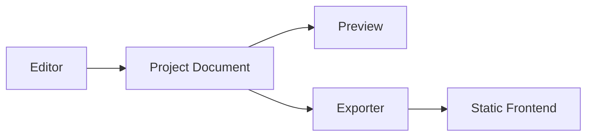
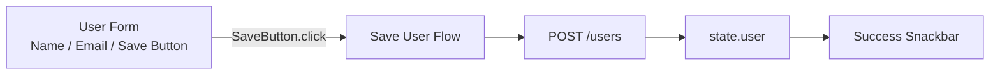
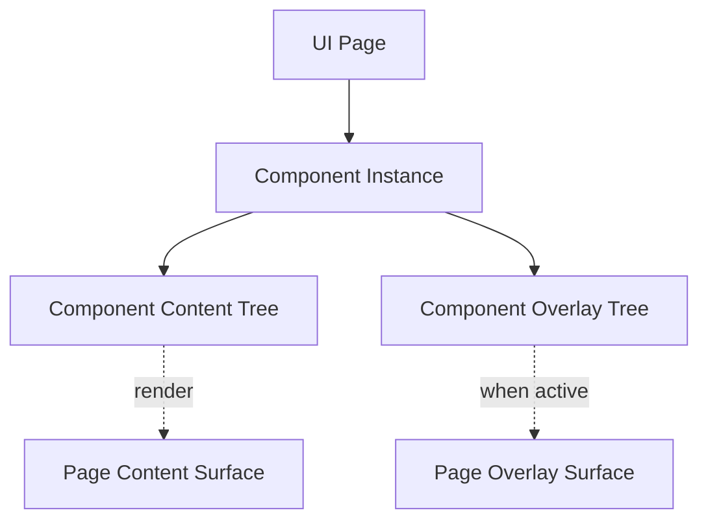
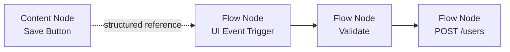
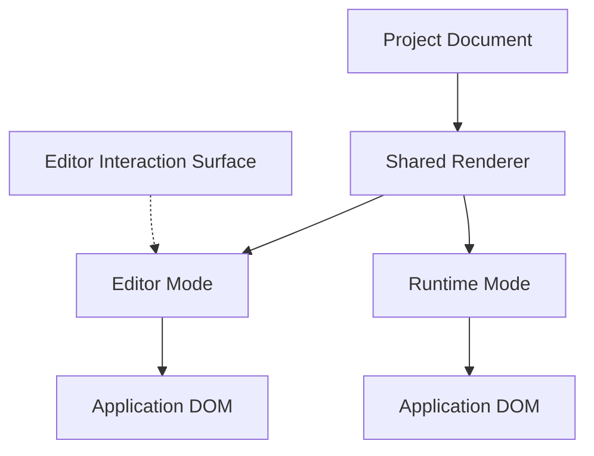
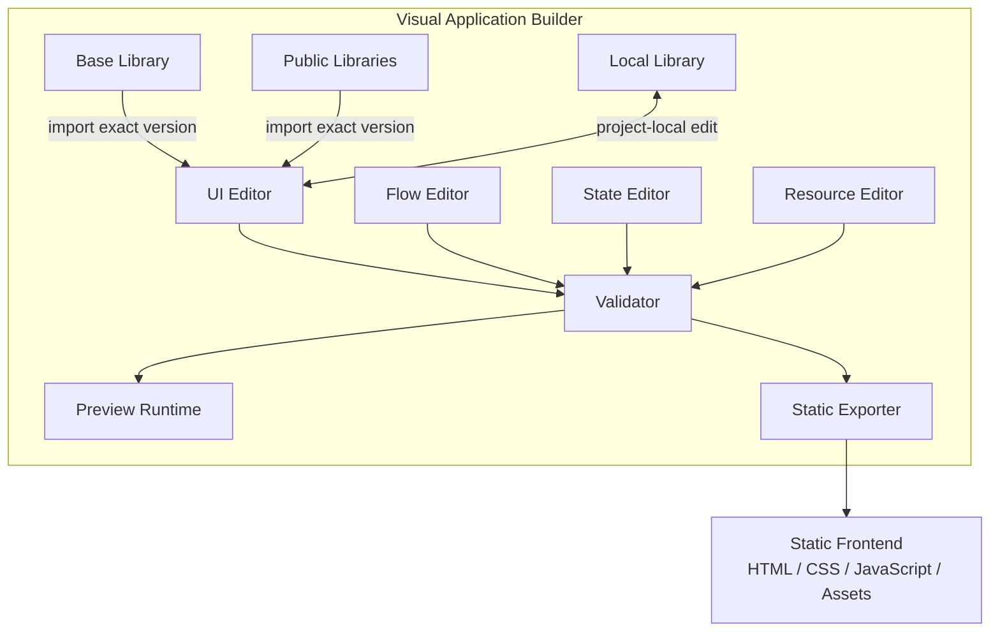

# Architecture: Product Overview

> [Architecture Index](./README.md) · Previous: [Index](./README.md) · Next: [Core Principles](./02-core-principles.md)
>
> Covers: Section 1, Section 2

---

## 1. Overview

### 1.1 Purpose

FlagShipは、Web ApplicationのUI、Flow、State、外部Resource連携を視覚的に設計し、Browserで動作する静的Frontendを生成するVisual Application Builderである。

編集対象の正本はHTMLやDOMではなく、構造化されたProject Documentとする。



Project Documentは次のModelを統合する。

```text
Project Document
├─ UI Document
│  └─ UI Page
│     └─ Component Instance
├─ Flow Document
│  └─ Flow Graph
│     └─ Flow Node
├─ State
├─ Resources
├─ Components
└─ Settings
```

Editor、Preview、Exporterは同じProject Documentと同じRuntime Semanticsを利用する。

### 1.2 Representative Application Example

User Management Applicationを例とする。



この例では、UIは構造、Flowは振る舞い、Stateは共有値、Resourceは外部接続を担当する。

## 2. Product Concept

### 2.1 ProjectをSingle Source of Truthとする

Applicationの正本はProject Documentである。

```text
Project Document
├─ Editor # Commandを通して編集する
├─ Preview # Runtimeとして実行する
└─ Exporter # 静的Frontendを生成する
```

DOM、生成済みHTML、Svelte State、Editor View StateをApplicationの正本にしない。

### 2.2 UI DocumentはUI Pageを保持する

UI DocumentはUI Pageの配列を持つ。UI Pageは画面単位であり、配置されたComponent InstanceとPage設定を保持する。

```text
UI Document
└─ UI Page[]
   ├─ id
   ├─ name
   ├─ componentInstances[]
   └─ settings
```

UI PageはRuntimeでContent SurfaceとOverlay Surfaceを1つずつ持つ。SurfaceのDOMや計算済み座標は永続化しない。

### 2.3 ComponentはUIとFlowを一体で再利用する

ComponentはLibraryが提供するVersion付きAssetであり、UIとその内部Behaviorをまとめて再利用する単位である。

Componentの選択元はBase、Public、Localの3種類とする。

```text
Component Libraries
├─ Base Library # FlagShipが標準搭載する標準Theme相当のLibrary
├─ Public Libraries # Userが追加導入し、複数保持できるLibrary
└─ Local Library # 現在のProjectだけで作成・編集する永続Library
```

Base LibraryとPublic LibraryはProject外のCatalogである。選択したComponentの固定VersionをProjectへSnapshotとして取り込む。Local LibraryはProject固有だがEditor Sessionだけの一時Dataではなく、Project Documentへ保存し、再読込、Preview、Exportの対象とする。

```text
Component
├─ id
├─ version
├─ contentTree # 0..1
├─ overlayTrees # 0..n
└─ flowGraphs # 0..n
```

例えば時計Componentは表示用Content Treeに加え、初期化Flow Graphと1秒間隔の更新Flow Graphを持てる。

Projectは利用するComponentの特定Versionを取り込む。Library側の更新によって既存Projectの意味が暗黙に変化してはならない。

### 2.4 Component Instanceは配置された実体を表す

Component Instanceは、ComponentをUI Pageへ配置した実体である。

```text
Component Instance
├─ id # Page上の実体ID
├─ componentId
├─ componentVersion
└─ initialValues
```

Component内部のContent Node、Overlay Tree、Flow Graph、StateはComponent Instance PathをScopeとして識別する。同じComponentを複数配置しても内部IDは衝突しない。

### 2.5 Content Treeは通常UIを表す

Content TreeはContent Nodeを根とするUI Treeである。ComponentはContent Treeを0個または1個だけ持ち、Root配下のNodeは任意の深さにネストできる。

```text
Content Tree
└─ Content Node
   ├─ id
   ├─ type
   ├─ props
   ├─ state
   ├─ slots
   ├─ layout
   ├─ size
   └─ children[]
```

通常Layoutでは絶対座標を保存せず、Stack、Grid、Slot等の構造として保存する。

### 2.6 Overlay TreeはUI Treeに表示条件を加える

Overlay Treeは、Overlayとして描画するContent Treeに、開く契機と配置規則を加えたUI Treeである。

```text
Overlay Tree
├─ id
├─ openTrigger # Trigger Instance | null
├─ positioning
└─ contentTree
   └─ Content Node
```

Content NodeはOverlay Treeを子として持たない。Overlay TreeはComponentがContent Treeと並列に保持する。

Modal、Popover、Snackbarは専用Node種別ではなく、Content Tree、Positioning Rule、Flow Graph等を組み合わせたOverlay Templateである。

- Modal Templateは既定ではボタンと紐づかず、`openTrigger = null` とする。
- Popup Button TemplateはButtonのclick TriggerとOverlay表示Flowをあらかじめ紐づける。

BackdropやModal WindowもContent Nodeとして表し、表示位置はPositioning Ruleで決める。

### 2.7 Pageが物理Render Surfaceを所有する

Componentが持つContent TreeとOverlay Treeは論理構造である。物理的な描画先はUI Pageが所有する。



OverlayがPage Overlay Surfaceへ描画されても、所有元はComponent Instanceのままとする。Page Overlay Managerがstack、focus、dismissを管理する。

### 2.8 StateとSlotはContent Nodeが持つ

StateとSlotはComponent直下の別Collectionにせず、それを利用するContent Nodeへ置く。

```text
Content Node
├─ state
│  ├─ values
│  └─ bindings
└─ slots
   ├─ header
   ├─ content
   ├─ fields
   └─ footer
```

Slotは子Content Nodeの挿入先を表す構造概念であり、Flowを保持しない。`actions` はFlow Actionと混同するためSlot名に使わない。

入力途中の値やValidation結果等、Component Instanceごとに独立すべき値は、そのInstance内のContent Node Stateとして扱う。Application全体で共有する値はProject Stateとして扱う。

### 2.9 UIとFlowを分離して参照で接続する

Content Nodeへ任意JavaScriptを埋め込まない。Flow GraphがTriggerから始まるBehaviorを表す。



Project共通のFlow GraphはFlow Documentが保持し、Component固有のFlow GraphはComponentが保持する。

### 2.10 FlowをStructured Graphとして保存する

```text
Flow Document
└─ Flow Graph[]
   ├─ id
   ├─ nodes[]
   └─ edges[]
```

Flow NodeはTrigger、Action、Logic、Data、Timing、Control等の実行単位である。実行時には永続Modelを変更せず、Flow Executionを生成する。

```text
Flow Graph # Persistent
└─ Flow Execution # Runtime, concurrent instances allowed
```

### 2.11 State、Resource、Expressionを分離する

- StateはApplication、Component Instance内のContent Node、Flow ExecutionのScopeを明示する。
- ResourceはREST API等の接続先と通信設定を保持し、Flow GraphはResource IDを参照する。
- Expressionは任意JavaScript文字列ではなく、検証可能なStructured ASTとして保持する。
- SecretはProject Documentや生成Frontendへ保存しない。

### 2.12 Editorは実UIと同じRendererを使用する

Editor ModeとRuntime Modeは同じUI ModelとRendering Ruleを利用する。



Selection Border、Drop Indicator、Resize Handle等はEditor専用のInteraction Surfaceへ描画し、Application DOMへ混ぜない。

### 2.13 Generated Applicationの境界

生成物はBrowser JavaScriptで動作する静的Frontendとする。

```text
Generated Application
├─ index.html
├─ app.js
├─ runtime.js
├─ styles.css
├─ project-data.js
└─ assets/
```

REST API、CORS、認証、永続Storage、確実なServer Scheduleは外部Backendの責務とする。Browserが閉じている間のSchedule実行をFrontendだけで保証しない。

### 2.14 Productの最終構成



---

Previous: [Index](./README.md) · [Architecture Index](./README.md) · Next: [Core Principles](./02-core-principles.md)
