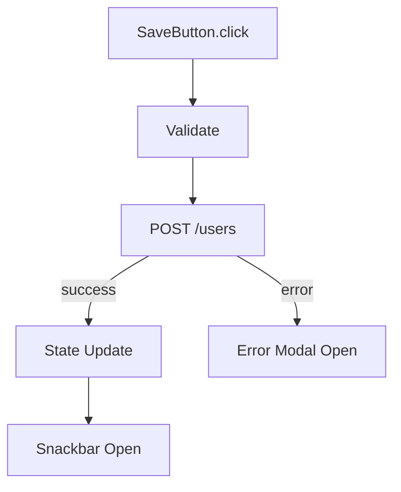
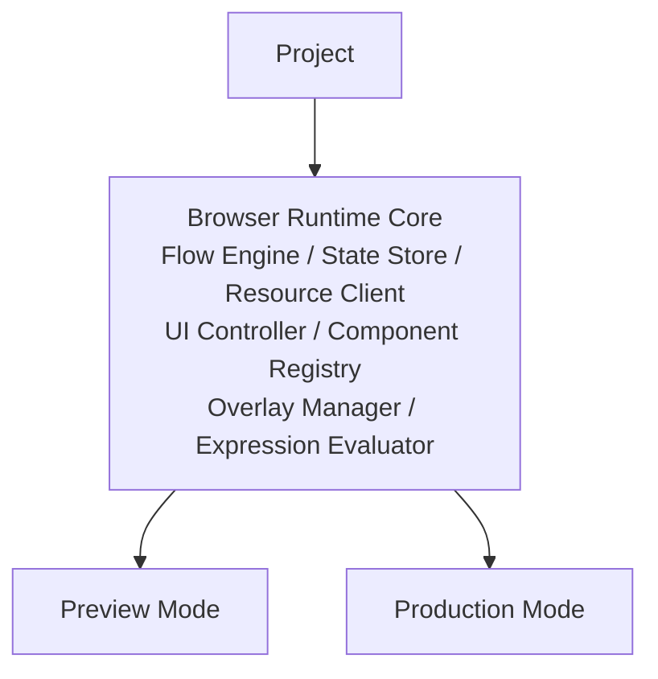
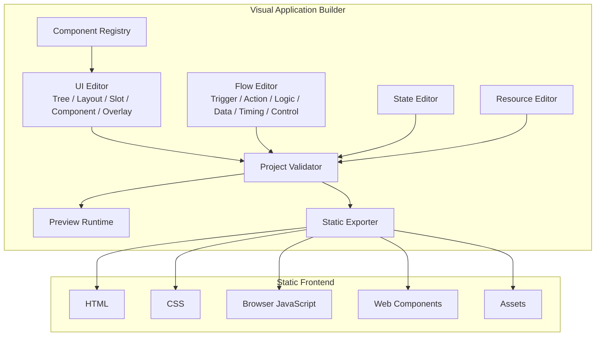

# Architecture: Product Overview

> [Architecture Index](./README.md) · Previous: [Index](./README.md) · Next: [Core Principles](./02-core-principles.md)
>
> Covers: Section 1, Section 2

---

## 1. Overview

### 1.1 Purpose

本システムは、実際にブラウザ上で動作するWeb ApplicationのUI構造・状態・振る舞い・外部API連携を視覚的に設計・編集し、最終的に静的Frontendとして出力するVisual Application Builderである。

ユーザーが視覚的に編集できる対象

```
Application
├─ UI # Applicationの見た目・DOM構造・レイアウト・入力・表示を定義する
│  ├─ Structure # UIの論理階層と意味的なまとまりを構成する
│  │  ├─ Page # Application内の画面単位
│  │  ├─ Section # Page内の意味的な領域
│  │  ├─ Container # 子要素を保持する汎用コンテナ
│  │  ├─ Group # 複数要素を論理的にまとめる
│  │  ├─ Form # 入力要素と関連処理をまとめるフォーム領域
│  │  └─ Component Instance # 再利用可能Componentの配置インスタンス
│  │
│  ├─ Layout # 子要素をどのような規則で配置するかを定義する
│  │  ├─ Vertical Stack # 子要素を上から下へ並べる
│  │  ├─ Horizontal Stack # 子要素を左から右へ並べる
│  │  ├─ Grid # 行・列構造で子要素を配置する
│  │  ├─ Slot # Componentが定義した名前付き挿入領域
│  │  ├─ Spacer # Layout内に意図的な余白を設ける
│  │  └─ Divider # 要素間の視覚的・構造的な区切り
│  │
│  ├─ Content # ユーザーへ情報を表示する
│  │  ├─ Text # 一般的な文字列表示
│  │  ├─ Heading # 見出し
│  │  ├─ Paragraph # 段落
│  │  ├─ Label # 入力要素等に関連付けるラベル
│  │  ├─ Badge # 状態や分類を短い文字列で表示する
│  │  ├─ List # 複数の情報を一覧表示する
│  │  ├─ Code # コードや整形済みテキストを表示する
│  │  └─ Quote # 引用情報を表示する
│  │
│  ├─ Input # ユーザーから値を受け取るUI
│  │  ├─ Text Input # 1行テキスト入力
│  │  ├─ Textarea # 複数行テキスト入力
│  │  ├─ Select # 選択肢から値を選択する
│  │  ├─ Checkbox # 真偽値や複数選択を扱う
│  │  ├─ Radio # 排他的な単一選択を扱う
│  │  ├─ Switch # ON / OFF状態を切り替える
│  │  ├─ Slider # 数値等を範囲から選択する
│  │  ├─ Date Input # 日付・時刻を入力する
│  │  ├─ File Input # ファイルを選択する
│  │  └─ Search Input # 検索用途の入力を行う
│  │
│  ├─ Action # ユーザー操作を受け取りFlow等のTriggerとなるUI
│  │  ├─ Button # 一般的な操作ボタン
│  │  ├─ Icon Button # アイコンを主体とする操作ボタン
│  │  ├─ Link # Page遷移や外部URL遷移を行う
│  │  ├─ Menu Button # MenuやPopoverを開く操作要素
│  │  └─ Split Button # 主操作と補助操作を分けて提供する
│  │
│  ├─ Data Display # 構造化されたデータを表示するUI
│  │  ├─ Card # 関連情報をひとまとまりとして表示する
│  │  ├─ Table # 行・列形式でデータを表示する
│  │  ├─ Data Grid # 高機能な表形式データを表示・操作する
│  │  ├─ List View # レコードを縦方向に一覧表示する
│  │  ├─ Tree # 階層データを表示する
│  │  ├─ Description List # 項目名と値の組み合わせを表示する
│  │  ├─ Timeline # 時系列情報を表示する
│  │  └─ Pagination # 大量データを複数ページに分割して移動する
│  │
│  ├─ Navigation # Application内の画面・領域・状態を移動するためのUI
│  │  ├─ Tabs # 同一領域内の表示内容を切り替える
│  │  ├─ Breadcrumb # 現在位置と階層を示す
│  │  ├─ Navigation Menu # Application内の主要な移動先を表示する
│  │  ├─ Sidebar Navigation # Sidebar形式のナビゲーション
│  │  ├─ Stepper # 複数ステップの進行状況と移動を扱う
│  │  └─ Pagination # ページ単位のデータ移動を行う
│  │
│  ├─ Overlay # 通常のContent Layoutから独立して表示されるUI
│  │  ├─ Modal # 背景操作を抑止し、前面で操作を要求する
│  │  ├─ Dialog # 確認・入力など一時的な対話を行う
│  │  ├─ Drawer # 画面端から展開する補助領域
│  │  ├─ Popover # 特定要素を基準に一時的な内容を表示する
│  │  ├─ Dropdown # Anchor要素に関連する選択肢を表示する
│  │  ├─ Menu # 操作候補を一覧表示する
│  │  ├─ Context Menu # 対象要素に依存した操作候補を表示する
│  │  └─ Tooltip # 対象要素の補助説明を表示する
│  │
│  ├─ Feedback # Applicationの状態や処理結果をユーザーへ通知するUI
│  │  ├─ Snackbar # 短時間の操作結果通知を表示する
│  │  ├─ Toast # 一時的な非同期通知を表示する
│  │  ├─ Alert # 重要な状態や注意事項を表示する
│  │  ├─ Banner # 画面内の広い領域で継続的な通知を表示する
│  │  ├─ Progress # 処理の進捗状況を表示する
│  │  ├─ Spinner # 処理中であることを表示する
│  │  ├─ Skeleton # コンテンツ読み込み中のPlaceholderを表示する
│  │  ├─ Empty State # データが存在しない状態を表示する
│  │  └─ Error State # エラー状態と復旧方法を表示する
│  │
│  ├─ Media # 画像・音声・映像等のメディアを表示するUI
│  │  ├─ Image # 画像を表示する
│  │  ├─ Icon # アイコンを表示する
│  │  ├─ Avatar # ユーザーやEntityを表す画像を表示する
│  │  ├─ Video # 動画を表示・再生する
│  │  ├─ Audio # 音声を再生する
│  │  ├─ Canvas # 描画領域を提供する
│  │  └─ Map # 地理情報を表示する
│  │
│  └─ Custom Component # 標準Component以外の追加UIを利用する
│     ├─ Registered Web Component # Component Registryへ登録されたWeb Component
│     ├─ Project Component # Project内で定義した再利用可能Component
│     └─ External Component # 外部Library等から提供されるComponent
│
├─ Flow # Triggerを起点としてApplicationの振る舞いを定義する
│  ├─ Trigger # Flowを開始する契機を定義する
│  │  ├─ UI Event # UI Component上で発生するイベントを起点とする
│  │  │  ├─ Click # 要素がクリックされたときに開始する
│  │  │  ├─ Input # 入力値が変化している最中に開始する
│  │  │  ├─ Change # 入力値が確定・変更されたときに開始する
│  │  │  ├─ Submit # Formが送信されたときに開始する
│  │  │  ├─ Focus # 要素がFocusされたときに開始する
│  │  │  ├─ Blur # Focusが外れたときに開始する
│  │  │  └─ Custom Event # Web Component等が公開する独自イベントで開始する
│  │  │
│  │  ├─ Lifecycle Event # ApplicationやPage等のライフサイクルを起点とする
│  │  │  ├─ App Load # Application起動時に開始する
│  │  │  ├─ Page Load # Page表示時に開始する
│  │  │  └─ Component Mount # Component生成時に開始する
│  │  │
│  │  ├─ State Event # Application Stateの変更を起点とする
│  │  │  └─ State Change # 指定Stateの変更時に開始する
│  │  │
│  │  └─ Timing Event # 時間条件を起点とする
│  │     ├─ Delay # 指定時間経過後に開始する
│  │     ├─ Interval # 一定間隔で開始する
│  │     ├─ Foreground Schedule # Application起動中に指定時刻条件で開始する
│  │     └─ Server Schedule # Backend Scheduler等による実行を前提とする
│  │
│  ├─ UI Action # UI ComponentやOverlayに対して副作用を発生させる
│  │  ├─ Show # UIを表示する
│  │  ├─ Hide # UIを非表示にする
│  │  ├─ Enable # 操作可能状態にする
│  │  ├─ Disable # 操作不能状態にする
│  │  ├─ Focus # 指定要素へFocusを移す
│  │  ├─ Scroll # 指定位置またはComponentへスクロールする
│  │  ├─ Set Property # Componentの公開Propertyを変更する
│  │  └─ Overlay Action # Overlay Surface上のUIを操作する
│  │     ├─ Open Modal # Modalを表示する
│  │     ├─ Close Modal # Modalを閉じる
│  │     ├─ Open Drawer # Drawerを表示する
│  │     ├─ Close Drawer # Drawerを閉じる
│  │     ├─ Open Popover # Popoverを表示する
│  │     ├─ Close Popover # Popoverを閉じる
│  │     ├─ Show Snackbar # Snackbarを表示する
│  │     └─ Show Toast # Toastを表示する
│  │
│  ├─ Resource Action # Application外部のResourceへアクセスする
│  │  ├─ REST API Request # HTTP経由でREST APIを呼び出す
│  │  │  ├─ GET # Resourceを取得する
│  │  │  ├─ POST # Resourceを新規作成または処理要求する
│  │  │  ├─ PUT # Resource全体を更新する
│  │  │  ├─ PATCH # Resourceの一部を更新する
│  │  │  └─ DELETE # Resourceを削除する
│  │  ├─ Upload # ファイル等を外部Resourceへ送信する
│  │  ├─ Download # 外部Resourceからデータやファイルを取得する
│  │  ├─ WebSocket Send # WebSocket経由でMessageを送信する
│  │  └─ SSE Subscribe # Server-Sent Eventsを購読する
│  │
│  ├─ State Action # Application Stateを更新する
│  │  ├─ Set # Stateへ値を設定する
│  │  ├─ Merge # Object等へ値を統合する
│  │  ├─ Clear # Stateを初期化・削除する
│  │  ├─ Toggle # Boolean Stateを反転する
│  │  ├─ Increment # 数値を増加させる
│  │  ├─ Decrement # 数値を減少させる
│  │  ├─ Append # Arrayへ値を追加する
│  │  └─ Remove # Array等から値を削除する
│  │
│  ├─ Navigation Action # Application内外の移動を行う
│  │  ├─ Navigate # 指定PageやURLへ移動する
│  │  ├─ Back # 履歴上の前画面へ戻る
│  │  ├─ Forward # 履歴上の次画面へ進む
│  │  ├─ Reload # 現在のPageを再読み込みする
│  │  ├─ Open External URL # 外部URLを開く
│  │  └─ Set Query Parameter # URL Queryを変更する
│  │
│  ├─ Logic # Flowの実行経路を条件によって分岐する
│  │  ├─ Condition # 真偽条件によって分岐する
│  │  ├─ Switch # 値に応じて複数経路へ分岐する
│  │  └─ Guard # 条件を満たさない場合に後続処理を停止する
│  │
│  ├─ Data # Flow内で使用する値を加工・変換する
│  │  ├─ Set Variable # Flow Local Variableへ値を設定する
│  │  ├─ Transform # 入力データを別形式へ変換する
│  │  ├─ Map # Collection各要素を変換する
│  │  ├─ Filter # 条件に一致する要素だけを抽出する
│  │  ├─ Pick # Objectから指定Propertyを抽出する
│  │  ├─ Merge # 複数Object等を統合する
│  │  ├─ Format # 文字列・日付・数値等を整形する
│  │  ├─ Calculate # 数値計算や式評価を行う
│  │  └─ Parse # JSON等の入力を構造化データへ変換する
│  │
│  ├─ Timing # Flow途中の時間制御を行う
│  │  ├─ Wait # 指定時間処理を待機する
│  │  ├─ Delay # 後続処理を遅延実行する
│  │  ├─ Debounce # 短時間に連続する実行をまとめる
│  │  └─ Throttle # 一定時間内の実行頻度を制限する
│  │
│  └─ Control # Flowそのものの実行方法を制御する
│     ├─ Parallel # 複数の処理を並列実行する
│     ├─ For Each # Collectionの各要素に対して処理する
│     ├─ Retry # 失敗した処理を再試行する
│     ├─ Error Handler # Error発生時の処理を定義する
│     ├─ Cancel # Flowまたは非同期処理を中止する
│     ├─ Subflow # 別Flowを呼び出す
│     └─ Return # Flowを終了し値を返す
│
├─ Data / State # UIとFlowが参照・変更するApplication Dataを定義する
│  ├─ Application State # Application全体で共有する状態
│  ├─ Page State # 特定Pageに属する状態
│  ├─ Component State # Component固有の状態
│  ├─ Flow Variables # Flow実行中だけ存在する一時変数
│  ├─ Flow Outputs # 各Flow Nodeの実行結果
│  ├─ Event Data # TriggerからFlowへ渡されるEvent情報
│  └─ Environment Values # Development / Production等で切り替える環境値
│
├─ Resources # Applicationが接続する外部Resourceを定義する
│  ├─ REST Resource # REST APIのBase URLや共通設定を定義する
│  ├─ Static Resource # 静的データやAsset等を定義する
│  ├─ WebSocket Resource # WebSocket接続情報を定義する
│  ├─ SSE Resource # Server-Sent Events接続情報を定義する
│  └─ Future Resource Type # 将来的なResource拡張のためのExtension Point
│
├─ Components # UI Builderで利用可能なComponentの定義・再利用単位を管理する
│  ├─ Built-in Components # システム標準で提供するComponent
│  ├─ Registered Web Components # 外部または独自Web Componentを登録する
│  ├─ Project Components # Project内で作成した再利用可能Component
│  └─ Component Metadata # Props / Slots / Events / Actions等のEditor向け定義
│
└─ Application Behavior # UI・Flow・State・Resourceを組み合わせたApplication全体の動作関係
   ├─ UI Event → Flow # UIイベントをFlow Triggerへ接続する
   ├─ Flow → UI # FlowからModalやSnackbar等を操作する
   ├─ Flow → State # FlowからApplication Stateを変更する
   ├─ Flow → Resource # FlowからREST API等へアクセスする
   ├─ Resource → Data → UI # API Response等を加工してUIへ反映する
   └─ Navigation → Page # FlowによってApplication内のPageを切り替える
```

生成されるStatic Frontend

```
Static Frontend
├─ HTML # ApplicationのDocument構造
├─ CSS # Layout・Theme・Component Style
├─ JavaScript # Application全体をブラウザ上で実行するコード
│  ├─ Flow Engine # Flow定義を解釈・実行する
│  ├─ State Store # Application Stateを保持・更新・通知する
│  ├─ Resource Client # fetch等を利用してREST API等へアクセスする
│  ├─ UI Controller # UI Componentの表示・状態・Actionを制御する
│  ├─ Component Registry # Web Componentsの定義・Metadata・公開APIを管理する
│  └─ Application Definition # UI・Flow・State・Resource等の生成済みProject定義
├─ Web Components # 実際のUI Component
└─ Assets # Image・Icon等の静的Asset
```

生成Applicationの実行環境

```
Browser
├─ Chrome
├─ Safari
├─ Brave
├─ Firefox
└─ WebView
```

生成Applicationが利用する標準Web API

```
Web Platform
├─ DOM API # UI構造とElement操作
├─ Custom Elements # Web Componentsの登録・利用
├─ EventTarget / CustomEvent # UI EventとFlow Triggerのイベント基盤
├─ Fetch API # REST API等へのHTTPアクセス
├─ AbortController # Requestや非同期Flowの中断
├─ URL / URLSearchParams # URLおよびQuery Parameter操作
├─ History API # Client-side Navigation
├─ localStorage / sessionStorage # Browser Local Stateの永続化
├─ Promise / async / await # 非同期処理
└─ Standard Form APIs # Formおよび入力要素の操作
```

生成経路

```
Project
├─ UI
├─ Flow
├─ Data / State
├─ Resources
└─ Components
   ↓
Editor / Preview
   ↓
Exporter
   ↓
Static Frontend
├─ HTML
├─ CSS
├─ JavaScript
├─ Web Components
└─ Assets
   ↓
Browser
├─ Chrome
├─ Safari
├─ Brave
├─ Firefox
└─ WebView
   ↓
REST API / External Resources
```

実行時の技術方針

```
Browser Runtime Policy
├─ 標準Web APIを優先する
├─ Experimental APIを必須依存にしない
├─ 特定Browser固有APIを必須依存にしない
├─ Browser差異がある場合はFeature Detectionを行う
├─ 必要に応じてFallbackを提供する
└─ 必要な場合のみ軽量PolyfillをBuild時に含める

Framework Boundary

Editor
└─ Svelte 5 # Editor View Layerの実装に使用する

Generated Application
├─ Svelte Runtime不要
├─ React Runtime不要
├─ Node.js Runtime不要
└─ Server-side Runtime不要
```

### 1.2 Representative Application Example

本システムで構築するApplicationの代表例を以下に示す。
個々の機能ではなく、UI・Flow・State・Resourceが1つのApplicationとして統合されることを示すための例である。

```text
Example Application # Visual Application Builderで構築する典型的なBrowser Application
└─ User Management App
   ├─ UI # Userが操作するApplication UI
   │  ├─ User List
   │  ├─ User Form
   │  └─ Success Snackbar
   ├─ Flow # UI Eventから始まるApplication Behavior
   │  └─ SaveButton.click → POST /users → State Update → Snackbar
   ├─ State # Application内で共有するData
   │  ├─ users
   │  ├─ currentUser
   │  └─ form
   └─ Resources # Applicationが利用する外部Resource
      └─ Backend REST API
```

---

## 2. Product Concept

本システムは、実際にブラウザ上で動作するWeb ApplicationのUI構造・状態・振る舞い・外部Resource連携を視覚的に設計し、静的Frontendとして生成するVisual Application Builderである。

単なるHTML Builder、Design Canvas、Code Generatorではなく、Applicationを構成するModelを統合的に編集する。

```text
Project
├─ UI Document # UIの論理構造、Layout、Component、Presentationを定義する
├─ Flow Document # Triggerを起点としたApplication Behaviorを定義する
├─ Data / State # UIとFlowが参照・更新する値を定義する
├─ Resources # REST API等の外部接続先と通信設定を定義する
├─ Components # Built-in / Web Component / Project Componentを定義する
└─ Settings # Project全体の設定、環境、Build条件等を保持する
```

### 2.1 ProjectをSingle Source of Truthとする

Applicationの正本はHTML、DOM、Svelte Component TreeではなくProject Documentとする。

```text
Project
├─ Editor # Projectを視覚的に編集する
├─ Preview # ProjectをBrowser上で実行する
└─ Exporter # ProjectからStatic Frontendを生成する
```

Editor、Preview、Exporterは同一のProject Definitionを参照する。

Editor専用DocumentとProduction専用Documentを別々に持たない。

### 2.2 UIは構造化されたApplication UIとして扱う

UIはCanvas上の矩形集合ではなく、SemanticなLogical Treeとして保持する。

```text
Page
└─ UserForm
   ├─ NameInput
   ├─ EmailInput
   ├─ Actions
   │  ├─ CancelButton
   │  └─ SaveButton
   ├─ ValidationPopover
   └─ SuccessSnackbar
```

各UI Nodeは以下の情報を持つ。

```text
UINode
├─ id # Project内で安定した一意ID
├─ type # Component Definitionを参照するComponent Type
├─ parent / children # Logical Ownership
├─ slot # Parent Component内の挿入先
├─ props # Componentへ渡す公開Property
├─ layout # 子要素の配置規則
├─ size # fit / fill / fixed / fraction等のSemantic Size
└─ presentation # Content / Overlay等の描画条件
```

UIの保存形式としてDOM HTMLやCSS class文字列を正本にしない。

### 2.3 UI配置は構造編集として扱う

通常UIでは絶対座標を保存しない。

```text
Layout
├─ Stack
│  ├─ Vertical
│  └─ Horizontal
├─ Grid
├─ Slot-defined Layout
└─ Overlay
```

Editor上ではNotionのようにDrag & Dropできるが、Drop完了後は必ずDocument構造へ変換する。

```text
Drop Intent
├─ before # 同一Layout内で対象の直前へ挿入
├─ after # 同一Layout内で対象の直後へ挿入
├─ inside # Container内部へ挿入
├─ slot # 指定Component Slotへ挿入
└─ split # 新しいVertical / Horizontal Layoutを生成して配置
```

Pointer座標、Drag Ghost座標、Hit Test用Rect等はEditor Temporary StateでありProjectへ保存しない。

### 2.4 Logical OwnershipとRender Destinationを分離する

UI Nodeの所属先と実DOM上の描画先は別概念とする。

```text
Logical Tree
└─ UserForm
   ├─ SaveButton
   ├─ ValidationPopover
   └─ SuccessSnackbar
```

```text
Render Surfaces
├─ Content Surface
│  └─ UserForm
└─ Overlay Surface
   ├─ ValidationPopover
   └─ SuccessSnackbar
```

ValidationPopoverやSnackbarがOverlay Surfaceへ描画されてもLogical ParentはUserFormのままとする。

これによりLogical Ownership単位で以下を扱える。

```text
Ownership Operations
├─ Copy
├─ Paste
├─ Duplicate
├─ Delete
├─ Reuse
├─ Componentization
├─ Undo / Redo
└─ Import / Export
```

### 2.5 Render Surfaceを明示する

描画先をSurfaceとして定義する。

```text
Render Surfaces
├─ Application
│  ├─ Content Surface # 通常のDocument Layoutへ参加する
│  └─ Overlay Surface # 通常Layoutから独立して描画する
│     ├─ Anchored # Popover / Tooltip / Dropdown / Menu等
│     ├─ Modal # Modal / Dialog / Blocking Drawer等
│     └─ Notification # Snackbar / Toast等
└─ Editor
   └─ Interaction Surface # Selection / Drop Indicator等のEditor専用UI
```

`Layer` はLogical Treeやz-orderと混同するため、描画先には `Surface` を使用する。

### 2.6 Editorは実UIを直接編集する

Editor専用の疑似Componentを描画してProduction UIへ変換する方式は採用しない。

```text
UI Document
      ↓
Shared Renderer
   ┌──┴─────────────┐
   ▼                ▼
Editor Mode      Runtime Mode
   │                │
   └──── Real DOM ──┘
```

Editor Modeでは実DOMにEditor専用UIを外側から重ねる。

```text
Interaction Surface # Editor上の選択・ドラッグ・配置・サイズ変更などを補助する専用描画領域
├─ Selection Border # 現在選択されているUI Nodeの外周を示し、操作対象を明確にする
├─ Hover Outline # Pointerが現在どのUI Node上にあるかを示し、選択候補やDrop対象候補を可視化する
├─ Drop Indicator # Drag中に、Nodeが最終的にどこへ挿入されるかをbefore / after / inside等として示す
├─ Slot Indicator # Componentが持つNamed Slotの位置・範囲・Drop可否を可視化する
├─ Drag Preview # Drag中のNodeをPointer付近に仮表示し、移動対象を視覚的に示す
├─ Resize Handle # 選択Nodeのサイズ変更可能箇所を示し、Semantic Size変更操作を提供する
├─ Alignment Guide # 周囲のNodeやContainerとの揃い位置を補助表示する
└─ Spacing Guide # Node間のgap・padding・margin等の間隔を可視化し、Layout調整を補助する
```

Editor UIをApplication Component内部DOMへ挿入しない。

### 2.7 ComponentはPublic Contractを持つ

Editor、Flow Runtime、RendererはComponent内部DOMに依存しない。

```text
Component Definition
├─ type # Project上のComponent Type
├─ tag # Web Component Tag
├─ props # 公開Property
├─ slots # 子Nodeを受け入れるNamed Slot
├─ events # Flow Triggerとして使用可能なEvent
├─ actions # Flowから呼び出せる公開操作
├─ defaults # Default Property / Layout等
└─ presentation # Content / Overlay等の既定Presentation
```

例:

```text
ui-modal
├─ Properties
│  └─ open
├─ Slots
│  ├─ header
│  ├─ content
│  └─ actions
├─ Events
│  ├─ open
│  ├─ close
│  └─ confirm
└─ Actions
   ├─ open()
   └─ close()
```

FlowやEditorはShadow DOMやprivate DOM selectorを直接操作しない。

### 2.8 Slotを第一級概念とする

Component内部の子要素配置は単純なchildrenだけでなくNamed Slotを扱う。

```text
ui-card
├─ header
├─ content
└─ actions
```

Slot Definitionは以下を持つ。

```text
Slot Definition
├─ name
├─ acceptedTypes # Drop可能なComponent Type
├─ cardinality # 1件 / 複数件等
├─ layout # Slot内部のLayout
└─ required # 必須Slotかどうか
```

EditorはSlot Definitionを使ってDrop CandidateとDrop Indicatorを生成する。

### 2.9 UIとBehaviorを分離する

UI ComponentにBehaviorコードを直接埋め込まない。

避ける構造:

```text
Button
└─ onclick = arbitrary JavaScript
```

採用する構造:

```text
UI Document
└─ SaveButton

Flow Document
└─ SaveUserFlow
   └─ Trigger
      ├─ target = SaveButton
      └─ event = click
```

UIとFlowはStable Node IDでReferenceする。

UI Nodeは「何であるか」「どこに所属するか」を定義し、Flowは「いつ、何を実行するか」を定義する。

### 2.10 FlowをApplication Behavior Modelとして扱う

FlowはApplicationの振る舞いを表す独立したBehavior Modelとする。

Triggerから開始し、Action / Logic / Data / Timing / Control等のNodeをGraphとして接続する。

```text
Flow
├─ Trigger # Flowの開始条件
│  ├─ UI Event
│  ├─ Lifecycle Event
│  ├─ State Event
│  └─ Timing Event
├─ UI Action # UIへ副作用を発生させる
├─ Resource Action # REST API等の外部Resourceへアクセスする
├─ State Action # Application Stateを変更する
├─ Navigation Action # PageやURLを変更する
├─ Logic # 条件分岐を行う
├─ Data # 値の変換・加工を行う
├─ Timing # Flow途中の時間制御を行う
└─ Control # 並列・再試行・Subflow等の実行制御を行う
```

例:



Flow Editor上で表示されるGraphと、保存されるFlow Documentは同じ意味構造を持つ。

### 2.11 FlowはStructured Graphとして保存する

FlowをJavaScriptコードやイベントハンドラ文字列として保存せず、NodeとEdgeからなるStructured Graphとして保存する。

```text
Flow
├─ id # Flowの一意ID
├─ name # Editor上の表示名
├─ nodes # Flowを構成する処理Node
│  ├─ Trigger Node
│  ├─ Action Node
│  ├─ Logic Node
│  ├─ Data Node
│  ├─ Timing Node
│  └─ Control Node
└─ edges # Node間の実行経路
   ├─ default # 通常の次処理
   ├─ success / error # 成否による分岐
   ├─ true / false # 条件による分岐
   └─ Node固有Port # Switch等の複数出力
```

各Flow Nodeは少なくとも以下を持つ。

```text
Flow Node
├─ id # Flow内で一意なNode ID
├─ type # Node Type
├─ config # Node固有設定
├─ inputs # 入力Reference
├─ outputs # 実行結果として公開する値
└─ metadata # Editor表示等に必要な非実行情報
```

任意JavaScriptコード文字列をFlowの基本表現にしない。

### 2.12 Flow Execution Contextを明示する

Flow実行時の値をNamespaceで分離する。

```text
Flow Context
├─ event # Triggerから渡されたEvent Data
├─ state # Application / Page等のState
├─ variables # Flow Local Variable
├─ outputs # 先行NodeのOutput
└─ env # Environment Values
```

値参照はStable Structured Referenceとして保存する。

```text
state.form.email
outputs.createUser.id
event.detail.value
env.API_BASE_URL
```

### 2.13 ExpressionをASTとして保持する

ConditionやData Transformで任意JavaScriptを基本使用しない。

```text
AND
├─ GTE
│  ├─ state.user.age
│  └─ 18
└─ EQ
   ├─ state.enabled
   └─ true
```

これにより以下を可能にする。

```text
Expression Capabilities
├─ Visual Editing
├─ Validation
├─ Type Checking
├─ Static Analysis
├─ Migration
├─ Dependency Analysis
└─ Alternative Runtime / Compilerへの変換
```

Custom JavaScriptが将来必要になった場合は、通常Expressionとは分離した明示的なAdvanced / Escape Hatchとして扱う。

### 2.14 ResourcesをFlowから分離する

REST API等の接続情報を各Flowへ重複して保持しない。

```text
Resources
└─ backend
   ├─ type = REST
   ├─ baseUrl
   ├─ common headers
   ├─ auth policy
   └─ environment overrides
```

Flow側はResourceを参照する。

```text
HTTP Request
├─ resource = backend
├─ method = POST
├─ path = /users
├─ headers / query / body
└─ output = createdUser
```

Development / ProductionでResource設定を切り替えてもFlow Definitionは変更しない。

### 2.15 StateをScopeごとに分離する

Applicationで扱うState Scopeを分離する。

```text
State
├─ Application State # Application全体
├─ Page State # Page単位
├─ Component State # Component固有
├─ Flow Variables # Flow Execution単位
├─ Flow Outputs # Node実行結果
├─ Event Data # Trigger入力
└─ Environment Values # Environment依存値
```

Editor StateはApplication Stateと分離する。

```text
Editor State
├─ selectedNode
├─ hoveredNode
├─ dragging
├─ pointer
├─ dropIntent
├─ activePanel
├─ viewport
├─ zoom
└─ previewOverrides
```

### 2.16 PreviewとProductionで同じRuntime Coreを利用する

Editor Preview専用Behavior Engineを作らない。



Preview固有機能はHookとして追加する。

```text
Preview Hooks
├─ Node Highlight
├─ Step Execution
├─ Flow Inspection
├─ Mock Resource
├─ State Inspection
└─ Debug Output
```

### 2.17 生成ApplicationはBrowser JavaScriptのみで動作可能とする

Generated Applicationの必須Runtime EnvironmentはBrowserとする。

```text
Generated Application
├─ HTML
├─ CSS
├─ JavaScript
│  ├─ Flow Engine
│  ├─ State Store
│  ├─ Resource Client
│  ├─ UI Controller
│  ├─ Component Registry
│  ├─ Overlay Manager
│  ├─ Expression Evaluator
│  └─ Application Definition
├─ Web Components
└─ Assets
```

以下を必須依存としない。

```text
Generated Application
├─ Svelte Runtime不要
├─ React Runtime不要
├─ Node.js Runtime不要
└─ Server-side Runtime不要
```

対象実行環境:

```text
Browser
├─ Chrome
├─ Safari
├─ Brave
├─ Firefox
└─ WebView
```

実装は可能な限り標準Web APIを利用する。

### 2.18 Static FrontendとBackend Responsibilityを分離する

Static Frontend側の責務:

```text
Frontend
├─ UI Rendering
├─ Client State
├─ Client-side Validation
├─ Flow Execution
├─ Navigation
├─ Overlay Control
├─ Data Transformation
├─ REST Request
└─ Browser Storage
```

Backend / REST API側の責務:

```text
Backend
├─ Authentication / Authorization
├─ Database
├─ Secret Management
├─ Protected Business Logic
├─ External API Proxy
├─ Secure File Processing
└─ Server-side Scheduled Job
```

Secretを生成Static Frontendへ保存しない。

### 2.19 Scheduleの実行保証を区別する

BrowserのみではApplicationが閉じている間の確実なSchedule実行を保証しない。

```text
Timing
├─ Delay # Browser実行中
├─ Interval # Browser実行中
├─ Foreground Schedule # Browser実行中のみ保証
└─ Server Schedule # Backend Schedulerを必要とする
```

Editor上でもForeground ScheduleとServer Scheduleを別種として明示する。

### 2.20 Representative Project Example

UI、Flow、State、Resourcesが1つのProject内でどのように接続されるかを以下に示す。

```text
Example Project # Product Concept全体を1つのApplicationで示す
├─ UI
│  └─ UserForm
│     ├─ NameInput
│     ├─ EmailInput
│     ├─ SaveButton
│     └─ SuccessSnackbar
│
├─ State
│  ├─ form
│  │  ├─ name
│  │  └─ email
│  └─ user
│
├─ Resources
│  └─ backend
│     └─ POST /users
│
└─ Flow
   └─ SaveButton.click
      ↓
      Validate
      ↓
      POST /users
      ↓
      Set state.user
      ↓
      Show SuccessSnackbar
```

UIはApplication Structure、FlowはBehavior、Stateは共有Data、Resourcesは外部接続を担当し、それぞれを独立したModelとして保持する。

### 2.21 Productの最終構成



---

Previous: [Index](./README.md) · [Architecture Index](./README.md) · Next: [Core Principles](./02-core-principles.md)
