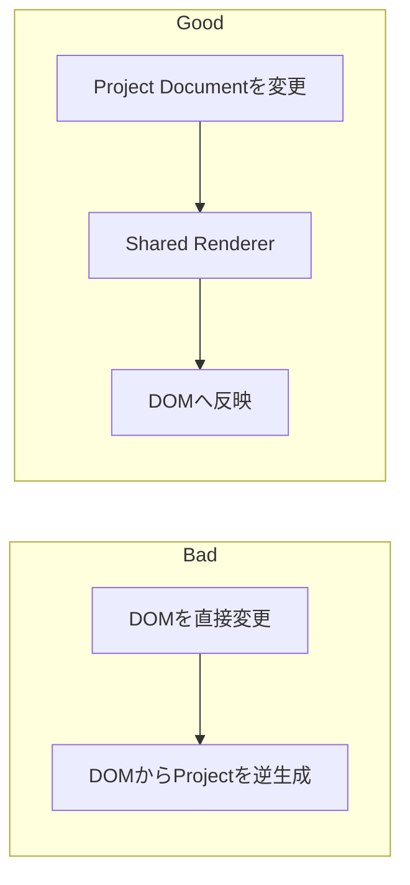
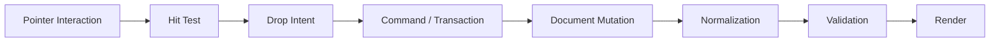
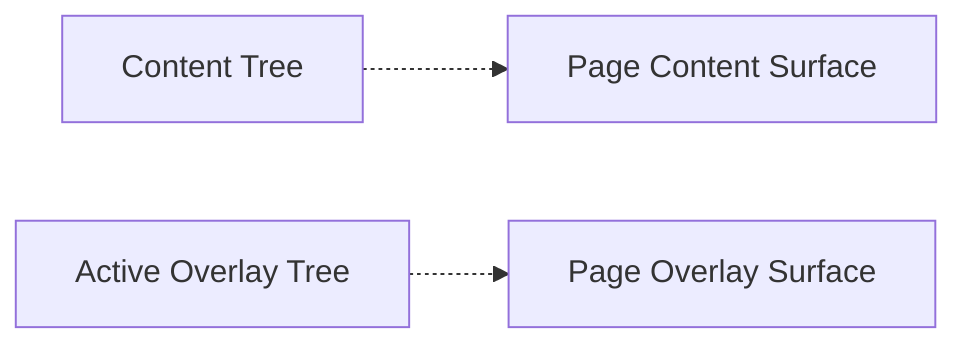
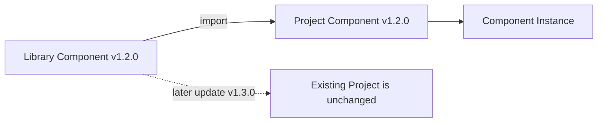
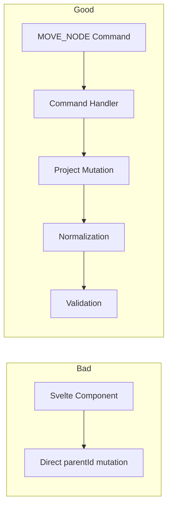
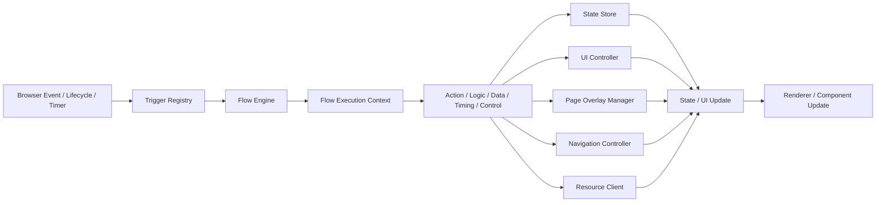
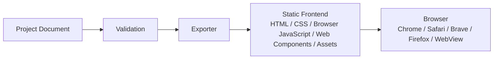

# Architecture: Core Principles

> [Architecture Index](./README.md) · Previous: [Product Overview](./01-product-overview.md) · Next: [Technology and System Architecture](./03-technology-and-system-architecture.md)
>
> Covers: Section 3

---

## 3. Core Architecture Principles

以下をArchitecture Invariantとして扱う。新機能は原則としてこれらを破らない形で実装する。

### 3.1 Project Documentを唯一のApplication Source of Truthとする

Applicationの正本はProject Documentとする。

```text
Source of Truth
└─ Project Document
   ├─ UI
   ├─ Flow
   ├─ State
   ├─ Resources
   ├─ Components
   └─ Settings
```

以下をSource of Truthにしない。

```text
Not Source of Truth
├─ Browser DOM
├─ Serialized HTML
├─ CSS Classes
├─ Svelte Component Tree
├─ Editor View Component State
└─ Preview DOM
```

DOMやGenerated CodeはProjectから導出される成果物とする。

具体例:



### 3.2 UI DocumentはSemantic Modelとして保持する

保存対象:

```text
Semantic UI
├─ Node Type
├─ Logical Parent / Children
├─ Slot
├─ Properties
├─ Layout
├─ Size
└─ Presentation
```

基本的に保存しないもの:

```text
Implementation Detail
├─ DOM sibling位置そのもの
├─ Editor座標
├─ Temporary Bounding Rect
├─ Generated CSS Selector
└─ Framework-specific State
```

RendererがSemantic Modelを実DOM / CSSへ変換する。

### 3.3 通常Layoutでは絶対座標を使用しない

Default Layoutは以下とする。

```text
Layout
├─ Stack
├─ Grid
└─ Slot
```

Freeform / Absoluteは必要になった場合のみ特殊Layoutとして追加する。

Absolute Geometryを一般UIの保存形式にしない。

### 3.4 Drag GeometryとApplication Layoutを分離する

Drag中のみTemporary Geometryを使用する。

```text
Temporary Editor Geometry
├─ pointer position
├─ drag ghost
├─ source rect
├─ target rect
└─ candidate zone
```

Drop後はPersistent Documentへ変換する。

```text
Persistent Placement
├─ before
├─ after
├─ inside
├─ slot
└─ split
```

Drop完了後にTemporary GeometryをProjectへ残さない。

具体例:

```text
Bad
└─ Drop Result
   ├─ x = 412
   └─ y = 288

Good
└─ Drop Result
   ├─ parent = ui-node-actions
   └─ position = after(ui-node-cancel-button)
```

### 3.5 Drag操作は必ずStructural Commandへ変換する

Drag処理からDOMを直接並べ替え、それを正本としない。



### 3.6 EditorとProductionは同じRendering Ruleを使用する

Editor RendererとProduction Rendererを独立実装し、異なるLayout Logicを持たせない。

```text
UI Document
      ↓
Shared Renderer
├─ Editor Mode
└─ Runtime Mode
```

Mode差分はEditor Decoration、Preview Override等に限定する。

### 3.7 Editor InteractionをApplication DOMから分離する

Editor専用表示はInteraction Surfaceへ描画する。

```text
Interaction Surface
├─ Selection
├─ Hover
├─ Drop Indicator
├─ Slot Indicator
├─ Resize Handle
├─ Drag Preview
└─ Guide
```

Application Component内部へEditor専用Nodeを挿入しない。

可能な限りBounding Rect等を参照して外部から描画する。

### 3.8 Logical OwnershipとPhysical Renderingを分離する

Component InstanceはComponent内のContent Tree、Overlay Tree、Flow Graphを論理的に所有する。Render SurfaceはUI Page上の物理的な描画先を表す。

```text
Component Instance
├─ Content Tree
└─ Overlay Tree
```



Overlay Treeを表示するためにComponent InstanceからPage直下へ所有権を移さない。

### 3.9 Overlayを専用UI Node Categoryにしない

Overlay TreeはUI TreeへTrigger InstanceとPositioning Ruleを加えた構造である。

```text
Overlay Tree
├─ openTrigger # Trigger Instance | null
├─ positioning
└─ contentTree
```

Modal、Snackbar、Popover等は専用Node Typeではなく、Overlay TreeのPositioning、Content Tree、Flow Graphを組み合わせたTemplateとして提供する。

### 3.10 Overlay管理を中央Runtimeへ集約する

UI PageごとにPage Overlay Managerを1つ持ち、Overlayごとに独自Stack管理を実装しない。

```text
Page Overlay Manager
├─ Open / Close
├─ Stack
├─ Focus
├─ Escape
├─ Outside Click
├─ Scroll Lock
└─ Positioning
```

Componentごとに任意の巨大なz-indexを設定させない。

Overlay Stack PolicyをRuntime側で統一する。

### 3.11 Componentの所有境界を固定する

ComponentはUIとFlowを一体で再利用するVersion付きAssetである。

```text
Component
├─ contentTree # 0..1
├─ overlayTrees # 0..n
└─ flowGraphs # 0..n
```

Content NodeはOverlay Treeを内包せず、Componentが両方を直接所有する。Component直下へStateやSlotを重複して持たせない。

### 3.12 Library更新とProjectの再現性を分離する

LibraryからComponentをProjectへ追加するときは、利用するVersionをProjectへ取り込む。



Libraryの更新によって既存ProjectのUIやFlowが暗黙に変化してはならない。

### 3.13 Slot Boundaryを第一級概念として保持する

SlotはContent Nodeが持つDocument Model上の配置境界とする。

Drop、Validation、Componentization、NormalizationでSlotを保持する。

NormalizerがSlot Boundaryを跨いでNodeを勝手に昇格・移動してはならない。

`actions` はFlow Actionと混同するためSlot名に使わず、`header`、`content`、`fields`、`footer` 等の構造名を使う。

### 3.14 UI NodeをScope付きStable Referenceで参照する

FlowやState BindingからDOM Selectorを参照しない。

採用:

```json
{
  "kind": "content-node",
  "componentInstanceId": "component-instance-user-form",
  "nodeId": "ui-node-save-button"
}
```

禁止:

```text
target = "#form > div:nth-child(2) button"
```

Layout変更後もStable Node IDは維持する。

```text
Before
└─ ui-node-save-button
   └─ Parent = form-footer

After Layout Change
└─ ui-node-save-button
   └─ Parent = footer-stack

Flow Target
├─ component-instance-user-form
└─ ui-node-save-button # 変更なし
```

DOM Layout変更によってFlow Referenceが壊れないようにする。

### 3.15 FlowはUIから独立したStructured Graphとする

Button等のprops内にFlow実装そのものを埋め込まない。

```text
UI Document
└─ SaveButton

Flow Document
└─ SaveFlow
   └─ Trigger
      ├─ target = SaveButton
      └─ event = click
```

Project共通のBehaviorはFlow Documentへ、Component固有のBehaviorはComponentのFlow Graphへ置く。

### 3.16 Flow RuntimeはComponent Type固有のprivate logicを持たない

Flow RuntimeはGenericなExecution Engineとする。

```text
Flow Runtime
├─ Trigger Registry
├─ Action Registry
├─ Expression Evaluator
├─ Execution Context
├─ Branching
├─ Async Execution
└─ Cancellation
```

UIの更新はUI Controllerへ、Overlayの表示状態はPage Overlay Managerへ委譲する。

### 3.17 Flow Expressionに任意JavaScriptを標準採用しない

Flow ExpressionはASTとして構造化する。

```text
Expression AST
├─ Visual Editor
├─ Validation
├─ Type Analysis
├─ Security Review
├─ Dependency Analysis
├─ Migration
└─ Compilation
```

Custom JavaScriptが必要になった場合も、明示的なAdvanced / Escape Hatch Nodeとして通常Flowから分離する。

### 3.18 Flow Node Outputを明示する

非同期Action結果を暗黙Global Variableへ書き込まない。

```text
HTTP Node
├─ id = createUser
└─ output
   └─ outputs.createUser
```

後続NodeはStructured Referenceで参照する。

### 3.19 Resource接続情報とFlow Logicを分離する

Flowが完全なEnvironment URLを直接保持することを標準としない。

```text
Flow
├─ resource = backend
└─ path = /users
```

```text
Resource: backend
├─ Development baseUrl
└─ Production baseUrl
```

Environment切替でFlow Graphを変更しない。

### 3.20 State Scopeを明示する

Stateを単一Global Objectへ無制限に集約しない。

```text
State Scope
├─ Application
├─ Page
├─ Component
└─ Flow
```

ScopeごとにLifecycleと可視範囲を定義する。

### 3.21 Editor StateをApplication Stateへ混ぜない

Editor-only StateはExport対象外とする。

```text
Editor State
├─ selection
├─ hover
├─ drag
├─ viewport
├─ zoom
├─ active tool
└─ preview overrides
```

### 3.22 すべてのProject変更をCommandまたはTransactionとして扱う

ProjectをUI Componentから直接任意Mutationしない。

```text
Document Mutation
├─ ADD_COMPONENT_INSTANCE
├─ DELETE_COMPONENT_INSTANCE
├─ ADD_CONTENT_NODE
├─ DELETE_CONTENT_NODE
├─ MOVE_CONTENT_NODE
├─ REORDER_CONTENT_NODE
├─ MOVE_TO_SLOT
├─ SET_PROPERTY
├─ SET_LAYOUT
├─ ADD_OVERLAY_TREE
├─ SET_OVERLAY_TRIGGER
├─ SET_OVERLAY_POSITIONING
├─ CONNECT_FLOW
├─ DISCONNECT_FLOW
└─ SET_RESOURCE
```

複合操作はTransactionとしてまとめる。

具体例:



### 3.23 Undo / Redo単位をUser Intentに合わせる

Pointer移動ごとにHistory Entryを作らない。

```text
pointerdown
pointermove × N
pointerup
    ↓
Transaction
└─ MOVE_NODE × 1
```

Horizontal Split等も複数内部Commandを1 User Transactionとして扱う。

### 3.24 Document Mutation後にNormalizationを行う

処理順序を統一する。

```text
Command
   ↓
Mutation
   ↓
Normalization
   ↓
Validation
   ↓
Render
```

Normalization対象:

```text
Normalization
├─ 不要な自動生成Layout Container
├─ 空になったTemporary Structure
├─ Merge可能な自動生成Stack
└─ Canonical Child Order
```

意味を持つ構造は削除しない。

### 3.25 Normalizerが削除・統合してはいけないBoundaryを定義する

```text
Preserve Boundary
├─ User-created Explicit Container
├─ Component Root
├─ Reusable Component Boundary
├─ Slot Boundary
├─ Semantic Group
├─ Styling Boundary
├─ Flow Reference Target
└─ Externally Referenced Node
```

NormalizationはApplicationの意味を変更しない範囲でのみ行う。

具体例:

```text
Before
└─ Explicit Container
   └─ SaveButton

Normalizer
└─ Containerが1 Childしか持たなくても
   └─ Explicit Containerは保持する
```

### 3.26 Validationを保存・Preview・Exportの共通処理とする

Validation RuleをEditorとExporterで別々に実装しない。

```text
Project Validation
├─ Duplicate ID
├─ Missing Parent
├─ Circular UI Tree
├─ Invalid Slot
├─ Unsupported Child Type
├─ Missing Flow Target
├─ Invalid Flow Edge
├─ Missing Resource
├─ Invalid Expression
├─ Invalid Reference
├─ Unreachable Flow Node
├─ Potential Infinite Loop
└─ Deleted Node Reference
```

同一ValidatorをSave、Preview、Exportから利用する。

### 3.27 Browser RuntimeをFramework-independentにする

Runtime CoreをSvelte ComponentやReact Hookとして実装しない。

```text
Browser Runtime
├─ Flow Engine
├─ State Store
├─ Resource Client
├─ UI Controller
├─ Project Component Resolver
├─ Page Overlay Manager
└─ Expression Engine
```

Editorからも同じRuntime Coreを利用できる形を維持する。

### 3.28 Generated ApplicationはBrowser Standard APIを基本とする

標準依存:

```text
Web Platform
├─ DOM
├─ Custom Elements
├─ EventTarget / CustomEvent
├─ Fetch
├─ AbortController
├─ URL / URLSearchParams
├─ History API
├─ Storage API
├─ Form APIs
└─ Promise / async-await
```

Experimental APIを必須にしない。

Browser差異がある場合:

```text
Compatibility
├─ Feature Detection
├─ Fallback
└─ 必要な場合のみBuild-time Polyfill
```

### 3.29 Target Browser互換性をRuntime Design Constraintとする

対象:

```text
Browser
├─ Chrome
├─ Safari
├─ Brave
├─ Firefox
└─ WebView
```

新しいBrowser APIを導入する場合、対象環境での互換性とFallback有無を確認する。

特定Engineのみで動作する機能をCore Requirementにしない。

### 3.30 file:// CompatibilityとHTTP Hostingを別条件として扱う

Static Frontendであることと `file://` で完全動作することを同一要件にしない。

Runtime内でLocal File Fetchを前提にしない。

Project Definition等は必要に応じてJavaScript BundleまたはHTMLへ埋め込む。

```text
Recommended Export
├─ index.html
├─ app.bundle.js
├─ styles.css
└─ assets/
```

標準DeploymentはHTTP(S) Static Hostingを推奨する。

REST API通信時はBrowser CORS Policyに従う。

### 3.31 SecretをClient Projectへ保持しない

Generated Applicationへ以下を出力しない。

```text
Secrets
├─ Private API Key
├─ Database Credential
├─ OAuth Client Secret
├─ Service Account Secret
└─ Backend Secret
```

Secretが必要な処理はREST API等のBackendへ委譲する。

### 3.32 Browserで保証できない処理を擬似的に保証しない

Applicationが閉じている間の正確なSchedule等をBrowser-only Runtimeで保証しない。

```text
Browser-capable
├─ Delay
├─ Interval
└─ Foreground Schedule

Server-required
└─ Guaranteed Background Schedule
```

必要な場合はServer-side Capabilityとして明示する。

Editor上でも実行保証範囲を隠さない。

### 3.33 Preview RuntimeとProduction RuntimeのBehaviorを一致させる

Preview専用MockやDebug機能がProduction Behavior自体を変更しないようにする。

Preview Overrideは明示的ContextとしてRuntimeへ与える。

同一のFlow Graph、Expression Rule、Component Asset、State Semanticsを利用する。

### 3.34 ExporterはApplicationの意味を再解釈しない

Exporterの責務はProjectを別Application Modelへ作り直すことではなく、既存Core Modelを配布形式へ変換することである。

```text
Exporter
├─ Validate Project
├─ Serialize Application Definition
├─ Generate HTML Entry
├─ Generate / Bundle CSS
├─ Bundle Components
├─ Bundle Browser Runtime
└─ Bundle Assets
```

EditorとExporterに同じBusiness Ruleを重複実装しない。

### 3.35 Architecture CoreをFrameworkから独立させる

依存方向を一方向にする。

```text
core
↑
├─ renderer
├─ runtime
├─ exporter
└─ editor
```

Editor FrameworkからCoreへの依存は許可する。

CoreからSvelte等Editor Frameworkへの依存は禁止する。

### 3.36 Svelteの責務をEditor View Layerに限定する

Svelteで扱うもの:

```text
Editor View State
├─ selection
├─ pointer
├─ hover
├─ drag UI
├─ panels
├─ inspector presentation
└─ editor interaction presentation
```

Svelte固有にしないもの:

```text
Application Core
├─ Project Schema
├─ Commands
├─ History
├─ Flow Graph
├─ Expression AST
├─ Runtime
├─ Renderer Rule
├─ Validation Rule
└─ Exporter Rule
```

### 3.37 実装順序をModelから開始する

新機能追加時はEditor UIからではなく、Application Modelから定義する。

```text
Feature Development
├─ 1. Schema / Model
├─ 2. Validation
├─ 3. Runtime Behavior
├─ 4. Renderer Behavior
├─ 5. Command / History Behavior
├─ 6. Editor UI
└─ 7. Export Verification
```

Editor UIだけ先に実装し、後から保存形式やRuntime Semanticsを決める方式を避ける。

### 3.38 Architecture Invariants

以下を中核Invariantとする。

```text
A # Editor上の一時Geometryを通常Application Layout Dataへ保存しない

B # Drop完了後のUIは必ずTree / Slot / Layout Ruleへ正規化する

C # Logical OwnershipとRender Destinationを分離する

D # Project DocumentをSingle Source of Truthとする

E # DOMやFramework StateをSingle Source of Truthにしない

F # EditorとProductionで同じRendering Ruleを利用する

G # FlowはStable Node IDでUIを参照し、DOM Selectorへ依存しない

H # Flow RuntimeはComponent内部DOMへ直接アクセスしない

I # ComponentはContent Tree 0..1、Overlay Tree 0..n、Flow Graph 0..nを持つ

J # Flow BehaviorはStructured Dataを基本とし、任意JavaScriptを基本表現にしない

K # Project MutationはCommand / Transactionとして扱う

L # Mutation後にNormalizationとValidationを行う

M # NormalizerはSemantic Boundaryを破壊しない

N # Browser Runtime CoreをEditor Frameworkから独立させる

O # 生成ApplicationはBrowser JavaScriptだけで実行可能にする

P # SecretやServer-only ResponsibilityをStatic Frontendへ持ち込まない

Q # PreviewとProductionで同一Project / Runtime Semanticsを維持する

R # ComponentのContent TreeとOverlay Treeは同じUI Pageの各Surfaceへ描画する

S # StateとSlotはそれを利用するContent Nodeが持つ

T # Modal Templateは未接続を既定とし、Popup Button Templateだけが開くTriggerを初期設定する
```

### 3.39 Core Data Flow

Editor操作からDOM反映までの基本経路:

```mermaid
flowchart LR
    User["User Interaction"] --> EditorState["Editor Interaction State"]
    EditorState --> Intent
    Intent --> Command["Command / Transaction"]
    Command --> Project["Project Document"]
    Project --> Normalize["Normalization"]
    Normalize --> Validate["Validation"]
    Validate --> Renderer["Shared Renderer"]
    Renderer --> DOM["Real DOM"]
```



Flow実行経路:



Export経路:



---

Previous: [Product Overview](./01-product-overview.md) · [Architecture Index](./README.md) · Next: [Technology and System Architecture](./03-technology-and-system-architecture.md)
