# Architecture: Technology and System Architecture

> [Architecture Index](./README.md) · Previous: [Core Principles](./02-core-principles.md) · Next: [Project Document Model](./04-project-document-model.md)
>
> Covers: Section 4, Section 5

---

## 4. Technology Selection

### 4.1 TypeScriptをBuilderの実装に使用する

Project Model、Command、Validation、Renderer、Flow Runtime、ExporterをTypeScriptで実装する。

```text
TypeScript
├─ Project Schema
├─ Commands and History
├─ Validation
├─ Renderer
├─ Flow Runtime
├─ Runtime Services
└─ Exporter
```

Project Documentは保存時にJSONとなるため、TypeScriptの型だけを信頼せず、読込境界でRuntime Validationを行う。

### 4.2 Svelte 5をEditor View Layerに限定する

SvelteはEditor Shell、Panel、Inspector、Canvas、Flow Editor等の表示と入力を担当する。

```text
Svelte Editor
├─ Header
├─ Layers
├─ Canvas
├─ Flow
├─ Inspector
└─ Console
```

Project Schema、Flow Semantics、Renderer Rule、Validation RuleをSvelte Component内へ閉じ込めない。

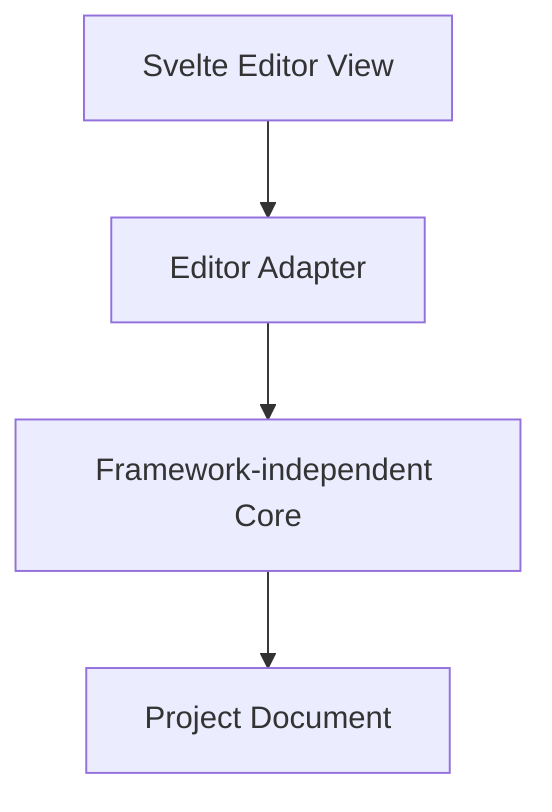

### 4.3 Generated ApplicationはBrowser JavaScriptで実行する

ExporterはProject DocumentとRuntimeを、Browserで動作するHTML、CSS、JavaScript、Assetへ変換する。

生成物の実行にSvelte RuntimeやBuilder本体を必須としない。

### 4.4 Component ModelとDOM実装を分離する

Project上のComponentは、Content Tree、Overlay Tree、Flow Graphを束ねる再利用Assetである。Web Component、通常のDOM Element、JavaScript Module等はRenderer内部の実装手段であり、Project Model上のComponentと同一概念にしない。

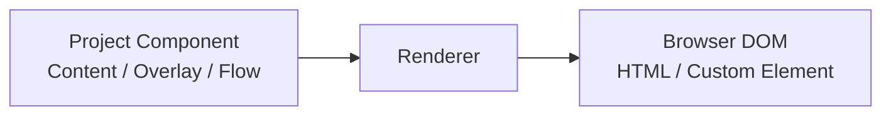

FlowはDOM SelectorやShadow DOM内部を直接操作せず、Component Instance PathとLocal Node IDを含むStructured ReferenceをRuntime Serviceへ渡す。

### 4.5 Shared RendererをFramework-independentにする

同じRenderer RuleをEditor、Preview、Generated Applicationで利用する。

```text
Shared Renderer
├─ Editor Mode
├─ Preview Mode
└─ Production Mode
```

Mode差分は、Editor用HookやPreview Override等の明示的な入力に限定する。

### 4.6 Editor InteractionをApplication DOMから分離する

Selection、Hover、Drop Indicator、Resize Handle等はSvelte側のInteraction Surfaceへ描画する。

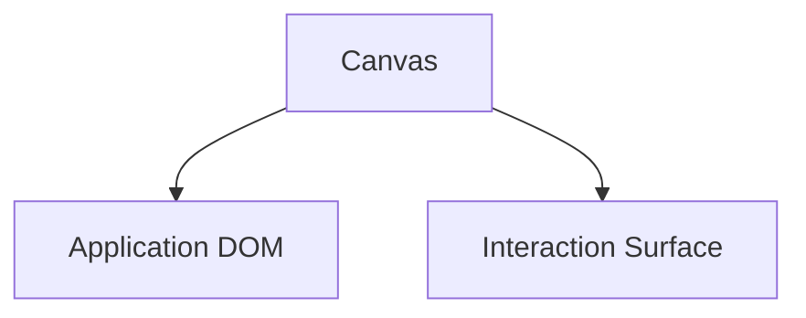

Editor専用ElementをApplicationのContent Treeへ挿入しない。

### 4.7 Page単位でOverlayを管理する

各UI PageはContent SurfaceとOverlay Surfaceを持つ。Overlayの表示状態はRoot UI NodeのRuntime Stateで管理する。Page Overlay Managerはstack、focus、dismiss、positioningを管理する。

Componentごとに物理Overlay Rootを生成しない。

### 4.8 Flow RuntimeはStructured Graphを実行する

Flow RuntimeはFlow Graphを解釈する汎用Executorとする。

```text
Flow Runtime
├─ Trigger Registry
├─ Action Registry
├─ Expression Evaluator
├─ Execution Context
├─ Cancellation
└─ Runtime Services
```

初期実装はInterpreter方式とし、Flow Compilerは必要になるまで追加しない。

### 4.9 Browser Standard APIを基本依存とする

生成Applicationの主要機能にはBrowser Standard APIを使用する。

```text
Browser APIs
├─ DOM Events
├─ CustomEvent
├─ Fetch
├─ AbortController
├─ History
├─ URL
└─ Timers
```

REST通信はFetch APIを使用する。htmxはServer-rendered Fragment連携が必要な場合だけ追加するOptional Integrationとする。

### 4.10 Technology Boundary

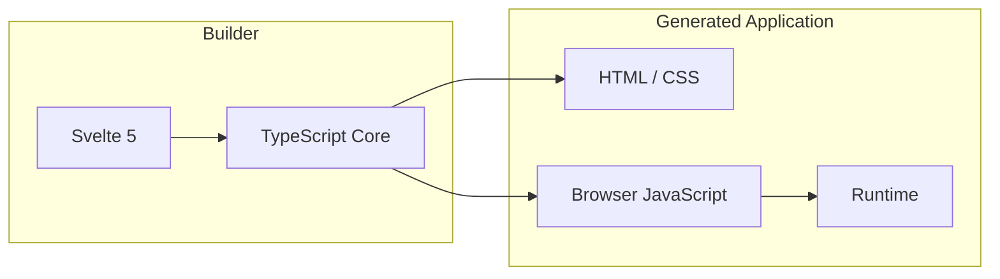

## 5. High-Level Architecture

### 5.1 Project Documentを中心にする

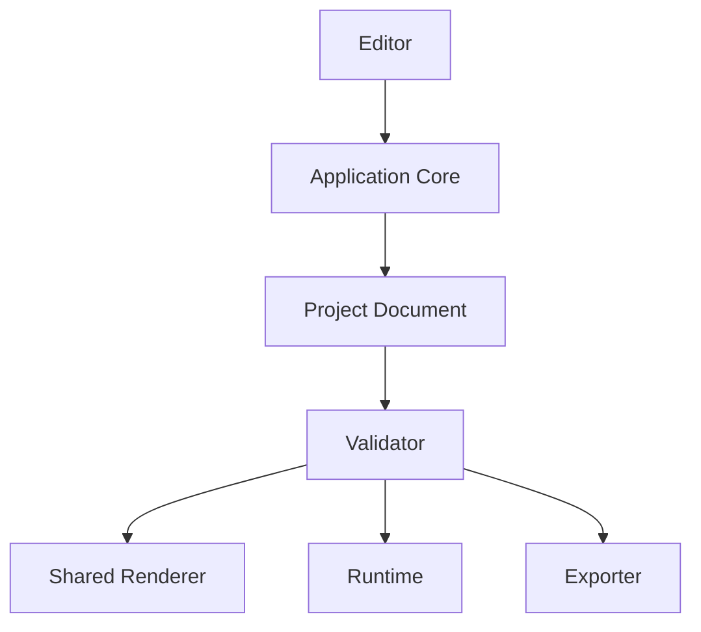

Editor操作はCommandまたはTransactionとしてProject Documentを変更し、その後にNormalizationとValidationを行う。

### 5.2 Core Module

```text
Application Core
├─ model
├─ command
├─ history
├─ normalization
├─ validation
├─ reference resolution
└─ serialization / migration
```

CoreはSvelte、DOM、Browser Eventへ依存しない。

### 5.3 Canonical Modelの所有関係

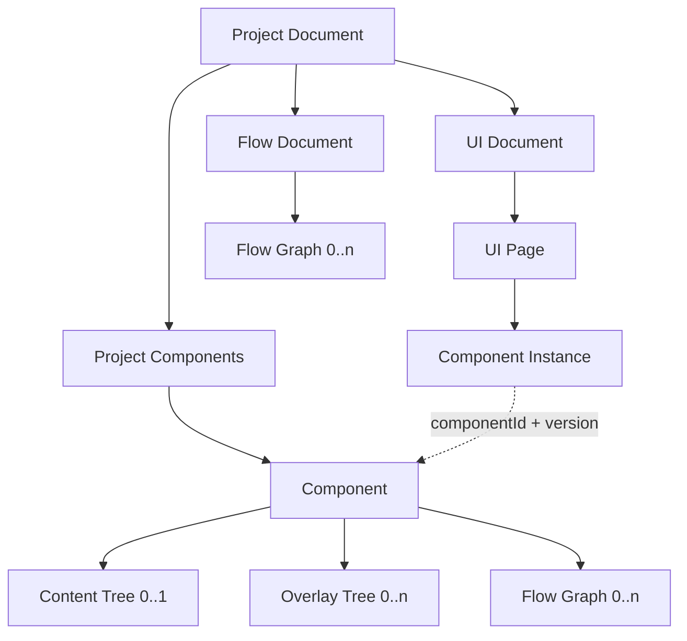

Component InstanceがComponent Definitionを参照する。Content SurfaceとOverlay Surfaceのどちらに描画される場合も、Flow VariableはComponent Instance Pathを参照する。描画先によってFlowのScopeを分けない。

### 5.4 ComponentをLibraryから取り込む

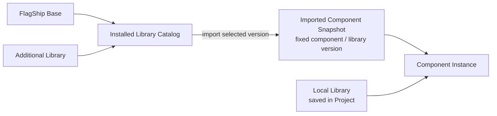

Installed Library CatalogはProject Documentへ複製しない。既存Projectの再現性を保つため、Libraryへの参照だけを保存せず、利用するComponentのSnapshotと取得元Library VersionをProjectへ取り込む。

Local LibraryはProject固有の編集可能なComponentを保持する。Projectを閉じても失われない永続Dataであり、取り込み済みSnapshotとは分離して保存する。

### 5.5 UI Rendering

RendererはContent RootのComponent InstanceとOverlay RootのOverlay InstanceからComponent Definitionを解決し、各Surfaceへ描画する。

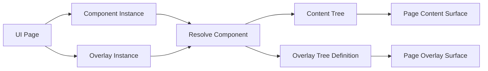

Content/Overlay Tree DefinitionはLibrary Componentが所有する。Page上の実体はContent RootのComponent InstanceまたはOverlay RootのOverlay Instanceが所有する。

### 5.6 Reference Resolution

ReferenceはDOM Selectorではなく、対象種別とScopeを持つ構造化値とする。

```json
{
  "kind": "content-node",
  "componentInstancePath": [
    "component-instance-user-form",
    "component-instance-save-button"
  ],
  "localId": "content-node-button"
}
```

ResolverはProject内のID整合性、Component Version、Local IDを検証して対象を解決する。

### 5.7 Flow Execution

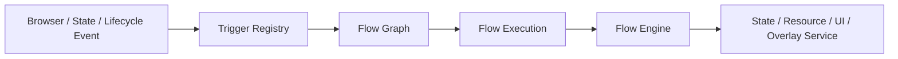

Project共通Flow GraphとComponent固有Flow Graphは同じEngineで実行する。Component固有GraphのReferenceは、Component Instance PathをExecution Scopeへ含めて解決する。

### 5.8 State

State StoreはScopeとKeyで値を管理する。

```text
State Scope
├─ Application
├─ Page
├─ Component Instance
└─ Flow Execution
```

Content Nodeが宣言するStateはComponent Instance Scopeで実体化する。Editorのselectionやpanel sizeはApplication Stateへ入れない。

### 5.9 Runtime Services

```text
Runtime Services
├─ State Store
├─ Resource Client
├─ UI Controller
├─ Page Overlay Manager
└─ Navigation Controller
```

Flow ActionはこれらのServiceを介して副作用を実行する。Flow Engine自身へUI種別固有の処理を埋め込まない。

### 5.10 Preview

PreviewはProduction Runtime Coreを使用する。Mock Response、Execution Trace、Step実行等はPreview Contextとして注入し、Project Documentへ保存しない。

### 5.11 Export

ExporterはProjectの意味を再解釈せず、Validation済みProjectとRuntimeを配布形式へ変換する。

```text
Export
├─ validate
├─ serialize project
├─ emit entry HTML
├─ emit styles
├─ bundle runtime
├─ bundle imported components
└─ copy assets
```

### 5.12 Dependency Direction

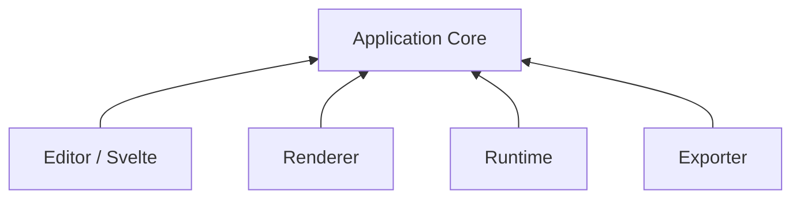

CoreからEditor Frameworkへの逆依存を禁止する。

### 5.13 Core Data Flow

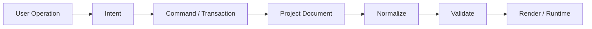

### 5.14 High-Level Architecture Invariants

```text
A # Project DocumentをEditor、Preview、Exportの正本とする
B # ComponentはContent Tree 0..1、Overlay Tree 0..n、Flow Graph 0..nを持つ
C # Component Instance PathでComponent内部のLocal IDをScope化する
D # PageがContent SurfaceとOverlay Surfaceを所有する
E # Overlay表示によってLogical Ownershipを変更しない
F # StateとSlotはContent Nodeが持つ
G # EditorとProductionで同じRenderer RuleとRuntime Semanticsを使う
H # CoreはSvelteへ依存しない
I # FlowはStructured Referenceを使いDOM Selectorへ依存しない
J # Library更新は取り込み済みComponentを暗黙に変更しない
```

---

Previous: [Core Principles](./02-core-principles.md) · [Architecture Index](./README.md) · Next: [Project Document Model](./04-project-document-model.md)
