# Architecture: Technology and System Architecture

> [Architecture Index](./README.md) · Previous: [Core Principles](./02-core-principles.md) · Next: [Project Document Model](./04-project-document-model.md)
>
> Covers: Section 4, Section 5

---

## 4. Technology Selection

本章ではVisual Application Builder本体、Editor、Browser Runtime、Generated Applicationの各責務に使用する技術を定義する。

技術選定は、Application CoreをEditor Frameworkから独立させ、Generated ApplicationをBrowser単体で実行可能にすることを最優先とする。

```text
Technology Responsibility
├─ TypeScript # Visual Application Builder本体のCore / Runtime Source / Exporter等を実装する
├─ Svelte 5 # Editor View LayerとEditor Interaction UIを実装する
├─ Web Components # Application UI Componentの公開境界として使用する
├─ Browser Standard APIs # PreviewおよびGenerated Applicationの実行基盤として使用する
├─ JavaScript # Export後のGenerated Applicationで実際に実行する
└─ htmx # Optional Integration。Core Requirementにはしない
```

### 4.1 TypeScriptはVisual Application Builder本体の実装に使用する

TypeScriptはBuilder内部のApplication Core、Editor、Preview Runtime Source、Exporter等の実装言語として使用する。

```text
TypeScript Implementation
├─ Project Schema
├─ UI Document Model
├─ Flow Document Model
├─ State Model
├─ Resource Model
├─ Component Definition
├─ Command System
├─ Transaction System
├─ History
├─ Normalization
├─ Validation
├─ Expression AST
├─ Reference Resolution
├─ Shared Renderer
├─ Browser Runtime Source
├─ Component Registry
├─ Overlay Manager
└─ Static Exporter
```

TypeScriptの型情報はBuilder開発時の安全性、Schema整合性、Refactor、Validation実装に利用する。

Generated ApplicationへTypeScript Sourceを必須出力しない。

```text
Builder Source
└─ TypeScript
      ↓
Build / Export
      ↓
Generated Application
└─ JavaScript
```

### 4.2 Generated ApplicationはJavaScriptのみで実行可能とする

Export後のApplicationはTypeScript Compiler、Node.js、Svelte Compiler等を必要としない。

```text
Generated Application
├─ HTML
├─ CSS
├─ JavaScript
├─ Web Components
└─ Assets
```

実行時に不要なもの:

```text
Generated Runtime Requirements
├─ TypeScript不要
├─ TypeScript Compiler不要
├─ Svelte Runtime不要
├─ React Runtime不要
├─ Node.js Runtime不要
└─ Server-side Runtime不要
```

Generated ApplicationはBrowserへ配布された時点で、そのままJavaScriptとして実行可能な状態にする。

Builder内部とExport結果の具体的な対応は以下とする。

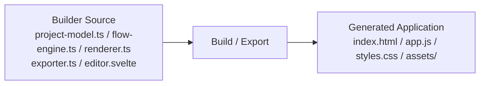

`.ts` や `.svelte` はBuilder実装側のSourceであり、Generated ApplicationのRuntime Fileではない。

### 4.3 Svelte 5はEditor View Layerに限定する

Svelte 5はVisual Application BuilderのEditor UI実装に使用する。

主な対象は、頻繁に変化するEditor専用状態とEditor Presentationである。

```text
Svelte Editor
├─ Application Canvas
├─ Logical Tree View
├─ Inspector
├─ Flow Editor
├─ State Editor
├─ Resource Editor
├─ Component Browser
├─ Interaction Surface
├─ Preview Controls
└─ Editor Panels
```

Svelteで扱うEditor-only State:

```text
Editor View State
├─ selectedNode
├─ hoveredNode
├─ pointer
├─ dragging
├─ dropIntent
├─ activeSlot
├─ viewport
├─ zoom
├─ activePanel
├─ inspectorTab
└─ previewOverrides
```

以下はSvelte固有にしない。

```text
Framework-independent Core
├─ Project Document
├─ UI Document
├─ Flow Document
├─ State
├─ Resources
├─ Component Definitions
├─ Commands
├─ Transactions
├─ History
├─ Normalization
├─ Validation
├─ Expression AST
├─ Runtime Semantics
├─ Renderer Rules
└─ Export Rules
```

依存方向は以下に固定する。

```text
Svelte Editor
      ↓
Application Core

Application Core
      ↓
      ✕
Svelte
```

Application CoreからSvelteへ依存させない。

### 4.4 Web ComponentsをApplication UI Componentの境界とする

Application UI ComponentはWeb Componentsを基本的なRuntime境界とする。

```text
Application UI
├─ Built-in Web Components
├─ Registered Web Components
├─ Project Components
└─ External Web Components
```

Componentの外部公開仕様はComponent Public Contractとして定義する。

```text
Component Public Contract
├─ Properties # 外部から設定可能な値
├─ Attributes # HTML Attributeとして公開可能な値
├─ Slots # 子UI Nodeの受け入れ先
├─ Events # Flow Triggerとして利用可能なEvent
└─ Actions # Flowから実行可能な公開操作
```

例:

```text
ui-modal
├─ Properties
│  └─ open
├─ Slots
│  ├─ header
│  ├─ content
│  └─ actions
├─ Events
│  ├─ open
│  ├─ close
│  └─ confirm
└─ Actions
   ├─ open()
   └─ close()
```

Editor、Renderer、Flow RuntimeはComponent内部DOMやShadow DOM構造へ依存しない。

### 4.5 Componentの内部実装技術をPublic Contractから分離する

Web Component内部の実装方式はComponent Public Contractとは別概念とする。

```text
Web Component Implementation
├─ Pure JavaScript Custom Element
├─ SvelteからCustom ElementとしてBuild
├─ Third-party Web Component
└─ その他Web Component互換実装
```

Generated Applicationから見たComponentの境界は常にWeb Component Contractとする。

内部実装がSvelteである場合でも、Generated Application全体にSvelte Runtimeを必須依存させない構成を優先する。

Component Registryは内部実装方式ではなくPublic Contractを管理する。

同一Contractに対して内部実装技術は異なってよい。

```text
ui-modal Public Contract
├─ Property: open
├─ Event: close
└─ Action: open()
      │
      ├─ Pure JavaScript Custom Element
      ├─ Svelte Custom Element
      └─ External Web Component
```

EditorとFlow Runtimeは上記3実装を同じContractとして扱う。

### 4.6 Shared RendererをFramework-independentにする

RendererはUI DocumentのSemantic ModelをBrowser DOM / Web Componentsへ反映する。

```text
UI Document
      ↓
Shared Renderer
      ↓
Application DOM
      ↓
Web Components
```

Shared RendererはEditorとProductionで同じRendering Rulesを使用する。

```text
Shared Renderer
├─ Editor Mode
└─ Runtime Mode
```

Mode差分はApplication UIの意味を変更しない。

Editor Modeで追加されるものはInteraction SurfaceやPreview Override等のEditor専用機能に限定する。

### 4.7 Interaction SurfaceはSvelte Editor側で管理する

Interaction SurfaceはGenerated Applicationに含まれないEditor専用Surfaceとする。

```text
Interaction Surface # Editor上の選択・Drag・配置・サイズ編集等を補助する
├─ Selection Border # 選択中UI Nodeの境界を表示する
├─ Hover Outline # Pointer下のUI Nodeを表示する
├─ Drop Indicator # Drop後のbefore / after / inside / slot / splitを表示する
├─ Slot Indicator # Named Slotの位置とDrop可否を表示する
├─ Drag Preview # Drag中の対象を一時表示する
├─ Resize Handle # Semantic Size変更操作を提供する
├─ Alignment Guide # Layout上の整列補助を表示する
└─ Spacing Guide # gap / padding等の間隔を表示する
```

Interaction Surfaceは以下の条件を満たす。

```text
Interaction Surface Rules
├─ Project Documentの一部ではない
├─ Export対象ではない
├─ Application Component内部DOMへ侵入しない
├─ Editor Stateから導出する
└─ Real DOMのBounding Rect等を参照して描画する
```

### 4.8 Browser RuntimeをFramework-independentなJavaScript Runtimeとして設計する

Browser RuntimeはProject DefinitionをBrowser上で実行するRuntimeである。

Builder内部ではTypeScriptで実装してよいが、Generated ApplicationではJavaScriptとして出力する。

```text
Browser Runtime
├─ Flow Engine # Flow Graphを実行する
├─ Trigger Registry # Event等をFlow Triggerへ接続する
├─ Action Registry # Flow ActionをRuntime Serviceへ接続する
├─ State Store # Application Stateを管理する
├─ Expression Evaluator # Expression ASTを評価する
├─ Resource Client # REST API等へアクセスする
├─ UI Controller # UI Component Public Contractを操作する
├─ Overlay Manager # Overlay Surfaceを管理する
├─ Component Registry # Component Definitionを解決する
└─ Navigation Controller # Browser Navigationを管理する
```

Runtime CoreをSvelte ComponentやReact Hookとして実装しない。

### 4.9 Browser Standard APIsをRuntimeの基本依存とする

Generated Applicationは可能な限り標準Web APIのみで実行する。

```text
Web Platform
├─ DOM API
├─ Custom Elements
├─ EventTarget / CustomEvent
├─ Fetch API
├─ AbortController
├─ URL / URLSearchParams
├─ History API
├─ localStorage / sessionStorage
├─ Standard Form APIs
└─ Promise / async / await
```

Experimental APIや特定Browser固有APIをCore Requirementにしない。

```text
Compatibility Policy
├─ Standard Web APIを優先する
├─ Feature Detectionを行う
├─ 必要に応じてFallbackを用意する
└─ 必要な場合のみ軽量PolyfillをBuild時に含める
```

### 4.10 REST通信はFetch APIを基本とする

Resource ClientはBrowser標準のFetch APIを基本とする。

```text
Flow Resource Action
      ↓
Resource Client
      ↓
Resource Definition
      ↓
Fetch API
      ↓
REST API
```

Flow NodeへEnvironment固有の完全URLを直接埋め込まない。

```text
Resource Definition
└─ backend
   ├─ baseUrl
   ├─ commonHeaders
   ├─ authPolicy
   └─ environmentOverrides
```

Flow側はResourceをReferenceする。

```text
REST Action
├─ resource = backend
├─ method = POST
├─ path = /users
├─ query
├─ headers
├─ body
└─ output
```

### 4.11 OverlayはOverlay ManagerとOverlay Surfaceで管理する

Modal、Popover、Snackbar等のRendering Policyを各Componentへ分散させない。

```text
Overlay Surface
├─ Anchored # Popover / Tooltip / Dropdown / Menu等
├─ Modal # Modal / Dialog / Blocking Drawer等
└─ Notification # Snackbar / Toast等
```

```text
Overlay Manager
├─ Open / Close
├─ Overlay Stack
├─ Backdrop
├─ Focus Management
├─ Escape Handling
├─ Outside Click
├─ Scroll Lock
├─ Anchor Position
└─ Notification Queue
```

Logical OwnershipはUI Document側で保持し、Overlay ManagerはPhysical Renderingを管理する。

### 4.12 Flow RuntimeはStructured Dataを実行する

Flow RuntimeはJavaScript Source Code文字列を基本入力としない。

```text
Flow Document
├─ Nodes
├─ Edges
├─ Structured References
└─ Expression AST
```

Flow Runtimeはこれを解釈して実行する。

```text
Flow Document
      ↓
Flow Engine
      ↓
Execution Context
      ↓
Action / Logic / Data / Timing / Control
```

初期実装ではInterpreter方式を基本とする。

将来必要になった場合、Structured Flowから最適化JavaScriptへCompileする機能を追加できる設計とする。

### 4.13 Preview RuntimeとProduction Runtimeを同一Semanticsとする

Preview専用Runtimeを別実装しない。

```text
Project
   ↓
Browser Runtime Core
├─ Preview Mode
└─ Production Mode
```

Preview Modeのみ以下を追加可能とする。

```text
Preview Hooks
├─ Node Highlight
├─ Flow Step Execution
├─ State Inspection
├─ Flow Inspection
├─ Mock Resource
├─ Force-visible Overlay
└─ Debug Output
```

Preview HookがProject Definitionそのものを暗黙変更しない。

### 4.14 ExporterはJavaScript実行物を生成する

ExporterはBuilder内部のTypeScript Sourceをそのまま配布しない。

```text
Project Document
      ↓
Validation
      ↓
Static Exporter
      ↓
JavaScript Build / Bundle
      ↓
Static Frontend
```

基本出力:

```text
dist/
├─ index.html
├─ app.js
├─ styles.css
└─ assets/
```

物理的なBundle分割は実装上変更可能とする。

```text
Alternative Output
├─ index.html
├─ app.js
├─ runtime.js
├─ components.js
├─ styles.css
└─ assets/
```

論理責務と物理ファイル数を同一視しない。

### 4.15 Generated Applicationは自己完結したBrowser Applicationとする

Static Frontendの実行にVisual Application Builder本体を必要としない。

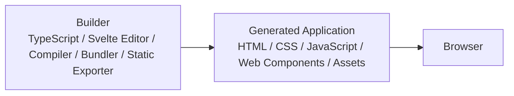

Generated Application実行時にBuilderを読み込まない。

Export後の起動関係:

```text
index.html
   ↓
app.js
├─ Application Definition
├─ Browser Runtime
└─ Web Components
   ↓
Browser Standard APIs
```

Visual Application Builder本体をGenerated Applicationから読み込まない。

### 4.16 htmxはOptional Integrationとする

htmxをFlow EngineやApplication RuntimeのCoreには使用しない。

```text
htmx
└─ Optional Integration
   ├─ Existing Server-rendered Applicationとの統合
   ├─ HTML Fragment取得
   └─ 特殊なHTML-over-the-wire Component
```

以下の置き換えとして使用しない。

```text
Core Runtime
├─ Flow Engine
├─ State Store
├─ Resource Client
├─ UI Controller
└─ Navigation Controller
```

### 4.17 Technology Boundary

技術境界を以下に固定する。

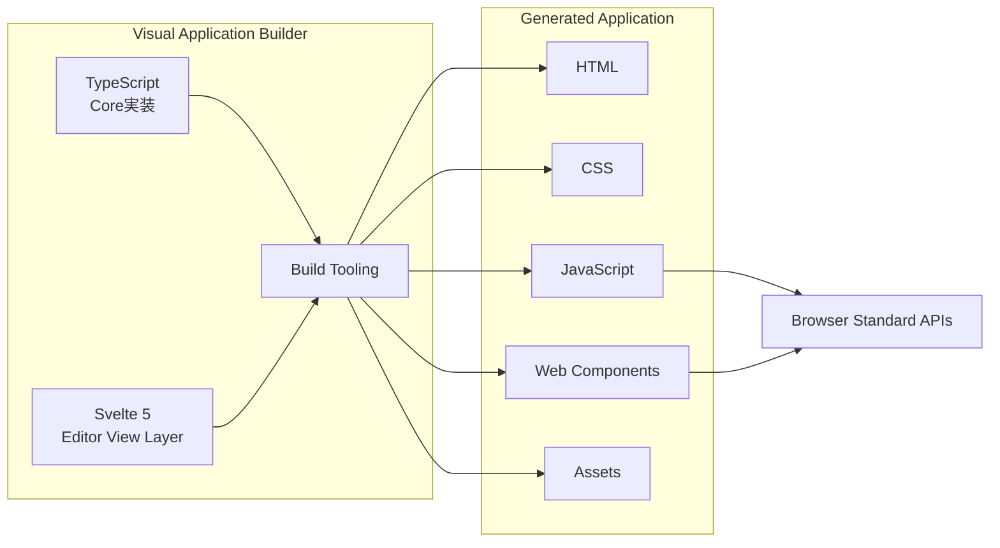

Builder内部の実装技術をGenerated ApplicationのRuntime Requirementへ漏らさない。

---

## 5. High-Level Architecture

本章ではProject Documentを中心として、Editor、Core、Preview Runtime、Browser Runtime、Exporter、Generated Applicationがどのように接続されるかを定義する。

Applicationの正本は常にProject Documentであり、Editor、Preview、Exportのために別々のApplication Modelを持たない。

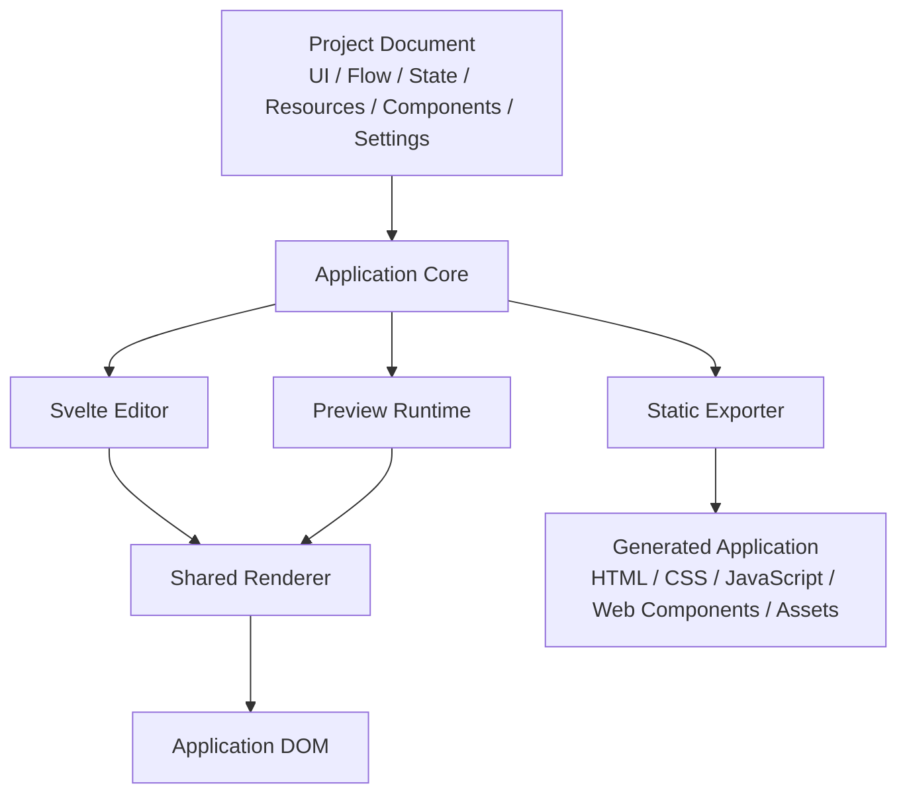

### 5.1 Project DocumentをArchitectureの中心とする

Project DocumentはApplication全体を表すSingle Source of Truthである。

```text
Project Document
├─ UI Document # UIのLogical Tree、Layout、Slot、Props、Presentation
├─ Flow Document # Application Behaviorを表すStructured Graph
├─ State # Application / Page / Component等のState定義
├─ Resources # REST API等の外部Resource定義
├─ Components # Component DefinitionとPublic Contract
└─ Settings # Project全体の設定とEnvironment情報
```

Project Documentは以下すべてから利用する。

```text
Project Consumers
├─ Editor
├─ Preview Runtime
├─ Shared Renderer
├─ Validator
└─ Static Exporter
```

Editor専用Project ModelとProduction専用Project Modelを分離しない。

### 5.2 Application CoreをProject操作の中心とする

Application CoreはFramework-independentなTypeScript Module群としてBuilder内部に実装する。

```text
Application Core
├─ Project Schema
├─ UI Model
├─ Flow Model
├─ State Model
├─ Resource Model
├─ Component Model
├─ Command System
├─ Transaction System
├─ History
├─ Normalizer
├─ Validator
├─ Expression Model
├─ Reference Resolver
└─ Serialization
```

EditorはApplication Coreを通してProjectを変更する。

Project ObjectをSvelte Componentから直接任意Mutationしない。

### 5.3 Editor操作からProject変更までの経路を統一する

Editor上のUser Interactionは直接DOMやProjectを変更せず、IntentからCommandへ変換する。

```mermaid
flowchart LR
    User["User Interaction"] --> EditorState["Editor Interaction State"]
    EditorState --> Intent
    Intent --> Command["Command / Transaction"]
    Command --> Mutation["Project Mutation"]
    Mutation --> Normalize["Normalization"]
    Normalize --> Validate["Validation"]
    Validate --> Renderer["Shared Renderer"]
    Renderer --> DOM["Application DOM"]
```

例:

単純なSibling移動も、後述するSlot移動と同じCommand Pipelineを使用する。

Pointer座標はこの処理中のTemporary StateでありProjectへ保存しない。

具体例として、ButtonをCardの`actions` SlotへDragする場合は以下となる。

```mermaid
flowchart LR
    Drag["User drags Button"] --> Surface["Interaction Surface"]
    Surface --> HitTest["Hit Test"]
    HitTest --> Candidate["Drop Candidate<br/>Card.actions"]
    Candidate --> SlotValidation["Slot Validation"]
    SlotValidation --> Intent["Drop Intent<br/>slot(actions)"]
    Intent --> Command["MOVE_TO_SLOT Command"]
    Command --> Project["Project Document"]
    Project --> Normalize["Normalization"]
    Normalize --> Validate["Validation"]
    Validate --> Renderer["Shared Renderer"]
    Renderer --> DOM["Application DOM Updated"]
```

Pointer座標はHit Testにのみ使用し、Projectへ保存しない。

### 5.4 UI DocumentはLogical Ownershipを保持する

UI DocumentはApplication UIのLogical Treeを保持する。

```text
UI Document
└─ Page
   └─ UserForm
      ├─ NameInput
      ├─ SaveButton
      ├─ ValidationPopover
      └─ SuccessSnackbar
```

このTreeはComponentのLogical Ownershipを表す。

Physical Rendering先とは独立させる。

### 5.5 Render SurfaceはLogical Treeと分離する

RendererはNodeのPresentationに従って適切なRender Surfaceへ描画する。

```text
Render Surfaces
├─ Application
│  ├─ Content Surface
│  └─ Overlay Surface
│     ├─ Anchored
│     ├─ Modal
│     └─ Notification
└─ Editor
   └─ Interaction Surface
```

例:

```text
Logical Tree
└─ UserForm
   ├─ SaveButton
   ├─ ValidationPopover
   └─ SuccessSnackbar
```

```text
Physical Rendering
├─ Content Surface
│  └─ UserForm
│     └─ SaveButton
└─ Overlay Surface
   ├─ Anchored
   │  └─ ValidationPopover
   └─ Notification
      └─ SuccessSnackbar
```

ValidationPopoverやSuccessSnackbarのLogical ParentはUserFormのまま維持する。

### 5.6 Shared RendererがUI DocumentをReal DOMへ変換する

RendererはUI DocumentのSemantic ModelをDOM / Web Componentsへ反映する。

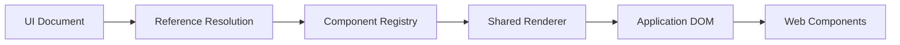

RendererはNode TypeからComponent Definitionを解決する。

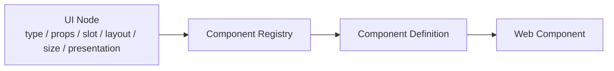

EditorとGenerated Applicationで異なるRendering Semanticsを持たない。

### 5.7 EditorではApplication DOMとInteraction Surfaceを分離する

EditorはShared Rendererが生成したReal Application DOMを表示する。

その上にEditor専用Interaction Surfaceを重ねる。

```text
Editor View
├─ Application DOM # 実Applicationと同じRendering Rulesで描画する
└─ Interaction Surface # Editor専用操作UI
   ├─ Selection Border
   ├─ Hover Outline
   ├─ Drop Indicator
   ├─ Slot Indicator
   ├─ Drag Preview
   ├─ Resize Handle
   ├─ Alignment Guide
   └─ Spacing Guide
```

Interaction SurfaceをApplication Component内部へ挿入しない。

### 5.8 Component RegistryをUIとRuntimeの接続点とする

Component RegistryはComponent TypeとPublic Contractを解決する。

```text
Component Registry
└─ Component Definition
   ├─ type
   ├─ tag
   ├─ props
   ├─ slots
   ├─ events
   ├─ actions
   ├─ defaults
   └─ presentation
```

以下が同一Definitionを利用する。

```text
Component Definition Consumers
├─ Renderer
├─ Inspector
├─ Drop System
├─ Validator
├─ Trigger Registry
├─ Action Registry
└─ Exporter
```

Editor MetadataとRuntime Metadataを別々に定義しない。

### 5.9 Flow DocumentはUI Documentから独立して保持する

FlowはApplication BehaviorをStructured Graphとして保持する。

```text
Flow Document
└─ SaveUserFlow
   ├─ Trigger
   │  ├─ target = node-save-button
   │  └─ event = click
   ├─ REST Action
   ├─ Condition
   ├─ State Action
   └─ Snackbar Action
```

UI Node側へJavaScript Behaviorを埋め込まない。

UIとFlowはStable Node IDで接続する。

### 5.10 Stable Node IDでUI Referenceを解決する

Flow RuntimeはDOM Selectorへ依存しない。

```text
UI Document
└─ SaveButton
   └─ id = node-save-button
```

```text
Flow Trigger
├─ target = node-save-button
└─ event = click
```

RuntimeはNode IDから実際のComponent Bindingを解決する。

```text
Stable Node ID
      ↓
UI Binding Registry
      ↓
Rendered Web Component
```

DOM hierarchyやCSS Selectorが変更されてもFlow Referenceを維持する。

### 5.11 Trigger RegistryがBrowser EventとFlowを接続する

Trigger RegistryはUI Event、Lifecycle、State Event、Timing Event等をFlow開始条件へ接続する。

```text
Trigger Sources
├─ UI Event
├─ Lifecycle Event
├─ State Event
└─ Timing Event
      ↓
Trigger Registry
      ↓
Flow Engine
```

UI Eventの場合:

```text
Web Component Event
      ↓
Component Public Event
      ↓
Trigger Registry
      ↓
Matching Flow Trigger
      ↓
Flow Engine
```

Component内部DOM Eventへ直接依存しない。

### 5.12 Flow EngineがStructured Graphを実行する

Runtime全体の具体的な実行例:

```mermaid
flowchart LR
    Click["User clicks SaveButton"] --> Event["Web Component Public Event"]
    Event --> Trigger["Trigger Registry"]
    Trigger --> Flow["flow-save-user"]
    Flow --> Engine["Flow Engine"]
    Engine --> ResourceAction["Resource Action"]
    ResourceAction --> Client["Resource Client"]
    Client --> API["POST /users"]
    API --> Output["Flow Node Output"]
    Output --> StateAction["State Action"]
    StateAction --> Store["State Store"]
    Store --> UIAction["UI Action"]
    UIAction --> Controller["UI Controller"]
    Controller --> Overlay["Overlay Manager"]
    Overlay --> Snackbar["SuccessSnackbar"]
```

Flow Engine自身はFetch、DOM操作、Overlay描画等のImplementation Detailを直接実装しない。

Flow EngineはFlow DocumentをExecution Contextとともに実行する。

```text
Flow Engine
├─ Node Execution
├─ Edge Selection
├─ Async Execution
├─ Branching
├─ Parallel Execution
├─ Retry
├─ Error Handling
├─ Cancellation
└─ Subflow
```

Flow EngineはSpecific Component内部実装を持たない。

UI操作はUI Controller / Action Registryを経由する。

### 5.13 Flow Execution Contextで値を管理する

Flow実行時の値をNamespaceごとに管理する。

```text
Flow Execution Context
├─ event # Triggerから受け取った値
├─ state # State Store内の値
├─ variables # Flow Local Variable
├─ outputs # 先行NodeのOutput
└─ env # Environment Value
```

Node間の値参照はStructured Referenceを使用する。

```text
state.form.email
event.detail.value
outputs.createUser.id
env.API_BASE_URL
```

任意JavaScript ScopeをFlowのData Modelにしない。

### 5.14 Expression EvaluatorがExpression ASTを評価する

ConditionやData TransformはExpression ASTとして保存し、Expression Evaluatorが実行する。

```text
Expression AST
      ↓
Expression Evaluator
      ↓
Flow Context
      ↓
Result
```

例:

```text
AND
├─ GTE
│  ├─ state.user.age
│  └─ 18
└─ EQ
   ├─ state.enabled
   └─ true
```

これによりEditorとRuntimeで同一Expression Semanticsを使用する。

### 5.15 State StoreをUIとFlowの共有Data Layerとする

State StoreはUIとFlow双方から利用する。

```text
                 Flow Engine
                     │
                     ▼
                  State Store
                 ▲         │
                 │         ▼
            UI Binding   State Trigger
```

State Scopeを区別する。

```text
State Scope
├─ Application State
├─ Page State
├─ Component State
└─ Flow Variables
```

Editor StateはこのState Storeへ混ぜない。

### 5.16 UI BindingはState変更をComponentへ反映する

Stateを参照するUI PropertyはBindingとして管理する。

```text
State Store
      ↓
Binding Resolution
      ↓
UI Controller / Renderer
      ↓
Component Property
```

例:

```text
state.user.name
      ↓
Text Component
      ↓
"Yamada"
```

Flow RuntimeがComponent内部DOMへ直接値を書き込まない。

### 5.17 Resource DefinitionとResource Clientを分離する

ResourcesはProject側の接続定義であり、Resource ClientはBrowser上の実行機構である。

```text
Project Resources
└─ backend
   ├─ baseUrl
   ├─ commonHeaders
   ├─ authPolicy
   └─ environmentOverrides
```

実行経路:

```text
Flow REST Action
      ↓
Resource Client
      ↓
Resource Definition
      ↓
Fetch API
      ↓
REST API
```

Flow GraphへEnvironment固有のBase URLを重複記述しない。

### 5.18 UI ControllerをFlowとComponentの境界とする

FlowからのUI操作はUI Controllerを経由する。

```text
Flow UI Action
      ↓
Action Registry
      ↓
UI Controller
      ↓
Stable Node ID Resolution
      ↓
Component Public Contract
      ↓
Web Component
```

例:

```text
Open Modal
      ↓
UI Controller
      ↓
node-user-modal
      ↓
ui-modal.open()
```

Flowから`querySelector()`やShadow DOM操作を行わない。

### 5.19 Overlay ManagerがOverlay Surfaceを管理する

Overlay ComponentのPhysical RenderingはOverlay Managerが管理する。

```text
Flow / UI Event
      ↓
UI Controller
      ↓
Overlay Manager
      ↓
Overlay Surface
├─ Anchored
├─ Modal
└─ Notification
```

Overlay Managerが管理するもの:

```text
Overlay Management
├─ Open / Close
├─ Stack
├─ Backdrop
├─ Focus
├─ Escape
├─ Outside Click
├─ Scroll Lock
├─ Anchor Position
└─ Notification Queue
```

Logical OwnershipはUI Document側から変更しない。

### 5.20 Navigation ControllerがBrowser Navigationを管理する

Navigation Actionを直接Browser APIへ分散させず、Navigation Controllerへ集約する。

```text
Flow Navigation Action
      ↓
Navigation Controller
      ↓
Browser APIs
├─ History
├─ Location
├─ URL
└─ URLSearchParams
```

Navigation Action:

```text
Navigation
├─ Navigate
├─ Back
├─ Forward
├─ Reload
├─ Open External URL
└─ Set Query Parameter
```

### 5.21 PreviewはProduction Runtime Coreを利用する

PreviewはProductionに似せた別Engineではなく、同一Runtime Coreを使用する。

```text
Project Document
      ↓
Browser Runtime Core
├─ Preview Mode
└─ Production Mode
```

Preview ModeのみEditor Hookを追加する。

```text
Preview Hooks
├─ Flow Node Highlight
├─ Step Execution
├─ State Inspector
├─ Flow Inspector
├─ Mock Resource
├─ Force-visible Overlay
└─ Debug Output
```

Preview HookはProject Documentへ暗黙的な恒久変更を加えない。

### 5.22 Preview OverrideをProject Stateから分離する

EditorでModal等を強制表示したい場合、Application Stateを書き換えない。

```text
Project
└─ Modal
   └─ open = false

Preview Override
└─ forceVisible(node-modal) = true
```

描画時:

```text
Project State
      +
Preview Override
      ↓
Shared Renderer
      ↓
Editor Preview
```

Export時にPreview Overrideを含めない。

### 5.23 ValidationをEditor、Preview、Exportで共有する

Project Validatorは共通Ruleを使用する。

```text
Project Validator
├─ UI Validation
├─ Slot Validation
├─ Reference Validation
├─ Flow Validation
├─ Expression Validation
├─ Resource Validation
├─ Component Validation
└─ State Validation
```

利用箇所:

```text
Validator
├─ Editor
├─ Preview
└─ Static Exporter
```

Previewだけ通るProjectやExportだけ失敗するProjectを可能な限り作らない。

### 5.24 Static ExporterはProjectの意味を再解釈しない

Static ExporterはProjectから別のApplication Modelを作成しない。

```text
Project Document
      ↓
Validation
      ↓
Serialization / Build
      ↓
Generated Application
```

Exporterの責務:

```text
Static Exporter
├─ Validate Project
├─ Serialize Application Definition
├─ Build JavaScript Runtime
├─ Build Web Components
├─ Generate HTML Entry
├─ Generate / Bundle CSS
└─ Copy / Bundle Assets
```

Core SemanticsをExporter内部で再実装しない。

### 5.25 Application DefinitionをJavaScriptで配布可能にする

Generated ApplicationにはRuntimeが解釈可能なApplication Definitionを含める。

```text
Generated JavaScript
├─ Application Definition
│  ├─ UI Definition
│  ├─ Flow Definition
│  ├─ State Definition
│  ├─ Resource Definition
│  ├─ Component Definition
│  └─ Settings
│
└─ Browser Runtime
   ├─ Flow Engine
   ├─ State Store
   ├─ Resource Client
   ├─ UI Controller
   ├─ Overlay Manager
   ├─ Component Registry
   └─ Expression Evaluator
```

Application Definitionは別JSON Fetchを必須にしない。

必要に応じてJavaScript Bundle内へ埋め込む。

### 5.26 Generated Applicationの基本構成

標準的なExport結果:

```text
dist/
├─ index.html # Browser Entry Point
├─ app.js # Runtime / Application Definition / Component等のJavaScript
├─ styles.css # Application Style
└─ assets/ # Image / Icon / Font以外の許可された静的Asset等
```

内部責務は以下のように論理分割される。

```text
app.js
├─ Application Definition
├─ Flow Engine
├─ State Store
├─ Resource Client
├─ UI Controller
├─ Overlay Manager
├─ Navigation Controller
├─ Component Registry
├─ Expression Evaluator
└─ Web Components
```

物理的には1ファイルでも複数JavaScriptファイルでもよい。

### 5.27 Generated ApplicationはBrowserだけで起動可能にする

Generated Application実行時の依存関係:

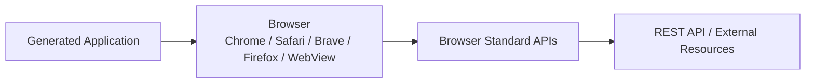

以下を実行時前提にしない。

```text
Not Required at Runtime
├─ Visual Application Builder
├─ TypeScript
├─ TypeScript Compiler
├─ Svelte Editor
├─ Svelte Runtime
├─ React Runtime
├─ Node.js
└─ Application Server
```

### 5.28 Static Hostingを標準Deploymentとする

Generated ApplicationはStatic Frontendとして配置できる。

```text
Static Hosting
├─ CDN
├─ Object Storage
├─ Static Web Server
└─ Existing Web Server
      ↓
Generated Application
      ↓
REST API
```

REST API接続時はCORS、Authentication、Authorization等のBrowser制約に従う。

### 5.29 file:// とHTTP(S) Hostingを別要件として扱う

Static Frontendであることと`file://`で完全動作することを同一視しない。

Local File FetchやRuntime Module Fetchを必須にしないことで、可能な範囲で`file://`互換性を高める。

```text
Avoid Runtime Requirements
├─ fetch("./project.json")
├─ fetch("./component.html")
└─ 不要なRuntime Module Dependency Chain
```

ただしREST API通信、CORS、Origin Policy等の理由から標準DeploymentはHTTP(S) Hostingとする。

### 5.30 Backend ResponsibilityをGenerated Applicationから分離する

Browser Runtimeで安全に実行できない責務はBackendへ配置する。

```text
Generated Frontend
├─ UI Rendering
├─ Flow Execution
├─ Client State
├─ Navigation
├─ Overlay Control
├─ Data Transformation
├─ Client Validation
├─ REST Request
└─ Browser Storage
```

```text
Backend
├─ Authentication / Authorization
├─ Database
├─ Secret Management
├─ Protected Business Logic
├─ External API Proxy
├─ Secure File Processing
└─ Guaranteed Scheduled Jobs
```

Frontend JavaScriptへSecretを埋め込まない。

### 5.31 Server ScheduleをExternal Capabilityとして扱う

Foreground ScheduleとServer ScheduleをArchitecture上で区別する。

```text
Browser Runtime
├─ Delay
├─ Interval
└─ Foreground Schedule

External Backend Capability
└─ Server Schedule
```

Server ScheduleはGenerated Application自身がBrowser外で実行する機能ではない。

必要な場合はBackend Schedulerや外部ServiceとのIntegrationとして扱う。

### 5.32 BuilderとGenerated Applicationの技術境界

Builder内部とExport結果を明確に分ける。

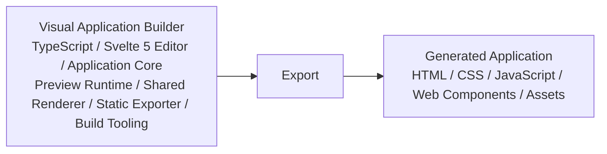

Builder内部のTypeScriptやSvelteをGenerated Applicationの必須Runtime Dependencyにしない。

### 5.33 Dependency Direction

Architectureの依存方向を以下にする。

```text
Svelte Editor
      ↓
Application Core
      ↑
Shared Renderer
      ↑
Browser Runtime Source
      ↑
Static Exporter
```

より正確には各ModuleはCore ModelやPublic Contractへ依存し、Editor Frameworkへ逆依存しない。

```text
Application Core
├─ Editorから参照される
├─ Rendererから参照される
├─ Runtimeから参照される
└─ Exporterから参照される

Application Core
└─ Svelteへ依存しない
```

### 5.34 全体Architecture

Builder内部からGenerated Application実行までを統合すると以下となる。

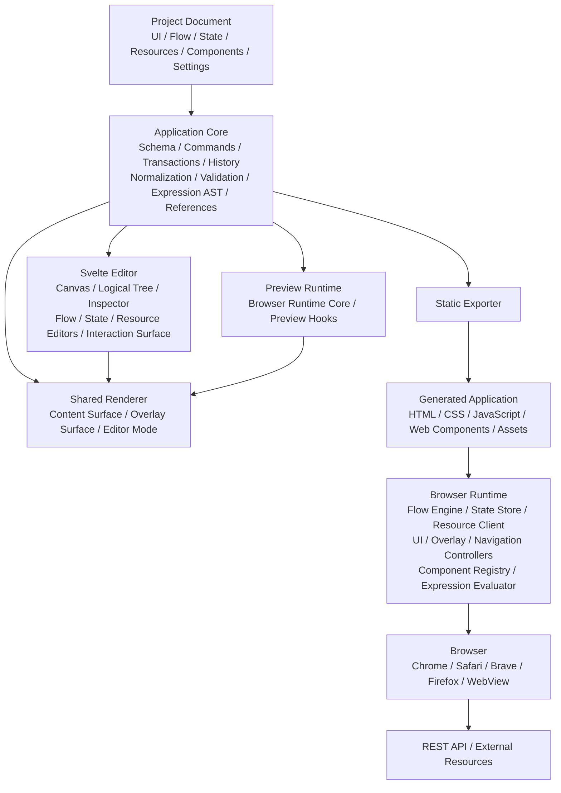

### 5.35 Core Data Flow

Editor操作、Flow実行、ExportのCanonical Data Flowは[Section 3.39](./02-core-principles.md#339-core-data-flow)で定義する。

本章では[Section 5.34](#534-全体architecture)の全体Architectureへ各Data Flowの実行主体を割り当て、別の実行経路を再定義しない。

### 5.36 High-Level Architecture Invariants

本章における重要なArchitecture Invariantを以下に固定する。

```text
A # Project DocumentをEditor / Preview / Exportの共通Source of Truthとする

B # Editor専用Application Modelを作らない

C # Production専用Application Modelを作らない

D # Shared RendererでEditorとProductionのRendering Semanticsを一致させる

E # Interaction SurfaceをApplication DOMおよびExport結果から分離する

F # Logical OwnershipとRender Surfaceを分離する

G # UIとFlowをStable Node IDで接続する

H # FlowからDOM SelectorやComponent内部DOMへ直接アクセスしない

I # Component RegistryとPublic ContractをEditor / Runtime / Exporterで共有する

J # State StoreをUIとFlowの共有Data Layerとする

K # Resource DefinitionとResource Clientを分離する

L # PreviewはProduction Runtime Coreを再利用する

M # ExporterはProject Semanticsを再実装しない

N # Builder内部はTypeScriptを使用してよいが、Generated ApplicationはJavaScriptとして出力する

O # Generated ApplicationはTypeScript / Svelte / Node.jsを実行時必須依存にしない

P # Generated ApplicationはBrowser Standard APIsを基本として単体実行可能にする

Q # Secret、Database、Guaranteed Schedule等のServer ResponsibilityをGenerated Frontendへ持ち込まない

```

---

Previous: [Core Principles](./02-core-principles.md) · [Architecture Index](./README.md) · Next: [Project Document Model](./04-project-document-model.md)
