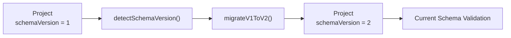
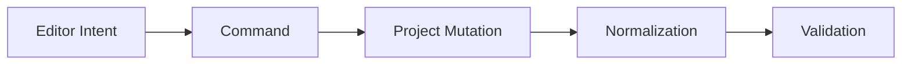
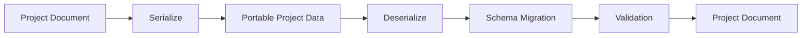

# Architecture: Project Document Model

> [Architecture Index](./README.md) · Previous: [Technology and System Architecture](./03-technology-and-system-architecture.md) · Next: [UI and Responsive Model](./05-ui-and-responsive-model.md)
>
> Covers: Section 6

---

## 6. Project Document Model

Project Documentは、Visual Application Builderで作成されるApplication全体を表す永続的なCanonical Modelであり、Editor、Preview、Validation、Exportの共通Source of Truthとする。

DOM、Generated HTML、Svelte State、Editor View State等をApplicationの正本としない。

```text
Project Document # Application全体を表すCanonical Model
├─ meta # Project識別情報とSchema Version
├─ ui # UI Document
├─ flows # Flow Document群
├─ state # State Definition
├─ resources # Resource Definition
├─ components # Component Definition / Reference
└─ settings # Project全体の設定
```

### 6.1 Project Documentを永続Application Modelとする

Project DocumentはEditor操作中だけ存在する一時Modelではなく、保存、読込、Preview、Exportすべてで利用するApplication Definitionとする。

```text
Project Document
├─ Save # 永続化する
├─ Load # 復元する
├─ Edit # Editorが変更する
├─ Validate # Project整合性を検証する
├─ Preview # Browser Runtimeで実行する
└─ Export # Static Frontendへ変換する
```

同一ProjectからEditor用ApplicationとProduction用Applicationを別々に生成する二重Modelを持たない。

### 6.2 ProjectのTop-level Structureを固定する

Projectは以下の責務に分離する。

```text
Project
├─ meta # Project ID、Name、Schema Version等
├─ ui # Logical UI Tree
├─ flows # Application Behavior Graph
├─ state # State Schema / Initial Values
├─ resources # REST Resource等の接続定義
├─ components # Component DefinitionとRegistry情報
└─ settings # EnvironmentやApplication設定
```

各領域が他領域の内部Dataを複製しない。

Referenceが必要な場合はStable IDで接続する。

最小Projectの概念的な保存例:

```json
{
  "meta": {
    "id": "project-user-app",
    "name": "User App",
    "schemaVersion": "1"
  },
  "ui": {
    "roots": ["page-home"],
    "nodes": {}
  },
  "flows": {
    "flows": {}
  },
  "state": {},
  "resources": {},
  "components": {},
  "settings": {}
}
```

この例はField名の最終Schema固定ではなく、Top-level責務の境界を示すCanonical Exampleとする。

### 6.3 Project Metadataを持つ

Project自体を識別し、Schema Migrationを可能にするためMetadataを持つ。

```text
Project Meta
├─ id # Projectを識別するStable ID
├─ name # Project表示名
├─ schemaVersion # Project Schema Version
├─ createdAt # 作成日時
├─ updatedAt # 最終更新日時
└─ generatorVersion # 必要な場合のみBuilder Versionを記録する
```

`schemaVersion` はBuilder Versionとは分離する。

Builderが更新されてもProject Schemaが変更されない場合、Schema Versionを変更する必要はない。

### 6.4 Schema Versionを明示する

Project Formatは将来変更されるため、Versionなしの匿名JSON構造にしない。

```text
Project
└─ meta
   └─ schemaVersion = "1"
```

Schema変更時はMigrationを定義する。



既存ProjectをEditor内部で場当たり的に補正するのではなく、明示的なMigration Stepを通す。

Migration中にEditor UIへ依存した処理を行わない。

### 6.5 Stable IDをProject全体のReference基盤とする

Project内で外部から参照されるEntityはStable IDを持つ。

```text
Stable IDs
├─ Project ID
├─ UI Node ID
├─ Flow ID
├─ Flow Node ID
├─ State Definition ID
├─ Resource ID
└─ Component Definition ID
```

表示名をReference Keyとして使用しない。

```text
name = "Save Button" # Userが変更可能

id = "node_01H..." # Reference用Stable ID
```

RenameによってReferenceが破壊されない構造にする。

### 6.6 IDと表示名を分離する

`id` はMachine Reference、`name` はHuman-readable Labelとして扱う。

```text
Entity
├─ id # Stable Machine Reference
└─ name # Userが変更可能なDisplay Name
```

以下を禁止する。

```text
Flow Target
└─ target = "Save Button" # Display Name依存
```

以下を使用する。

```text
Flow Target
└─ target = "node-save-button"
```

### 6.7 Project間ReferenceとProject内Referenceを区別する

基本Project ModelではProject内部のReferenceをStable IDで表現する。

```text
Internal Reference
├─ UI → Component Definition
├─ Flow → UI Node
├─ Flow → Resource
├─ Flow → State
└─ Component Instance → Project Component
```

Project外ResourceやExternal Component等は、内部Entity IDではなく明示的なExternal Referenceとして扱う。

```text
Reference
├─ Internal Reference # Project内Stable ID
└─ External Reference # Package / URL / Registry Key等
```

両者を同じStringの暗黙解釈にしない。

### 6.8 ReferenceはStructured Dataとして保持する

Reference可能な値を任意String Pathだけで表現しない。

概念的には以下のようなStructured Referenceを使用する。

```text
Reference
├─ kind # uiNode / state / resource / output / env等
├─ id # Reference対象のStable ID
└─ path # Entity内部のProperty Pathが必要な場合のみ保持
```

Flow Context等の簡潔な表示では、

```text
state.form.email
outputs.createUser.id
```

のように見せてもよいが、内部保存形式は解析可能なStructured Referenceを優先する。

簡潔なReference表現の例:

```json
{
  "$ref": "state.form.email"
}
```

Entity IDを伴うReferenceの概念例:

```json
{
  "$ref": {
    "kind": "resource",
    "id": "resource-backend"
  }
}
```

RuntimeやValidatorが通常StringとReferenceを区別できる形式とする。

### 6.9 UI DocumentをProject内の独立Modelとして保持する

UI DocumentはProject内のUI構造を担当する。

```text
Project
└─ ui
   ├─ roots # Page等のRoot Node
   ├─ nodes # UI Node Definition
   └─ uiSettings # UI Document固有設定が必要な場合
```

UI Documentの詳細なSemantic Modelは[Section 7](./05-ui-and-responsive-model.md#7-ui-document-model)で定義する。

### 6.10 Flow DocumentをUI Documentから分離する

BehaviorをUI NodeのPropertyへ直接埋め込まない。

```text
Project
├─ ui
│  └─ SaveButton
│     └─ id = node-save
│
└─ flows
   └─ SaveFlow
      └─ Trigger
         ├─ target = node-save
         └─ event = click
```

UIとFlowはStable Referenceで接続する。

### 6.11 State Definitionを独立して保持する

Application State DefinitionをComponent TreeやFlow Graphへ分散させない。

```text
Project State
├─ Application State
├─ Page State
└─ Component State Definition
```

Flow Variables、Flow Outputs、Event Data等のExecution-local DataはProject-level Persistent Stateとは区別する。

```text
Persistent Definition
├─ Application State
├─ Page State
└─ Component State Schema

Runtime Context
├─ Flow Variables
├─ Flow Outputs
└─ Event Data
```

### 6.12 Resource Definitionを独立して保持する

REST API等の接続先をFlow Nodeへ重複保存しない。

```text
Project
└─ resources
   └─ backend
      ├─ id
      ├─ type = REST
      ├─ baseUrl
      ├─ commonHeaders
      ├─ authPolicy
      └─ environmentOverrides
```

Flow ActionはResource IDを参照する。

```text
REST Action
├─ resource = backend-resource-id
├─ method = POST
└─ path = /users
```

具体例:

```json
{
  "id": "resource-backend",
  "type": "rest",
  "baseUrl": "https://api.example.com",
  "commonHeaders": {
    "Accept": "application/json"
  }
}
```

Flowは`resource-backend`をStable IDで参照する。

### 6.13 Component DefinitionをProject Modelへ統合する

利用可能なComponentと、そのPublic ContractをProjectから解決できるようにする。

```text
Project Components
├─ Built-in Component References
├─ Registered Web Components
├─ Project Components
└─ External Component References
```

各Component Definitionは少なくとも以下を公開する。

```text
Component Definition
├─ id
├─ type
├─ tag
├─ props
├─ slots
├─ events
├─ actions
├─ defaults
└─ presentation
```

Component内部DOMをProject Schemaへ保存しない。

### 6.14 SettingsをApplication Modelから分離して保持する

Project全体に関係する設定はSettingsへまとめる。

```text
Project Settings
├─ Application Settings
├─ Environment Settings
├─ Navigation Settings
├─ Theme Settings
├─ Build / Export Settings
└─ Compatibility Settings
```

特定Editor Panelの開閉状態等はProject Settingsに含めない。

### 6.15 Environment値とSecretを区別する

Browserから参照可能なEnvironment ValueはProject Definitionに含めることができる。

```text
Client Environment
├─ API Base URL
├─ Public Feature Flag
└─ Public Configuration
```

SecretはProjectへ保存しない。

```text
Do Not Store
├─ Private API Key
├─ OAuth Client Secret
├─ Database Password
├─ Service Account Secret
└─ Backend Credential
```

Secretが必要な処理はBackendへ委譲する。

### 6.16 Persistent DataとEditor-only Dataを分離する

Projectへ保存するDataとEditor Sessionだけで必要なDataを明確に分離する。

```text
Persistent Project Data
├─ UI Document
├─ Flow Document
├─ State Definition
├─ Resources
├─ Components
└─ Settings
```

```text
Editor-only State
├─ selectedNode
├─ hoveredNode
├─ pointer
├─ dragging
├─ dropIntent
├─ activeSlot
├─ viewport
├─ zoom
├─ activePanel
├─ inspectorTab
└─ previewOverrides
```

Editor-only StateをProject Documentへ混ぜない。

例:

```text
Saved Project
├─ node-save-button
├─ flow-save-user
└─ resource-backend

Not Saved
├─ selectedNode = node-save-button
├─ hoveredNode = node-email
├─ pointer = {x, y}
└─ zoom = 1.25
```

### 6.17 Runtime StateとProject Definitionを分離する

ProjectはApplication Definitionであり、実行中の状態そのものではない。

```text
Project Definition
├─ State Schema
├─ Initial State
├─ UI Definition
└─ Flow Definition
```

```text
Runtime Instance
├─ Current State Values
├─ Active Flows
├─ Pending Requests
├─ Open Overlays
└─ Navigation State
```

通常のRuntime Instance DataをProject保存時に自動保存しない。

### 6.18 Preview OverrideをProjectへ保存しない

Editor上の編集補助のためにApplicationを一時的に異なる状態で表示できる。

```text
Project
└─ Modal
   └─ open = false

Preview Override
└─ forceVisible(modal) = true
```

Preview OverrideはProject Definitionを変更しない。

Exportにも含めない。

### 6.19 Geometry CacheをProjectへ保存しない

DOMから取得するBounding Rect等はDerived Runtime Dataである。

```text
Derived Geometry
├─ x
├─ y
├─ width
├─ height
├─ clientRect
└─ scrollOffset
```

これらを通常UI LayoutのSource of TruthとしてProjectへ保存しない。

EditorのHit TestやInteraction Surfaceで一時的に利用する。

### 6.20 Project MutationはCommand経由とする

Project変更をEditor Componentから直接任意Mutationしない。



代表Command:

```text
Project Commands
├─ ADD_NODE
├─ DELETE_NODE
├─ MOVE_NODE
├─ REORDER_NODE
├─ MOVE_TO_SLOT
├─ SET_PROPERTY
├─ SET_LAYOUT
├─ SET_PRESENTATION
├─ ADD_FLOW
├─ CONNECT_FLOW
├─ DISCONNECT_FLOW
├─ SET_STATE
├─ SET_RESOURCE
└─ SET_COMPONENT
```

### 6.21 複合変更をTransactionとして扱う

1つのUser Intentが複数Project Mutationを必要とする場合、Transactionとしてまとめる。

```text
User Action
└─ Create Horizontal Split
      ↓
Transaction
├─ ADD_LAYOUT_NODE
├─ MOVE_NODE
├─ MOVE_NODE
└─ SET_LAYOUT
```

Undo / Redoは内部Command数ではなくUser Intent単位を基本とする。

### 6.22 Project HistoryをProject Definitionと分離する

Undo / Redo HistoryはEditor Session Dataとして扱い、Project Definitionそのものへ必須保存しない。

```text
Editor Session
├─ Current Project
└─ History
   ├─ Past Transactions
   └─ Future Transactions
```

Project永続化とHistory永続化は別機能として扱う。

### 6.23 Mutation後にNormalizationを行う

Project Mutation後はCanonical FormへNormalizeする。

```text
Command / Transaction
      ↓
Mutation
      ↓
Normalization
      ↓
Validation
      ↓
Render
```

Normalizationは意味を変えない構造整理のみを行う。

### 6.24 Semantic BoundaryをNormalizationから保護する

Normalizerが以下を暗黙削除・統合してはならない。

```text
Preserve Boundary
├─ Explicit User Container
├─ Component Root
├─ Reusable Component Boundary
├─ Slot Boundary
├─ Semantic Group
├─ Styling Boundary
├─ Flow Reference Target
└─ Externally Referenced Node
```

### 6.25 Project-level Validationを行う

保存、Preview、Exportで共通Validatorを使用する。

```text
Project Validation
├─ Schema Validation
├─ ID Validation
├─ Reference Validation
├─ UI Validation
├─ Flow Validation
├─ State Validation
├─ Resource Validation
├─ Component Validation
└─ Settings Validation
```

Reference切れ等を各Subsystemで個別に黙って無視しない。

### 6.26 Deleted Entity Referenceを検出する

Entity削除時はReference Integrityを確認する。

```text
Delete UI Node
      ↓
Reference Search
├─ Flow Trigger
├─ Flow Action
├─ State Binding
└─ External Project Reference
      ↓
Delete Policy
```

削除PolicyはCommand側で明示する。

```text
Delete Policy
├─ Block Delete # Referenceがある場合削除不可
├─ Cascade Delete # 明示された関連Entityを削除
└─ Leave Invalid Reference # 原則使用しない
```

Userに見えない形でReferenceを勝手に別Nodeへ付け替えない。

### 6.27 Serialization FormatをCanonicalにする

ProjectはJSON等へSerialization可能なPure Data Modelを基本とする。



Function、DOM Node、Svelte Proxy等をPersistent Project Dataへ保存しない。

### 6.28 Project ModelをFramework-independentにする

Project ObjectはSvelte固有Reactive ObjectをCanonical Modelにしない。

```text
Framework-independent Project
      ↓
Svelte Editor Adapter
```

Svelte側では必要に応じてProject変更通知を購読する。

Project SchemaそのものをSvelte `$state` 等へ依存させない。

### 6.29 TypeScript SchemaはBuilder内部実装とする

Builder内部ではProject ModelをTypeScript Type / Schemaとして定義する。

```text
Builder
└─ TypeScript Project Schema
      ↓
Validation / Editing / Export
```

TypeScript TypeそのものをGenerated ApplicationのRuntime Requirementにはしない。

Export時はJavaScriptから利用可能なApplication Definitionへ変換する。

```text
TypeScript Builder Model
      ↓
Static Exporter
      ↓
JavaScript Application Definition
```

### 6.30 Application DefinitionとEditor Project Dataの意味を一致させる

Export時にProjectを別の意味Modelへ変換しない。

```text
Project Document
      ↓
Serialize / Build
      ↓
Application Definition
```

Data表現を最適化してもSemantic Meaningは維持する。

### 6.31 Project Documentの最終構成

```text
Project Document # Application全体のCanonical Source of Truth
├─ meta # Project Identity / Schema Version
│  ├─ id
│  ├─ name
│  ├─ schemaVersion
│  ├─ createdAt
│  └─ updatedAt
│
├─ ui # Logical UI Definition
│  ├─ roots
│  └─ nodes
│
├─ flows # Structured Behavior Graph
│  ├─ flows
│  ├─ nodes
│  └─ edges
│
├─ state # Persistent State Definitions
│  ├─ application
│  ├─ pages
│  └─ components
│
├─ resources # External Resource Definitions
│  └─ REST Resources
│
├─ components # Component Definitions / References
│  ├─ Built-in
│  ├─ Registered Web Components
│  ├─ Project Components
│  └─ External Components
│
└─ settings # Application / Environment / Export Settings
```

### 6.32 Project Document Invariants

```text
A # Project DocumentをApplicationのSingle Source of Truthとする

B # DOM、Generated HTML、Svelte StateをSource of Truthにしない

C # Persistent Project DataとEditor-only Stateを分離する

D # Project DefinitionとRuntime Instance Stateを分離する

E # Stable IDをProject内Referenceの基盤とする

F # Display NameをReference Keyとして使用しない

G # Referenceは解析可能なStructured Dataとして保持する

H # UI / Flow / State / Resources / Componentsの責務を分離する

I # SecretをProject Documentへ保存しない

J # Project MutationはCommand / Transactionを経由する

K # Mutation後にNormalizationとValidationを行う

L # Semantic BoundaryをNormalizerが破壊しない

M # Schema VersionとMigrationを明示する

N # Persistent Project DataへDOM NodeやFramework Objectを保存しない

O # Builder内部ではTypeScriptを利用してよいがExport結果へTypeScript実行環境を要求しない

P # ExportされたApplication DefinitionとProject DocumentのSemanticsを一致させる
```

---

Previous: [Technology and System Architecture](./03-technology-and-system-architecture.md) · [Architecture Index](./README.md) · Next: [UI and Responsive Model](./05-ui-and-responsive-model.md)
