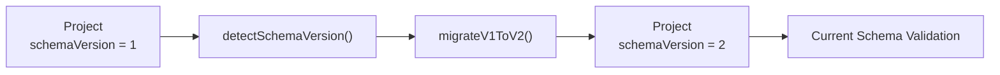
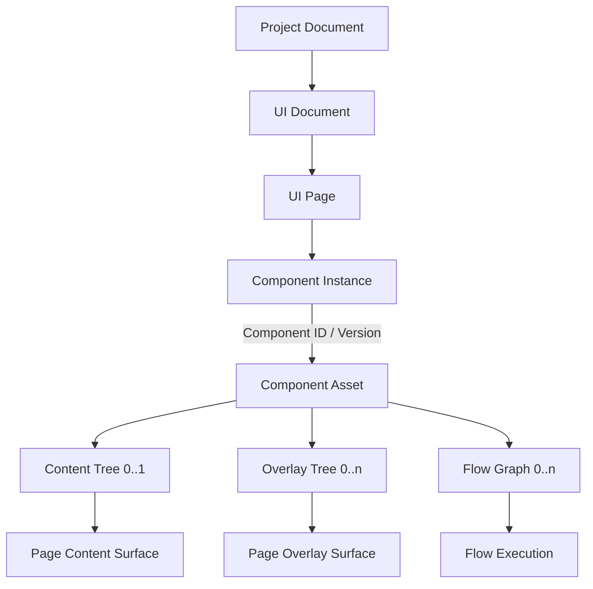
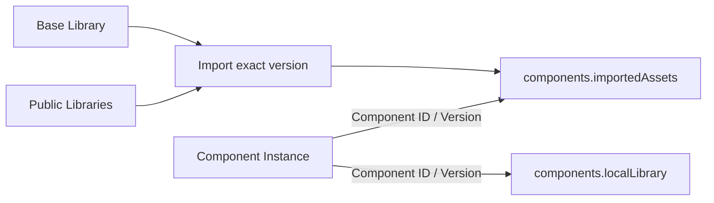
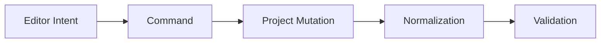
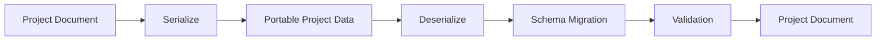

# Architecture: Project Document Model

> [Architecture Index](./README.md) · Previous: [Technology and System Architecture](./03-technology-and-system-architecture.md) · Next: [UI and Responsive Model](./05-ui-and-responsive-model.md)
>
> Covers: Section 6

---

## 6. Project Document Model

Project Documentは、Visual Application Builderで作成されるApplication全体を表す永続的なCanonical Modelであり、Editor、Preview、Validation、Exportの共通Source of Truthとする。

DOM、Generated HTML、Svelte State、Editor View State等をApplicationの正本としない。

```text
Project Document # Application全体を表すCanonical Model
├─ meta # Project識別情報とSchema Version
├─ ui # UI PageとComponent Instance
├─ flows # Flow Graph
├─ state # Application共有State
├─ resources # Resource Definition
├─ components # Imported Component SnapshotとProject Local Library
└─ settings # Project全体の設定
```

### 6.1 Project Documentを永続Application Modelとする

Project DocumentはEditor操作中だけ存在する一時Modelではなく、保存、読込、Preview、Exportすべてで利用するApplication Definitionとする。

```text
Project Document
├─ Save # 永続化する
├─ Load # 復元する
├─ Edit # Editorが変更する
├─ Validate # Project整合性を検証する
├─ Preview # Browser Runtimeで実行する
└─ Export # Static Frontendへ変換する
```

同一ProjectからEditor用ApplicationとProduction用Applicationを別々に生成する二重Modelを持たない。

### 6.2 ProjectのTop-level Structureを固定する

Projectは次の責務へ分離する。

```text
Project
├─ meta # Project ID、Name、Schema Version
├─ ui # UI PageとComponent Instance
├─ flows # Project-level Flow Graph
├─ state # Application共有State
├─ resources # REST Resource等
├─ components # Imported Component SnapshotとProject Local Library
└─ settings # EnvironmentやApplication設定
```

最小Projectの概念的な保存例:

```json
{
  "meta": {
    "id": "project-user-app",
    "name": "User App",
    "schemaVersion": "1",
    "createdAt": "2026-08-29T00:00:00Z",
    "updatedAt": "2026-08-29T00:00:00Z"
  },
  "ui": {
    "pages": {
      "ui-page-main": {
        "id": "ui-page-main",
        "name": "Main",
        "componentInstances": {}
      }
    }
  },
  "flows": { "graphs": {} },
  "state": { "states": {} },
  "resources": { "resources": {} },
  "components": {
    "importedAssets": {},
    "localLibrary": {
      "id": "library-local",
      "name": "Local",
      "assets": {}
    }
  },
  "settings": { "environment": {} }
}
```

各領域が他領域の内部Dataを複製しない。接続にはStable IDとStructured Referenceを使用する。

### 6.3 Project Metadataを持つ

Project自体を識別し、Schema Migrationを可能にするためMetadataを持つ。

```text
Project Meta
├─ id # Projectを識別するStable ID
├─ name # Project表示名
├─ schemaVersion # Project Schema Version
├─ createdAt # 作成日時
├─ updatedAt # 最終更新日時
└─ generatorVersion # 必要な場合のみBuilder Versionを記録する
```

`schemaVersion` はBuilder Versionとは分離する。

Builderが更新されてもProject Schemaが変更されない場合、Schema Versionを変更する必要はない。

### 6.4 Schema Versionを明示する

Project Formatは将来変更されるため、Versionなしの匿名JSON構造にしない。

```text
Project
└─ meta
   └─ schemaVersion = "1"
```

Schema変更時はMigrationを定義する。



既存ProjectをEditor内部で場当たり的に補正するのではなく、明示的なMigration Stepを通す。

Migration中にEditor UIへ依存した処理を行わない。

### 6.5 Stable IDをProject全体のReference基盤とする

Project内で参照されるEntityはStable IDを持つ。

```text
Stable IDs
├─ Project ID
├─ UI Page ID
├─ Component ID / Version
├─ Component Instance ID
├─ Content Node Local ID
├─ Overlay Tree Local ID
├─ Trigger Instance ID
├─ Flow Graph ID
├─ Flow Node ID
├─ State ID
└─ Resource ID
```

Component内のContent Node、Overlay Tree、Flow GraphはComponent Instance PathとLocal IDの組で解決する。

```text
component-instance-clock-a / clock-display
component-instance-clock-a / timezone-modal
component-instance-clock-a / tick
```

Display NameをReference Keyとして使用しない。

### 6.6 IDと表示名を分離する

`id` はMachine Reference、`name` はHuman-readable Labelとして扱う。

```text
Entity
├─ id # Stable Machine Reference
└─ name # Userが変更可能なDisplay Name
```

以下を禁止する。

```text
Flow Target
└─ target = "Save Button" # Display Name依存
```

以下を使用する。

```json
{
  "kind": "content-node",
  "componentInstancePath": [
    "component-instance-user-form",
    "component-instance-save-button"
  ],
  "localId": "content-node-button"
}
```

### 6.7 Project間ReferenceとProject内Referenceを区別する

Project内部のReferenceはStable IDで表現する。

```text
Internal Reference
├─ UI Page → Component Instance
├─ Component Instance → Component Asset Version
├─ Trigger Instance → Content Node Event
├─ Overlay Tree → Anchor Content Node
├─ Flow Node → Content Node / Overlay Tree / State / Resource
└─ Component-local Entity → Component Instance Path + Local ID
```

Base／Public Library Componentは使用時にProjectへ取り込み、Component ID、Component Version、取得元Library ID／Versionを固定する。Local ComponentはProjectのLocal Libraryから参照する。Package、URL等のProject外ReferenceはInternal Referenceと同じStringとして暗黙解釈しない。

### 6.8 ReferenceはStructured Dataとして保持する

Reference可能な値を任意String Pathだけで表現しない。

概念的には以下のようなStructured Referenceを使用する。

```text
Reference
├─ kind # content-node / content-node-state / application-state / resource / output / env等
├─ scope # current-component-instance等の相対Scopeが必要な場合
├─ componentInstancePath # 明示ScopeではPage Rootから、current Scopeでは現在のInstanceからのPath
├─ localId # Component内のContent Node、Overlay Tree等を参照するとき
├─ id # Application State、Resource等のProject Entityを参照するとき
└─ path # Entity内部のProperty Pathが必要な場合のみ保持
```

Content Node Stateを参照する概念例:

```json
{
  "$ref": {
    "kind": "content-node-state",
    "componentInstancePath": ["component-instance-user-form"],
    "localId": "content-node-user-form",
    "path": ["form", "email"]
  }
}
```

Resourceを参照する概念例:

```json
{
  "$ref": {
    "kind": "resource",
    "id": "resource-backend"
  }
}
```

RuntimeやValidatorが通常StringとReferenceを区別できる形式とする。

### 6.9 UI DocumentをProject内の独立Modelとして保持する

UI DocumentはUI PageとComponent Instanceの配置を担当する。

```text
Project
└─ ui
   └─ pages
      └─ UI Page
         ├─ id
         ├─ name
         └─ componentInstances
```

各UI PageはRuntimeでContent SurfaceとOverlay Surfaceを持つ。Surface DOM、Active Overlay、計算済み座標をProjectへ保存しない。



UI Modelの詳細は[Section 7](./05-ui-and-responsive-model.md#7-ui-document-model)で定義する。

### 6.10 Flow DocumentをUI Documentから分離する

Flow DocumentはProject-level Flow Graphを保持する。Component固有Flow GraphはComponent Assetが保持し、両者は同じFlow Graph Schemaを使用する。

```text
Flow Document
└─ graphs
   └─ Flow Graph
      ├─ Flow Nodes
      └─ Edges

Component
└─ flowGraphs
   └─ Flow Graph
```

Flow ExecutionはRuntime InstanceでありProjectへ保存しない。UI Event、Overlay Open Trigger、Flow NodeはStructured Referenceで接続し、DOM Event Handler文字列を保存しない。

### 6.11 Application StateとContent Node Stateを分離する

Application全体で共有するStateはProjectのState Documentへ保持する。Component Instanceごとに独立するStateは、それを利用するContent Nodeが初期値とSchemaを持つ。

```text
Persistent State Model
├─ State Document
│  └─ Application State
└─ Component
   └─ Content Node State
```

Flow Variables、Flow Outputs、Event Data等のExecution-local DataはProject-level Persistent Stateとは区別する。

```text
Runtime State Scope
├─ Application
├─ Component Instance / Content Node
└─ Flow Execution

Projectへ保存しないCurrent Value
├─ Content Node Runtime State
├─ Flow Variables
├─ Flow Outputs
└─ Event Data
```

### 6.12 Resource Definitionを独立して保持する

REST API等の接続先をFlow Nodeへ重複保存しない。

```text
Project
└─ resources
   └─ backend
      ├─ id
      ├─ type = REST
      ├─ baseUrl
      ├─ commonHeaders
      ├─ authPolicy
      └─ environmentOverrides
```

Flow ActionはResource IDを参照する。

```text
REST Action
├─ resource = backend-resource-id
├─ method = POST
└─ path = /users
```

具体例:

```json
{
  "id": "resource-backend",
  "type": "rest",
  "baseUrl": "https://api.example.com",
  "commonHeaders": {
    "Accept": "application/json"
  }
}
```

Flowは`resource-backend`をStable IDで参照する。

### 6.13 Component AssetをProject Modelへ統合する

ComponentはContent Tree、Overlay Tree、Flow GraphをまとめるVersion付きAssetである。

```text
Component
├─ id
├─ name
├─ version
├─ contentTree # Content Tree 0..1
├─ overlayTrees # Overlay Tree 0..n
└─ flowGraphs # Flow Graph 0..n
```

ComponentはState、Slot、Flow Nodeを直下へ重複保持しない。StateとSlotはContent Node、Flow NodeはFlow Graphが所有する。

Libraryは次の3種類に分ける。

```text
Component Library
├─ Base Library # FlagShip標準搭載の標準Theme相当
├─ Public Libraries # Userが追加導入して複数保持
└─ Local Library # 現在のProject固有で作成・編集
```

Base LibraryとPublic LibraryはProject外のLibrary Catalogへ置く。利用時はComponent Snapshotと取得元Library ID／VersionをProject Documentの`components.importedAssets`へ取り込む。Library Catalog全体や未使用ComponentはProjectへ複製しない。

Local Libraryは`components.localLibrary`へ保存する。Project固有という意味でLocalであり、Editorを閉じると失われる一時Stateではない。Local Componentは保存、Preview、Exportの対象になる。



```text
Project Components
├─ importedAssets
│  └─ Component ID
│     ├─ source
│     │  ├─ kind = base | public
│     │  ├─ libraryId
│     │  └─ libraryVersion
│     └─ component # 固定VersionのSnapshot
└─ localLibrary
   ├─ id
   ├─ name
   └─ assets # Project固有の編集可能Component
```

| 用語 | 意味 |
|---|---|
| Component | Libraryから再利用できるUI Tree / Flow Graphの組 |
| Component Asset | Componentの保存・配布形式 |
| Component Instance | ComponentをUI Pageへ配置した実体 |
| Base Library | FlagShipが標準搭載する標準Theme相当のLibrary |
| Public Library | Userが追加導入し複数保持できるLibrary |
| Local Library | Projectへ保存するProject固有のComponent Library |
| Imported Component Snapshot | Base／Publicから取り込んだ固定VersionのComponent |
| Content Tree | Componentの通常UI。0個または1個 |
| Overlay Tree | 任意Open Trigger、Positioning、Content Treeを持つUI Tree |
| Flow Execution | ComponentまたはProjectのFlow Graphを実行するRuntime Instance |

Component直下へSlot CollectionやState Objectを重複して追加しない。Component内部のSlotとStateはContent Nodeから解決する。

Modal ComponentのOpen Triggerは初期状態で`null`とする。Buttonとの初期接続を持つものはPopup Button TemplateとしてLibraryから提供する。

### 6.14 SettingsをApplication Modelから分離して保持する

Project全体に関係する設定はSettingsへまとめる。

```text
Project Settings
├─ Application Settings
├─ Environment Settings
├─ Navigation Settings
├─ Theme Settings
├─ Build / Export Settings
└─ Compatibility Settings
```

特定Editor Panelの開閉状態等はProject Settingsに含めない。

### 6.15 Environment値とSecretを区別する

Browserから参照可能なEnvironment ValueはProject Definitionに含めることができる。

```text
Client Environment
├─ API Base URL
├─ Public Feature Flag
└─ Public Configuration
```

SecretはProjectへ保存しない。

```text
Do Not Store
├─ Private API Key
├─ OAuth Client Secret
├─ Database Password
├─ Service Account Secret
└─ Backend Credential
```

Secretが必要な処理はBackendへ委譲する。

### 6.16 Persistent DataとEditor-only Dataを分離する

Projectへ保存するDataとEditor Sessionだけで必要なDataを明確に分離する。

```text
Persistent Project Data
├─ UI Document
├─ Flow Document
├─ State Definition
├─ Resources
├─ Components
└─ Settings
```

```text
Editor-only State
├─ selectedEntity
├─ hoveredEntity
├─ pointer
├─ dragging
├─ dropIntent
├─ activeSlot
├─ viewport
├─ zoom
├─ activePanel
├─ inspectorTab
└─ previewOverrides
```

Editor-only StateをProject Documentへ混ぜない。

例:

```text
Saved Project
├─ component-instance-save-button
├─ flow-save-user
└─ resource-backend

Not Saved
├─ selectedEntity = component-instance-save-button
├─ hoveredEntity = component-instance-email-input
├─ pointer = {x, y}
└─ zoom = 1.25
```

### 6.17 Runtime StateとProject Dataを分離する

ProjectはApplicationの永続Dataであり、Runtime Instance Dataではない。

```text
Project Data
├─ UI Page
├─ Imported Component Snapshot
├─ Local Component Library
├─ Component Instance
├─ Content Node Initial State
├─ Overlay Tree / Open Trigger
└─ Flow Graph

Runtime Instance
├─ Current Content Node State
├─ Active Overlay
├─ Calculated Overlay Geometry
├─ Flow Execution
├─ Pending Request
└─ Navigation State
```

通常のRuntime Instance DataをProject保存時に自動保存しない。

### 6.18 Preview OverrideをProjectへ保存しない

Editor上の編集補助のためにApplicationを一時的に異なる状態で表示できる。

```text
Project
└─ Modal
   └─ open = false

Preview Override
└─ forceVisible(modal) = true
```

Preview OverrideはProject Definitionを変更しない。

Exportにも含めない。

### 6.19 Geometry CacheをProjectへ保存しない

DOMから取得するBounding Rect等はDerived Runtime Dataである。

```text
Derived Geometry
├─ x
├─ y
├─ width
├─ height
├─ clientRect
└─ scrollOffset
```

これらを通常UI LayoutのSource of TruthとしてProjectへ保存しない。

EditorのHit TestやInteraction Surfaceで一時的に利用する。

### 6.20 Project MutationはCommand経由とする

Project変更をEditor Componentから直接任意Mutationしない。



代表Command:

```text
Project Commands
├─ ADD_COMPONENT_INSTANCE
├─ DELETE_COMPONENT_INSTANCE
├─ ADD_CONTENT_NODE
├─ DELETE_CONTENT_NODE
├─ MOVE_CONTENT_NODE
├─ REORDER_CONTENT_NODE
├─ MOVE_TO_SLOT
├─ SET_PROPERTY
├─ SET_LAYOUT
├─ ADD_OVERLAY_TREE
├─ SET_OVERLAY_TRIGGER
├─ SET_OVERLAY_POSITIONING
├─ ADD_FLOW_GRAPH
├─ CONNECT_FLOW
├─ DISCONNECT_FLOW
├─ ADD_APPLICATION_STATE
├─ SET_RESOURCE
└─ IMPORT_COMPONENT_VERSION
```

### 6.21 複合変更をTransactionとして扱う

1つのUser Intentが複数Project Mutationを必要とする場合、Transactionとしてまとめる。

```text
User Action
└─ Create Horizontal Split
      ↓
Transaction
├─ ADD_LAYOUT_NODE
├─ MOVE_NODE
├─ MOVE_NODE
└─ SET_LAYOUT
```

Undo / Redoは内部Command数ではなくUser Intent単位を基本とする。

### 6.22 Project HistoryをProject Definitionと分離する

Undo / Redo HistoryはEditor Session Dataとして扱い、Project Definitionそのものへ必須保存しない。

```text
Editor Session
├─ Current Project
└─ History
   ├─ Past Transactions
   └─ Future Transactions
```

Project永続化とHistory永続化は別機能として扱う。

### 6.23 Mutation後にNormalizationを行う

Project Mutation後はCanonical FormへNormalizeする。

```text
Command / Transaction
      ↓
Mutation
      ↓
Normalization
      ↓
Validation
      ↓
Render
```

Normalizationは意味を変えない構造整理のみを行う。

### 6.24 Semantic BoundaryをNormalizationから保護する

Normalizerは次のBoundaryを削除・統合しない。

```text
Protected Boundaries
├─ UI Page
├─ Component Instance
├─ Component Content Tree Root
├─ Overlay Tree
├─ Open Trigger
├─ Content Node Slot
├─ Explicit Container
└─ Flow Graph
```

特にOverlay TreeをContent NodeのChildへ移動せず、Componentの直接所有を維持する。

### 6.25 Project-level Validationを行う

保存、Preview、Exportで共通Validatorを使用する。

```text
Project Validation
├─ Schema Validation
├─ ID Validation
├─ Reference Validation
├─ UI Validation
├─ Flow Validation
├─ State Validation
├─ Resource Validation
├─ Component Validation
└─ Settings Validation
```

Reference切れ等を各Subsystemで個別に黙って無視しない。

### 6.26 Deleted Entity Referenceを検出する

Entity削除時はReference Integrityを確認する。

```text
Delete Content Node
      ↓
Reference Search
├─ Flow Trigger
├─ Flow Action
├─ State Binding
└─ External Project Reference
      ↓
Delete Policy
```

削除PolicyはCommand側で明示する。

```text
Delete Policy
├─ Block Delete # Referenceがある場合削除不可
├─ Cascade Delete # 明示された関連Entityを削除
└─ Leave Invalid Reference # 原則使用しない
```

Userに見えない形でReferenceを勝手に別Nodeへ付け替えない。

### 6.27 Serialization FormatをCanonicalにする

ProjectはJSON等へSerialization可能なPure Data Modelを基本とする。



Function、DOM Node、Svelte Proxy等をPersistent Project Dataへ保存しない。

### 6.28 Project ModelをFramework-independentにする

Project ObjectはSvelte固有Reactive ObjectをCanonical Modelにしない。

```text
Framework-independent Project
      ↓
Svelte Editor Adapter
```

Svelte側では必要に応じてProject変更通知を購読する。

Project SchemaそのものをSvelte `$state` 等へ依存させない。

### 6.29 TypeScript SchemaはBuilder内部実装とする

Builder内部ではProject ModelをTypeScript Type / Schemaとして定義する。

```text
Builder
└─ TypeScript Project Schema
      ↓
Validation / Editing / Export
```

TypeScript TypeそのものをGenerated ApplicationのRuntime Requirementにはしない。

Export時はJavaScriptから利用可能なApplication Definitionへ変換する。

```text
TypeScript Builder Model
      ↓
Static Exporter
      ↓
JavaScript Application Definition
```

### 6.30 Application DefinitionとEditor Project Dataの意味を一致させる

Export時にProjectを別の意味Modelへ変換しない。

```text
Project Document
      ↓
Serialize / Build
      ↓
Application Definition
```

Data表現を最適化してもSemantic Meaningは維持する。

### 6.31 Project Documentの最終構成

```text
Project Document
├─ meta
│  ├─ id
│  ├─ name
│  ├─ schemaVersion
│  ├─ createdAt
│  └─ updatedAt
├─ ui
│  └─ pages
│     └─ UI Page
│        └─ componentInstances
├─ flows
│  └─ graphs
│     └─ Flow Graph
│        ├─ Flow Nodes
│        └─ Edges
├─ state
│  └─ states
├─ resources
│  └─ resources
├─ components
│  ├─ importedAssets
│  │  └─ Imported Component Asset
│  │     ├─ source # base | public / Library ID / Version
│  │     └─ component
│  │        ├─ contentTree
│  │        ├─ overlayTrees
│  │        └─ flowGraphs
│  └─ localLibrary
│     ├─ id
│     ├─ name
│     └─ assets
│        └─ Component
└─ settings
   └─ environment
```

### 6.32 Project Document Invariants

```text
A # Project DocumentをApplicationのSingle Source of Truthとする

B # UI DocumentはUI PageとComponent Instanceを保持する

C # Component Assetの使用VersionをProjectへ取り込む

D # ComponentはContent Treeを0個または1個持つ

E # ComponentはOverlay TreeとFlow Graphを0個以上持てる

F # Overlay TreeのOpen Triggerはnullを許容する

G # StateとSlotはContent Node、Flow NodeはFlow Graphが所有する

H # Active Overlay、Runtime Geometry、Flow Executionを保存しない

I # Stable IDとStructured Referenceを使用する

J # SecretをProject Documentへ保存しない

K # Project MutationはCommand / Transactionを経由する
```
