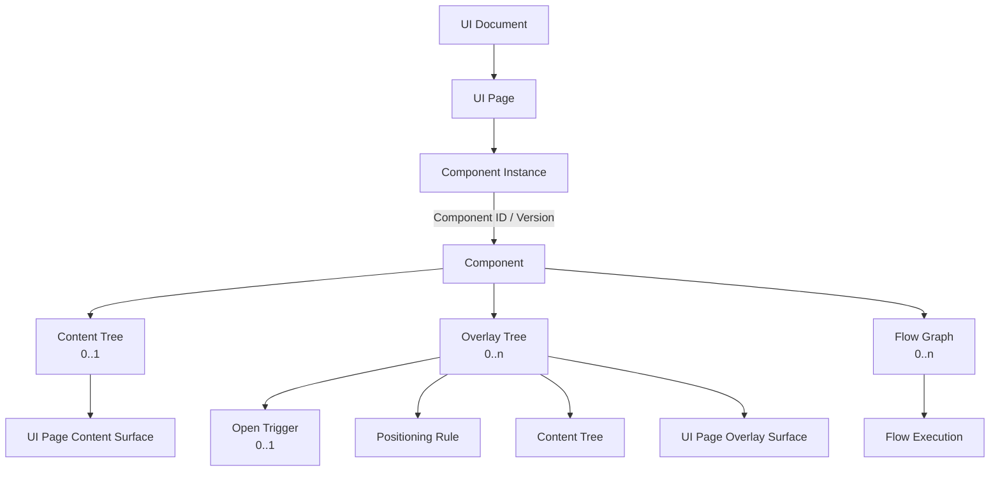
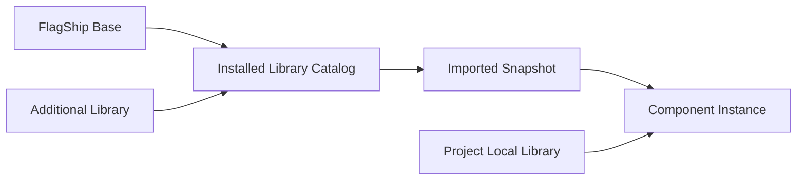
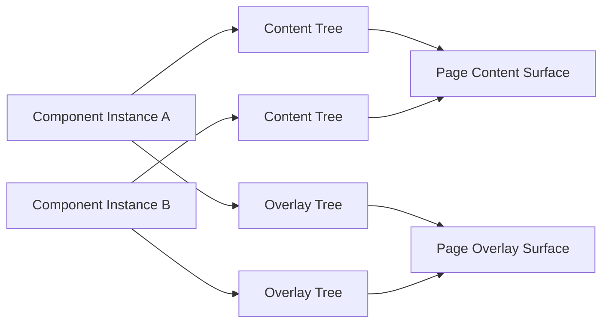

# Architecture: UI and Responsive Model

> [Architecture Index](./README.md) · Previous: [Project Document Model](./04-project-document-model.md) · Next: [Flow and Execution Model](./06-flow-and-execution-model.md)
>
> Covers: Section 7, Section 9

---

## 7. UI Document Model

UI DocumentはApplicationのUI PageとComponent Instanceの配置を保持するCanonical UI Modelである。



### 7.1 Canonical用語

| 用語 | 意味 |
|---|---|
| UI Document | UI Page群を保持するProject Model |
| UI Page | Page単位のComponent InstanceとRender SurfaceのOwner |
| Component | Content Tree、Overlay Tree、Flow Graphをまとめる再利用可能なAsset |
| Component Instance | ComponentをUI Pageへ配置した実体 |
| UI Tree | Content Nodeから構成されるUI構造の共通概念 |
| Content Tree | 通常Layoutへ参加するContent Node Tree |
| Overlay Tree | Open Trigger、Positioning Rule、Content Treeを追加したUI Tree |
| Content Node | State、Slot、Layout、Sizeを持つUI TreeのNode |
| Text Content Node | 文字列を表し、子を持たないContent Node |
| Flow Graph | Flow NodeとEdgeから構成される永続Behavior |
| Flow Execution | Flow Graphを実行するRuntime Instance |

`Definition`をProject ModelのEntity名として使用しない。Library上のComponentはTemplateとして機能するが、Projectへ配置された実体と区別する場合は`Component`と`Component Instance`を使用する。

### 7.2 UI DocumentはUI Pageを保持する

UI DocumentはStable UI Page IDをKeyにしたCollectionを持つ。

```text
UI Document # ApplicationのUI Pageを保持するCanonical UI Model
└─ pages # Stable UI Page IDをKeyにしたPage Collection
   ├─ ui-page-users # User管理画面を表すUI Page
   └─ ui-page-settings # 設定画面を表すUI Page
```

概念的な構造:

```text
UI Page # Page単位のComponent InstanceとRender SurfaceのOwner
├─ id # 保存後も変化しないUI Page ID
├─ name # Editor上に表示するPage名
└─ componentInstances # このPageへ配置したComponent Instance
```

UI PageはContent SurfaceとOverlay SurfaceのRuntime Ownerである。SurfaceのDOMや計算済み座標はProjectへ保存しない。

### 7.3 ComponentをUIとFlowの再利用単位とする

ComponentはLibraryから利用できるVersion付きAssetであり、次を一体として保持する。

```text
Component # UIとFlowをまとめたVersion付き再利用Asset
├─ id # Componentを識別するStable ID
├─ name # LibraryとEditorに表示する名前
├─ version # Projectが取り込むComponent Version
├─ contentTree # Content Treeを0個または1個
├─ overlayTrees # Overlay Treeを0個以上
└─ flowGraphs # Flow Graphを0個以上
```

ComponentはContent Node、State、Slot、Flow Nodeを直下へ重複保持しない。

- StateとSlotはContent Nodeが持つ。
- Flow NodeはFlow Graphが持つ。
- Overlayの表示内容はOverlay Tree内のContent Treeが持つ。
- Flow ExecutionはRuntimeが持つ。

ComponentをProjectで利用するときは、利用VersionをProjectへ取り込む。Libraryの更新によって既存Projectの動作を暗黙に変更しない。

Component SelectorではFlagShip Base、追加導入Library、LocalをLibrary名で区別する。FlagShip Baseは標準搭載されるInstalled Libraryの1つである。Installed Library Componentは固定VersionのSnapshotとして取り込み、Local ComponentはProject内で直接編集する。いずれも配置後は同じComponent Instance Schemaから参照する。



### 7.4 Component InstanceをUI配置の単位とする

Component InstanceはComponentをUIへ配置した実体である。UI Page直下だけでなく、ComponentのContent TreeまたはOverlay TreeにあるContent Node Slotへ子Component Instanceを配置できる。

```text
Component Instance # ComponentをPageまたは別Component内へ配置した実体
├─ id # Owner内でInstanceを識別するStable Local ID
├─ componentId # 利用するComponentのStable ID
├─ componentVersion # Projectが固定して利用するVersion
├─ state # Content Node IDごとのInstance固有Initial Value Override
└─ children # このInstanceのNamed Slotへ配置した子Instance
   └─ Child Placement
      ├─ parentContentNodeId # Slotを定義するContent Node
      ├─ slotId # 省略できないNamed Slot ID
      └─ instance # Slotへ配置した子Component Instance
```

子Component Instance自身へParent IDやSlot IDを保存しない。再利用Component Definitionに固定で含まれる子は`Content Tree.componentInstances`が所有し、親Content Nodeの`children`だけを配置のSource of Truthとする。配置済みInstanceごとに追加した子は親Component Instanceの`children`が所有し、そのChild Placementだけが親Content Node、Named Slot、順序を保持する。

Instanceの`state`はState Definitionを複製しない。KeyはStateを所有するContent Node ID、ValueはそのInstanceだけに適用するInitial Value Overrideとし、SchemaはComponent Definition内のContent Nodeから解決する。

Component Instance自身はDOM Elementではない。Instanceから解決されたContent TreeはPage Content Surfaceへ、Overlay Treeは同じPageのOverlay Surfaceへ描画する。

Component内へ配置した子Component Instance IDは、そのComponentに対するLocal IDとする。RuntimeではPage直下のComponent Instanceから子Component InstanceまでのPathでScopeを表す。

```text
Component Instance Path # Nested ComponentのRuntime Scopeを表すPath
└─ component-instance-user-form # UI Page直下のRoot Instance
   └─ component-instance-error-modal # User Formが所有するModal Instance
      └─ component-instance-modal-header # Modal内部のHeader Instance
         └─ component-instance-close-button # Header内部のClose Button Instance
```

同じComponentを複数配置した場合、Component Instance PathをScopeとしてLocal Node ID、Overlay Tree ID、Flow Graph ID、Stateを分離する。

### 7.5 UI TreeとContent Node

UI TreeはContent NodeをRootとし、Content Nodeと子Component Instanceを保持する。

```text
Content Tree # 通常Layoutへ参加するContent Node Tree
├─ rootNodeId # 親とSlotを持たないRoot Content Node ID
├─ nodes # Local Content Node IDをKeyにしたNode Collection
│  └─ Content Node # Component Instance Scope内のUI構造単位
│     ├─ id # Component内で一意なLocal Node ID
│     ├─ name # Editor上に表示するNode名
│     ├─ type # ContainerやText等のNode種別
│     ├─ state # このNodeが所有する初期State
│     ├─ slots # 子を受け入れるNamed Placement Boundary
│     ├─ children # Slotへ配置した子と順序
│     ├─ layout # 子へ適用するSemantic Layout Rule
│     └─ size # Node自身のSemantic Size Rule
└─ componentInstances # このTreeが所有する子Component Instance
   └─ Child Component Instance # Child Placementから参照する配置実体
```

Content NodeのChildrenは同じContent TreeのContent Nodeまたは子Component Instanceへの配置を保持する。子Component Instanceの実体は、そのContent Treeの`componentInstances`へ保存し、参照種別をStructured Dataで区別する。

```text
Child Placement # 親Content Nodeから子への配置情報
├─ target # 配置対象を型付きReferenceで指定
│  ├─ Content Node Reference # 同じContent Tree内のNodeを参照
│  └─ Component Instance Reference # Treeが所有する子Instanceを参照
└─ slotId # 親Content Nodeが定義したNamed Slot
```

Text Content Nodeは文字列を表すLeaf Nodeとする。

```text
Text Content Node # 文字列をStable ID付きで保持するLeaf Node
├─ id # 編集とReferenceに使用するLocal Node ID
├─ name # Editor上に表示するNode名
├─ type = text # Text Content Nodeを識別する固定種別
├─ value # Rendererが文字列へ解決する値
│  ├─ Literal String # Projectへ直接保存する固定文字列
│  └─ Structured Reference # State等から実行時に取得する文字列
├─ slots = [] # 子を受け入れないためSlotを持たない
└─ children = [] # Leaf Nodeであるため子を持たない
```

Content TreeへRaw Stringを直接保存しない。文字列もStable IDを持つText Content Nodeとして保存することで、編集、Binding、Reference、差分追跡の対象にする。Text Content Nodeを別のContent Node配下へ置く場合も、親のChild Placementに明示的な`slotId`を指定する。Content TreeのRootは親を持たないためChild Placementを持たない。

Content Treeの概念的な保存例:

```json
{
  "rootNodeId": "content-node-user-form",
  "nodes": {
    "content-node-user-form": {
      "id": "content-node-user-form",
      "name": "User Form",
      "type": "container",
      "state": {
        "schema": {
          "type": "object",
          "properties": {
            "form": {
              "type": "object",
              "properties": {
                "name": { "type": "string" },
                "email": { "type": "string" }
              },
              "required": ["name", "email"]
            }
          },
          "required": ["form"]
        },
        "initialValue": {
          "form": {
            "name": "",
            "email": ""
          }
        }
      },
      "slots": [
        { "id": "header", "name": "Header" },
        { "id": "fields", "name": "Fields" },
        { "id": "footer", "name": "Footer" }
      ],
      "children": [
        {
          "target": {
            "type": "content-node",
            "nodeId": "content-node-form-title"
          },
          "slotId": "header"
        },
        {
          "target": {
            "type": "component-instance",
            "componentInstanceId": "component-instance-save-button"
          },
          "slotId": "footer"
        }
      ],
      "layout": { "type": "slot" },
      "size": {
        "width": { "type": "fill" },
        "height": { "type": "fit" }
      }
    },
    "content-node-form-title": {
      "id": "content-node-form-title",
      "name": "Form Title",
      "type": "text",
      "value": "Create user",
      "state": {},
      "slots": [],
      "children": [],
      "layout": null,
      "size": {
        "width": { "type": "fit" },
        "height": { "type": "fit" }
      }
    }
  },
  "componentInstances": {
    "component-instance-save-button": {
      "id": "component-instance-save-button",
      "componentId": "component-button",
      "componentVersion": "1.0.0"
    }
  }
}
```

`component-instance-save-button`はComponent Definitionに固定で含まれる子であるため、親、Slot、順序をRoot Content Nodeの`children`だけに保存する。配置済みInstanceごとに後から追加する子は、親Component Instanceの`children`に保存する。いずれも子Instance自身へ同じPlacementを重複させない。

Overlay TreeをContent NodeのChildとして保存しない。Overlayを持つ子Component Instanceを配置した場合も、そのOverlay TreeのOwnerは子Component Instanceのままとする。

UI TreeはDOM Treeではない。RendererがContent NodeからDOM / Web Componentsを導出する。

### 7.6 ComponentのContent Treeは最大1つとする

ComponentはContent Treeを持たないか、Rootを1つ持つContent Treeを1つだけ持つ。

```text
Contentのみ # 通常Layoutへ描画するComponent
└─ contentTree = Content Tree # Content Surfaceへ投影するTree

Overlayのみ # 通常Contentを持たないOverlay専用Component
└─ contentTree = null # Content Surfaceへ描画するTreeはない

ContentとOverlay # 通常ContentとOverlayを併せ持つComponent
├─ contentTree = Content Tree # Content Surfaceへ投影するTree
└─ overlayTrees = Overlay Trees # 条件に応じてOverlay Surfaceへ投影するTree
```

「Rootが1つ」はContent Nodeが合計1つという意味ではない。Root配下にはContent Node Treeを構築でき、Slotへ別Component Instanceを配置できる。

### 7.7 Overlay TreeはUI TreeへTriggerとPositioningを追加する

Overlay TreeはUI Treeの構造に、表示開始のTrigger Instanceと位置決定Ruleを追加したものとする。

```text
Overlay Tree # Out-of-flow UIと表示条件をまとめたTree
├─ id # Component内で一意なOverlay Tree ID
├─ name # Editor上に表示するOverlay名
├─ openTrigger # 未接続時はnull
├─ positioning # ViewportまたはAnchor基準の配置Rule
└─ contentTree # Overlay Surfaceへ投影するContent Tree
```

Overlay Treeが持つContent NodeはOverlay内部の通常Layoutへ参加する。Page Content Surfaceへ戻して描画しない。

ComponentはOverlay Treeを0個以上持てる。Overlay TreeをContent NodeのChildへ入れず、Componentが直接所有する。

### 7.8 Open Triggerは任意とする

Overlay Treeの`openTrigger`は`Trigger Instance | null`とする。

```text
Unbound Overlay # 配置時点では表示開始Eventを持たないOverlay
└─ openTrigger = null # 利用側が後からTriggerを接続する

Bound Overlay # Component内で表示開始Eventが接続済みのOverlay
└─ openTrigger # OverlayをActivateするTrigger Instance
   ├─ triggerTypeId # click等のTrigger種別
   └─ config # Event Source等のTrigger固有設定
```

未接続のOverlay TreeをInvalidとしない。Button Event、Flow Signal、Lifecycle、Schedule等との関連は後から追加できる。

Open TriggerはOverlayをActiveにする入口である。Close、Escape、Outside Click等のBehaviorは必要なFlow GraphまたはOverlay Templateで表現する。

### 7.9 ModalとPopup Buttonを分離する

Modal TemplateはButtonへ自動接続しない。

```text
Modal Component # 外部Triggerを後から接続するOverlay専用Component
├─ contentTree = null # Page Content Surfaceへ描画する通常Contentはない
├─ overlayTrees # Modalが提供するOverlay Tree Collection
│  └─ modal # Modal WindowとBackdropをまとめたOverlay Tree
│     ├─ openTrigger = null # 通常Buttonとは初期状態で接続しない
│     ├─ positioning = viewport-center # WindowをViewport中央へ配置するRule
│     └─ Content Tree # Overlay Surfaceへ投影するVisual Structure
│        ├─ Backdrop Content Node # Window背面を覆う背景Node
│        └─ Modal Window Content Node # Header、Body、Footerの親Node
│           ├─ slots # Window内部が提供するNamed Slot
│           │  ├─ header # Header Componentの配置先
│           │  ├─ body # 本文Componentの配置先
│           │  └─ footer # 操作Button群の配置先
│           └─ children # Named Slotへ配置した子Component Instance
│              ├─ Modal Header Component Instance [slotId = header] # Headerの実体
│              │  └─ Modal Header Content Tree # Header内部のUI構造
│              │     └─ Header Content Node # Close Buttonを受け入れる親Node
│              │        ├─ slots # Headerが提供するNamed Slot
│              │        │  └─ close # Close Button専用の配置先
│              │        └─ children # Header内部へ配置した子Instance
│              │           └─ Close Button Component Instance [slotId = close] # 閉じる操作のEvent Source
│              ├─ Modal Body Component Instance [slotId = body] # Modal本文の実体
│              │  └─ Body Content Tree # Body Component内部のUI構造
│              │     └─ Message Text Content Node # 本文文字列を保持するLeaf Node
│              │        ├─ type = text # Text Content Nodeの固定種別
│              │        ├─ value = "処理を完了できませんでした" # 描画するLiteral String
│              │        ├─ slots = [] # TextはSlotを提供しない
│              │        └─ children = [] # Textは子を持たない
│              ├─ Cancel Button Component Instance [slotId = footer] # Cancel EventのSource
│              └─ Confirm Button Component Instance [slotId = footer] # Confirm EventのSource
└─ flowGraphs # Modal固有のBehaviorを保持するFlow Graph Collection
   ├─ close-window # HeaderのClose操作を処理するFlow Graph
   │  └─ Close Button.click → Deactivate modal # Close Eventで所有Overlayを閉じる
   └─ cancel-window # FooterのCancel操作を処理するFlow Graph
      └─ Cancel Button.click → Deactivate modal # Cancel Eventで所有Overlayを閉じる
```

ButtonとOverlayが最初から関連付いているものはPopup Button Templateとする。

```text
Popup Button Component # ButtonとPopupのOpen Triggerが接続済みのComponent
├─ contentTree # Page Content Surfaceへ描画するButton側のTree
│  └─ Button Host Content Node # Trigger Buttonを受け入れる親Node
│     ├─ slots # Button Hostが提供するNamed Slot
│     │  └─ trigger # Popupを開くButtonの配置先
│     └─ children # Button Host内部の子Instance
│        └─ Button Component Instance [slotId = trigger] # Popup Open EventのSource
├─ overlayTrees # Popup側のOverlay Tree Collection
│  └─ popup # Buttonから開くPopup Overlay
│     ├─ openTrigger = Button Component Instance.click # 内部Button clickとの初期接続
│     ├─ positioning # Button Anchorを基準にした配置Rule
│     └─ Popup Content Tree # Overlay Surfaceへ投影するUI構造
│        └─ Popup Window Content Node # Header、Body、Footerの親Node
│           ├─ slots # Popup Windowが提供するNamed Slot
│           │  ├─ header # Header Componentの配置先
│           │  ├─ body # 本文Componentの配置先
│           │  └─ footer # 操作Buttonの配置先
│           └─ children # Named Slotへ配置した子Instance
│              ├─ Popup Header Component Instance [slotId = header] # Popup Headerの実体
│              ├─ Popup Content Component Instance [slotId = body] # Popup本文の実体
│              └─ Close Button Component Instance [slotId = footer] # Popupを閉じるEvent Source
└─ flowGraphs # Popup固有のBehaviorを保持するFlow Graph Collection
   └─ close-popup # Close操作を処理するFlow Graph
      └─ Close Button.click → Deactivate popup # Close Eventで所有Overlayを閉じる
```

Close / Cancel Flow GraphはOverlay Treeを所有するModalまたはPopup Button Componentが持つ。子Button Componentが親Overlay Treeの状態を暗黙に操作しない。

```text
Modal Component Flow Reference # Nested Component Eventから所有Overlayへの接続
├─ trigger # Flow Graphを開始するEvent Reference
│  └─ current-instance / modal-header / close-button / click # 現在のModal Instance内のClose Event
└─ action # Flow Graphが実行するUI Action Reference
   └─ current-instance / modal / deactivate # 現在のModal Instanceが所有するOverlayを閉じる
```

通常ButtonはOverlay Treeを持たない。ModalとButtonを後から関連付ける場合、ModalのOpen TriggerへButton Eventを設定する。

### 7.10 Modal等はOverlay Templateとして表現する

Modal、Snackbar、Popoverを専用Content Node Categoryとして固定しない。Overlay TreeのPositioning、Content Tree、必要なBehaviorの組合せとして表現する。

```text
Modal # Dialog型Overlayを構成するLibrary Template
├─ positioning = viewport center # Viewport中央へWindowを配置
├─ Backdrop Content Node # 背面Interactionを覆う背景
└─ Window Content Tree # Dialog内部のVisual Structure

Snackbar # 一時通知を構成するLibrary Template
├─ positioning = viewport bottom-end # Viewport右下へ通知を配置
└─ Notification Content Tree # Messageと操作を含むVisual Structure

Popover # 特定Nodeを基準に表示するLibrary Template
├─ positioning = anchor # Anchor Geometryから表示位置を導出
├─ anchorId # 基準となるContent NodeへのStable Reference
└─ Popup Content Tree # Popup内部のVisual Structure
```

BackdropもModal WindowもContent Nodeである。Visual Structureを専用Runtime Objectへ隠さず、Library Templateとして再利用可能にする。

ModalにはFocus、Background Interaction、Scroll Lock等のBehaviorが必要になる場合がある。これらを単なる座標として省略せず、必要なTemplate RuleまたはFlow Graphとして明示する。

### 7.11 PositioningはRuleとして保存する

ProjectへBrowserで計算した`x`、`y`を保存しない。

```text
Persistent Positioning Rule # Projectへ保存する再計算可能な配置Semantics
├─ viewport alignment # Viewportに対するAlignment
├─ anchor reference # 基準となるContent NodeへのReference
├─ placement # Anchorの上下左右等の表示方向
└─ offset # Semanticな位置補正値

Runtime Geometry # Browserが実行時に計算する一時的な矩形
├─ x # Viewport上の計算済み横座標
├─ y # Viewport上の計算済み縦座標
├─ width # 計算済み横幅
└─ height # 計算済み高さ
```

ModalやSnackbarはRuntimeではAbsolute / Fixed Positioningとして描画できるが、保存形式はViewport Size、Scroll、Anchor Geometryから再計算可能なRuleとする。

### 7.12 Page単位でRender Surfaceを管理する

各UI PageはRuntimeで次のSurfaceを持つ。

```text
UI Page # 2つのPhysical Render Surfaceを管理するRuntime Owner
├─ Content Surface # 通常Layoutへ参加するContent Treeの描画先
└─ Overlay Surface # Active Overlay Treeの描画先
```

Component InstanceのContent TreeはContent Surfaceへ、ActiveなOverlay TreeはOverlay Surfaceへ投影する。



Page Overlay ManagerはPage ScopeでStack、Backdrop順、Focus、Escape、Scroll Lock等を管理する。Page遷移時は遷移元PageのOverlayと関連Flow Executionを停止する。

### 7.13 StateはContent Nodeが持つ

Content Nodeは自身の初期Stateを保持できる。RuntimeではComponent Instance PathとLocal Content Node IDでNamespace化する。

```text
component-instance-clock-a / clock-display / currentTime
component-instance-clock-b / clock-display / currentTime
```

Projectへ保存するのは初期値とSchemaであり、通常のRuntime Current ValueをProjectへ書き戻さない。

Application全体で共有するStateはState Documentへ保持する。Content Node StateとApplication Stateを同じScopeとして扱わない。

### 7.14 SlotはContent Nodeだけが持つ

SlotはContent Nodeが子Content Nodeまたは子Component Instanceを受け入れるNamed Placement Boundaryである。
Content TreeはUI構造全体、SlotはそのTree内のContent Nodeが定義する配置先であり、同義ではない。

```text
Content Node # Named SlotとChild Placementを所有する親Node
├─ slots # このNodeが提供するSlot
└─ children # Component Definitionに固定された子と順序
   └─ Child Placement # 1つの子に対する配置情報
      ├─ target # Content NodeまたはComponent Instance
      └─ slotId # このChildを配置するNamed Slot

Component Instance # InstanceごとにSlotへ追加した子を所有
└─ children
   └─ Child Placement
      ├─ parentContentNodeId # Slotを定義するContent Node
      ├─ slotId # このChildを配置するNamed Slot
      └─ instance # 子Component Instance
```

MVPのSlotは`id`と`name`だけを持つ。Child IDをSlot側へ重複保存しない。

Default Slotは定義しない。Definition固定の子とInstanceごとに追加した子のどちらも、親Content Nodeに存在する名前付きSlotの`slotId`を明示しなければならない。`slotId`の`null`、省略、および`default`という予約SlotはProjectへ保存できない。配置先が未確定の要素は有効なUI Treeへ追加せず、Editorの一時状態として扱う。

```text
Card Content Node # 本文とFooterを分けて受け入れるContainer
├─ slots # Cardが提供するNamed Slot
│  ├─ content # 本文Contentの配置先
│  └─ footer # 操作Componentの配置先
└─ children # Cardへ配置した子と表示順
   ├─ Text [slotId = content] # 本文Slotへ配置したText Content Node
   └─ Button [slotId = footer] # Footer Slotへ配置したButton Instance
```

`actions`をSlot名に使用しない。Flow Actionとの混同を避け、`header`、`content`、`fields`、`footer`等の配置領域名を使用する。

Component自身とOverlay Treeは別のSlot Collectionを持たない。Overlay Tree内の挿入先は、そのContent TreeのContent Nodeが持つ。

Editorは配置済みComponent Instance配下のNamed SlotをLayers Treeへ表示する。Library ComponentをSlot行へDrag and DropしたときだけInstance固有Child Placementを作成し、InspectorのSelect FieldからSlotへ追加する操作は用意しない。

### 7.15 LayoutとSizeをSemantic Ruleとして保持する

通常LayoutはStack、Grid、Slot等のSemantic Ruleとして保持する。

```text
Layout # Content Nodeが子へ適用するSemantic Layout Rule
├─ Stack # 子を1方向へ順番に配置
│  ├─ Vertical # 子を上から下へ配置
│  └─ Horizontal # 子を左から右へ配置
├─ Grid # 行と列のTrackへ子を配置
└─ Slot # Named Slotごとの配置Ruleへ委譲
```

Sizeは`fit`、`fill`、`fraction`、`fixed`、`min`、`max`等のRuleで表現する。

通常Content TreeへDrag中のPointer座標やBounding Rectを保存しない。Drag GeometryはDrop Intentへ変換し、Parent、Slot、Child Order等の構造変更として保存する。

Overlay PositioningだけはOut-of-flow RenderingのためのRuleを持てるが、Runtimeで計算したGeometryは保存しない。

### 7.16 UI EventとFlowをStable Referenceで接続する

Trigger InstanceとFlow NodeはComponent Instance Scopeを考慮したStructured ReferenceでContent Node、Overlay Tree、Stateを参照する。

```text
Component-local Reference # Nested Instance Scope内のEntityを指すReference
├─ scope # current-component-instanceまたは明示的なPage Scope
├─ componentInstancePath # Scopeの基点から対象InstanceまでのPath
└─ localId # 対象Component内のContent Node等のLocal ID
```

Display Name、DOM Selector、Shadow DOM内部ElementをReference Keyにしない。

Anchored OverlayのAnchorは同じUI Page内のContent NodeをStable Referenceで指定する。Anchor削除時はReference切れをValidationで検出する。

### 7.17 RendererはUI TreeからDOMを導出する

Rendering Directionは一方向とする。

```text
UI Document + Component Assets
        ↓
Component Instance Resolution
        ↓
Content Tree / Active Overlay Tree
        ↓
Shared Renderer
        ↓
Page Content Surface / Page Overlay Surface
        ↓
DOM / Web Components
```

EditorとProductionは同じRendererとSurface Resolution Ruleを使用する。EditorはSelection、Hover、Drop Indicator等をInteraction Surfaceへ追加するが、Application UI Treeへ保存しない。

### 7.18 UI Document Validation

少なくとも次を検証する。

```text
UI Document Validation # Canonical UI Modelの保存前に検出する構造Error
├─ Duplicate UI Page ID # UI Page IDがCollection内で重複している
├─ Missing Component # Instanceが参照するComponentが存在しない
├─ Missing Component Version # Instanceが指定するVersionを解決できない
├─ Duplicate Component Instance ID # 同じScope内でInstance IDが重複している
├─ Missing Child Component Instance # Child Placementの対象Instanceが存在しない
├─ Missing Parent Content Node # Placement先の親Nodeが存在しない
├─ Missing Slot # Childが指定するNamed Slotを親が定義していない
├─ Missing or null Child Slot ID # Root以外のChildが配置先Slotを明示していない
├─ Reserved Default Slot # 禁止したdefault Slotを定義または参照している
├─ Raw String Child # Text Content Nodeへ正規化されていない文字列がある
├─ Text Content Node with Children # LeafであるText Nodeが子を持っている
├─ Circular Content Tree # Content Nodeの親子関係が循環している
├─ Circular Component Composition # Component InstanceのNested関係が循環している
├─ Component Content Tree Count > 1 # Componentが複数の通常Content Treeを持っている
├─ Overlay Tree stored below Content Node # Overlay Treeが禁止されたChild位置に保存されている
├─ Invalid Open Trigger Reference # Open TriggerのEvent Sourceを解決できない
├─ Invalid Anchor Reference # Anchored Overlayの基準Nodeを解決できない
├─ Cross-page Overlay Reference # Overlayが別UI PageのNodeを参照している
└─ Deleted Local Node Reference # 削除済みLocal NodeへのReferenceが残っている
```

### 7.19 UI Document Invariants

```text
A # UI DocumentはUI Pageを保持する

B # UI PageはComponent Instanceを保持する

C # ComponentはContent Tree、Overlay Tree、Flow Graphをまとめる

D # ComponentのContent Treeは0個または1個とする

E # ComponentはOverlay Treeを0個以上持てる

F # Overlay TreeはOpen Trigger、Positioning Rule、Content Treeを持つ

G # Open Triggerはnullを許容する

H # ModalをButtonへ自動接続しない

I # Popup ButtonだけがButton clickとの初期接続を持つ

J # Content NodeのChildへOverlay Treeを入れない

K # Content NodeのChildはContent Nodeまたは子Component Instanceとする

L # 子Component InstanceはComponent Instance PathでScope化する

M # StateとSlotはContent Nodeが持つ

N # Flow NodeはFlow Graphが持つ

O # Modal等はOverlay Templateとして表現する

P # Page単位でContent SurfaceとOverlay Surfaceを管理する

Q # Runtime GeometryをProjectへ保存しない

R # DOMをProject Source of Truthにしない

S # Root以外のChildは既存のNamed Slotを明示する

T # Default Slot、nullのslotId、Raw String Childを保存しない

U # Text Content Nodeは子を持たない
```

---

## 9. Responsive Design Model

Responsive DesignはUI Treeを複製せず、Semantic Layout RuleへのOverrideとして扱う。

### 9.1 Breakpointの責務

Breakpointは次を変更できる。

- Stack Direction
- Grid Columns
- Gap
- Padding
- Size Rule
- Visibility

Component、Content Node、Overlay Tree、Flow ReferenceのStable IDは変更しない。

### 9.2 Responsive Layoutの具体例

同じContent NodeとChild Placementを維持したまま、Viewport幅に応じてLayout RuleだけをOverrideする。

```json
{
  "target": {
    "kind": "content-node",
    "scope": "current-component-instance",
    "localId": "content-node-user-layout"
  },
  "base": {
    "layout": {
      "type": "stack",
      "direction": "horizontal",
      "gap": "lg"
    }
  },
  "overrides": [
    {
      "condition": {
        "type": "viewport-width",
        "max": { "value": 640, "unit": "px" }
      },
      "properties": {
        "layout": {
          "type": "stack",
          "direction": "vertical",
          "gap": "md"
        }
      }
    }
  ]
}
```

```text
Viewport > 640px # Base Layoutを使用する幅
└─ Horizontal Stack # UserFormとUserTableを横方向へ配置
   ├─ UserForm [slotId = primary] # primary Slotにある既存のChild Placement
   └─ UserTable [slotId = secondary] # secondary Slotにある既存のChild Placement

Viewport <= 640px # Responsive Overrideを適用する幅
└─ Vertical Stack # 同じChildを縦方向へ配置
   ├─ UserForm [slotId = primary] # Stable IDとSlot IDは変更しない
   └─ UserTable [slotId = secondary] # Child Orderも変更しない
```

Overrideに存在しないPropertyは`base`から継承する。Override適用後もContent Node ID、Component Instance ID、Child Order、Named Slot、Flow Referenceを変更しない。

### 9.3 Overlay Positioning

Anchored OverlayはViewport幅やCollisionに応じてPlacementを変更できる。Runtimeで解決した座標をResponsive Overrideへ保存しない。

### 9.4 Initial Scope

MVPではDefault Layout Ruleを実装対象とする。Breakpoint Editorと高度なResponsive OverrideはMVP完了後に扱う。
