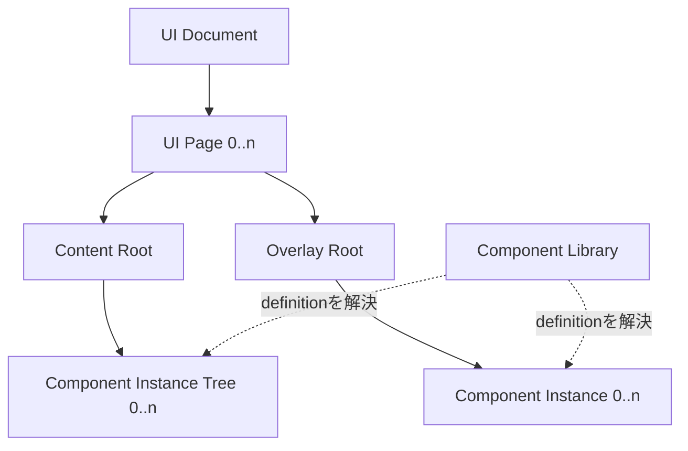
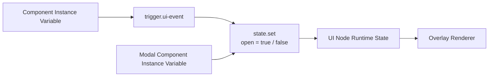
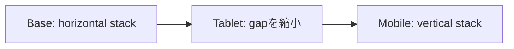

# Architecture: UI and Responsive Model

> [Architecture Index](./README.md) · Previous: [Project Document Model](./04-project-document-model.md) · Next: [Flow and Execution Model](./06-flow-and-execution-model.md)
>
> Covers: Section 7, Section 9

---

## 7. UI Document Model

UI DocumentはApplicationのPageと、各Pageへ配置したInstanceを保持する。Component DefinitionはLibrary Assetであり、UI上へ直接存在しない。



### 7.1 Canonical用語

| 用語 | 意味 |
|---|---|
| UI Document | UI PageのCollection |
| UI Page | 1画面と、そのContent Root / Overlay RootのOwner |
| Content Root | 通常Layoutへ参加するComponent Instance TreeのRoot |
| Overlay Root | 通常Layoutから外れたComponent Instanceだけを保持するRoot |
| Component Definition | Libraryが持つUI Node DefinitionとFlow Graph Definitionの組 |
| Component Instance | Component Definitionから生成し、Stateと子Instanceを持つ実体 |
| UI Node | Component Definition内でUI Treeを構成するNode |
| Named Slot | UI Nodeが公開する、子Component Instanceの挿入先 |

### 7.2 UI Pageは2つのRootを持つ

```text
UI Page # 1画面の永続Definition
├─ id # Stable UI Page ID
├─ name # Editor上の表示名
├─ componentInstances # Content Root直下。0個以上
│  └─ Component Instance Tree # 通常Layoutへ参加
└─ overlayInstances # Overlay Root直下。0個以上
   └─ Component Instance # surfaceは必ずoverlay
```

`surface`は`content | overlay`のEnumとして扱う。省略時は`content`である。`surface = overlay`のComponent Instanceは必ず`UIPage.overlayInstances`、すなわちOverlay Root直下から分岐する。

Content Root、Overlay Root、DOM Element、計算済み座標は保存しない。RootはUI PageのCollectionからRendererが構築する。

### 7.3 Component DefinitionはLibraryだけが持つ

ComponentはUI上の実体ではなく、再利用可能なDefinitionである。

```text
Component Definition # Library Asset
├─ id # Stable Component ID
├─ name # Library上の表示名
├─ version # Projectが固定するDefinition Version
├─ contentTree # 単一のUI Definition
├─ allowedSurface # 省略時content。Modal等はoverlay
└─ flowGraphs # Component固有Behavior Definition。0..n
```

ComponentをPageへ配置すると、どちらのSurfaceでもComponent Instanceを1つ生成する。Component Definition自体をUI Pageへ保存しない。

### 7.4 Component Instanceは配置された実体である

```text
Component Instance
├─ id # Owner内で安定したInstance ID
├─ componentId # Component Definition ID
├─ componentVersion # 使用するDefinition Version
├─ surface # content | overlay。省略時content
├─ overlay # surface=overlayの場合のalignmentとcontentBlock
├─ visible # Root Instanceの表示。省略時true
├─ state # UI Node IDごとのInstance固有State
└─ children # Named Slotへ配置した子Component Instance
```

Component InstanceはDOM Elementではない。RendererはComponent Definitionを解決し、Instance Stateと子Instanceを適用してUI Node Treeを描画する。

### 7.5 UI Node Treeと表示属性

すべてのUI NodeはStable Local IDと`visible`属性を持つ。`visible`省略時は`true`とする。

```text
UI Node
├─ id # Component内で一意なLocal ID
├─ name # Editor上の表示名
├─ visible # 省略時true
├─ state # Schemaと初期値
├─ size # Semantic Size
├─ slots # Named Slot。Leafでは空
├─ children # Slotへの配置関係。Leafでは空
└─ layout # Container/Buttonの子Layout
```

`visible = false`のUI NodeとそのDescendantは描画しない。Runtimeで一時的に切り替える値と、Definitionの初期表示値は分離する。

### 7.6 Named Slotだけを子Instanceの挿入先にする

Default Slotは禁止する。子Component Instanceは親UI Node IDとNamed Slot IDを明示して配置する。

```text
Component Instance Child Placement
├─ parentContentNodeId # Slotを所有するUI Node
├─ slotId # default以外のNamed Slot ID
└─ instance # 子Component Instance Tree
```

Content TreeとSlotは同義ではない。Content TreeはUI Node全体の所有構造、SlotはそのTree内の特定Nodeが外部へ公開する挿入位置である。

### 7.7 OverlayはComponent Instanceの配置方法である

```text
Component Instance # Overlay Root直下の永続実体
├─ id # Page内で一意なComponent Instance ID
├─ componentId / componentVersion
├─ surface = overlay # 固定値
├─ overlay.alignment # Viewport基準の9点配置
├─ overlay.contentBlock # 灰色の背景幕でContent操作を遮るか
├─ state / children
└─ visible # 省略時true
```

`alignment`は次の9値とする。

```text
Overlay Alignment
├─ top-left / top-center / top-right
├─ center-left / center / center-right
└─ bottom-left / bottom-center / bottom-right
```

Overlay SurfaceをUI Page全体へ重ね、その内側でComponent Instanceを9点配置する。Editor内ではPreview領域をContaining Blockとし、生成ApplicationではPage ViewportをContaining Blockとする。Runtimeで算出したPixel座標はProjectへ保存しない。

`contentBlock = true`ではComponent Instanceの背面へ半透明の背景幕を描画し、Content SurfaceへのPointer操作を遮る。`false`では背景幕を描画しない。

### 7.8 ModalとPopup Button

Modal ComponentはButtonと最初から関連付けない。配置後にFlow変数を介して任意のButtonとModal Component Instanceを接続する。

```text
Modalの配置例
UI Page
├─ Content Root
│  └─ Open Button Component Instance # 任意のButton
└─ Overlay Root
   └─ Modal Component Instance # Buttonとは未接続
      └─ Footer Named Slot
         └─ Close Button Component Instance
```

Modalは単一のComponent Definition、Content Tree、Component Instanceとして扱う。`allowedSurface = overlay`は配置先だけを制約し、Modal専用のInstance型を作らない。

### 7.9 Overlayの表示状態はUI Node Stateで管理する

Flow Graphは対象Component InstanceをGraph Local Variableへ登録する。NodeがComponent DefinitionやDOM Selectorを直接参照しない。Modalの表示状態はModal Root UI Nodeの`open` Stateであり、Overlay専用Actionや別の表示Stateを持たない。



Open/Close Flowの具体例は[Flowの使い方](../flow-usage.md)に示す。

### 7.10 StateはInstance単位で分離する

UI Node DefinitionはState Schemaと初期値を持つ。編集値は`ComponentInstance.state[uiNodeId]`へ保存する。同じComponent Definitionから複数Instanceを生成してもStateは共有しない。

Previewおよび生成Applicationの実行中は、初期値を直接変更せずRuntime Stateへ上書きを保存する。`state.set`はRuntime Stateを更新するため、Project Documentを変更しない。Applicationを再読み込みするとRuntime Stateは破棄され、Component Instanceの初期値、またはUI Node Definitionの初期値から再開する。

### 7.11 LayoutとSizeはSemantic Ruleとして保持する

Layoutは`stack | grid | slot`、Sizeは`fit | fill | fraction | fixed`で表す。Editorの一時的なDrag GeometryやDOMの計算済みPixel値をPersistent Layoutにしない。

```text
Stack Layout
├─ direction = vertical | horizontal
├─ gap
├─ align
├─ justify
├─ padding
└─ wrap
```

`horizontal`はCSS Flexboxの`flex-direction: row`、`vertical`は`flex-direction: column`に相当する。Stackという名前は並べ方だけでなく、gap・alignment・wrapを含むSemantic Layoutを表す。

### 7.12 Rendererは2つのSurfaceを構築する

```text
Renderer
├─ Content Surface # componentInstancesを順に描画
└─ Overlay Surface # overlayInstancesを重ねて描画
   ├─ Backdrop # contentBlock=trueの場合
   └─ Overlay Position # alignmentで9点配置
```

描画順、DOM Node、CSS Class、Focus状態はRuntime Dataであり、論理Ownershipを変更しない。

### 7.13 UI Document Validation

最低限、次を検証する。

```text
UI Validation
├─ Component Instanceが存在するComponent IDとVersionを参照する
├─ Content Root以下のsurfaceがcontentである
├─ Overlay Root以下のsurfaceがoverlayである
├─ Component Instance IDがPage内で一意である
├─ Overlay Root直下のComponentがallowedSurface=overlayである
├─ alignmentが定義済み9値のいずれかである
├─ UI Node IDがComponent内で一意である
├─ Root以外のUI Nodeが親を1つだけ持つ
├─ Named Slot IDがNode内で一意である
├─ default Slotを使用しない
├─ Child PlacementのNodeとSlotが存在する
└─ Flow Variableの対象Instanceが同じProject内に存在する
```

### 7.14 UI Document Invariants

```text
A # UI PageはContent RootとOverlay Rootを1つずつ論理的に持つ
B # Component DefinitionはLibraryにだけ存在する
C # Content Root直下にはComponent Instance Treeだけを置く
D # Overlay Root直下にはsurface=overlayのComponent Instanceだけを置く
E # Overlay用Componentも単一のContent TreeとComponent Instanceを使う
F # surface省略時はcontentとする
G # surface=overlayはOverlay Rootからだけ分岐する
H # Overlay配置は9点Alignmentとして保存する
I # Runtime計算済み座標を保存しない
J # すべてのUI Nodeはvisible属性を持てる
K # Default Slotを禁止する
L # StateをComponent Instanceごとに分離する
M # FlowはInstance Variableを介してUIを参照する
```

## 9. Responsive Design Model

### 9.1 Breakpointの責務

BreakpointはSemantic Layout RuleのOverrideに使用する。Viewportごとの最終Pixel座標を保存しない。

```text
Responsive Override
├─ target UI Node ID
├─ breakpoint
└─ changed semantic properties
```

### 9.2 Responsive Layoutの具体例



変更されないPropertyはBase Ruleから継承する。

### 9.3 Overlay Positioning

Overlayの9点AlignmentはViewport Sizeが変わっても同じSemantic Positionを維持する。必要になった時点でBreakpointごとのAlignment Overrideを追加できるが、初期実装では扱わない。

### 9.4 Initial Scope

初期実装はBase Layoutと9点Overlay Alignmentを対象とする。Breakpoint Editor、Collision回避、Anchor配置は要件が確定してから追加する。
