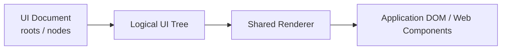
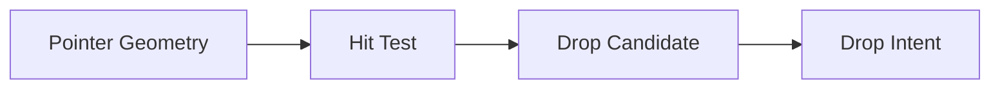
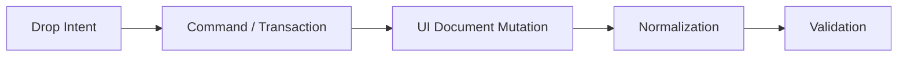

# Architecture: UI and Responsive Model

> [Architecture Index](./README.md) · Previous: [Project Document Model](./04-project-document-model.md) · Next: [Flow and Execution Model](./06-flow-and-execution-model.md)
>
> Covers: Section 7, Section 9

---

## 7. UI Document Model

UI DocumentはApplication UIのLogical Structure、Component Instance、Slot、Layout、Size、Properties、Presentationを表すSemantic Modelである。

UI DocumentはDOM Treeそのものではなく、RendererがDOM / Web Componentsを生成するためのCanonical UI Definitionとする。



### 7.1 UI DocumentをSemantic UI Modelとする

UI Documentは画面上の座標やDOM実装ではなく、Application UIの意味構造を保持する。

```text
UI Semantic Model
├─ Structure # NodeのLogical Ownership
├─ Component # Nodeが何のComponentか
├─ Slot # Parent内の挿入先
├─ Properties # Component Public Property
├─ Layout # 子Nodeの配置Rule
├─ Size # Semantic Size
└─ Presentation # Render Surface等
```

DOMはRendererによって導出する。

### 7.2 UI NodeをUI Documentの基本単位とする

各UI要素はStable IDを持つUI Nodeとして表現する。

```text
UINode
├─ id # Stable Node ID
├─ type # Component Definitionを参照するType
├─ name # Editor上のDisplay Name
├─ parentId # Logical Parent
├─ slot # Parent Component内の所属Slot
├─ children # Logical Child Node
├─ props # Component Public Properties
├─ layout # Child Layout Rule
├─ size # Semantic Size
├─ presentation # Render Surface等
└─ metadata # 必要最小限のPersistent UI Metadata
```

Editor専用情報をUINodeへ無制限に追加しない。

Button Nodeの概念的保存例:

```json
{
  "id": "node-save-button",
  "type": "ui-button",
  "name": "Save Button",
  "parentId": "node-actions",
  "slot": null,
  "children": [],
  "props": {
    "label": "Save",
    "disabled": {
      "$ref": "state.form.submitting"
    }
  },
  "layout": null,
  "size": {
    "width": "fit",
    "height": "fit"
  },
  "presentation": {
    "surface": "content"
  }
}
```

この例はUI NodeがDOM ElementではなくSemantic Definitionであることを示す。

### 7.3 UI Node IDをStable Referenceとする

UI Node IDはFlow、State Binding、Editor Operation等から参照されるStable Identifierとする。

```text
UI Node
└─ id = node-save-button
```

```text
Flow Trigger
├─ target = node-save-button
└─ event = click
```

Nodeの移動やLayout変更によってIDを変更しない。

### 7.4 UI NodeのDisplay NameとIDを分離する

```text
UINode
├─ id = node_01HX...
└─ name = "Save Button"
```

`name` はUserが自由に変更できる。

`id` はReference Integrityのため安定させる。

### 7.5 Logical OwnershipをParent / Child関係として保持する

UI TreeはApplication上の論理的な所属関係を表す。

```text
Page
└─ UserForm
   ├─ NameInput
   ├─ EmailInput
   ├─ SaveButton
   ├─ ErrorPopover
   └─ SuccessSnackbar
```

ErrorPopoverやSuccessSnackbarが別Render Surfaceへ描画されてもLogical ParentはUserFormのままとする。

### 7.6 Logical OwnershipとDOM Parentを同一視しない

Physical RenderingによってDOM上のParentが変わってもLogical Treeを変更しない。

```text
Logical Tree
└─ UserForm
   ├─ SaveButton
   ├─ ErrorPopover
   └─ SuccessSnackbar
```

```text
Physical Rendering
├─ Content Surface
│  └─ UserForm
│     └─ SaveButton
│
└─ Overlay Surface
   ├─ Anchored
   │  └─ ErrorPopover
   └─ Notification
      └─ SuccessSnackbar
```

DOM Parentを逆解析してLogical Parentを決定しない。

### 7.7 Root Nodeを明示する

UI Documentは1つ以上のRoot Nodeを持つことができる。

通常はPage等をRootとする。

```text
UI Document
└─ roots
   ├─ HomePage
   ├─ UsersPage
   └─ SettingsPage
```

Root間のNavigationはFlow / Navigation Modelで扱う。

### 7.8 Node TypeはComponent Definitionを参照する

UI Node自身にComponent実装を埋め込まない。

```text
UINode
├─ id = node-save
└─ type = ui-button
      ↓
Component Registry
      ↓
Component Definition
```

Component DefinitionからProps、Slots、Events、Actions等を解決する。

### 7.9 Component Public ContractをUI Documentの境界とする

UI Documentが知るComponent情報はPublic Contractまでとする。

```text
Component Public Contract
├─ Properties
├─ Slots
├─ Events
└─ Actions
```

以下をUI Documentへ保存しない。

```text
Component Private Implementation
├─ Shadow DOM Structure
├─ Internal CSS Selector
├─ Internal Event Listener
├─ Private State
└─ Implementation Framework State
```

### 7.10 PropsをComponent公開値として保持する

Component Instance固有の設定値を `props` として保持する。

```text
Button Node
└─ props
   ├─ label = "Save"
   ├─ disabled = false
   └─ variant = "primary"
```

PropsはComponent Definitionで定義されたSchemaに従う。

任意のprivate Component FieldをPropsとして保存しない。

### 7.11 PropsはLiteralとReferenceを扱えるようにする

Property Valueは固定値だけでなくState等へのBindingを持てる。

```text
Property Value
├─ Literal
│  └─ "Save"
│
└─ Reference
   └─ state.user.name
```

内部的にはLiteralとReferenceを区別できるStructured Representationを使用する。

Literal Property:

```json
{
  "label": "Save"
}
```

State Binding:

```json
{
  "disabled": {
    "$ref": "state.form.submitting"
  }
}
```

Editor、Validator、RuntimeがLiteralとReferenceを区別できるようにする。

### 7.12 ChildrenとSlotを分離して扱う

ComponentがNamed Slotを持つ場合、子Nodeの挿入先を明示する。

```text
ui-card
├─ header
├─ content
└─ actions
```

Logical Child:

```text
Card
├─ Heading
│  └─ slot = header
├─ UserDetails
│  └─ slot = content
└─ SaveButton
   └─ slot = actions
```

単純なchildren順だけからSlotを推測しない。

Named Slotを使用する具体例:

```json
{
  "id": "node-save-button",
  "type": "ui-button",
  "parentId": "node-user-card",
  "slot": "actions"
}
```

```text
UserCard
├─ header
│  └─ UserHeading
├─ content
│  └─ UserForm
└─ actions
   └─ SaveButton
```

`parentId` はLogical Ownership、`slot` はParent内部のPlacement Boundaryを表す。

### 7.13 Slot DefinitionをComponent Metadataから解決する

Slotの仕様はComponent Definition側で定義する。

```text
Slot Definition
├─ name # Slot Name
├─ acceptedTypes # Drop可能Component
├─ cardinality # 1 / many等
├─ required # Required Slotか
└─ layout # Slot内部Layout Rule
```

UI DocumentはNodeがどのSlotに所属するかを保持する。

SlotそのもののContractを各Nodeへ複製しない。

### 7.14 Slot BoundaryをSemantic Boundaryとする

Slot間を跨ぐNode移動は通常のSibling Reorderとは区別する。

```text
MOVE_NODE
└─ Same Slot

MOVE_TO_SLOT
└─ Different Slot
```

NormalizerがSlot Boundaryを無視してNodeを別Slotへ移動しない。

### 7.15 LayoutをSemantic Ruleとして保持する

通常Layoutは座標ではなく構造的なRuleとして保存する。

```text
Layout
├─ Stack
│  ├─ Vertical
│  └─ Horizontal
├─ Grid
└─ Slot-defined Layout
```

Overlayは通常Flow Layoutとは異なるPresentation / Rendering Policyとして扱う。

Layoutは原則としてContainer系UI Nodeの`layout` Propertyとして保持する。
Stackそのものを必ず独立Component Typeとして要求しない。

```json
{
  "id": "node-actions",
  "type": "ui-container",
  "children": [
    "node-cancel-button",
    "node-save-button"
  ],
  "layout": {
    "type": "stack",
    "direction": "horizontal",
    "gap": "md",
    "align": "center",
    "justify": "end"
  }
}
```

```text
Container Node
└─ layout
   ├─ type = stack
   ├─ direction = horizontal
   ├─ gap = md
   ├─ align = center
   └─ justify = end
```

特殊なReusable Layout Componentが必要な場合のみ、Component Typeとして別途定義する。

### 7.16 Vertical Stackを一次Layoutとして扱う

Vertical Stackは子Nodeを縦方向に順序付けする。

```text
Vertical Stack
├─ Heading
├─ TextInput
├─ TextInput
└─ Button
```

主なProperty:

```text
Vertical Stack
├─ gap
├─ align
├─ justify
├─ padding
└─ wrapping # 必要な場合
```

Node座標を保存してVertical Stackを再現しない。

### 7.17 Horizontal Stackを一次Layoutとして扱う

Horizontal Stackは子Nodeを横方向に配置する。

```text
Horizontal Stack
├─ CancelButton
└─ SaveButton
```

主なProperty:

```text
Horizontal Stack
├─ gap
├─ align
├─ justify
├─ padding
└─ wrapping
```

### 7.18 Gridを構造Layoutとして扱う

Gridは複数Column / RowによるLayoutを表す。

```text
Grid
├─ columns
├─ rows
├─ gap
├─ alignment
└─ child placement
```

Grid Placementも可能な限りSemantic Grid情報として保持する。

Freeform座標へ変換しない。

Gridの概念例:

```json
{
  "id": "node-dashboard-grid",
  "type": "ui-container",
  "layout": {
    "type": "grid",
    "columns": [
      {"type": "fraction", "value": 1},
      {"type": "fraction", "value": 2}
    ],
    "gap": "md"
  }
}
```

### 7.19 Freeform / Absolute LayoutをDefaultにしない

通常Component配置ではAbsolute Positionを保存しない。

```text
Default
├─ Stack
├─ Grid
└─ Slot Layout

Special Mode
└─ Freeform / Absolute
```

将来Freeformが必要な場合、明示的な特殊Layout Modeとして追加する。

通常Layoutと同一Schemaへ曖昧に混在させない。

### 7.20 SizeをSemantic Modelとして保持する

Node Sizeを可能な限り意味的なSizing Ruleとして表現する。

```text
Semantic Size
├─ fit # Contentに合わせる
├─ fill # 利用可能領域を埋める
├─ fixed # 明示Size
├─ fraction # Grid / Flex等の比率
├─ min # Minimum Constraint
└─ max # Maximum Constraint
```

Resize Gestureで得たPointer Geometryをそのまま保存するのではなく、適切なSemantic Sizeへ変換する。

例:

```json
{
  "size": {
    "width": {
      "type": "fill"
    },
    "height": {
      "type": "fit"
    },
    "minWidth": {
      "type": "fixed",
      "value": 240,
      "unit": "px"
    }
  }
}
```

Resize Gestureで得たPixel値をそのまま`x / y / width / height`として保存するのではなく、Semantic Sizeへ変換する。

### 7.21 Fixed Sizeを禁止しない

絶対座標を基本にしないことと、固定Width / Heightを禁止することは別である。

```text
Allowed
└─ width
   └─ fixed = 320px
```

必要なComponentでは固定Sizeを設定可能とする。

ただしEditor Gestureの一時Pixel PositionをPersistent Positionとして保存しない。

### 7.22 SpacingをLayout Propertyとして優先する

Sibling間隔は各Childの個別MarginよりParent Layoutの `gap` を優先する。

```text
Preferred
└─ Vertical Stack
   └─ gap = md
```

必要な場合はDesign Tokenを利用できる。

```text
Spacing
├─ xs
├─ sm
├─ md
├─ lg
└─ Custom Value
```

### 7.23 Container PaddingとChild Marginを区別する

外側余白と内側余白の責務を曖昧にしない。

```text
Container
├─ padding # Container内部境界との間隔
└─ layout.gap # Child同士の間隔
```

個別Marginが必要な場合のみChild Presentationとして扱う。

### 7.24 Child OrderをLogical Orderとして保持する

Stackや通常Containerではchildren順をSemantic Orderとして扱う。

```text
children
├─ node-a
├─ node-b
└─ node-c
```

DOMを読み取ってOrderを保存し直す方式にしない。

### 7.25 Drag & DropをDrop Intentへ変換する

Pointer座標から直接Persistent Positionを作らない。



Drop Intent:

```text
Drop Intent
├─ before # 対象Nodeの直前
├─ after # 対象Nodeの直後
├─ inside # Container内部
├─ slot # Named Slot内部
└─ split # 新しいLayout Structureを作る
```

### 7.26 Drop IntentをCommandへ変換する

Drop確定時にStructure変更Commandを生成する。



例:

```text
after
└─ REORDER_NODE

inside
└─ MOVE_NODE

slot
└─ MOVE_TO_SLOT

split
└─ Transaction
   ├─ ADD_LAYOUT_NODE
   ├─ MOVE_NODE
   └─ MOVE_NODE
```

具体例:

```text
Before

Actions
├─ CancelButton
└─ SaveButton

DeleteButtonをSaveButtonの後ろへDrag
      ↓
Hit Test
      ↓
Drop Intent
└─ after(node-save-button)
      ↓
Command
└─ MOVE_NODE
   ├─ node = node-delete-button
   ├─ parent = node-actions
   └─ after = node-save-button
      ↓
After

Actions
├─ CancelButton
├─ SaveButton
└─ DeleteButton
```

Drop時のPointer座標は最終Project Dataへ残さない。

### 7.27 Drag GeometryをUI Documentへ保存しない

Drag中に使用する以下はEditor-only Stateとする。

```text
Drag Geometry
├─ pointer
├─ sourceRect
├─ targetRect
├─ dragPreviewRect
├─ candidateZone
└─ temporaryDropIntent
```

Drop完了後はStructureのみ残す。

### 7.28 PresentationをStructureから分離する

NodeのLogical OwnershipとPhysical Rendering条件を別Dataとして扱う。

```text
UINode
├─ Structure
│  ├─ parentId
│  ├─ children
│  └─ slot
│
└─ Presentation
   └─ Render Surface
```

これによりOverlay ComponentもLogical Tree内に維持できる。

### 7.29 Render Surfaceを明示する

Application用Surface:

```text
Application Render Surfaces
├─ Content Surface # 通常Layoutへ参加する
└─ Overlay Surface # 通常Layoutとは独立して描画する
   ├─ Anchored # Popover / Tooltip / Dropdown等
   ├─ Modal # Modal / Dialog / Blocking Drawer等
   └─ Notification # Snackbar / Toast等
```

Editor専用Surface:

```text
Editor Render Surface
└─ Interaction Surface
   ├─ Selection Border
   ├─ Hover Outline
   ├─ Drop Indicator
   ├─ Slot Indicator
   ├─ Drag Preview
   ├─ Resize Handle
   ├─ Alignment Guide
   └─ Spacing Guide
```

Interaction SurfaceはUI Documentへ保存しない。

### 7.30 Overlay ComponentのLogical Ownershipを維持する

例:

```text
Logical UI
└─ UserForm
   ├─ SaveButton
   ├─ ValidationPopover
   └─ SuccessSnackbar
```

Physical Rendering:

```text
Render
├─ Content Surface
│  └─ UserForm
│     └─ SaveButton
│
└─ Overlay Surface
   ├─ Anchored
   │  └─ ValidationPopover
   └─ Notification
      └─ SuccessSnackbar
```

Overlayへ描画するためにNodeをUI Tree上のGlobal Overlay Rootへ移動しない。

### 7.31 Anchored OverlayはAnchor Referenceを持てる

Popover、Tooltip等は表示基準となるUI NodeをReference可能にする。

```text
Anchored Presentation
├─ surface = overlay.anchored
├─ anchor = node-input-email
├─ placement = bottom-start
└─ collisionPolicy
```

Anchor ReferenceにはStable Node IDを使用する。

DOM Selectorを保存しない。

Anchored Overlayの概念的保存例:

```json
{
  "id": "node-validation-popover",
  "type": "ui-popover",
  "name": "Validation Popover",
  "parentId": "node-user-form",
  "slot": null,
  "presentation": {
    "surface": "overlay.anchored",
    "anchor": "node-email-input",
    "placement": "bottom-start"
  }
}
```

```text
Logical Ownership
└─ UserForm
   └─ ValidationPopover

Physical Rendering
└─ Overlay Surface
   └─ Anchored
      └─ ValidationPopover
         └─ anchor = EmailInput
```

`parentId`、`surface`、`anchor`はそれぞれ異なる意味を持つ。

### 7.32 Modal OverlayはLogical Parentと独立してBlocking Behaviorを持つ

```text
Modal Presentation
├─ surface = overlay.modal
├─ backdrop
├─ blocking
├─ focusPolicy
└─ dismissPolicy
```

Focus TrapやBackdrop等の実行処理はOverlay Managerが担当する。

UI Documentは必要なSemantic Configurationのみ保持する。

### 7.33 Notification OverlayをLogical UIとして保持できる

SnackbarやToastもFlowから突然生成される無名DOMとしてのみ扱わず、必要に応じてLogical UI Nodeとして定義できる。

```text
Page
└─ SaveFlowFeedback
   └─ SuccessSnackbar
```

FlowからStable Node IDでActionを呼び出せる。

```text
Show Snackbar
└─ target = node-success-snackbar
```

### 7.34 UI DocumentとFlow Documentを分離する

UI NodeへFlow GraphやJavaScriptコードを埋め込まない。

```text
UI Document
└─ SaveButton
   └─ id = node-save
```

```text
Flow Document
└─ SaveUser
   └─ Trigger
      ├─ target = node-save
      └─ event = click
```

UI DocumentはComponent Structureを、Flow DocumentはBehaviorを担当する。

### 7.35 UI EventはComponent Public Eventを参照する

Flow Triggerで利用可能なEventはComponent Definitionから解決する。

```text
Component Definition
└─ events
   ├─ click
   ├─ change
   └─ submit
```

Component内部private DOM EventをFlowへ直接Exposeしない。

### 7.36 UI ActionはComponent Public Actionを使用する

FlowからUIを操作する場合もUI Nodeのprivate DOMを操作しない。

```text
Flow
      ↓
UI Controller
      ↓
Component Public Action
      ↓
Component
```

例:

```text
Modal
└─ actions
   ├─ open()
   └─ close()
```

### 7.37 Component Instance BoundaryをSemantic Boundaryとする

Project ComponentやReusable ComponentのRootはNormalizerが暗黙解体しない。

```text
Reusable Component Instance
└─ Component Root
   ├─ Slot
   └─ Internal Structure
```

Componentizationの意味を単なるContainer最適化として扱わない。

### 7.38 Explicit Containerを維持する

Userが明示的に作成したContainerは、見た目上冗長でもSemantic Boundaryとして保持できる。

```text
Explicit Container
├─ Styling Boundary
├─ Semantic Group
├─ Future Drop Target
└─ Flow Reference Target
```

Normalizerが自動生成ContainerとUser-created Containerを区別する。

### 7.39 Auto-generated Layout Containerを識別可能にする

Split操作等によってEditorが自動作成するLayout Containerは、そのOriginを識別可能にしてよい。

```text
Layout Container
├─ explicit # Userが明示作成
└─ generated # Editorが構造維持のため自動作成
```

Generated Containerのみ、安全な場合にNormalization対象とできる。

### 7.40 UI Node削除時にReference Integrityを確認する

UI NodeがFlow等から参照されている場合、削除前にDependencyを確認する。

```text
Delete UI Node
      ↓
Dependency Check
├─ Flow Trigger Reference
├─ Flow UI Action Reference
├─ Anchor Reference
├─ State Binding
└─ Component Reference
```

Referenceを黙って壊さない。

### 7.41 UI TreeのCircular Referenceを禁止する

Parent / Child関係はTreeとして成立しなければならない。

```text
Invalid

A
└─ B
   └─ C
      └─ A
```

ValidatorとCommand Handler双方でCircular Structureを防止する。

### 7.42 Slot CompatibilityをValidationする

Node移動時およびProject Validation時にSlot Contractを確認する。

```text
Drop Node
      ↓
Target Slot
      ↓
Slot Definition
├─ acceptedTypes
├─ cardinality
└─ required
      ↓
Accept / Reject
```

Editor上のDrop Indicatorも同じValidation Ruleを利用する。

### 7.43 Layout CompatibilityをValidationする

Layoutごとに有効なChild Placementを確認する。

```text
Layout Validation
├─ Stack Child Rule
├─ Grid Placement Rule
├─ Slot Rule
└─ Special Layout Rule
```

Editorで許可した操作がExport時にInvalidになるRule差異を作らない。

### 7.44 UI DocumentからReal DOMを導出する

Rendering Directionは常にUI DocumentからDOMへ向ける。

```text
UI Document
      ↓
Component Registry
      ↓
Shared Renderer
      ↓
Application DOM
```

通常操作でDOMからUI Documentを逆生成しない。

### 7.45 DOM MutationをProject Mutationとして扱わない

Component内部やBrowserによるDOM変化をそのままProject変更として採用しない。

```text
DOM Mutation
   ✕
Project Source of Truth
```

Project変更はCommand経由とする。

### 7.46 EditorとProductionで同一UI Semanticsを使用する

```text
UI Document
      ↓
Shared Renderer
├─ Editor Mode
└─ Runtime Mode
```

Editor ModeではInteraction Surface等を追加するが、Application DOMのSemantic Rendering Ruleは変更しない。

### 7.47 UI Documentの概念的な最終構成

```text
UI Document
├─ roots # Page等のRoot Node ID
│
└─ nodes
   └─ UINode
      ├─ id # Stable Node ID
      ├─ type # Component Type Reference
      ├─ name # Display Name
      ├─ parentId # Logical Parent
      ├─ slot # Parent内のNamed Slot
      ├─ children # Logical Child Order
      │
      ├─ props # Component Public Properties
      │  ├─ Literal Values
      │  └─ Structured References
      │
      ├─ layout # Child Layout Rule
      │  ├─ Vertical Stack
      │  ├─ Horizontal Stack
      │  ├─ Grid
      │  └─ Slot-defined Layout
      │
      ├─ size # Semantic Sizing
      │  ├─ fit
      │  ├─ fill
      │  ├─ fixed
      │  ├─ fraction
      │  ├─ min
      │  └─ max
      │
      └─ presentation # Physical Rendering Policy
         ├─ Content Surface
         └─ Overlay Surface
            ├─ Anchored
            ├─ Modal
            └─ Notification
```

### 7.48 UI Document Invariants

```text
A # UI DocumentをDOMではなくSemantic Modelとして保持する

B # UI NodeはStable IDを持つ

C # Display NameをReferenceとして使用しない

D # Logical OwnershipをParent / Childとして保持する

E # Logical OwnershipとPhysical Renderingを分離する

F # Component TypeはComponent Registryから解決する

G # Component内部DOMをUI Documentへ保存しない

H # Props / Slots / Events / ActionsのPublic Contractを境界とする

I # Named Slotを第一級のSemantic Boundaryとして扱う

J # 通常LayoutではAbsolute Positionを保存しない

K # Drag GeometryをPersistent UI Dataへ保存しない

L # Drop結果をbefore / after / inside / slot / split等のStructureへ変換する

M # Sizeを可能な限りfit / fill / fixed / fraction等のSemantic Ruleで保持する

N # Overlay NodeでもLogical Parentを維持する

O # Render SurfaceをComponent CategoryやLogical Parentと混同しない

P # UIとFlowをStable Node IDで接続する

Q # Flow Behaviorや任意JavaScriptをUI Nodeへ埋め込まない

R # Project MutationはCommand / Transactionを経由する

S # NormalizerはSlot、Component、Explicit Container等のSemantic Boundaryを破壊しない

T # EditorとProductionで同じUI Rendering Semanticsを使用する
```

---

## 9. Responsive Design Model

Section 9以降は、[Sections 3〜8](./README.md#1-document-map)で定義したCanonical Modelを再定義せず、実装・運用・拡張に必要な補足仕様のみを扱う。

Responsive DesignはUI TreeをBreakpointごとに複製する機能ではない。
同一UI Nodeと同一Logical Ownershipを維持したまま、Layout、Size、Visibility等のSemantic Propertyを条件付きでOverrideする。

### 9.1 Breakpointの責務

```text
Responsive Override
├─ condition # Breakpoint等の適用条件
├─ target # Override対象のStable Node ID
└─ properties # Layout / Size / Visibility等の差分
```

初期実装ではViewport Widthに基づくBreakpointを使用する。
Container Query相当の条件は将来拡張とし、同じFieldへ曖昧に混在させない。

### 9.2 Responsive Layoutの具体例

```json
{
  "id": "node-user-layout",
  "type": "ui-container",
  "layout": {
    "default": {
      "type": "stack",
      "direction": "horizontal",
      "gap": "lg"
    },
    "breakpoints": {
      "sm": {
        "direction": "vertical",
        "gap": "md"
      }
    }
  }
}
```

```text
Viewport >= sm
└─ Horizontal Stack
   ├─ UserForm
   └─ UserTable

Viewport < sm
└─ Vertical Stack
   ├─ UserForm
   └─ UserTable
```

Breakpoint Overrideに存在しないPropertyはDefaultから継承する。
Override適用後もChild Order、Stable Node ID、Flow Referenceは変更しない。

### 9.3 Initial Scope

MVPではDefault LayoutをCanonicalとし、Responsive Overrideは保存形式の拡張点だけを確保する。
Breakpoint Editor、Container Query、Nodeごとの複雑なVisibility RuleはPost-MVPとする。

---

Previous: [Project Document Model](./04-project-document-model.md) · [Architecture Index](./README.md) · Next: [Flow and Execution Model](./06-flow-and-execution-model.md)
