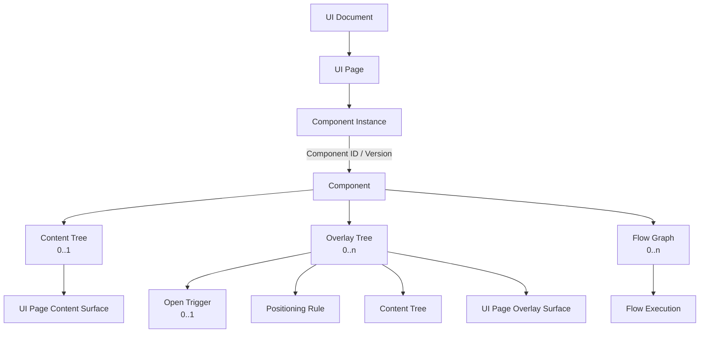
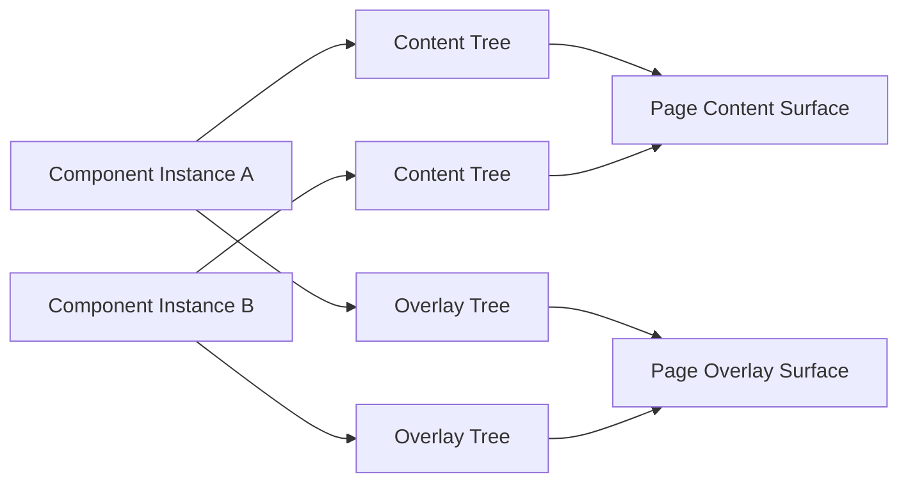

# Architecture: UI and Responsive Model

> [Architecture Index](./README.md) · Previous: [Project Document Model](./04-project-document-model.md) · Next: [Flow and Execution Model](./06-flow-and-execution-model.md)
>
> Covers: Section 7, Section 9

---

## 7. UI Document Model

UI DocumentはApplicationのUI PageとComponent Instanceの配置を保持するCanonical UI Modelである。



### 7.1 Canonical用語

| 用語 | 意味 |
|---|---|
| UI Document | UI Page群を保持するProject Model |
| UI Page | Page単位のComponent InstanceとRender SurfaceのOwner |
| Component | Content Tree、Overlay Tree、Flow Graphをまとめる再利用可能なAsset |
| Component Instance | ComponentをUI Pageへ配置した実体 |
| UI Tree | Content Nodeから構成されるUI構造の共通概念 |
| Content Tree | 通常Layoutへ参加するContent Node Tree |
| Overlay Tree | Open Trigger、Positioning Rule、Content Treeを追加したUI Tree |
| Content Node | State、Slot、Layout、Sizeを持つUI TreeのNode |
| Text Content Node | 文字列を表し、子を持たないContent Node |
| Flow Graph | Flow NodeとEdgeから構成される永続Behavior |
| Flow Execution | Flow Graphを実行するRuntime Instance |

`Definition`をProject ModelのEntity名として使用しない。Library上のComponentはTemplateとして機能するが、Projectへ配置された実体と区別する場合は`Component`と`Component Instance`を使用する。

### 7.2 UI DocumentはUI Pageを保持する

UI DocumentはStable UI Page IDをKeyにしたCollectionを持つ。

```text
UI Document
└─ pages
   ├─ ui-page-users
   └─ ui-page-settings
```

概念的な構造:

```text
UI Page
├─ id
├─ name
└─ componentInstances
```

UI PageはContent SurfaceとOverlay SurfaceのRuntime Ownerである。SurfaceのDOMや計算済み座標はProjectへ保存しない。

### 7.3 ComponentをUIとFlowの再利用単位とする

ComponentはLibraryから利用できるVersion付きAssetであり、次を一体として保持する。

```text
Component
├─ id
├─ name
├─ version
├─ contentTree # Content Treeを0個または1個
├─ overlayTrees # Overlay Treeを0個以上
└─ flowGraphs # Flow Graphを0個以上
```

ComponentはUI Node、State、Slot、Flow Nodeを直下へ重複保持しない。

- StateとSlotはContent Nodeが持つ。
- Flow NodeはFlow Graphが持つ。
- Overlayの表示内容はOverlay Tree内のContent Treeが持つ。
- Flow ExecutionはRuntimeが持つ。

ComponentをProjectで利用するときは、利用VersionをProjectへ取り込む。Libraryの更新によって既存Projectの動作を暗黙に変更しない。

### 7.4 Component InstanceをUI配置の単位とする

Component InstanceはComponentをUIへ配置した実体である。UI Page直下だけでなく、ComponentのContent TreeまたはOverlay TreeにあるContent Node Slotへ子Component Instanceを配置できる。

```text
Component Instance
├─ id
├─ componentId
├─ componentVersion
└─ placement
   ├─ page # UI Page直下へ配置する場合
   │  └─ pageId
   └─ slot # Component内へ配置する場合
      ├─ parentNodeId
      └─ slotId
```

Component Instance自身はDOM Elementではない。Instanceから解決されたContent TreeはPage Content Surfaceへ、Overlay Treeは同じPageのOverlay Surfaceへ描画する。

Component内へ配置した子Component Instance IDは、そのComponentに対するLocal IDとする。RuntimeではPage直下のComponent Instanceから子Component InstanceまでのPathでScopeを表す。

```text
Component Instance Path
└─ component-instance-user-form
   └─ component-instance-error-modal
      └─ component-instance-modal-header
         └─ component-instance-close-button
```

同じComponentを複数配置した場合、Component Instance PathをScopeとしてLocal Node ID、Overlay Tree ID、Flow Graph ID、Stateを分離する。

### 7.5 UI TreeとContent Node

UI TreeはContent NodeをRootとし、Content Nodeと子Component Instanceを保持する。

```text
Content Tree
├─ rootNodeId
├─ nodes
│  └─ Content Node
│     ├─ id
│     ├─ name
│     ├─ type
│     ├─ state
│     ├─ slots
│     ├─ children
│     ├─ layout
│     └─ size
└─ componentInstances
   └─ Child Component Instance
```

Content NodeのChildrenは同じContent TreeのContent Nodeまたは子Component Instanceへの配置を保持する。子Component Instanceの実体は、そのContent Treeの`componentInstances`へ保存し、参照種別をStructured Dataで区別する。

```text
Child Placement
├─ target
│  ├─ Content Node Reference
│  └─ Component Instance Reference
└─ slotId # 親Content Nodeが定義したNamed Slot
```

Text Content Nodeは文字列を表すLeaf Nodeとする。

```text
Text Content Node
├─ id
├─ name
├─ type = text
├─ value
│  ├─ Literal String
│  └─ Structured Reference
├─ slots = []
└─ children = []
```

Content TreeへRaw Stringを直接保存しない。文字列もStable IDを持つText Content Nodeとして保存することで、編集、Binding、Reference、差分追跡の対象にする。Text Content Nodeを別のContent Node配下へ置く場合も、親のChild Placementに明示的な`slotId`を指定する。Content TreeのRootは親を持たないためChild Placementを持たない。

Overlay TreeをContent NodeのChildとして保存しない。Overlayを持つ子Component Instanceを配置した場合も、そのOverlay TreeのOwnerは子Component Instanceのままとする。

UI TreeはDOM Treeではない。RendererがContent NodeからDOM / Web Componentsを導出する。

### 7.6 ComponentのContent Treeは最大1つとする

ComponentはContent Treeを持たないか、Rootを1つ持つContent Treeを1つだけ持つ。

```text
Contentのみ
└─ contentTree = Content Tree

Overlayのみ
└─ contentTree = null

ContentとOverlay
├─ contentTree = Content Tree
└─ overlayTrees = Overlay Trees
```

「Rootが1つ」はContent Nodeが合計1つという意味ではない。Root配下にはContent Node Treeを構築でき、Slotへ別Component Instanceを配置できる。

### 7.7 Overlay TreeはUI TreeへTriggerとPositioningを追加する

Overlay TreeはUI Treeの構造に、表示開始のTrigger Instanceと位置決定Ruleを追加したものとする。

```text
Overlay Tree
├─ id
├─ name
├─ openTrigger # 未接続時はnull
├─ positioning
└─ contentTree
```

Overlay Treeが持つContent NodeはOverlay内部の通常Layoutへ参加する。Page Content Surfaceへ戻して描画しない。

ComponentはOverlay Treeを0個以上持てる。Overlay TreeをContent NodeのChildへ入れず、Componentが直接所有する。

### 7.8 Open Triggerは任意とする

Overlay Treeの`openTrigger`は`Trigger Instance | null`とする。

```text
Unbound Overlay
└─ openTrigger = null

Bound Overlay
└─ openTrigger
   ├─ triggerTypeId
   └─ config
```

未接続のOverlay TreeをInvalidとしない。Button Event、Flow Signal、Lifecycle、Schedule等との関連は後から追加できる。

Open TriggerはOverlayをActiveにする入口である。Close、Escape、Outside Click等のBehaviorは必要なFlow GraphまたはOverlay Templateで表現する。

### 7.9 ModalとPopup Buttonを分離する

Modal TemplateはButtonへ自動接続しない。

```text
Modal Component
├─ contentTree = null
├─ overlayTrees
│  └─ modal
│     ├─ openTrigger = null
│     ├─ positioning = viewport-center
│     └─ Content Tree
│        ├─ Backdrop Content Node
│        └─ Modal Window Content Node
│           ├─ slots
│           │  ├─ header
│           │  ├─ body
│           │  └─ footer
│           └─ children
│              ├─ Modal Header Component Instance [slotId = header]
│              │  └─ Modal Header Content Tree
│              │     └─ Header Content Node
│              │        ├─ slots
│              │        │  └─ close
│              │        └─ children
│              │           └─ Close Button Component Instance [slotId = close]
│              ├─ Modal Body Component Instance [slotId = body]
│              │  └─ Body Content Tree
│              │     └─ Message Text Content Node
│              │        ├─ type = text
│              │        ├─ value = "処理を完了できませんでした"
│              │        ├─ slots = []
│              │        └─ children = []
│              ├─ Cancel Button Component Instance [slotId = footer]
│              └─ Confirm Button Component Instance [slotId = footer]
└─ flowGraphs
   ├─ close-window
   │  └─ Close Button.click → Deactivate modal
   └─ cancel-window
      └─ Cancel Button.click → Deactivate modal
```

ButtonとOverlayが最初から関連付いているものはPopup Button Templateとする。

```text
Popup Button Component
├─ contentTree
│  └─ Button Host Content Node
│     ├─ slots
│     │  └─ trigger
│     └─ children
│        └─ Button Component Instance [slotId = trigger]
├─ overlayTrees
│  └─ popup
│     ├─ openTrigger = Button Component Instance.click
│     ├─ positioning
│     └─ Popup Content Tree
│        └─ Popup Window Content Node
│           ├─ slots
│           │  ├─ header
│           │  ├─ body
│           │  └─ footer
│           └─ children
│              ├─ Popup Header Component Instance [slotId = header]
│              ├─ Popup Content Component Instance [slotId = body]
│              └─ Close Button Component Instance [slotId = footer]
└─ flowGraphs
   └─ close-popup
      └─ Close Button.click → Deactivate popup
```

Close / Cancel Flow GraphはOverlay Treeを所有するModalまたはPopup Button Componentが持つ。子Button Componentが親Overlay Treeの状態を暗黙に操作しない。

```text
Modal Component Flow Reference
├─ trigger
│  └─ current-instance / modal-header / close-button / click
└─ action
   └─ current-instance / modal / deactivate
```

通常ButtonはOverlay Treeを持たない。ModalとButtonを後から関連付ける場合、ModalのOpen TriggerへButton Eventを設定する。

### 7.10 Modal等はOverlay Templateとして表現する

Modal、Snackbar、Popoverを専用UI Node Categoryとして固定しない。Overlay TreeのPositioning、Content Tree、必要なBehaviorの組合せとして表現する。

```text
Modal
├─ positioning = viewport center
├─ Backdrop Content Node
└─ Window Content Tree

Snackbar
├─ positioning = viewport bottom-end
└─ Notification Content Tree

Popover
├─ positioning = anchor
├─ anchorId
└─ Popup Content Tree
```

BackdropもModal WindowもContent Nodeである。Visual Structureを専用Runtime Objectへ隠さず、Library Templateとして再利用可能にする。

ModalにはFocus、Background Interaction、Scroll Lock等のBehaviorが必要になる場合がある。これらを単なる座標として省略せず、必要なTemplate RuleまたはFlow Graphとして明示する。

### 7.11 PositioningはRuleとして保存する

ProjectへBrowserで計算した`x`、`y`を保存しない。

```text
Persistent Positioning Rule
├─ viewport alignment
├─ anchor reference
├─ placement
└─ offset

Runtime Geometry
├─ x
├─ y
├─ width
└─ height
```

ModalやSnackbarはRuntimeではAbsolute / Fixed Positioningとして描画できるが、保存形式はViewport Size、Scroll、Anchor Geometryから再計算可能なRuleとする。

### 7.12 Page単位でRender Surfaceを管理する

各UI PageはRuntimeで次のSurfaceを持つ。

```text
UI Page
├─ Content Surface
└─ Overlay Surface
```

Component InstanceのContent TreeはContent Surfaceへ、ActiveなOverlay TreeはOverlay Surfaceへ投影する。



Page Overlay ManagerはPage ScopeでStack、Backdrop順、Focus、Escape、Scroll Lock等を管理する。Page遷移時は遷移元PageのOverlayと関連Flow Executionを停止する。

### 7.13 StateはContent Nodeが持つ

Content Nodeは自身の初期Stateを保持できる。RuntimeではComponent Instance IDとLocal Content Node IDでNamespace化する。

```text
component-instance-clock-a / clock-display / currentTime
component-instance-clock-b / clock-display / currentTime
```

Projectへ保存するのは初期値とSchemaであり、通常のRuntime Current ValueをProjectへ書き戻さない。

Application全体で共有するStateはState Documentへ保持する。Content Node StateとApplication Stateを同じScopeとして扱わない。

### 7.14 SlotはContent Nodeだけが持つ

SlotはContent Nodeが子Content Nodeまたは子Component Instanceを受け入れるNamed Placement Boundaryである。
Content TreeはUI構造全体、SlotはそのTree内のContent Nodeが定義する配置先であり、同義ではない。

```text
Content Node
├─ slots # このNodeが提供するSlot
└─ children
   └─ Child Placement
      ├─ target # Content NodeまたはComponent Instance
      └─ slotId # このChildを配置するNamed Slot
```

MVPのSlotは`id`と`name`だけを持つ。Child IDをSlot側へ重複保存しない。

Default Slotは定義しない。Root以外のすべてのChild Placementは、親Content Nodeに存在する名前付きSlotの`slotId`を明示しなければならない。`slotId`の`null`、省略、および`default`という予約SlotはProjectへ保存できない。配置先が未確定の要素は有効なContent Treeへ追加せず、Editorの一時状態として扱う。

```text
Card Content Node
├─ slots
│  ├─ content
│  └─ footer
└─ children
   ├─ Text [slotId = content]
   └─ Button [slotId = footer]
```

`actions`をSlot名に使用しない。Flow Actionとの混同を避け、`header`、`content`、`fields`、`footer`等の配置領域名を使用する。

Component自身とOverlay Treeは別のSlot Collectionを持たない。Overlay Tree内の挿入先は、そのContent TreeのContent Nodeが持つ。

### 7.15 LayoutとSizeをSemantic Ruleとして保持する

通常LayoutはStack、Grid、Slot等のSemantic Ruleとして保持する。

```text
Layout
├─ Stack
│  ├─ Vertical
│  └─ Horizontal
├─ Grid
└─ Slot
```

Sizeは`fit`、`fill`、`fraction`、`fixed`、`min`、`max`等のRuleで表現する。

通常Content TreeへDrag中のPointer座標やBounding Rectを保存しない。Drag GeometryはDrop Intentへ変換し、Parent、Slot、Child Order等の構造変更として保存する。

Overlay PositioningだけはOut-of-flow RenderingのためのRuleを持てるが、Runtimeで計算したGeometryは保存しない。

### 7.16 UI EventとFlowをStable Referenceで接続する

Trigger InstanceとFlow NodeはComponent Instance Scopeを考慮したStructured ReferenceでContent Node、Overlay Tree、Stateを参照する。

```text
Component-local Reference
├─ componentInstancePath
└─ localId
```

Display Name、DOM Selector、Shadow DOM内部ElementをReference Keyにしない。

Anchored OverlayのAnchorは同じUI Page内のContent NodeをStable Referenceで指定する。Anchor削除時はReference切れをValidationで検出する。

### 7.17 RendererはUI TreeからDOMを導出する

Rendering Directionは一方向とする。

```text
UI Document + Component Assets
        ↓
Component Instance Resolution
        ↓
Content Tree / Active Overlay Tree
        ↓
Shared Renderer
        ↓
Page Content Surface / Page Overlay Surface
        ↓
DOM / Web Components
```

EditorとProductionは同じRendererとSurface Resolution Ruleを使用する。EditorはSelection、Hover、Drop Indicator等をInteraction Surfaceへ追加するが、Application UI Treeへ保存しない。

### 7.18 UI Document Validation

少なくとも次を検証する。

```text
UI Document Validation
├─ Duplicate UI Page ID
├─ Missing Component
├─ Missing Component Version
├─ Duplicate Component Instance ID
├─ Missing Child Component Instance
├─ Missing Parent Content Node
├─ Missing Slot
├─ Missing or null Child Slot ID
├─ Reserved Default Slot
├─ Raw String Child
├─ Text Content Node with Children
├─ Circular Content Tree
├─ Circular Component Composition
├─ Component Content Tree Count > 1
├─ Overlay Tree stored below Content Node
├─ Invalid Open Trigger Reference
├─ Invalid Anchor Reference
├─ Cross-page Overlay Reference
└─ Deleted Local Node Reference
```

### 7.19 UI Document Invariants

```text
A # UI DocumentはUI Pageを保持する

B # UI PageはComponent Instanceを保持する

C # ComponentはContent Tree、Overlay Tree、Flow Graphをまとめる

D # ComponentのContent Treeは0個または1個とする

E # ComponentはOverlay Treeを0個以上持てる

F # Overlay TreeはOpen Trigger、Positioning Rule、Content Treeを持つ

G # Open Triggerはnullを許容する

H # ModalをButtonへ自動接続しない

I # Popup ButtonだけがButton clickとの初期接続を持つ

J # Content NodeのChildへOverlay Treeを入れない

K # Content NodeのChildはContent Nodeまたは子Component Instanceとする

L # 子Component InstanceはComponent Instance PathでScope化する

M # StateとSlotはContent Nodeが持つ

N # Flow NodeはFlow Graphが持つ

O # Modal等はOverlay Templateとして表現する

P # Page単位でContent SurfaceとOverlay Surfaceを管理する

Q # Runtime GeometryをProjectへ保存しない

R # DOMをProject Source of Truthにしない

S # Root以外のChildは既存のNamed Slotを明示する

T # Default Slot、nullのslotId、Raw String Childを保存しない

U # Text Content Nodeは子を持たない
```

---

## 9. Responsive Design Model

Responsive DesignはUI Treeを複製せず、Semantic Layout RuleへのOverrideとして扱う。

### 9.1 Breakpointの責務

Breakpointは次を変更できる。

- Stack Direction
- Grid Columns
- Gap
- Padding
- Size Rule
- Visibility

Component、Content Node、Overlay Tree、Flow ReferenceのStable IDは変更しない。

### 9.2 Overlay Positioning

Anchored OverlayはViewport幅やCollisionに応じてPlacementを変更できる。Runtimeで解決した座標をResponsive Overrideへ保存しない。

### 9.3 Initial Scope

MVPではDefault Layout Ruleを実装対象とする。Breakpoint Editorと高度なResponsive OverrideはMVP完了後に扱う。
