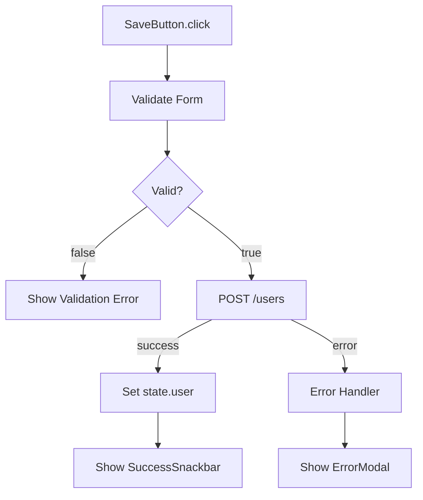
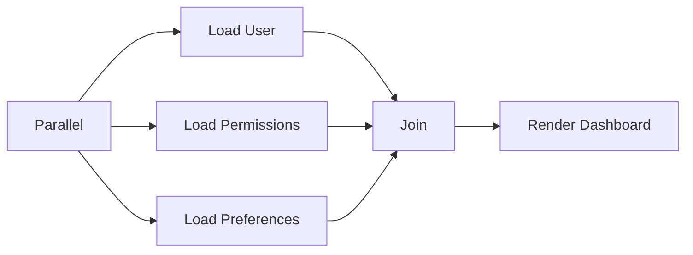
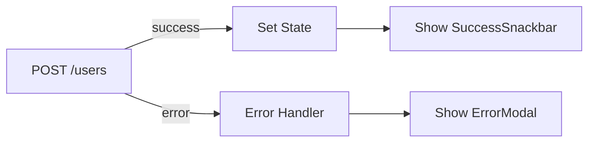
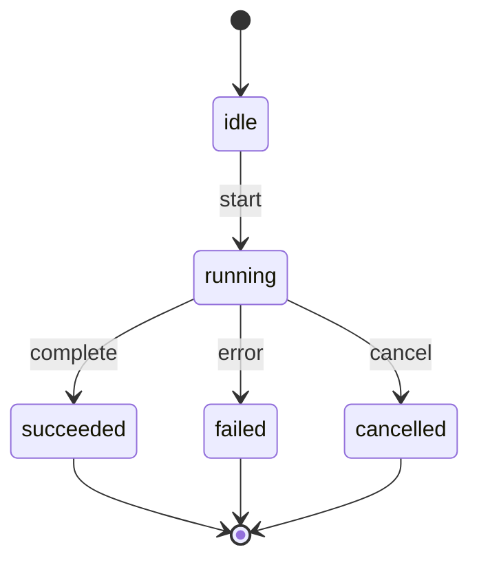
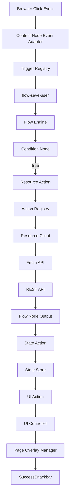
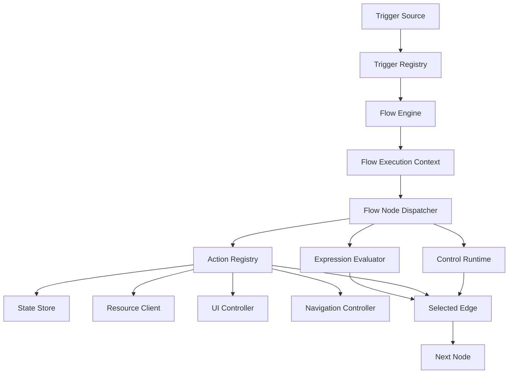
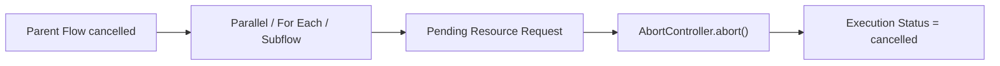

# Architecture: Flow and Execution Model

> [Architecture Index](./README.md) · Previous: [UI and Responsive Model](./05-ui-and-responsive-model.md) · Next: [State, Command, and History](./07-state-command-and-history.md)
>
> Covers: Section 8, Section 15

---

## 8. Flow Document Model

Flow DocumentはApplicationの振る舞いを表すCanonical Behavior Modelであり、Triggerを起点としてAction、Logic、Data、Timing、Control等のNodeを接続したStructured Graphとして保持する。

FlowをJavaScript Source Code、DOM Event Handler、Component内部Logicとして保存しない。

```text
Flow Document # Application共通BehaviorのCanonical Model
└─ graphs
   └─ Flow Graph
      ├─ id # Stable Flow Graph ID
      ├─ name # Editor上のDisplay Name
      ├─ variables # Page Instanceを参照するGraph Local Variable
      ├─ nodes # Flow Node群
      ├─ edges # Node間のExecution Path
      └─ metadata # Flow Editor表示に必要なPersistent Metadata
```

Component固有のFlow GraphはComponentが保持する。どちらも同じFlow Graph SchemaとFlow Runtimeを使用する。

```text
Component
└─ flowGraphs
   └─ Flow Graph
```

### 8.1 FlowをApplication BehaviorのCanonical Modelとする

Application共通の振る舞いはFlow Documentへ、Component固有の振る舞いはComponentのFlow Graphへ置く。どちらもFlow GraphをBehaviorの正本とする。

```text
Application Behavior
├─ User Interaction # Click / Input / Submit等
├─ Lifecycle # App Load / Page Load等
├─ State Change # State更新による処理開始
├─ Resource Access # REST API等
├─ UI Update # Show / Hide / Focus等
├─ Navigation # Page / URL変更
├─ Data Transformation # 値の変換・加工
├─ Conditional Logic # Condition / Switch等
├─ Timing # Delay / Debounce等
└─ Execution Control # Parallel / Retry / Subflow等
      ↓
Flow Graph
```

以下をBehaviorのSource of Truthにしない。

```text
Not Behavior Source of Truth
├─ onclick文字列
├─ DOM Event Listenerそのもの
├─ Svelte Event Handler
├─ Web Component内部private logic
└─ Generated JavaScript Source
```

Generated JavaScriptはFlow Graphから導出されるRuntime Execution Formとする。

### 8.2 Flow全体の基本実行モデル

典型的なApplication Behaviorは以下のようなFlowとして表現する。



この1本のGraph内で以下を明示する。

```text
Flow Responsibilities
├─ Trigger # いつFlowを開始するか
├─ Logic # どのPathを通るか
├─ Resource Action # 外部APIへ何を要求するか
├─ State Action # Application Stateをどう更新するか
├─ UI Action # UIへ何を行うか
└─ Error Path # Failure時にどこへ進むか
```

### 8.3 Flow Graphを独立したStructured Graphとして保持する

各Flow GraphはNodeとEdgeから構成する。

```text
Flow Graph
├─ id # Stable Flow Graph ID
├─ name # Userが変更可能なDisplay Name
├─ variables # Component / Overlay InstanceのGraph Local Binding
├─ nodes
│  ├─ Trigger Node
│  ├─ Action Node
│  ├─ Logic Node
│  ├─ Data Node
│  ├─ Timing Node
│  └─ Control Node
└─ edges
   ├─ default
   ├─ success / error
   ├─ true / false
   └─ Node固有Port
```

Visual Flow Editor上のGraphとPersistent Flow Modelで異なる意味構造を持たない。

### 8.4 Flow Graph IDをStable Referenceとする

各Flow GraphはStable IDを持つ。

```text
Flow Graph
├─ id = flow-save-user
└─ name = "Save User"
```

`name` は変更可能だが、`id` はReference Integrityのため安定させる。

Subflow等からFlow Graphを参照する場合もFlow Graph IDを使用する。

### 8.5 Flow Nodeを実行単位とする

各Flow Nodeは1つの明確な責務を持つ。

```text
Flow Node
├─ id # Flow内のStable Node ID
├─ type # Node Type
├─ config # Node固有設定
├─ inputs # Structured Input
├─ outputs # 公開するOutput Definition
└─ metadata # Editor表示に必要な非Runtime情報
```

概念的な保存例:

```json
{
  "id": "flow-node-create-user",
  "type": "resource.request",
  "config": {
    "resource": {
      "$ref": {
        "kind": "resource",
        "id": "resource-backend"
      }
    },
    "method": "POST",
    "path": "/users"
  },
  "inputs": {},
  "outputs": {
    "data": {}
  },
  "metadata": {
    "x": 720,
    "y": 340
  }
}
```

`metadata.x / y` はFlow Editor上の座標であり、Execution Semanticsには含めない。

現段階のFlow Editorは`edges`から階層を計算してフローチャートを自動配置するため、`metadata.x / y`を表示位置へ適用しない。

`data.constant` Nodeは`config.value`へ保存したLiteral Valueを`value` Outputとして公開する。Structured ReferenceはLiteralとして扱わない。

現段階のBrowser Runtimeは`trigger.ui-event`のComponent Instance VariableとUI Node Local IDを照合し、`overlay.action`のOverlay Instance VariableをPage Overlay Managerへ渡す。

### 8.6 Flow Node IDをStableにする

Flow Node間ReferenceやOutput ReferenceにはStable Node IDを使用する。

```text
CreateUser Node
└─ id = flow-node-create-user
```

後続NodeはこのNodeのOutputを参照できる。

```text
outputs.flow-node-create-user.data.id
```

Editor上でNodeを移動、整列、Group化してもNode IDを変更しない。

### 8.7 Flow Editor上の座標をBehavior Semanticsと分離する

Flow Graph EditorではNode Positionを保持してよい。

```text
Flow Editor Metadata
├─ x # Editor Canvas上のX座標
├─ y # Editor Canvas上のY座標
├─ collapsed # Editor上の折りたたみ状態
└─ group # Editor上の表示Group
```

Runtime Dataと分離する。

```text
Flow Node
├─ Runtime Data
│  ├─ type
│  ├─ config
│  ├─ inputs
│  └─ outputs
│
└─ Editor Metadata
   ├─ x
   ├─ y
   ├─ collapsed
   └─ group
```

Flow Editor上の見た目変更によってApplication Behaviorが変化しないようにする。

### 8.8 Trigger NodeをFlow Entry Pointとする

FlowはTriggerから開始する。

```text
Trigger
├─ UI Event # Content Nodeで発生するBrowser Event
├─ Lifecycle Event # App / Page等のLifecycle
├─ State Event # State Storeの変更
└─ Timing Event # Delay / Interval / Schedule
```

Triggerを持たないFlowはSubflow等から明示的に呼び出されるCallable Flowとして区別する。

### 8.9 UI Event TriggerをContent Nodeへ接続する

UI Event TriggerはFlow Graphへ登録したComponent Instance Variable、UI NodeのStable Local ID、Event Typeを参照する。

```text
UI Event Trigger
├─ variableId = flow-variable-save-button # Component Instanceを解決するGraph Local Variable
├─ localId = content-node-button # Button Component内のEvent Source
└─ event = click
```

概念的な保存例:

```json
{
  "id": "flow-node-save-click",
  "type": "trigger.ui-event",
  "config": {
    "variableId": "flow-variable-save-button",
    "localId": "content-node-button",
    "event": "click"
  }
}
```

実行経路:

```text
Content Node DOM
      ↓
Browser Event Adapter
      ↓
Trigger Registry
      ↓
Matching Flow Trigger
      ↓
Flow Engine
```

以下のようなDOM Selectorを保存しない。

```text
target = "#form > button.save"
target = "[data-id='save']"
target = "div:nth-child(4)"
```

### 8.10 Lifecycle Triggerを明示的に定義する

ApplicationやPage等のLifecycleをTriggerとして扱える。

```text
Lifecycle Trigger
├─ App Load # Application Runtime起動時
├─ Page Load # Page表示時
└─ Component Mount # 明示的に公開されたComponent Lifecycle
```

Renderer内部の任意Lifecycle Eventを自動的なFlow Triggerにしない。

### 8.11 State Event TriggerをState Storeへ接続する

State変更をFlow Triggerとして扱える。

```text
State Event Trigger
├─ stateReference # 監視対象State
├─ changeType # set / change等
└─ condition # 必要な場合のみExpression
```

例:

```text
state.auth.user changes
      ↓
State Trigger
      ↓
Load User Profile
```

State更新とState Triggerが意図しない無限Loopを形成しないようRuntime GuardとValidationを設ける。

### 8.12 Timing Triggerを実行保証範囲ごとに区別する

Timing EventはBrowserで保証可能なものとServer Capabilityを必要とするものを区別する。

```text
Timing Trigger
├─ Delay # Browser Runtime実行中に一度開始する
├─ Interval # Browser Runtime実行中に繰り返す
├─ Foreground Schedule # Application実行中のみ保証するSchedule
└─ Server Schedule # Backend Scheduler等のExternal Capability
```

Server ScheduleをBrowser Runtime自身の能力として扱わない。

### 8.13 Action Nodeを副作用の実行単位とする

ActionはApplicationまたは外部環境へ副作用を発生させるNodeである。

```text
Action
├─ UI Action # UI Componentへ操作を行う
├─ Resource Action # REST API等へアクセスする
├─ State Action # State Storeを更新する
└─ Navigation Action # Browser Navigationを行う
```

Flow Engine自身へ具体的Action実装を埋め込まず、Action RegistryからRuntime Serviceへ委譲する。

### 8.14 UI ActionをUI Controllerへ委譲する

UI ActionはComponent InstanceとContent Nodeを含むStructured ReferenceをTargetとする。

```text
UI Action
├─ Show
├─ Hide
├─ Enable
├─ Disable
├─ Focus
├─ Scroll
├─ Set Property
└─ Overlay Action
```

Content NodeへFocusを移す例:

```json
{
  "id": "flow-node-focus-name",
  "type": "ui.action",
  "config": {
    "target": {
      "kind": "content-node",
      "scope": "current-component-instance",
      "componentInstancePath": ["component-instance-name-input"],
      "localId": "content-node-input"
    },
    "action": "focus"
  }
}
```

実行経路:

```text
Flow UI Action
      ↓
Action Registry
      ↓
UI Controller
      ↓
Stable Node ID Resolution
      ↓
Rendered Content Node
```

以下のような実装を行わない。

```text
Flow
  ↓
querySelector("#error-modal")
  ↓
shadowRoot.querySelector(...)
```

### 8.15 Overlay ActionをPage Overlay Managerへ委譲する

Overlay操作もUI Actionの一種として扱う。

```text
Overlay Action
├─ Activate Overlay
├─ Deactivate Overlay
└─ Toggle Overlay
```

実行経路:

```text
Flow
  ↓
UI Controller
  ↓
Page Overlay Manager
      ↓
Page Overlay Surface
```

TargetはFlow Graphへ登録したOverlay Instance Variableで指定する。Overlay DefinitionやDOM SelectorをAction Nodeへ直接保存しない。

### 8.16 Resource ActionをResource Definitionから分離する

REST Action内へEnvironment固有のConnection情報を重複保存しない。

Project側のResource Definition:

```json
{
  "id": "resource-backend",
  "type": "rest",
  "baseUrl": "https://api.example.com",
  "commonHeaders": {
    "Accept": "application/json"
  }
}
```

Flow側のResource Action:

```json
{
  "id": "flow-node-create-user",
  "type": "resource.request",
  "config": {
    "resource": {
      "$ref": {
        "kind": "resource",
        "id": "resource-backend"
      }
    },
    "method": "POST",
    "path": "/users",
    "body": {
      "email": {
        "$ref": {
          "kind": "content-node-state",
          "scope": "current-component-instance",
          "localId": "content-node-user-form",
          "path": ["form", "email"]
        }
      },
      "name": {
        "$ref": {
          "kind": "content-node-state",
          "scope": "current-component-instance",
          "localId": "content-node-user-form",
          "path": ["form", "name"]
        }
      }
    }
  }
}
```

実行時:

```text
Flow Resource Action
      ↓
Resource Client
      ↓
resource-backend
      ↓
baseUrl + path
      ↓
Fetch API
      ↓
REST API
```

Environmentを切り替えてもFlow Graph自体を変更しない。

### 8.17 REST Actionを標準Resource Actionとする

初期Core Resource ActionはRESTを中心とする。

```text
REST API Request
├─ GET
├─ POST
├─ PUT
├─ PATCH
└─ DELETE
```

REST Actionは以下の情報をStructured Dataとして保持できる。

```text
REST Action
├─ resource # Resource ID
├─ method # HTTP Method
├─ path # Resource Base URLからの相対Path
├─ query # Query Parameters
├─ headers # Request固有Header
├─ body # Request Body
├─ timeout # 必要な場合
└─ output # Response Output Definition
```

必要に応じて将来拡張する。

```text
Optional / Future Resource Actions
├─ Upload
├─ Download
├─ WebSocket Send
└─ SSE Subscribe
```

WebSocket / SSEを初期Core Requirementにはしない。

### 8.18 REST Action OutputをStructured Outputとして公開する

REST Requestの結果を暗黙Global Variableへ保存しない。

```text
Create User Request
└─ id = flow-node-create-user
   └─ outputs
      ├─ data
      ├─ status
      └─ headers
```

後続Nodeから参照する。

```text
outputs.flow-node-create-user.data.id
outputs.flow-node-create-user.status
```

概念的なReference:

```json
{
  "$ref": {
    "kind": "flow-node-output",
    "id": "flow-node-create-user",
    "path": ["data", "id"]
  }
}
```

### 8.19 State ActionをState Storeへ委譲する

State更新をStructured Actionとして表現する。

```text
State Action
├─ Set
├─ Merge
├─ Clear
├─ Toggle
├─ Increment
├─ Decrement
├─ Append
└─ Remove
```

例:

```json
{
  "id": "flow-node-set-user",
  "type": "state.set",
  "config": {
    "target": {
      "$ref": {
        "kind": "application-state",
        "id": "state-user"
      }
    },
    "value": {
      "$ref": {
        "kind": "flow-node-output",
        "id": "flow-node-create-user",
        "path": ["data"]
      }
    }
  }
}
```

State ActionはState Store経由で実行する。

### 8.20 Navigation ActionをNavigation Controllerへ委譲する

Browser Navigation処理をFlow Nodeごとに直接実装しない。

```text
Navigation Action
├─ Navigate
├─ Back
├─ Forward
├─ Reload
├─ Open External URL
└─ Set Query Parameter
```

実行経路:

```text
Flow Navigation Action
      ↓
Navigation Controller
      ↓
Browser APIs
├─ History
├─ Location
├─ URL
└─ URLSearchParams
```

### 8.21 Logic Nodeを副作用なしの分岐処理として扱う

Logic NodeはFlow Execution Pathを選択する。

```text
Logic
├─ Condition
├─ Switch
└─ Guard
```

Logic Node内でREST RequestやDOM操作等の副作用を実行しない。

### 8.22 Condition Nodeをtrue / false Edgeへ接続する

```text
Condition: Valid?
├─ true
│  ↓
│  Create User
│
└─ false
   ↓
   Show Validation Error
```

Condition Node:

```json
{
  "id": "flow-node-is-valid",
  "type": "logic.condition",
  "config": {
    "expression": {
      "type": "eq",
      "left": {
        "$ref": {
          "kind": "flow-node-output",
          "id": "flow-node-validation",
          "path": ["valid"]
        }
      },
      "right": true
    }
  }
}
```

Condition結果をNode内部の暗黙Branchにせず、Edge PortとしてGraphへ表現する。

### 8.23 Switch Nodeを複数Port分岐として扱う

```text
Switch: state.user.role
├─ admin
│  └─ Admin Flow
├─ member
│  └─ Member Flow
├─ guest
│  └─ Guest Flow
└─ default
   └─ Fallback Flow
```

Switch Port Definitionは解析可能なStructured Dataとして保持する。

### 8.24 Guard NodeをFlow継続条件として扱う

Guardは条件を満たさない場合にFlowを停止、または別Pathへ送る。

```text
Guard: Is Authenticated?
├─ pass
│  └─ Continue
└─ reject
   └─ Navigate Login
```

複雑な条件を各Action Nodeへ重複して埋め込まず、必要に応じてGuardとして明示する。

### 8.25 Data Nodeを値変換の実行単位とする

Data Nodeは原則として外部副作用を持たず、入力からOutputを生成する。

```text
Data
├─ Set Variable
├─ Transform
├─ Map
├─ Filter
├─ Pick
├─ Merge
├─ Format
├─ Calculate
└─ Parse
```

### 8.26 Data Node Outputを後続Nodeから参照可能にする

```text
Normalize User
└─ id = flow-node-normalize-user
   └─ output
      └─ result
```

後続Node:

```text
outputs.flow-node-normalize-user.result.email
```

概念的保存形式:

```json
{
  "$ref": {
    "kind": "flow-node-output",
    "id": "flow-node-normalize-user",
    "path": ["result", "email"]
  }
}
```

### 8.27 Timing NodeをTiming Triggerと区別する

Timing TriggerはFlow開始条件である。

Timing NodeはFlow実行途中の時間制御である。

```text
Timing Trigger
└─ Flowを開始する

Timing Node
└─ Flow途中のExecutionを制御する
```

Timing Node:

```text
Timing
├─ Wait
├─ Delay
├─ Debounce
└─ Throttle
```

### 8.28 Wait / DelayをExecution Suspensionとして扱う

```text
Show Snackbar
      ↓
Wait 3000ms
      ↓
Hide Snackbar
```

Browser Runtime内で非同期に実行する。

Runtime全体やBrowser Main ThreadをBlockingしない。

### 8.29 Debounce / Throttleを明示的なTiming Semanticsとして扱う

例:

```text
SearchInput.input
      ↓
Debounce 300ms
      ↓
GET /search
```

Component内部へ暗黙Debounceを埋め込むのではなく、Application Behaviorとして必要な場合はFlow Semanticsとして明示する。

### 8.30 Control NodeをExecution Structureとして扱う

Control Nodeは複数Nodeの実行方法を制御する。

```text
Control
├─ Parallel
├─ For Each
├─ Retry
├─ Error Handler
├─ Cancel
├─ Subflow
└─ Return
```

### 8.31 Parallelを明示的なConcurrency Nodeとする



Join Policyを明示できるようにする。

```text
Parallel Join
├─ all # 全Branch完了
├─ allSettled # 成否を問わず全Branch完了
├─ firstSuccess # 最初に成功したBranchの結果を採用
└─ race # 成否を問わず最初に完了したBranchの結果を採用
```

各Policyについて、残りのBranchを継続するかCancelするかも明示する。

Runtimeが暗黙的なExecution Orderや完了条件を推測しない。

### 8.32 For EachをCollection Iterationとして扱う

```text
For Each
├─ source # Collection Reference
├─ itemVariable # Current Item
├─ indexVariable # Current Index
└─ body # Iteration Body
```

例:

```text
state.selectedUsers
      ↓
For Each user
      ↓
DELETE /users/{user.id}
```

Current ItemをGlobal Stateへ暗黙保存しない。

### 8.33 RetryをAction固有実装から分離する

Retryを各Resource Action内部へ独自実装せず、共通Control Semanticsとして表現できるようにする。

```text
Retry
├─ maxAttempts
├─ delay
├─ backoff
└─ retryCondition
```

例:

```text
Retry: max 3
      ↓
POST /users
```

Retry対象はError Type、HTTP Status、MethodのIdempotencyを考慮して明示する。
Validation Errorや認証失敗等を無条件にRetryしない。

### 8.34 Error HandlingをStructured Execution Pathとして扱う

Failure PathをGraphへ明示する。



Error PathのEdge例:

```json
{
  "id": "edge-create-user-error",
  "fromNode": "flow-node-create-user",
  "fromPort": "error",
  "toNode": "flow-node-error-handler",
  "toPort": "in"
}
```

各Node内部へ独自の`try / catch` Behavior Modelを埋め込まない。

### 8.35 Error Contextを後続Nodeから参照可能にする

Error Handlerでは発生したError情報をStructured Dataとして参照できるようにする。

```text
Error Context
├─ sourceNode
├─ type
├─ message
├─ status
└─ cause
```

Runtime内部のJavaScript Error ObjectそのものをPersistent Flow Dataとして保存しない。

### 8.36 CancelをFlow Executionの第一級操作とする

長時間Request、Wait、Subflow等をCancel可能にする。

```text
Flow Execution
├─ AbortController
├─ Cancellation State
└─ Cancellation Propagation
```

Cancel可能なResource RequestではBrowser標準のAbortControllerを活用する。

Execution Statusは少なくとも以下を区別する。



`cancelled` を通常の `failed` と同一視せず、必要な場合のみ専用Portまたは親Executionへ伝播する。

### 8.37 SubflowでBehaviorを再利用する

Flowから別Flowを呼び出せる。

```text
SaveUserFlow
      ↓
ValidateUser Subflow
├─ input
│  └─ user = current Component Instance / content-node-user-form / form
└─ output
   └─ valid
      ↓
Condition
```

Subflow Nodeの概念的保存例:

```json
{
  "id": "flow-node-validate-user",
  "type": "control.subflow",
  "config": {
    "flow": {
      "$ref": {
        "kind": "flow-graph",
        "id": "flow-validate-user"
      }
    },
    "inputs": {
      "user": {
        "$ref": {
          "kind": "content-node-state",
          "scope": "current-component-instance",
          "localId": "content-node-user-form",
          "path": ["form"]
        }
      }
    }
  }
}
```

Subflow ReferenceにはStable Flow Graph IDを使用する。

### 8.38 Subflow Inputを明示する

Reusable FlowはCallerから受け取るInput Contractを定義できる。

```text
ValidateUser Flow
├─ inputs
│  └─ user
└─ outputs
   └─ valid
```

Caller:

```text
Subflow
├─ flow = flow-validate-user
└─ inputs
   └─ user = current Component Instance / content-node-user-form / form
```

Application Stateへ値を一時書き込むことでParameter Passingを代用しない。

### 8.39 ReturnでFlow Outputを明示する

Reusable Flow / SubflowはReturn NodeでOutputを返せる。

```text
ValidateUser
      ↓
Calculate Result
      ↓
Return
└─ valid = outputs.validation.result
```

概念例:

```json
{
  "id": "flow-node-return-validation",
  "type": "control.return",
  "config": {
    "value": {
      "valid": {
        "$ref": {
          "kind": "flow-node-output",
          "id": "flow-node-validation",
          "path": ["result"]
        }
      }
    }
  }
}
```

CallerはSubflow Node Outputとして参照する。

### 8.40 Flow Execution ContextをNamespace分離する

Flow Runtimeが利用する値を明示的に区別する。

```text
Flow Execution Context
├─ event # Triggerから渡されたInput
├─ state # State Store内のApplication Data
├─ variables # Flow Execution固有のLocal Data
├─ outputs # 実行済みNodeのOutput
└─ env # Browserへ公開可能なEnvironment Value
```

Namespaceの意味を混同しない。

### 8.41 Event DataをTrigger Inputとして扱う

UI Event等から受け取る値は `event` Namespaceへ格納する。

```text
event
├─ type # Event Type
├─ target # Trigger Source
└─ detail # Event Adapterが正規化したPayload
```

例:

```text
event.detail.value
```

Trigger TypeごとのPayload SchemaはTrigger Registryで定義する。

### 8.42 Instance VariableとExecution Variableを分離する

Flow Graphの`variables`は、NodeがPage上のComponent InstanceまたはOverlay Instanceを参照するための永続Bindingである。

```text
Graph Local Instance Variables
├─ flow-variable-save-button # Component Instance Path
└─ flow-variable-modal # Overlay Instance ID
```

一方、実行途中で生成するData VariableはFlow Executionに閉じる。

```text
variables
├─ formData
├─ currentPage
└─ retryCount
```

Execution VariableをApplication Stateへ暗黙Promoteしない。

Concurrent Flow実行間でも共有しない。

### 8.43 Flow OutputをNode IDごとにNamespace化する

Node OutputはStable Flow Node IDを基準に管理する。

```text
outputs
├─ flow-node-create-user
│  ├─ data
│  └─ status
│
└─ flow-node-transform-user
   └─ result
```

同じNode表示名が存在してもOutput Collisionを起こさない。

### 8.44 Environment ValueをPublic Configurationとして扱う

`env` へ格納するのはBrowserへ公開してよい値のみとする。

```text
env
├─ API_BASE_URL
├─ FEATURE_FLAG
└─ PUBLIC_CONFIG
```

以下を含めない。

```text
Secrets
├─ Private API Key
├─ OAuth Client Secret
├─ Database Password
└─ Backend Credential
```

### 8.45 Flow InputをLiteralまたはReferenceとして扱う

Flow Inputは固定値とDynamic Referenceを明確に区別する。

```text
Flow Input
├─ Literal
│  ├─ string
│  ├─ number
│  ├─ boolean
│  ├─ null
│  ├─ array
│  └─ object
│
└─ Reference
   ├─ event
   ├─ state
   ├─ variables
   ├─ outputs
   └─ env
```

Literal例:

```json
{
  "value": "active"
}
```

Reference例:

```json
{
  "$ref": {
    "kind": "application-state",
    "id": "state-user",
    "path": ["email"]
  }
}
```

### 8.46 Structured Referenceを使用する

ReferenceをJavaScript Expressionとして`eval()`する形式にしない。

Content Node State Referenceの例:

```json
{
  "$ref": {
    "kind": "content-node-state",
    "scope": "current-component-instance",
    "localId": "content-node-user-form",
    "path": ["form", "email"]
  }
}
```

`current-component-instance` はComponent固有Flow GraphのFlow Executionが持つComponent Instance Pathから解決する。このScopeで`componentInstancePath`を併記した場合はCurrent Instanceから子Instanceまでの相対Pathとする。Project共通Flow GraphではUI Page直下から対象InstanceまでのPathを明示する。

重要なのは、ReferenceであることをRuntime、Validator、Editorが明確に識別できることである。

### 8.47 Structured Referenceの対象を明示する

```text
Reference Scope
├─ event # Trigger Event Data
├─ state # State Store
├─ variables # Current Flow Execution
├─ outputs # Flow Node Output
├─ env # Public Environment
├─ content-node # Stable Content Node Referenceが必要な場合
├─ resource # Resource Definition
└─ flow # Subflow等のFlow Reference
```

異なるReference Typeを同じ曖昧Stringとして扱わない。

### 8.48 ExpressionをASTとして保持する

ConditionやData Transformで使用するExpressionはStructured ASTとして保持する。

```text
Expression
├─ Literal
├─ Reference
├─ Unary Operator
├─ Binary Operator
├─ Logical Operator
├─ Comparison
├─ Conditional
├─ Collection Operation
└─ Supported Function Call
```

視覚表現例:

```text
AND
├─ GTE
│  ├─ state.user.age
│  └─ 18
└─ EQ
   ├─ state.user.enabled
   └─ true
```

### 8.49 Expression ASTの具体的保存例

上記Expressionは概念的に以下のように保存できる。

```json
{
  "type": "and",
  "operands": [
    {
      "type": "gte",
      "left": {
        "$ref": {
          "kind": "application-state",
          "id": "state-user",
          "path": ["age"]
        }
      },
      "right": 18
    },
    {
      "type": "eq",
      "left": {
        "$ref": {
          "kind": "application-state",
          "id": "state-user",
          "path": ["enabled"]
        }
      },
      "right": true
    }
  ]
}
```

これにより以下を可能にする。

```text
Expression Capabilities
├─ Visual Editing
├─ Validation
├─ Type Analysis
├─ Dependency Analysis
├─ Migration
├─ Static Analysis
└─ Future Compilation
```

### 8.50 Expression EvaluatorをRuntime共通機能とする

Editor PreviewとProductionで別Expression Engineを使用しない。

```text
Expression AST
      ↓
Expression Evaluator
├─ Preview Runtime
└─ Production Runtime
```

Visual Editor上のValidation結果とProduction Execution結果を一致させる。

### 8.51 Arbitrary JavaScriptを基本Flow Modelにしない

以下を通常Flow Nodeとして保存しない。

```text
Do Not Use as Core Flow Representation
├─ eval(...)
├─ new Function(...)
├─ Arbitrary JavaScript Expression
└─ Arbitrary Script Block
```

将来Custom Codeが必要な場合は、明示的なAdvanced / Escape Hatch機能として通常Flowから分離する。

### 8.52 Flow EdgeをExecution Pathとして保持する

EdgeはNode間の実行順序・分岐を表す。

```text
Edge
├─ id # Stable Edge ID
├─ fromNode # Source Node ID
├─ fromPort # Source Output Port
├─ toNode # Destination Node ID
└─ toPort # Destination Input Port
```

具体例:

```json
{
  "id": "edge-condition-valid",
  "fromNode": "flow-node-is-valid",
  "fromPort": "true",
  "toNode": "flow-node-create-user",
  "toPort": "in"
}
```

これにより `true` はNodeではなくOutput Portであることを明示する。

### 8.53 PortをNode Contractとして定義する

Node Typeごとに利用可能なExecution Portを定義する。

```text
Condition Node
├─ Input Ports
│  └─ in
└─ Output Ports
   ├─ true
   └─ false
```

```text
REST Request Node
├─ Input Ports
│  └─ in
└─ Output Ports
   ├─ success
   └─ error
```

無効なPortへのEdgeをValidatorで検出する。

### 8.54 Execution EdgeとData Referenceを分離する

Execution順序とData依存を同じものとして扱わない。

```text
Execution Edge
└─ A → B # Bをいつ実行するか

Data Reference
└─ B.input → outputs.A.data # Bが何を読むか
```

例:

```text
Create User
      ↓ Execution Edge
Set Current User
      └─ value = outputs.CreateUser.data
```

Output Referenceだけから暗黙的Execution Orderを推測しないことを基本とする。

### 8.55 Flow Graphの具体的保存イメージ

Save User Flow全体の概念的な保存例:

```json
{
  "id": "flow-save-user",
  "name": "Save User",
  "variables": {
    "flow-variable-save-button": {
      "id": "flow-variable-save-button",
      "name": "Save Button",
      "target": {
        "kind": "component-instance",
        "pageId": "ui-page-users",
        "componentInstancePath": ["component-instance-user-form", "component-instance-save-button"]
      }
    },
    "flow-variable-validation": {
      "id": "flow-variable-validation",
      "name": "Validation Overlay",
      "target": {
        "kind": "overlay-instance",
        "pageId": "ui-page-users",
        "overlayInstanceId": "overlay-instance-validation"
      }
    },
    "flow-variable-success": {
      "id": "flow-variable-success",
      "name": "Success Overlay",
      "target": {
        "kind": "overlay-instance",
        "pageId": "ui-page-users",
        "overlayInstanceId": "overlay-instance-success"
      }
    },
    "flow-variable-error": {
      "id": "flow-variable-error",
      "name": "Error Overlay",
      "target": {
        "kind": "overlay-instance",
        "pageId": "ui-page-users",
        "overlayInstanceId": "overlay-instance-error"
      }
    }
  },
  "nodes": [
    {
      "id": "flow-node-click-save",
      "type": "trigger.ui-event",
      "config": {
        "variableId": "flow-variable-save-button",
        "localId": "content-node-button",
        "event": "click"
      }
    },
    {
      "id": "flow-node-validation",
      "type": "logic.condition",
      "config": {
        "expression": {
          "type": "eq",
          "left": {
            "$ref": {
              "kind": "content-node-state",
              "scope": "current-component-instance",
              "localId": "content-node-user-form",
              "path": ["form", "valid"]
            }
          },
          "right": true
        }
      }
    },
    {
      "id": "flow-node-validation-error",
      "type": "overlay.action",
      "config": {
        "variableId": "flow-variable-validation",
        "action": "activate"
      }
    },
    {
      "id": "flow-node-create-user",
      "type": "resource.request",
      "config": {
        "resource": {
          "$ref": {
            "kind": "resource",
            "id": "resource-backend"
          }
        },
        "method": "POST",
        "path": "/users",
        "body": {
          "name": {
            "$ref": {
              "kind": "content-node-state",
              "scope": "current-component-instance",
              "localId": "content-node-user-form",
              "path": ["form", "name"]
            }
          },
          "email": {
            "$ref": {
              "kind": "content-node-state",
              "scope": "current-component-instance",
              "localId": "content-node-user-form",
              "path": ["form", "email"]
            }
          }
        }
      }
    },
    {
      "id": "flow-node-set-user",
      "type": "state.set",
      "config": {
        "target": {
          "$ref": {
            "kind": "application-state",
            "id": "state-user"
          }
        },
        "value": {
          "$ref": {
            "kind": "flow-node-output",
            "id": "flow-node-create-user",
            "path": ["data"]
          }
        }
      }
    },
    {
      "id": "flow-node-show-success",
      "type": "overlay.action",
      "config": {
        "variableId": "flow-variable-success",
        "action": "activate"
      }
    },
    {
      "id": "flow-node-show-error",
      "type": "overlay.action",
      "config": {
        "variableId": "flow-variable-error",
        "action": "activate"
      }
    }
  ],
  "edges": [
    {
      "id": "edge-1",
      "fromNode": "flow-node-click-save",
      "fromPort": "default",
      "toNode": "flow-node-validation",
      "toPort": "in"
    },
    {
      "id": "edge-2",
      "fromNode": "flow-node-validation",
      "fromPort": "true",
      "toNode": "flow-node-create-user",
      "toPort": "in"
    },
    {
      "id": "edge-validation-error",
      "fromNode": "flow-node-validation",
      "fromPort": "false",
      "toNode": "flow-node-validation-error",
      "toPort": "in"
    },
    {
      "id": "edge-3",
      "fromNode": "flow-node-create-user",
      "fromPort": "success",
      "toNode": "flow-node-set-user",
      "toPort": "in"
    },
    {
      "id": "edge-4",
      "fromNode": "flow-node-set-user",
      "fromPort": "default",
      "toNode": "flow-node-show-success",
      "toPort": "in"
    },
    {
      "id": "edge-5",
      "fromNode": "flow-node-create-user",
      "fromPort": "error",
      "toNode": "flow-node-show-error",
      "toPort": "in"
    }
  ]
}
```

この例はSchemaの最終固定形ではなく、各責務・Reference・Node・Edgeの関係を明示するためのCanonical Exampleとする。

### 8.56 Async ExecutionをFlow Engineの標準Semanticsとする

Resource Action、Wait、Subflow等は非同期実行可能とする。

```text
Flow Engine
├─ Sync Node
├─ Async Node
├─ Await
├─ Error Propagation
└─ Cancellation
```

Node TypeごとにPromise Handlingを独自実装しない。

### 8.57 Flow Engineを汎用Graph Executorとする

Flow Engine自体へ特定ComponentやREST Endpoint固有のBehaviorを埋め込まない。

```text
Flow Engine
├─ Graph Traversal # 次に実行するNodeを決定する
├─ Execution Context # Flow固有Dataを管理する
├─ Node Dispatch # Node TypeからHandlerを解決する
├─ Branching # Portに従ってExecution Pathを選択する
├─ Async Control # Promise / Wait等を扱う
├─ Error Propagation # Error Pathへ送る
└─ Cancellation # Flow Execution停止を扱う
```

具体的ActionはRegistryとRuntime Serviceへ委譲する。

本仕様では `Flow Engine` と `Flow Runtime` を次のように区別する。

```text
Flow Runtime # Flow実行に必要なBrowser側Subsystem全体
├─ Trigger Registry
├─ Flow Engine # Graph TraversalとNode Dispatchを担当
├─ Action Registry
├─ Expression Evaluator
├─ State Store
├─ Resource Client
├─ UI Controller
└─ Navigation Controller
```

`Flow Engine` を実行アルゴリズム、`Flow Runtime` をその依存Serviceを含む実行環境の名称として使用する。

### 8.58 Trigger Registryを拡張境界とする

Trigger Typeと実Browser Event Sourceの接続をRegistryで管理する。

```text
Trigger Registry
├─ UI Event Trigger
├─ Lifecycle Trigger
├─ State Trigger
└─ Timing Trigger
```

Browser Event Listener実装をFlow Engine本体へ分散させない。

### 8.59 Action Registryを拡張境界とする

Action Typeから実行Handlerを解決する。

```text
Action Registry
├─ UI Action Handler
├─ Resource Action Handler
├─ State Action Handler
└─ Navigation Action Handler
```

実行先:

```text
Action Registry
├─ UI Controller
├─ Resource Client
├─ State Store
└─ Navigation Controller
```

Component内のFlow Graphも同じAction Registryを使用し、Component Instance ScopeをExecution Contextへ渡す。

### 8.60 Flow Runtimeの具体的実行経路

SaveButton ClickからREST Request、State更新、Snackbar表示までのRuntime経路:



Flow Engine自身はDOM、Fetch、State implementation detailを直接操作しない。

### 8.61 Flow変更をCommand / Transactionとして扱う

Flow EditorからGraph Dataを直接任意Mutationしない。

```text
Flow Editor Intent
      ↓
Command / Transaction
      ↓
Flow Document Mutation
      ↓
Validation
      ↓
Render Flow Editor
```

代表Command:

```text
Flow Commands
├─ ADD_FLOW
├─ DELETE_FLOW
├─ ADD_FLOW_NODE
├─ DELETE_FLOW_NODE
├─ MOVE_FLOW_NODE # Editor Metadataのみ変更
├─ SET_FLOW_NODE_CONFIG
├─ CONNECT_FLOW
├─ DISCONNECT_FLOW
└─ SET_FLOW_TRIGGER
```

### 8.62 Graph Position変更とBehavior変更を区別する

Flow Editor上でNodeを移動する操作はExecution Behaviorを変更しない。

```text
MOVE_FLOW_NODE
└─ metadata.x / metadata.y
```

Edge接続変更はBehavior変更である。

```text
CONNECT_FLOW
└─ Execution Graph Change
```

Undo / Redoでも両者を区別できるようにする。

### 8.63 Flow削除時にReference Integrityを確認する

FlowがSubflow等から参照されている場合、削除前にDependencyを確認する。

```text
Delete Flow
      ↓
Dependency Check
├─ Subflow Reference
├─ Navigation / Trigger Referenceがある場合
└─ Other Project Reference
```

Referenceを黙って破壊しない。

### 8.64 Content NodeまたはOverlay Tree削除時のFlow Referenceを検証する

Content NodeまたはOverlay Treeを削除した場合、Flow TargetやTriggerがInvalidになる可能性がある。

```text
Delete UI Target
      ↓
Flow Reference Search
├─ UI Event Trigger
├─ UI Action Target
├─ Overlay Action Target
└─ Anchor-related Reference
```

Project ValidatorでMissing Targetを検出する。

### 8.65 Resource削除時のFlow Referenceを検証する

```text
Delete Resource
      ↓
Flow Resource Reference Search
      ↓
Missing Resource Validation
```

Flow内のResource Referenceを自動的に別Resourceへ差し替えない。

### 8.66 Flow Graphの構造Validationを行う

```text
Flow Validation
├─ Duplicate Flow ID
├─ Duplicate Flow Node ID
├─ Missing Node
├─ Missing Edge Target
├─ Invalid Port
├─ Missing UI Target
├─ Missing Resource
├─ Invalid State Reference
├─ Invalid Expression
├─ Invalid Output Reference
├─ Invalid Subflow Reference
├─ Invalid Input Type
├─ Unreachable Node
└─ Potential Infinite Loop
```

Editor、Preview、Exportで同一Validation Ruleを使用する。

### 8.67 Unreachable Nodeを検出する

TriggerまたはSubflow Entryから到達できないNodeを検出する。

```text
Trigger
   ↓
Node A
   ↓
Node B

Node C # Unreachable
```

Unreachable NodeをErrorとするかWarningとするかはValidation Policyで明示する。

### 8.68 Infinite Loop Riskを検出する

Cycle自体を全面禁止しない。

Retry、Polling、Loop等ではCycleが必要な場合がある。

```text
Cycle
├─ Explicit Loop # Control Node等による意図されたLoop
└─ Accidental Loop # 意図しないGraph Cycle
```

Loopを許可する場合は終了条件やRuntime Guardを明示する。

### 8.69 Persistent Flow GraphとRuntime Flow Executionを分離する

Flow Graphは永続Modelであり、実行中の状態そのものではない。

```text
Flow Graph
├─ nodes
├─ edges
└─ config
```

実行中:

```text
Flow Execution
├─ executionId # 実行Instance ID
├─ flowGraphId # 実行対象Flow Graph
├─ currentNodes # 現在実行中のNode
├─ context # event / variables / outputs等
├─ pendingAsyncOperations
├─ cancellationState
└─ errorState
```

Runtime InstanceをProject Documentへ通常保存しない。

### 8.70 Concurrent Flow Executionを許容する

同じFlowが複数回同時実行されてもExecution Contextが衝突しないようにする。

```text
SaveUserFlow
├─ Execution A
│  ├─ variables
│  └─ outputs
│
└─ Execution B
   ├─ variables
   └─ outputs
```

`variables` や `outputs` をFlow Graph単位のGlobal Objectとして共有しない。

### 8.71 Preview RuntimeでFlow Inspectionを可能にする

PreviewではProduction Runtime CoreへDebug Hookを追加する。

```text
Preview Flow Hooks
├─ Execution Start
├─ Node Enter
├─ Node Exit
├─ Node Output
├─ Branch Selected
├─ Resource Request
├─ State Update
├─ Error
├─ Cancellation
└─ Execution End
```

Debug HookによってProduction Flow Semanticsを変更しない。

### 8.72 Flow Step ExecutionをPreview機能として提供できる

```text
Preview Flow Control
├─ Pause
├─ Step
├─ Continue
├─ Stop
└─ Inspect Context
```

これらはEditor / Preview用機能であり、Flow DocumentのBehavior Nodeとして保存しない。

### 8.73 PreviewとProductionで同一Flow Runtime Semanticsを使用する

```text
Flow Document
      ↓
Flow Runtime Core
├─ Preview Mode
│  └─ Debug Hooks
└─ Production Mode
```

Preview専用Flow Engineを別実装しない。

### 8.74 Generated ApplicationではJavaScript Flow Runtimeが実行する

Builder内部ではFlow ModelやFlow Runtime SourceをTypeScriptで実装してよい。

Export後はJavaScriptとして実行する。

```text
Visual Application Builder
├─ TypeScript Flow Model
├─ TypeScript Flow Runtime Source
└─ Static Exporter
      ↓
Generated Application
├─ Serialized Flow Graph
└─ JavaScript Flow Runtime
```

Generated ApplicationにTypeScript CompilerやTypeScript Runtimeを要求しない。

### 8.75 初期Flow RuntimeはInterpreter方式を基本とする

初期実装ではStructured Flow DocumentをBrowser Runtimeが解釈する。

```text
Structured Flow Graph
      ↓
JavaScript Flow Interpreter
      ↓
Browser Execution
```

Interpreter方式の利点:

```text
Interpreter
├─ EditorとProductionのSemanticsを一致させやすい
├─ Flow Debuggerを実装しやすい
├─ Validation結果とRuntimeを対応させやすい
├─ Project Schema Migrationを扱いやすい
└─ Initial Implementationを単純化できる
```

### 8.76 将来Flow Compilerを追加可能にする

PerformanceやBundle Size Optimizationが必要になった場合、Structured FlowからJavaScriptへCompileできる設計を維持する。

```text
Structured Flow Document
├─ Interpreter # Initial / Debug-friendly Runtime
└─ Future Compiler
      ↓
Optimized JavaScript
```

Compilerを追加してもStructured Flow DocumentをCanonical Source of Truthとして維持する。

### 8.77 Flow Documentの概念的な最終構成

```text
Flow Document # Application共通BehaviorのCanonical Model
└─ graphs
   └─ Flow Graph
      ├─ id # Stable Flow Graph ID
      ├─ name # Display Name
      ├─ variables # Page Instanceを参照するGraph Local Binding
      │
      ├─ nodes
      │  └─ Flow Node
      │     ├─ id # Stable Flow Node ID
      │     ├─ type # Trigger / Action / Logic等
      │     ├─ config # Node固有設定
      │     ├─ inputs # Literal / Structured Reference
      │     ├─ outputs # Node Output Definition
      │     └─ metadata # Flow Editor表示情報
      │
      └─ edges
         └─ Edge
            ├─ id
            ├─ fromNode
            ├─ fromPort
            ├─ toNode
            └─ toPort
```

Flow Node Category:

```text
Flow Node Categories
├─ Trigger # Flowの開始条件
│  ├─ UI Event
│  ├─ Lifecycle Event
│  ├─ State Event
│  └─ Timing Event
│
├─ Action # Applicationや外部環境へ副作用を発生させる
│  ├─ UI Action
│  ├─ Resource Action
│  ├─ State Action
│  └─ Navigation Action
│
├─ Logic # Execution Pathを選択する
│  ├─ Condition
│  ├─ Switch
│  └─ Guard
│
├─ Data # 値を加工してOutputを生成する
│  ├─ Set Variable
│  ├─ Transform
│  ├─ Map
│  ├─ Filter
│  ├─ Pick
│  ├─ Merge
│  ├─ Format
│  ├─ Calculate
│  └─ Parse
│
├─ Timing # Flow途中の時間制御
│  ├─ Wait
│  ├─ Delay
│  ├─ Debounce
│  └─ Throttle
│
└─ Control # Execution Structureを制御する
   ├─ Parallel
   ├─ For Each
   ├─ Retry
   ├─ Error Handler
   ├─ Cancel
   ├─ Subflow
   └─ Return
```

Execution Context:

```text
Flow Execution Context
├─ event # Trigger Input
├─ state # Application / Content Node State
├─ variables # Flow-local Data
├─ outputs # Flow Node Execution Result
└─ env # Public Environment Configuration
```

Runtime Architecture:



### 8.78 Flow Document Invariants

```text
A # Flow DocumentをApplication BehaviorのCanonical Source of Truthとする

B # FlowをStructured Graphとして保持する

C # UI ComponentへFlow Behavior Codeを直接埋め込まない

D # Generated JavaScript SourceをFlowのSource of Truthにしない

E # Arbitrary JavaScript文字列をFlowの基本表現にしない

F # FlowとUIはComponent / Overlay Instance Variableを介して接続する

G # DOM SelectorやShadow DOMをFlow Targetとして使用しない

H # FlowとFlow NodeにStable IDを使用する

I # Display NameをReference Keyとして使用しない

J # Flow Editor上のGeometryとExecution Semanticsを分離する

K # Trigger / Action / Logic / Data / Timing / Controlの責務を分離する

L # UI Event TriggerはComponent Instance Variable、UI Node Local ID、Event Typeを参照する

M # UI ActionはUI Controllerを経由する

N # Overlay ActionはOverlay Instance Variableを参照しPage Overlay Managerを経由する

O # Resource ActionはResource IDを参照しResource Clientを経由する

P # Environment固有Base URLをFlow Nodeへ直接埋め込まない

Q # State ActionはState Storeを経由する

R # Navigation ActionはNavigation Controllerを経由する

S # event / state / variables / outputs / envをExecution Context上で分離する

T # Flow InputをLiteralまたはStructured Referenceとして保持する

U # ExpressionをStructured ASTとして保持する

V # Execution EdgeとData Referenceを分離する

W # true / false / success / error等を明示的なPortとして扱う

X # Node OutputをStable Node ID単位でNamespace化する

Y # Async / Error / CancellationをFlow Runtimeの標準Semanticsとして扱う

Z # Flow Engineを特定ComponentやResourceに依存しない汎用Graph Executorとする

AA # Trigger RegistryとAction RegistryをRuntime拡張境界とする

AB # Flow変更はCommand / Transactionを経由する

AC # Editor / Preview / Exportで同一Flow Validation Ruleを使用する

AD # Persistent Flow GraphとRuntime Flow Executionを分離する

AE # Concurrent Flow Execution間でvariables / outputsを共有しない

AF # PreviewとProductionで同一Flow Runtime Semanticsを使用する

AG # Preview Debug機能をFlow DocumentのBehaviorへ混ぜない

AH # Builder内部ではTypeScriptを使用してよいがGenerated ApplicationではJavaScriptとして実行する

AI # 初期Flow RuntimeはStructured Flowを解釈するJavaScript Interpreterを基本とする

AJ # 将来Compilerを追加してもStructured Flow DocumentをCanonical Source of Truthとして維持する

AK # SecretをFlow Graph、env、Generated JavaScriptへ保存しない

AL # Project共通Flow GraphはFlow Documentが、Component固有Flow GraphはComponentが所有する
```

---

## 15. Type, Error, and Cancellation Model

Type、Error、CancellationはFlow Editorだけの補助情報ではなく、ValidationとRuntimeが共有するContractとする。

### 15.1 Type System

```text
outputs.flow-node-create-user.data
└─ User
   ├─ id: string
   ├─ name: string
   └─ email: string
```

Type情報はState Schema、Content Node Property Schema、Resource Response Schema、Flow Node Outputから解決する。
後続Nodeの補完、Expression Type Check、Invalid Binding検出へ使用する。

```json
{
  "source": {
    "$ref": {
      "kind": "flow-node-output",
      "id": "flow-node-create-user",
      "path": ["data", "id"]
    }
  },
  "expectedType": "string"
}
```

Typeが不明な外部Dataは `unknown` として扱い、暗黙に任意PropertyへAccess可能としない。

### 15.2 Error Contract

```text
Resource Action Ports
├─ success
├─ error
├─ timeout # 明示Policyがある場合
└─ cancelled # Cancellationを分岐として扱う場合
```

```json
{
  "sourceNode": "flow-node-create-user",
  "type": "http",
  "code": "HTTP_409",
  "message": "Request failed.",
  "status": 409,
  "retryable": false
}
```

Raw JavaScript Error ObjectやStack TraceをPersistent Project Dataへ保存しない。
ProductionでUserへ表示するMessageとDebug Detailを分離する。

### 15.3 Cancellation Propagation



Cancellation後に完了した非同期処理がStateやUIを更新しないよう、Execution IDとStatusをCommit前に確認する。

---

Previous: [UI and Responsive Model](./05-ui-and-responsive-model.md) · [Architecture Index](./README.md) · Next: [State, Command, and History](./07-state-command-and-history.md)
