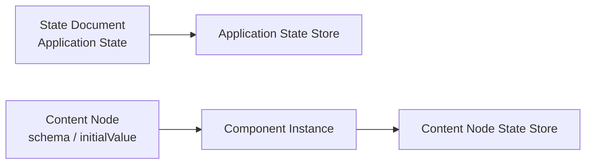
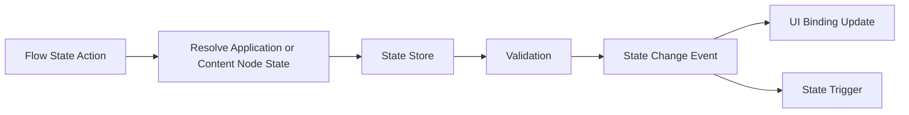

# Architecture: State, Command, and History

> [Architecture Index](./README.md) · Previous: [Flow and Execution Model](./06-flow-and-execution-model.md) · Next: [Editor, Preview, and Debugging](./08-editor-preview-and-debugging.md)
>
> Covers: Section 10, Section 11

---

## 10. State Model

StateはApplication共有値、Component InstanceごとのContent Node値、Flow Execution、Editor Sessionで責務を分離する。

### 10.1 State Scope

```text
State Domains
├─ Application State # Application全体で共有するRuntime Data
├─ Content Node State # Component Instanceごとに独立するRuntime Data
├─ Flow Variables # 1 Flow Execution内だけで有効
├─ Event Data # Triggerから渡されるInput
├─ Flow Outputs # Node実行結果
├─ Environment # Public Configuration
└─ Editor State # SelectionやPointer等。Application Stateではない
```

同名の値が存在しても、Scopeを暗黙に探索しない。
ReferenceはApplication StateかContent Node Stateかを明示する。Component固有Flow Graph内のContent Node State Referenceは、Flow Executionが持つCurrent Component Instance IDを使って解決する。

### 10.2 DefinitionとRuntime Valueの分離



Projectへ保存するのはState DefinitionとInitial Valueであり、Preview中やProduction実行中のCurrent Valueではない。

### 10.3 Content Node Stateの具体例

Form入力値はApplication全体のStateではなく、User Form ComponentのContent Nodeへ置く。

```json
{
  "id": "ui-node-user-form",
  "state": {
    "schema": {
      "type": "object",
      "properties": {
        "name": {"type": "string"},
        "email": {"type": "string"},
        "submitting": {"type": "boolean"}
      },
      "required": ["name", "email", "submitting"]
    },
    "initialValue": {
      "name": "",
      "email": "",
      "submitting": false
    }
  },
  "children": []
}
```

同じUser Form Componentを2つ配置した場合、Runtime Keyは次のように分かれる。

```text
component-instance-user-form-a / ui-node-user-form / name
component-instance-user-form-b / ui-node-user-form / name
```

保存済みUser等、Componentを跨いで共有する値だけをApplication Stateへ置く。Private CredentialをState Initial Valueへ保存しない。

### 10.4 State Mutation



State Triggerから同じStateを更新するFlowでは、再入防止、比較Policy、最大実行回数等を定義し、無限更新Loopを防ぐ。

---

## 11. Command History and Transactions

Project Documentの編集はCommandまたはTransactionとして記録する。
Runtime Stateの更新はEditor Historyへ含めない。

### 11.1 Command Catalog

```text
UI Commands
├─ ADD_COMPONENT_INSTANCE
├─ DELETE_COMPONENT_INSTANCE
├─ ADD_CONTENT_NODE
├─ DELETE_CONTENT_NODE
├─ MOVE_CONTENT_NODE
├─ REORDER_CONTENT_NODE
├─ MOVE_TO_SLOT
├─ SET_PROPERTY
├─ SET_LAYOUT
├─ ADD_OVERLAY_TREE
├─ DELETE_OVERLAY_TREE
├─ SET_OVERLAY_TRIGGER
└─ SET_OVERLAY_POSITIONING

Flow Commands
├─ ADD_FLOW_NODE
├─ DELETE_FLOW_NODE
├─ CONNECT_FLOW
├─ DISCONNECT_FLOW
├─ SET_FLOW_PROPERTY
└─ SET_FLOW_POSITION

Project Commands
├─ ADD_RESOURCE
├─ UPDATE_RESOURCE
├─ ADD_STATE_DEFINITION
└─ UPDATE_SETTINGS
```

Command名はUser Intentを表し、UI Event名や内部配列操作名を使用しない。

### 11.2 Transactionの具体例

CardAをCardBの右側へDropし、新しいHorizontal Stackを作る場合:

```text
SPLIT_HORIZONTAL Transaction
├─ ADD_CONTENT_NODE
│  └─ node = ui-node-generated-stack
├─ MOVE_CONTENT_NODE
│  ├─ node = ui-node-card-b
│  └─ parent = ui-node-generated-stack
├─ MOVE_CONTENT_NODE
│  ├─ node = ui-node-card-a
│  ├─ parent = ui-node-generated-stack
│  └─ after = ui-node-card-b
├─ NORMALIZE
└─ VALIDATE
```

上記全体を1 Undo単位とする。
途中Commandだけが失敗した場合はTransaction全体をCommitしない。

### 11.3 History Entry

```json
{
  "id": "history-202",
  "label": "Move Save Button to Footer",
  "command": "MOVE_TO_SLOT",
  "targetIds": ["ui-node-save-button", "ui-node-user-card"],
  "timestamp": "2026-08-23T00:00:00Z"
}
```

HistoryへPointer Move、Hover、Selection、Drag Preview等を記録しない。
Normalizationは元Commandと同じHistory Entryへ含め、独立したUndo Stepにしない。

---

Previous: [Flow and Execution Model](./06-flow-and-execution-model.md) · [Architecture Index](./README.md) · Next: [Editor, Preview, and Debugging](./08-editor-preview-and-debugging.md)
