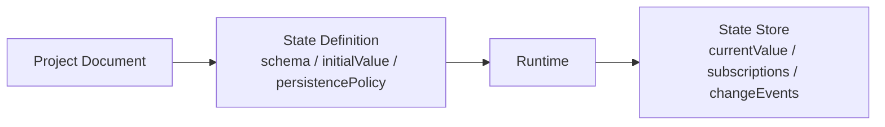
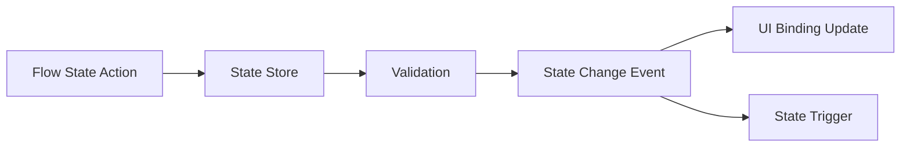

# Architecture: State, Command, and History

> [Architecture Index](./README.md) · Previous: [Flow and Execution Model](./06-flow-and-execution-model.md) · Next: [Editor, Preview, and Debugging](./08-editor-preview-and-debugging.md)
>
> Covers: Section 10, Section 11

---

## 10. State Model

StateはApplication Definition、Flow Execution Context、Component内部実装、Editor Sessionで責務を分離する。

### 10.1 State Scope

```text
State Domains
├─ Application State # Application全体で共有するRuntime Data
├─ Page State # Page Lifetimeに属するRuntime Data
├─ Component Public State # Binding可能な公開State
├─ Component Private State # Component内部実装。Projectから直接操作しない
├─ Flow Variables # 1 Flow Execution内だけで有効
├─ Event Data # Triggerから渡されるInput
├─ Flow Outputs # Node実行結果
├─ Environment # Public Configuration
└─ Editor State # SelectionやPointer等。Application Stateではない
```

同名の値が存在しても、Scopeを暗黙に探索しない。
Referenceは `state`、`variables`、`event`、`outputs`、`env` のNamespaceを明示する。

### 10.2 DefinitionとRuntime Valueの分離



Projectへ保存するのはState DefinitionとInitial Valueであり、Preview中やProduction実行中のCurrent Valueではない。

### 10.3 State Definitionの具体例

```json
{
  "id": "state-form",
  "scope": "application",
  "schema": {
    "type": "object",
    "properties": {
      "name": {"type": "string"},
      "email": {"type": "string"},
      "submitting": {"type": "boolean"}
    },
    "required": ["name", "email", "submitting"]
  },
  "initialValue": {
    "name": "",
    "email": "",
    "submitting": false
  },
  "persistencePolicy": "memory"
}
```

`localStorage` 等へ永続化する場合は明示的なPolicyとMigrationを持たせる。
Private CredentialをState Initial Valueへ保存しない。

### 10.4 State Mutation



State Triggerから同じStateを更新するFlowでは、再入防止、比較Policy、最大実行回数等を定義し、無限更新Loopを防ぐ。

---

## 11. Command History and Transactions

Project Documentの編集はCommandまたはTransactionとして記録する。
Runtime Stateの更新はEditor Historyへ含めない。

### 11.1 Command Catalog

```text
UI Commands
├─ ADD_NODE
├─ DELETE_NODE
├─ MOVE_NODE
├─ REORDER_NODE
├─ MOVE_TO_SLOT
├─ SET_PROPERTY
├─ SET_LAYOUT
└─ SET_PRESENTATION

Flow Commands
├─ ADD_FLOW_NODE
├─ DELETE_FLOW_NODE
├─ CONNECT_FLOW
├─ DISCONNECT_FLOW
├─ SET_FLOW_PROPERTY
└─ SET_FLOW_POSITION

Project Commands
├─ ADD_RESOURCE
├─ UPDATE_RESOURCE
├─ ADD_STATE_DEFINITION
└─ UPDATE_SETTINGS
```

Command名はUser Intentを表し、UI Event名や内部配列操作名を使用しない。

### 11.2 Transactionの具体例

CardAをCardBの右側へDropし、新しいHorizontal Stackを作る場合:

```text
SPLIT_HORIZONTAL Transaction
├─ ADD_LAYOUT_NODE
│  └─ node = node-generated-stack
├─ MOVE_NODE
│  ├─ node = node-card-b
│  └─ parent = node-generated-stack
├─ MOVE_NODE
│  ├─ node = node-card-a
│  ├─ parent = node-generated-stack
│  └─ after = node-card-b
├─ NORMALIZE
└─ VALIDATE
```

上記全体を1 Undo単位とする。
途中Commandだけが失敗した場合はTransaction全体をCommitしない。

### 11.3 History Entry

```json
{
  "id": "history-202",
  "label": "Move Save Button to Actions",
  "command": "MOVE_TO_SLOT",
  "targetIds": ["node-save-button", "node-user-card"],
  "timestamp": "2026-08-23T00:00:00Z"
}
```

HistoryへPointer Move、Hover、Selection、Drag Preview等を記録しない。
Normalizationは元Commandと同じHistory Entryへ含め、独立したUndo Stepにしない。

---

Previous: [Flow and Execution Model](./06-flow-and-execution-model.md) · [Architecture Index](./README.md) · Next: [Editor, Preview, and Debugging](./08-editor-preview-and-debugging.md)
