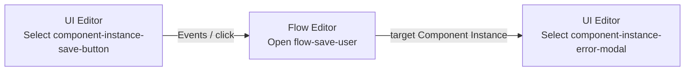
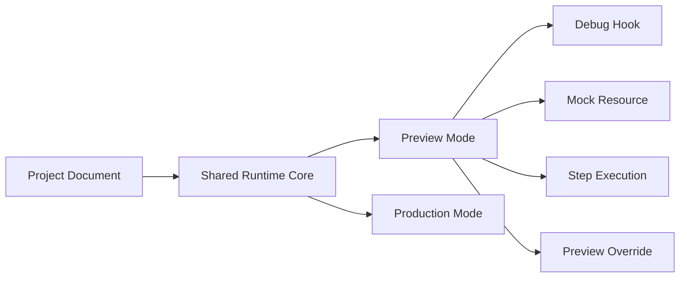

# Architecture: Editor, Preview, and Debugging

> [Architecture Index](./README.md) · Previous: [State, Command, and History](./07-state-command-and-history.md) · Next: [Export, Validation, and Integration](./09-export-validation-and-integration.md)
>
> Covers: Section 12, Section 17

---

## 12. Editor Architecture

EditorはProject Documentを操作するView Layerであり、Application DOMとは分離する。

### 12.1 Layer Tree

Layer TreeはPageのContent SurfaceとOverlay SurfaceごとにComponent Instance Treeを表示する。

```text
UsersPage
├─ Content Surface
│  └─ UserForm Instance
│     ├─ NameInput
│     ├─ EmailInput
│     └─ Footer
│        └─ SaveButton
└─ Overlay Surface
   ├─ ValidationPopover Instance
   ├─ SuccessSnackbar Instance
   └─ DeleteModal Instance
```

Layer Tree上の順序はLogical Ownershipを表し、Overlay Stack順を兼ねない。

### 12.2 UI EditorとFlow EditorのReference Navigation



双方向NavigationはStable IDで解決する。
Display NameやDOM Selectorから対象を推測しない。

### 12.3 Editor Shell

```text
┌─────────────────────────────────────────────────────────────┐
│ Header / Project Status                                    │ fixed
├───────────┬───────────────────────┬─────────────────────────┤
│ Layers    │ UI Canvas             │ Flow Canvas             │ resizable
│           │ Runtime-equivalent UI │ Flow Graph              │
├───────────┴───────────────────────┴─────────────────────────┤
│ Inspector                                                   │ resizable
├─────────────────────────────────────────────────────────────┤
│ Console                                                     │ optional / resizable
└─────────────────────────────────────────────────────────────┘
```

`Layers`、`UI Canvas`、`Flow Canvas` は横方向に並べ、各境界をResize可能にする。`Inspector` はその下へ置き、MCPやConsole Commandを実装するときだけさらに下へ `Console` を追加する。Header以外の領域はすべてResize可能とする。

`Canvas` はEditorの表示領域を指す用語としてのみ使用し、Persistent Absolute Layoutを意味しない。

### 12.4 Overlay Editing

ModalやPopoverを編集するためにApplication StateやProject Documentの `open` 値を書き換えない。

```json
{
  "previewOverrides": {
    "forceVisible": [
      {
        "kind": "component-instance",
        "id": "component-instance-delete-modal"
      }
    ]
  }
}
```

Preview OverrideはEditor Sessionでのみ保持し、Save、Export、Undo/Redoの対象外とする。

### 12.5 Renderer Mode

```text
Shared Renderer
├─ Runtime Mode
│  └─ Application DOM
└─ Editor Mode
   ├─ Same Application DOM
   └─ Editor Hooks / Geometry Observation

Svelte Editor
└─ Interaction Surface
   ├─ Selection Border
   ├─ Drop Indicator
   ├─ Resize Handle
   └─ Guides
```

Editor専用DOMをApplication DOM内部へ挿入しない。

---

## 17. Preview and Debugging

PreviewはProduction Runtime CoreへEditor Hookを追加した実行Modeである。

### 17.1 Runtime Equivalence



Preview専用のFlow BehaviorやComponent実装を別Modelとして持たない。

### 17.2 Debug Event

```json
{
  "executionId": "exec-44",
  "flowGraphId": "flow-save-user",
  "nodeId": "flow-node-create-user",
  "phase": "completed",
  "port": "success",
  "durationMs": 184,
  "outputAvailable": true
}
```

DebuggerはRun、Pause、Step、Restart、Current Node Highlight、Context Inspectionを提供できる。
Production BuildではDebug Detailを除去または無効化できるようにする。

### 17.3 Resource Mock

```json
{
  "resource": "resource-backend",
  "mode": "mock",
  "routes": [
    {
      "method": "POST",
      "path": "/users",
      "status": 201,
      "body": {
        "id": "user-101",
        "name": "Taro"
      }
    }
  ]
}
```

Mock設定はPreview ProfileとしてProject Definitionと分離する。
Flow NodeやResource IDをMock用に差し替えない。

---

Previous: [State, Command, and History](./07-state-command-and-history.md) · [Architecture Index](./README.md) · Next: [Export, Validation, and Integration](./09-export-validation-and-integration.md)
