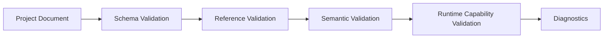
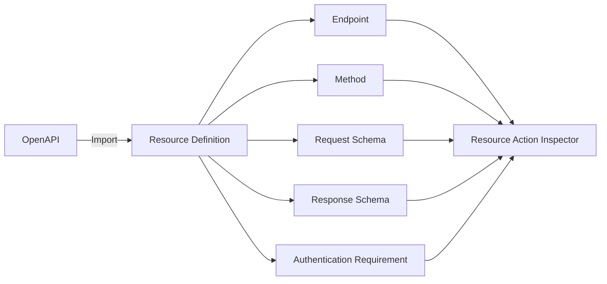

# Architecture: Export, Validation, and Integration

> [Architecture Index](./README.md) · Previous: [Editor, Preview, and Debugging](./08-editor-preview-and-debugging.md) · Next: [Examples, Roadmap, and Decisions](./10-examples-roadmap-and-decisions.md)
>
> Covers: Section 13, Section 14, Section 16, Section 18

---

## 13. Export, Hosting, and Backend Boundary

ExporterはProject DocumentのSemanticsを変えず、Browserで実行できる配布形式へPackageする。

### 13.1 Export Artifact

```text
dist/
├─ index.html
├─ app.js # Application Definitionと起動処理
├─ runtime.js # Renderer / Flow Runtime / State Store等
├─ components.js # 取り込んだComponentの実装
├─ styles.css
└─ assets/
```

Bundle Optimization後にFile数が変わっても、論理責務は維持する。

```text
Generated Application Requires
├─ Application Definition
├─ Shared Renderer
├─ Imported Components
├─ Flow Runtime
├─ State Store
├─ Resource Client
├─ CSS
└─ Assets

Generated Application Does Not Require
├─ Svelte Editor
├─ Flow Editor
├─ Inspector
├─ Drag Library
└─ TypeScript Compiler
```

### 13.2 Hosting Mode

| Mode | Support Level | Project Data | Network / Module制約 | 推奨用途 |
|---|---|---|---|---|
| HTTP(S) Static Hosting | Standard | Embeddedまたは同一Origin取得 | Browser標準動作 | Production |
| `file://` | Best Effort | BundleまたはHTMLへEmbedded | CORS、Module、Fetch制約あり | Offline Demo |

`file://` 対応時は `fetch("./project.json")` や深いRuntime Module Chainへ依存せず、Application DefinitionをBundleまたはHTMLへ埋め込む。

### 13.3 REST API、CORS、Authentication

```text
https://app.example.com
        ↓ Fetch
https://api.example.com
```

Originが異なる場合、API側でCORS、Credential、Allowed Header、Preflightを設計する。
Frontendへ配置可能なのは公開Client Configurationだけであり、認可判定をFrontendだけに委ねない。

### 13.4 Security Boundary

```text
Static Frontend
├─ Public API Base URL
├─ Public Client ID
└─ User Access Token # Runtimeで安全に取得・保持する

Backend Only
├─ Private API Key
├─ OAuth Client Secret
├─ Database Credential
├─ Service Account Secret
└─ Authorization Policy
```

SecretをProject Document、Generated JavaScript、Environment Override、Mock Responseへ保存しない。

### 13.5 Backend Responsibility

| Frontend | Backend |
|---|---|
| UI Rendering | Authentication / Authorization |
| Local Validation | Database Transaction |
| Navigation | Secretを使うExternal API |
| Browser Flow Execution | Durable Scheduled Job |
| Public REST Request | Secure File Processing |
| Local Storage | Business Rule Enforcement |

Client ValidationはUX改善であり、Backend ValidationやAuthorizationの代替ではない。

### 13.6 Schedule Boundary

```text
Foreground Schedule
└─ Applicationが開いている間だけ実行保証

Durable Schedule
└─ Backend Scheduler / Job Queueが実行保証
```

「Browserを閉じていても毎日09:00」のような要件をStatic Frontendだけで保証しない。

---

## 14. Validation and Static Analysis

ValidationはEditor、Save、Preview、Exportで共通のRule Setを使用する。

### 14.1 Validation Phase



| Phase | Example |
|---|---|
| Schema | Required Field、Value Type、Enum |
| Reference | Missing Content Node、Flow、Resource、State |
| Semantic | Slot Compatibility、Circular UI Tree、Invalid Flow Port |
| Capability | Unsupported Browser Feature、Secret Requirement、Durable Schedule |

### 14.2 Diagnostic Contract

```json
{
  "code": "FLOW_TARGET_NOT_FOUND",
  "severity": "error",
  "entity": {
    "kind": "flow-node",
    "id": "flow-node-open-modal"
  },
  "reference": {
    "kind": "overlay-tree",
    "componentInstancePath": ["component-instance-user-form"],
    "localId": "overlay-deleted-modal"
  },
  "message": "Overlay Action target does not exist.",
  "path": ["flows", "graphs", "flow-save-user", "nodes", "flow-node-open-modal"]
}
```

Diagnostic Codeは安定識別子とし、表示文言と分離する。
Editorは `entity` と `path` を使って該当箇所へNavigationできる。

### 14.3 Required Checks

```text
Project
├─ Duplicate Stable ID
├─ Invalid Parent Reference
├─ Circular UI Tree
├─ Missing Component Asset or Version
└─ Unsupported Schema Version

UI
├─ Missing Slot
├─ Invalid Slot Child
├─ Multiple Content Tree Roots
├─ Overlay Tree inside Content Node
├─ Invalid Trigger Reference
└─ Invalid Layout / Size Combination

Flow
├─ Missing Trigger Target
├─ Missing Resource
├─ Invalid Port Connection
├─ Invalid Expression
├─ Unreachable Node
└─ Potential Infinite Loop
```

### 14.4 Static Analysis Views

Structured Modelから以下を導出できるようにする。

```text
Derived Views
├─ PageごとのResource依存
├─ Content Nodeを参照するFlow一覧
├─ Overlayを開くFlow一覧
├─ Unused Flow / Resource / Component
├─ State Read / Write一覧
├─ Environment依存一覧
└─ Required Browser / Backend Capability
```

Derived ViewをProject Documentへ重複保存しない。

---

## 16. Extension and Integration

Component拡張は[Section 7](./05-ui-and-responsive-model.md#7-ui-document-model)のComponent構造を、Flow拡張は[Section 8](./06-flow-and-execution-model.md#8-flow-document-model)のTrigger RegistryとAction Registryを使用する。

### 16.1 Component LibraryとProject Component

```text
Component Libraries
├─ Base Library # FlagShip標準搭載
├─ Public Libraries # Userが追加導入
└─ Local Library # Project固有で永続化
   └─ Component
      ├─ id
      ├─ version
      ├─ contentTree # 0..1
      ├─ overlayTrees # 0..n
      └─ flowGraphs # 0..n
```

Base／PublicからProjectへ追加するときは、選択したComponent Versionと取得元Library ID／VersionをImported Snapshotとして取り込む。Local ComponentはProjectのLocal Libraryへ保存する。PaletteとInspectorはImported SnapshotとLocal Libraryの両方からContent Node、State、Slot、Trigger、Flow情報を生成する。

ExportはProjectへ保存されたImported SnapshotとLocal Componentだけを使用する。Base／Public Library CatalogへのNetwork AccessやLibraryの自動更新をGenerated Applicationへ含めない。

### 16.2 Reusable Component

```text
UserEditor Component
├─ Content Tree
│  └─ UserForm
│     ├─ NameInput
│     └─ SaveButton
├─ Overlay Trees
│  └─ ValidationPopover
└─ Flow Graphs
   └─ ValidateOnSubmit
```

Instance内部のStable IDはComponent Instance PathでScope化する。Reusable化してもOverlay TreeのLogical OwnershipをPageやGlobal Overlay Rootへ移動しない。

Modal Componentはopen Triggerを持たない状態を既定とする。Buttonとの接続済み構成が必要な場合は、別のPopup Button Componentとして提供する。

### 16.3 Reusable Flow

SubflowのCanonical Semanticsは[Sections 8.37〜8.39](./06-flow-and-execution-model.md#837-subflowでbehaviorを再利用する)に従う。

```text
confirmAndDelete
├─ inputs.entityId
├─ variables
├─ nodes
└─ output.deleted
```

呼び出し側とSubflow内部でState、Variable、Output Namespaceを混同しない。

### 16.4 OpenAPI Integration



Import結果は編集可能なProject Definitionへ変換し、RuntimeがOpenAPI Documentへ常時依存しない。
Authentication RequirementがSecretを必要とする場合はBackend CapabilityとしてDiagnosticを出す。

### 16.5 Future Flow Compiler

初期Flow Runtimeは[Section 8.75](./06-flow-and-execution-model.md#875-初期flow-runtimeはinterpreter方式を基本とする)のInterpreterを使用する。
将来Compilerを追加する場合も、Structured Flow DocumentをCanonical Source of Truthとし、InterpreterとCompilerで同一のConformance Testを通す。

---

## 18. Naming Conventions

同じ概念に複数の名称を使用しない。

| Preferred Term | Definition | Avoid |
|---|---|---|
| Project Document | Application全体のCanonical Definition | Application JSON、Editor State |
| UI Document | UI Page群 | DOM Model、Canvas Data |
| UI Page | 画面単位とPage Render SurfaceのOwner | Component、DOM Root |
| Component | Content Tree、Overlay Tree、Flow Graphを束ねるVersion付きAsset | DOM Element |
| Component Instance | UI Pageへ配置したComponentの実体 | Component Asset |
| UI Tree | Content Nodeを根とするLogical UI構造 | DOM Tree |
| Content Node | StateとSlotを持てる通常UI Entity | Component Instance |
| Overlay Tree | Trigger、Positioning、Content Treeを持つUI Tree | Modal専用Node |
| Flow Document | Project共通Flow Graph群 | Event Handler Code |
| Flow Graph | Flow NodeとEdgeからなる永続Behavior | Flow Execution |
| Flow Node | Flow内の実行単位 | Content Nodeとの無修飾なNode混同 |
| Flow Execution | Flow GraphのRuntime実体 | Projectへ保存するGraph |
| Logical Tree | OwnershipとChild Order | DOM Treeとの同一視 |
| Layer Tree | Editor上のLogical Tree表示 | Persistent別Model |
| Render Surface | Physical Render Destination | Component Category |
| Content Surface | 通常Flow Layoutの描画先 | Main Layer |
| Overlay Surface | Out-of-flow UIの描画先 | Floating Layer |
| Interaction Surface | Editor専用操作表示 | Editor DOMをComponent内部へ挿入 |
| Slot | Named Placement Boundary | 任意のDOM Selector |
| Flow Engine | Graph TraversalとNode Dispatch | Runtime全体 |
| Flow Runtime | Flow EngineとRuntime Serviceの集合 | Flow Document |
| Resource | External Service Definition | Request Instance |
| Preview Override | Editor Sessionだけの表示・実行Override | Application State |

`Node` 単独表記は文脈が明確な局所説明だけで使用し、通常は `Content Node` または `Flow Node` と書く。
`Context Layer` はReact Context、Context Menu、CSS Stacking Contextと衝突するため使用しない。
`Floating Layer` ではなく `Overlay Surface` を使用する。

Stable IDは小文字Kebab Caseを基本とする。

```text
project-user-app
ui-page-main
component-user-form
component-instance-user-form
content-node-button
overlay-validation
flow-save-user
flow-node-create-user
resource-backend
state-form
```

Display NameはUserが変更可能であり、Stable IDの代替にしない。

---

Previous: [Editor, Preview, and Debugging](./08-editor-preview-and-debugging.md) · [Architecture Index](./README.md) · Next: [Examples, Roadmap, and Decisions](./10-examples-roadmap-and-decisions.md)
