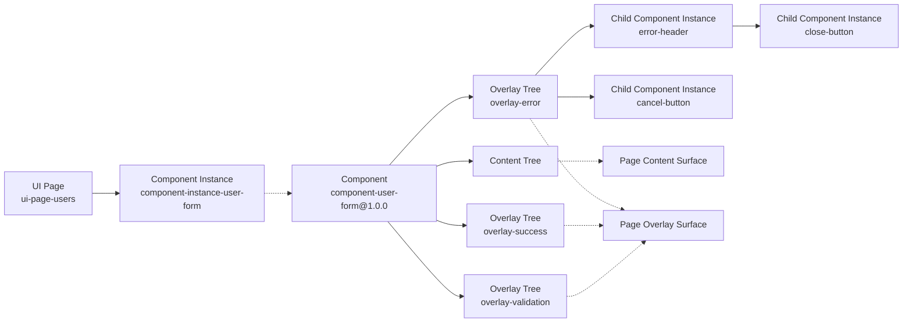
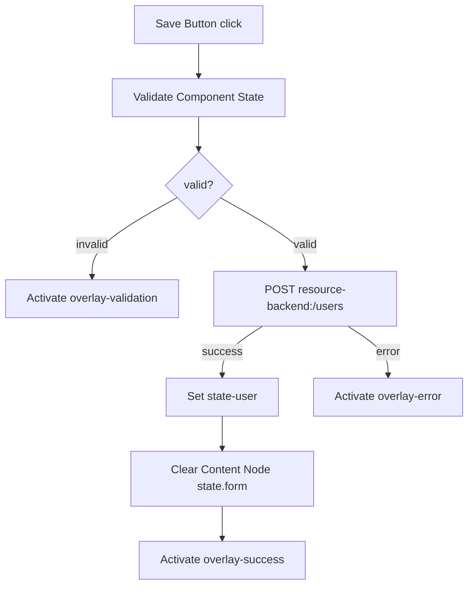
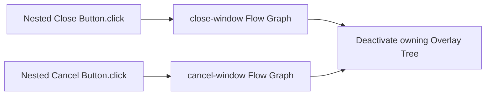
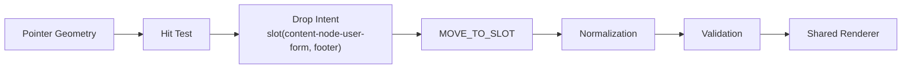
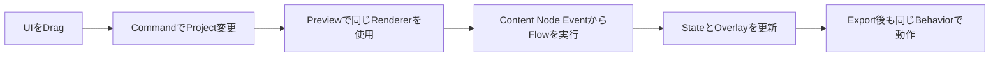
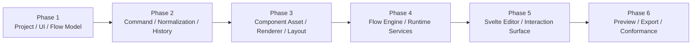
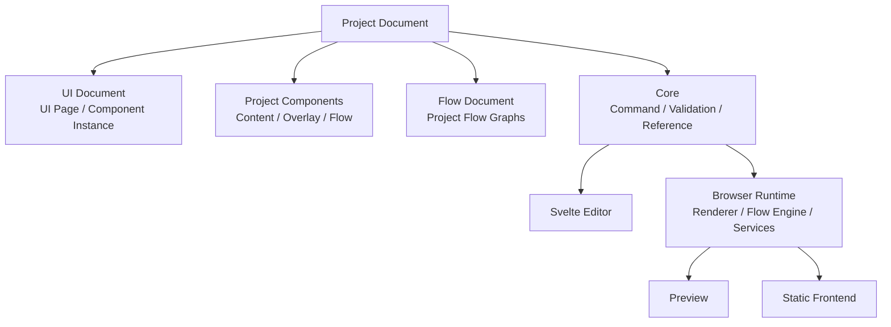

# Architecture: Examples, Roadmap, and Decisions

> [Architecture Index](./README.md) · Previous: [Export, Validation, and Integration](./09-export-validation-and-integration.md) · Next: [Index](./README.md)
>
> Covers: Section 19, Section 20, Section 21, Section 22

---

## 19. End-to-End Example

### 19.1 Project Map

```text
Project: project-user-app # User管理Application全体のSource of Truth
├─ UI Document # UI PageとComponent Instanceの配置を保持
│  └─ UI Page: ui-page-users # User管理画面を表すPage
│     └─ Component Instance: component-instance-user-form # Page直下へ配置したForm実体
│        └─ Component: component-user-form@1.0.0 # Instanceが利用する固定VersionのAsset
├─ Components # Imported SnapshotとProject固有Local Library
│  ├─ Imported Component: component-user-form@1.0.0 # Public Libraryから取り込んだ固定VersionのSnapshot
│  │  ├─ Content Tree # Page Content Surfaceへ投影する通常UI
│  │  │  └─ content-node-user-form # Form全体のRoot Content Node
│  │  │     ├─ state.form # 入力値とValidation状態の初期State
│  │  │     ├─ slots # Formが子へ提供するNamed Slot
│  │  │     │  ├─ fields # Input Componentの配置先
│  │  │     │  └─ footer # 操作Buttonの配置先
│  │  │     └─ children # Form内部へ配置した子Instance
│  │  │        ├─ component-instance-name-input [component = component-input@1.0.0, slotId = fields] # Name Input Instanceの配置
│  │  │        ├─ component-instance-email-input [component = component-input@1.0.0, slotId = fields] # Email Input Instanceの配置
│  │  │        └─ component-instance-save-button [component = component-button@1.0.0, slotId = footer] # Save Button Instanceの配置
│  │  ├─ Overlay Trees # Formが所有するOut-of-flow UI
│  │  │  ├─ overlay-validation # openTrigger = null
│  │  │  ├─ overlay-success # openTrigger = null
│  │  │  └─ overlay-error # Modal Template, openTrigger = null
│  │  │     └─ content-node-error-modal-window # Error Modal内部の親Content Node
│  │  │        ├─ slots # Windowが提供するNamed Slot
│  │  │        │  ├─ header # Header Componentの配置先
│  │  │        │  ├─ body # Error Messageの配置先
│  │  │        │  └─ footer # Cancel Buttonの配置先
│  │  │        └─ children # 各Slotへ配置した子Instance
│  │  │           ├─ component-instance-error-header [slotId = header] # Modal Headerの実体
│  │  │           ├─ component-instance-error-message [slotId = body] # Error Messageの実体
│  │  │           └─ component-instance-cancel-button [slotId = footer] # Cancel Buttonの実体
│  │  └─ Flow Graphs # User Form固有のBehavior
│  │     ├─ flow-save-user # ValidationとResource Requestを実行
│  │     ├─ flow-close-error-modal # HeaderのClose操作を処理
│  │     └─ flow-cancel-error-modal # FooterのCancel操作を処理
│  ├─ Imported Component: component-modal-header@1.0.0 # Modal Headerの再利用Asset
│  │  └─ Content Tree # Header内部の通常UI
│  │     └─ content-node-modal-header # Close Buttonを受け入れる親Content Node
│  │        ├─ slots # Headerが提供するNamed Slot
│  │        │  └─ close # Close Button専用の配置先
│  │        └─ children # Header内部へ配置した子Instance
│  │           └─ component-instance-close-button [slotId = close] # Close Buttonの実体
│  ├─ Imported Component: component-input@1.0.0 # NameとEmail Inputが利用するAsset
│  │  └─ Content Tree # Input内部の通常UI
│  │     └─ content-node-input # Input Component内のEvent Source
│  ├─ Imported Component: component-button@1.0.0 # Button UIを提供するAsset
│  │  └─ Content Tree # Button内部の通常UI
│  │     └─ content-node-button # Button Component内のclick Event Source
│  ├─ Imported Component: component-message@1.0.0 # Message表示を提供するAsset
│  │  └─ Content Tree # Message内部の通常UI
│  │     └─ content-node-message-text # 文字列をStable ID付きで保持するText Content Node
│  │        ├─ type = text # Text Content Nodeの固定種別
│  │        ├─ value = Literal String # Rendererが描画する固定文字列
│  │        ├─ slots = [] # TextはSlotを提供しない
│  │        └─ children = [] # Textは子を持たない
│  └─ Local Library: library-local # Project固有Componentを保存。Exampleでは空
├─ Flow Document # Project共通Behaviorを保持するDocument
│  └─ Flow Graphs # Project共通Flowだけを保持
├─ State # Application全体で共有するState Document
│  ├─ state-user # 保存後の選択User
│  └─ state-users # User一覧
└─ Resources # Applicationが利用する外部接続定義
   └─ resource-backend # User APIを提供するREST Resource
```

Form入力値とValidation状態はUser Form ComponentのContent Node Stateが持つ。保存済みUserとUser一覧はApplication Stateが持つ。

### 19.2 Logical OwnershipとRender Result



Overlayを表示してもComponent Instanceとの所有関係は変えない。

### 19.3 Save User Flow



このFlow GraphはUser Form Componentが所有する。実行時にComponent Instance PathをScopeへ加え、Local Content Node、Overlay Tree、Stateを解決する。

### 19.4 ModalとPopup Buttonの内部Component

```text
Modal Component # 外部Buttonとは未接続のOverlay専用Component
├─ contentTree = null # Page Content Surfaceへ描画する通常Contentはない
├─ overlayTrees # Modalが提供するOverlay Tree Collection
│  └─ modal # Windowを表すOverlay Tree
│     ├─ openTrigger = null # 利用側が後からOpen Triggerを接続する
│     ├─ positioning = viewport-center # WindowをViewport中央へ配置する
│     └─ Content Tree # Overlay Surfaceへ投影するVisual Structure
│        └─ Modal Window Content Node # Header、Body、Footerの親Node
│           ├─ slots # Windowが提供するNamed Slot
│           │  ├─ header # Header Componentの配置先
│           │  ├─ body # 本文Componentの配置先
│           │  └─ footer # 操作Button群の配置先
│           └─ children # Named Slotへ配置した子Instance
│              ├─ Modal Header Component Instance [slotId = header] # Headerの実体
│              │  └─ Modal Header Content Tree # Header内部のUI構造
│              │     └─ Header Content Node # Close Buttonを受け入れる親Node
│              │        ├─ slots # Headerが提供するNamed Slot
│              │        │  └─ close # Close Button専用の配置先
│              │        └─ children # Header内部へ配置した子Instance
│              │           └─ Close Button Component Instance [slotId = close] # Close EventのSource
│              ├─ Body Component Instance [slotId = body] # Modal本文の実体
│              │  └─ Body Content Tree # Body Component内部のUI構造
│              │     └─ Message Text Content Node # 本文を保持するLeaf Node
│              │        ├─ type = text # Text Content Nodeの固定種別
│              │        ├─ value = "処理を完了できませんでした" # 描画するLiteral String
│              │        ├─ slots = [] # TextはSlotを提供しない
│              │        └─ children = [] # Textは子を持たない
│              ├─ Cancel Button Component Instance [slotId = footer] # Cancel EventのSource
│              └─ Confirm Button Component Instance [slotId = footer] # Confirm EventのSource
└─ flowGraphs # Modal固有のBehaviorを保持するFlow Graph Collection
   ├─ close-window # HeaderのClose操作を処理するFlow Graph
   │  └─ Modal Header / Close Button.click # Nested Close ButtonのEvent Reference
   │     → Deactivate modal # 所有するModal Overlayを閉じるAction
   └─ cancel-window # FooterのCancel操作を処理するFlow Graph
      └─ Cancel Button.click # Cancel ButtonのEvent Reference
         → Deactivate modal # 所有するModal Overlayを閉じるAction

Popup Button Component # ButtonとPopup Open Triggerが接続済みのComponent
├─ contentTree # Page Content Surfaceへ描画するButton側のTree
│  └─ Button Host Content Node # Trigger Buttonを受け入れる親Node
│     ├─ slots # Button Hostが提供するNamed Slot
│     │  └─ trigger # Popupを開くButtonの配置先
│     └─ children # Button Host内部の子Instance
│        └─ Button Component Instance [slotId = trigger] # Popup Open EventのSource
├─ overlayTrees # Popup側のOverlay Tree Collection
│  └─ popup # Buttonから開くPopup Overlay
│     ├─ openTrigger = Button Component Instance.click # 内部Button clickとの初期接続
│     └─ Content Tree # Overlay Surfaceへ投影するUI構造
│        └─ Popup Window Content Node # Header、Body、Footerの親Node
│           ├─ slots # Popup Windowが提供するNamed Slot
│           │  ├─ header # Header Componentの配置先
│           │  ├─ body # 本文Componentの配置先
│           │  └─ footer # 操作Buttonの配置先
│           └─ children # Named Slotへ配置した子Instance
│              ├─ Header Component Instance [slotId = header] # Popup Headerの実体
│              ├─ Content Component Instance [slotId = body] # Popup本文の実体
│              └─ Close Button Component Instance [slotId = footer] # Close EventのSource
└─ flowGraphs # Popup固有のBehaviorを保持するFlow Graph Collection
   └─ close-popup # Close操作を処理するFlow Graph
      └─ Close Button.click # Close ButtonのEvent Reference
         → Deactivate popup # 所有するPopup Overlayを閉じるAction
```

Modalは配置しただけでは外部Buttonと紐づかないが、Window内部のHeader、Body、ButtonとClose / Cancel Flow GraphはComponentの一部として保持する。外部のButtonとOpen Triggerまで接続済みの部品が必要な場合だけPopup Buttonを選ぶ。

子の配置先は`header`、`body`、`footer`等の名前付きSlotで必ず明示する。Default Slotは使用しない。Body Content TreeのRootであるMessage Text Content Nodeは親を持たないため`slotId`を持たず、Raw StringではなくLeaf Nodeとして文字列を保持する。



Nested ComponentのReferenceはComponent Instance Pathで表す。

```text
component-instance-user-form # UI Page直下のRoot Instance
└─ component-instance-error-header # Error Modal内部のHeader Instance
   └─ component-instance-close-button # Header内部のClose Button Instance
```

### 19.5 Drag Operation

Save ButtonをUser Formの `footer` Slotへ移動する。



Pointer座標はProject Documentへ保存しない。

## 20. Delivery Scope and Roadmap

### 20.1 MVP

MVPはArchitecture Invariantを検証できる最小Vertical Sliceとする。

| Area | Included |
|---|---|
| Project Model | UI Document、UI Page、Component、Component Instance、Flow Document |
| Component Library | FlagShip Baseを含むInstalled Library、Project固有Local |
| Component | Content Tree 0..1、Overlay Tree 0..n、Flow Graph 0..n |
| UI | Container、Text、Button、Input、Card |
| Overlay Template | Modal、Snackbar |
| Layout | Vertical Stack、Horizontal Stack、Simple Grid、Named Slot |
| Drag | before、after、inside、slot、horizontal split |
| Flow Trigger | click、change、page.load |
| Flow Action | Resource Request、State Set、Overlay Activate/Deactivate、Navigate |
| Runtime | Renderer、Flow Engine、State Store、Resource Client、Page Overlay Manager |
| Editor | Layers、UI Canvas、Flow Canvas、Inspector、Preview、Undo/Redo |
| Export | HTTP(S) Static Hosting向けJavaScript Application |



### 20.2 Explicitly Out of MVP

```text
Responsive Breakpoint Editor
Public Library Publishing
Reusable Flow Authoring
OpenAPI Import
Flow Compiler
Advanced Type Checking
Parallel / Retry / For Each
Flow Debugger
Mock Profile Editor
WebSocket / SSE
Authentication Helper
Collaboration
Version History
Autosave
```

MVPではFlagShip Baseを含むInstalled Library Componentの取り込みと配置、およびProject内Local Componentの保存・編集を扱う。Local ComponentをPublic LibraryとしてPackaging・公開する機能は含めない。

### 20.3 Delivery Order



## 21. Decision and Invariant Index

設計判断の本文は各Canonical Sectionに置き、このIndexでは要点だけを参照する。

| Decision / Invariant | Canonical Section |
|---|---|
| Project DocumentをSource of Truthとする | [3.1](./02-core-principles.md#31-project-documentを唯一のapplication-source-of-truthとする)、[6.1](./04-project-document-model.md#61-project-documentを永続application-modelとする) |
| ComponentはUIとFlowを束ねる | [7.3](./05-ui-and-responsive-model.md#73-componentをuiとflowの再利用単位とする) |
| Installed LibraryとLocalの所有境界を分離する | [6.13](./04-project-document-model.md#613-component-assetをproject-modelへ統合する)、[16.1](./09-export-validation-and-integration.md#161-component-libraryとproject-component) |
| Component InstanceでLocal IDをScope化する | [7.4](./05-ui-and-responsive-model.md#74-component-instanceをpage配置の単位とする) |
| Content Treeは最大1つとする | [7.6](./05-ui-and-responsive-model.md#76-componentのcontent-treeは最大1つとする) |
| Overlay TreeへTriggerとPositioningを追加する | [7.7](./05-ui-and-responsive-model.md#77-overlay-treeはui-treeへtriggerとpositioningを追加する) |
| Modalは未接続、Popup Buttonは接続済みとする | [7.9](./05-ui-and-responsive-model.md#79-modalとpopup-buttonを分離する) |
| PageがRender Surfaceを所有する | [7.12](./05-ui-and-responsive-model.md#712-page単位でrender-surfaceを管理する) |
| StateとSlotはContent Nodeが持つ | [7.13](./05-ui-and-responsive-model.md#713-stateはcontent-nodeが持つ)、[7.14](./05-ui-and-responsive-model.md#714-slotはcontent-nodeだけが持つ) |
| Flow GraphとFlow Executionを分離する | [8.69](./06-flow-and-execution-model.md#869-persistent-flow-graphとruntime-flow-executionを分離する) |
| MutationをCommand / Transaction化する | [Section 11](./07-state-command-and-history.md#11-command-history-and-transactions) |
| PreviewとProductionで同一Semanticsを使う | [17.1](./08-editor-preview-and-debugging.md#171-runtime-equivalence) |
| Generated ApplicationへSecretを含めない | [13.4](./09-export-validation-and-integration.md#134-security-boundary) |

## 22. Final Architecture Summary



FlagShipは、UI Structure、Flow、State、ResourceをCanonical Project Documentとして保持し、Editor、Preview、Exportで同じSemanticsを実行するVisual Application Builderとして設計する。

---

Previous: [Export, Validation, and Integration](./09-export-validation-and-integration.md) · [Architecture Index](./README.md) · Next: [Index](./README.md)
