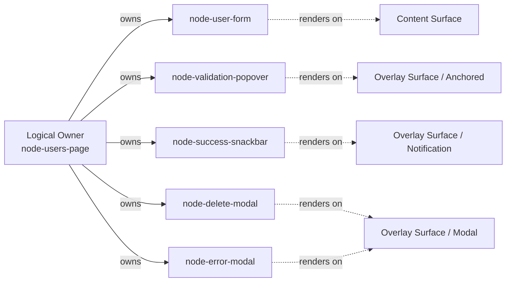
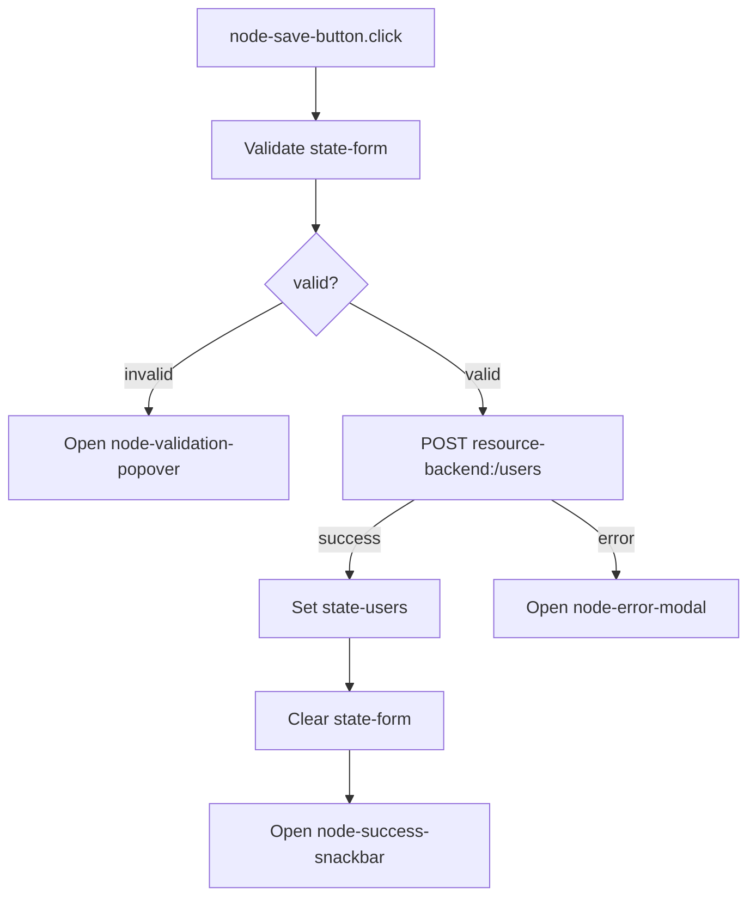
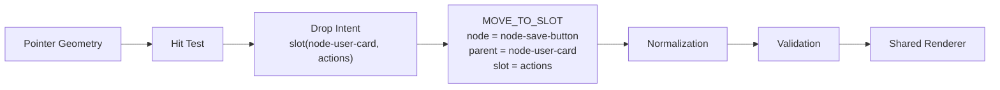
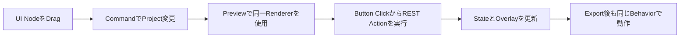
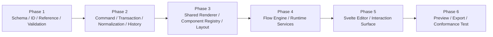
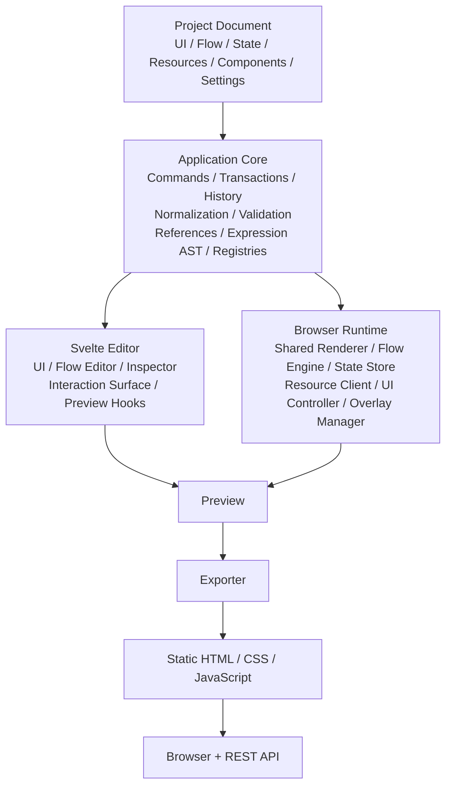

# Architecture: Examples, Roadmap, and Decisions

> [Architecture Index](./README.md) · Previous: [Export, Validation, and Integration](./09-export-validation-and-integration.md) · Next: [Index](./README.md)
>
> Covers: Section 19, Section 20, Section 21, Section 22

---

## 19. End-to-End Example

以下は、[Sections 6〜18](./README.md#1-document-map)の責務を1つのUser Management Applicationへ接続した例である。

### 19.1 Project Map

```text
Project: project-user-app
├─ UI Document
│  └─ node-users-page
│     ├─ node-header
│     ├─ node-user-form
│     │  ├─ node-name-input
│     │  ├─ node-email-input
│     │  └─ node-actions
│     │     ├─ node-cancel-button
│     │     └─ node-save-button
│     ├─ node-user-table
│     ├─ node-validation-popover [overlay.anchored]
│     ├─ node-success-snackbar [overlay.notification]
│     ├─ node-delete-modal [overlay.modal]
│     └─ node-error-modal [overlay.modal]
├─ State
│  ├─ state-form
│  ├─ state-user
│  └─ state-users
├─ Resources
│  └─ resource-backend
└─ Flows
   ├─ flow-save-user
   └─ flow-delete-user
```

### 19.2 Logical OwnershipとRender Result



Overlay表示後も `parentId` は変更しない。

### 19.3 Save User Flow



FlowはUI NodeをStable ID、APIをResource ID、DataをStructured Referenceで参照する。

### 19.4 Drag Operation

SaveButtonをUserCardの `actions` Slotへ移動する。



Pointer座標はProject Documentへ保存しない。

### 19.5 Horizontal Split

```text
Before
└─ node-page-stack
   ├─ node-card-a
   ├─ node-card-b
   └─ node-card-c

Drop Intent
└─ split-right(node-card-b, node-card-a)

After
└─ node-page-stack
   ├─ node-generated-horizontal-stack
   │  ├─ node-card-b
   │  └─ node-card-a
   └─ node-card-c
```

生成Containerには `generatedBy` 等のMetadataを持たせ、NormalizerがExplicit Containerと区別できるようにする。

---

## 20. Delivery Scope and Roadmap

MVPはArchitecture Invariantを検証できる最小Vertical Sliceとする。

### 20.1 MVP

| Area | Included |
|---|---|
| UI | Page、Container、Text、Button、Input、Card、Modal、Snackbar |
| Layout | Vertical Stack、Horizontal Stack、Simple Grid、Named Slot |
| Drag | before、after、inside、slot、horizontal split |
| Flow Trigger | click、change、page.load |
| Flow Action | Resource Request、State Set、Modal Open/Close、Snackbar Open、Navigate |
| Logic | Condition |
| Runtime | Renderer、Flow Engine、State Store、Resource Client、Overlay Manager、Expression Evaluator |
| Editor | UI Canvas、Layer Tree、Inspector、Flow Editor、Preview、Undo/Redo |
| Export | HTTP(S) Static Hosting向けJavaScript Application |

MVPのEnd-to-End Acceptance Scenario:



### 20.2 Explicitly Out of MVP

```text
Responsive Breakpoint Editor
Reusable Component Authoring
Reusable Flow Authoring
OpenAPI Import
Flow Compiler
Advanced Type Checking
Parallel / Retry / For Each
Flow Debugger
Mock Profile Editor
WebSocket / SSE
Authentication Helper
Collaboration
Version History
Autosave
```

Schema上の拡張点を確保することと、MVPでEditor UIやRuntime実装を提供することを区別する。

### 20.3 Delivery Order



UIだけを先に作り、後からCanonical Modelへ合わせる進め方を避ける。

---

## 21. Decision and Invariant Index

設計判断の規範本文は各Canonical Sectionに置き、このIndexでは重複定義しない。

| Decision / Invariant | Canonical Section |
|---|---|
| Project DocumentをSource of Truthとする | [3.1](./02-core-principles.md#31-project-documentを唯一のapplication-source-of-truthとする)、[6.1](./04-project-document-model.md#61-project-documentを永続application-modelとする) |
| Drag GeometryとPersistent Layoutを分離する | [3.4](./02-core-principles.md#34-drag-geometryとapplication-layoutを分離する)、[7.25〜7.27](./05-ui-and-responsive-model.md#725-drag--dropをdrop-intentへ変換する) |
| Logical OwnershipとRender Surfaceを分離する | [3.8](./02-core-principles.md#38-logical-ownershipとphysical-renderingを分離する)、[7.28〜7.32](./05-ui-and-responsive-model.md#728-presentationをstructureから分離する) |
| Stable IDでReferenceを解決する | [3.14](./02-core-principles.md#314-ui-node-idを安定referenceとして使用する)、[6.5](./04-project-document-model.md#65-stable-idをproject全体のreference基盤とする)、[7.3](./05-ui-and-responsive-model.md#73-ui-node-idをstable-referenceとする)、[8.4・8.6](./06-flow-and-execution-model.md#84-flow-idをstable-referenceとする) |
| Component Private DOMへ外部からAccessしない | [3.11](./02-core-principles.md#311-component内部実装を外部から操作しない)、[7.9](./05-ui-and-responsive-model.md#79-component-public-contractをui-documentの境界とする)、[16.1](./09-export-validation-and-integration.md#161-component-registry) |
| Project MutationをCommand / Transaction化する | [3.22〜3.23](./02-core-principles.md#322-すべてのproject変更をcommandまたはtransactionとして扱う)、[6.20〜6.21](./04-project-document-model.md#620-project-mutationはcommand経由とする)、[Section 11](./07-state-command-and-history.md#11-command-history-and-transactions) |
| NormalizerがSemantic Boundaryを破壊しない | [3.25](./02-core-principles.md#325-normalizerが削除統合してはいけないboundaryを定義する)、[6.24](./04-project-document-model.md#624-semantic-boundaryをnormalizationから保護する)、[7.37〜7.39](./05-ui-and-responsive-model.md#737-component-instance-boundaryをsemantic-boundaryとする) |
| FlowをStructured Graphとして保持する | [3.15](./02-core-principles.md#315-flowはuiから独立したstructured-graphとする)、[8.3](./06-flow-and-execution-model.md#83-flowを独立したstructured-graphとして保持する) |
| EditorとProductionで同一Semanticsを使う | [3.6](./02-core-principles.md#36-editorとproductionは同じrendering-ruleを使用する)、[5.21](./03-technology-and-system-architecture.md#521-previewはproduction-runtime-coreを利用する)、[8.73](./06-flow-and-execution-model.md#873-previewとproductionで同一flow-runtime-semanticsを使用する) |
| Generated ApplicationへSecretを含めない | [3.31](./02-core-principles.md#331-secretをclient-projectへ保持しない)、[6.15](./04-project-document-model.md#615-environment値とsecretを区別する)、[13.4](./09-export-validation-and-integration.md#134-security-boundary) |
| Initial Flow RuntimeはInterpreter方式とする | [8.75](./06-flow-and-execution-model.md#875-初期flow-runtimeはinterpreter方式を基本とする) |
| Generated ApplicationへEditor Runtimeを含めない | [4.15](./03-technology-and-system-architecture.md#415-generated-applicationは自己完結したbrowser-applicationとする)、[13.1](./09-export-validation-and-integration.md#131-export-artifact) |

新しい章で上記判断を再掲する場合は、別のRuleを作らずCanonical SectionへReferenceする。

---

## 22. Final Architecture Summary



本システムは、Canvas上の見た目をHTMLへ変換するだけのDesign Toolではない。

> **UI Structure、Application Behavior、State、ResourceをCanonical Project Documentとして保持し、Editor・Preview・Exportで同じSemanticsを実行するVisual Application Builder**

として設計する。

---

Previous: [Export, Validation, and Integration](./09-export-validation-and-integration.md) · [Architecture Index](./README.md) · Next: [Index](./README.md)
