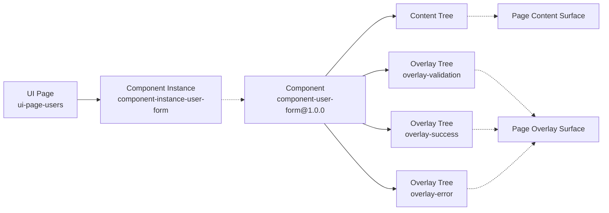
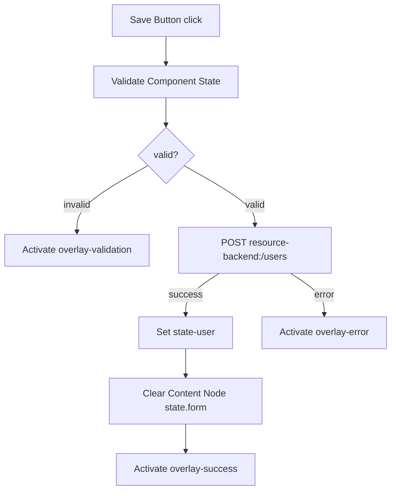
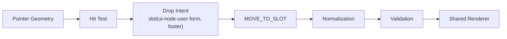
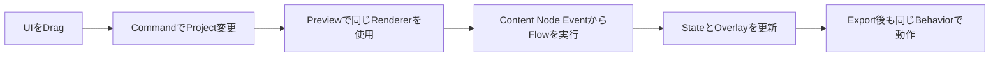
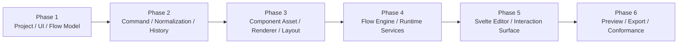
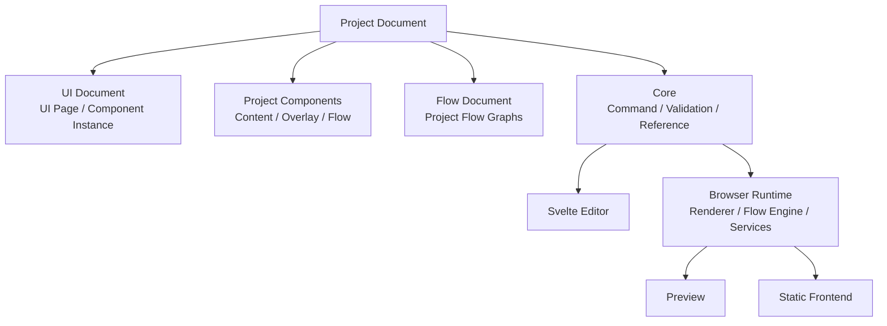

# Architecture: Examples, Roadmap, and Decisions

> [Architecture Index](./README.md) · Previous: [Export, Validation, and Integration](./09-export-validation-and-integration.md) · Next: [Index](./README.md)
>
> Covers: Section 19, Section 20, Section 21, Section 22

---

## 19. End-to-End Example

### 19.1 Project Map

```text
Project: project-user-app
├─ UI Document
│  └─ UI Page: ui-page-users
│     └─ Component Instance: component-instance-user-form
│        └─ Component: component-user-form@1.0.0
├─ Components
│  └─ Component: component-user-form@1.0.0
│     ├─ Content Tree
│     │  └─ ui-node-user-form
│     │     ├─ state.form
│     │     ├─ slots.fields
│     │     │  ├─ ui-node-name-input
│     │     │  └─ ui-node-email-input
│     │     └─ slots.footer
│     │        └─ ui-node-save-button
│     ├─ Overlay Trees
│     │  ├─ overlay-validation # openTrigger = null
│     │  ├─ overlay-success # openTrigger = null
│     │  └─ overlay-error # Modal Template, openTrigger = null
│     └─ Flow Graphs
│        └─ flow-save-user
├─ Flow Document
│  └─ Flow Graphs # Project共通Flowだけを保持
├─ State
│  ├─ state-user
│  └─ state-users
└─ Resources
   └─ resource-backend
```

Form入力値とValidation状態はUser Form ComponentのContent Node Stateが持つ。保存済みUserとUser一覧はApplication Stateが持つ。

### 19.2 Logical OwnershipとRender Result



Overlayを表示してもComponent Instanceとの所有関係は変えない。

### 19.3 Save User Flow



このFlow GraphはUser Form Componentが所有する。実行時にComponent Instance IDをScopeへ加え、Local Content Node、Overlay Tree、Stateを解決する。

### 19.4 ModalとPopup Button

```text
Modal Component
├─ contentTree
├─ overlayTrees
│  └─ modal
│     └─ openTrigger = null
└─ flowGraphs

Popup Button Component
├─ contentTree
│  └─ button
├─ overlayTrees
│  └─ popup
│     └─ openTrigger = button.click
└─ flowGraphs
   └─ activate-popup
```

Modalは配置しただけではButtonと紐づかない。Buttonと接続済みの部品が必要な場合だけPopup Buttonを選ぶ。

### 19.5 Drag Operation

Save ButtonをUser Formの `footer` Slotへ移動する。



Pointer座標はProject Documentへ保存しない。

## 20. Delivery Scope and Roadmap

### 20.1 MVP

MVPはArchitecture Invariantを検証できる最小Vertical Sliceとする。

| Area | Included |
|---|---|
| Project Model | UI Document、UI Page、Component、Component Instance、Flow Document |
| Component | Content Tree 0..1、Overlay Tree 0..n、Flow Graph 0..n |
| UI | Container、Text、Button、Input、Card |
| Overlay Template | Modal、Snackbar |
| Layout | Vertical Stack、Horizontal Stack、Simple Grid、Named Slot |
| Drag | before、after、inside、slot、horizontal split |
| Flow Trigger | click、change、page.load |
| Flow Action | Resource Request、State Set、Overlay Activate/Deactivate、Navigate |
| Runtime | Renderer、Flow Engine、State Store、Resource Client、Page Overlay Manager |
| Editor | Layers、UI Canvas、Flow Canvas、Inspector、Preview、Undo/Redo |
| Export | HTTP(S) Static Hosting向けJavaScript Application |



### 20.2 Explicitly Out of MVP

```text
Responsive Breakpoint Editor
Reusable Component Authoring
Reusable Flow Authoring
OpenAPI Import
Flow Compiler
Advanced Type Checking
Parallel / Retry / For Each
Flow Debugger
Mock Profile Editor
WebSocket / SSE
Authentication Helper
Collaboration
Version History
Autosave
```

MVPでは既存Componentの取り込みと配置を扱う。新しいReusable ComponentをEditor上でAuthoringする機能は含めない。

### 20.3 Delivery Order



## 21. Decision and Invariant Index

設計判断の本文は各Canonical Sectionに置き、このIndexでは要点だけを参照する。

| Decision / Invariant | Canonical Section |
|---|---|
| Project DocumentをSource of Truthとする | [3.1](./02-core-principles.md#31-project-documentを唯一のapplication-source-of-truthとする)、[6.1](./04-project-document-model.md#61-project-documentを永続application-modelとする) |
| ComponentはUIとFlowを束ねる | [7.3](./05-ui-and-responsive-model.md#73-componentをuiとflowの再利用単位とする) |
| Component InstanceでLocal IDをScope化する | [7.4](./05-ui-and-responsive-model.md#74-component-instanceをpage配置の単位とする) |
| Content Treeは最大1つとする | [7.6](./05-ui-and-responsive-model.md#76-componentのcontent-treeは最大1つとする) |
| Overlay TreeへTriggerとPositioningを追加する | [7.7](./05-ui-and-responsive-model.md#77-overlay-treeはui-treeへtriggerとpositioningを追加する) |
| Modalは未接続、Popup Buttonは接続済みとする | [7.9](./05-ui-and-responsive-model.md#79-modalとpopup-buttonを分離する) |
| PageがRender Surfaceを所有する | [7.12](./05-ui-and-responsive-model.md#712-page単位でrender-surfaceを管理する) |
| StateとSlotはContent Nodeが持つ | [7.13](./05-ui-and-responsive-model.md#713-stateはcontent-nodeが持つ)、[7.14](./05-ui-and-responsive-model.md#714-slotはcontent-nodeだけが持つ) |
| Flow GraphとFlow Executionを分離する | [8.69](./06-flow-and-execution-model.md#869-persistent-flow-graphとruntime-flow-executionを分離する) |
| MutationをCommand / Transaction化する | [Section 11](./07-state-command-and-history.md#11-command-history-and-transactions) |
| PreviewとProductionで同一Semanticsを使う | [17.1](./08-editor-preview-and-debugging.md#171-runtime-equivalence) |
| Generated ApplicationへSecretを含めない | [13.4](./09-export-validation-and-integration.md#134-security-boundary) |

## 22. Final Architecture Summary



FlagShipは、UI Structure、Flow、State、ResourceをCanonical Project Documentとして保持し、Editor、Preview、Exportで同じSemanticsを実行するVisual Application Builderとして設計する。

---

Previous: [Export, Validation, and Integration](./09-export-validation-and-integration.md) · [Architecture Index](./README.md) · Next: [Index](./README.md)
