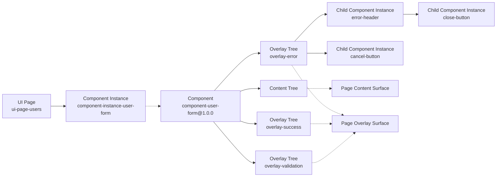
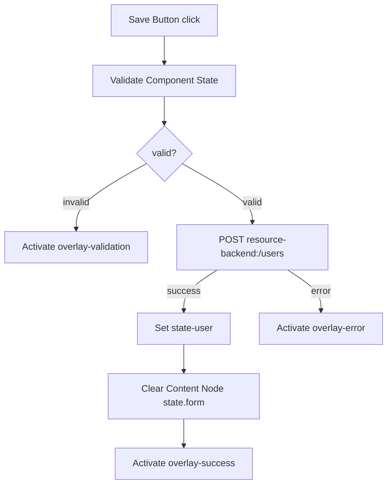
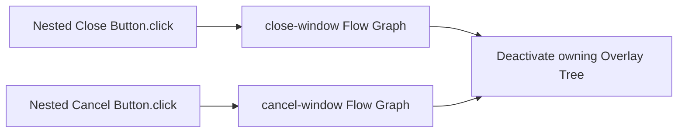
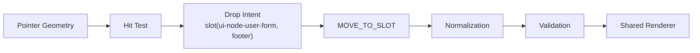
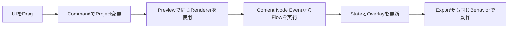
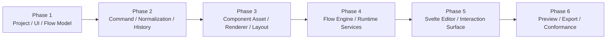
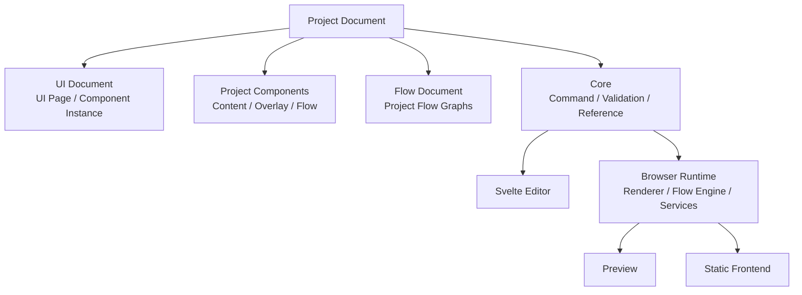

# Architecture: Examples, Roadmap, and Decisions

> [Architecture Index](./README.md) · Previous: [Export, Validation, and Integration](./09-export-validation-and-integration.md) · Next: [Index](./README.md)
>
> Covers: Section 19, Section 20, Section 21, Section 22

---

## 19. End-to-End Example

### 19.1 Project Map

```text
Project: project-user-app
├─ UI Document
│  └─ UI Page: ui-page-users
│     └─ Component Instance: component-instance-user-form
│        └─ Component: component-user-form@1.0.0
├─ Components
│  ├─ Component: component-user-form@1.0.0
│  │  ├─ Content Tree
│  │  │  └─ ui-node-user-form
│  │  │     ├─ state.form
│  │  │     ├─ slots
│  │  │     │  ├─ fields
│  │  │     │  └─ footer
│  │  │     └─ children
│  │  │        ├─ ui-node-name-input [slotId = fields]
│  │  │        ├─ ui-node-email-input [slotId = fields]
│  │  │        └─ ui-node-save-button [slotId = footer]
│  │  ├─ Overlay Trees
│  │  │  ├─ overlay-validation # openTrigger = null
│  │  │  ├─ overlay-success # openTrigger = null
│  │  │  └─ overlay-error # Modal Template, openTrigger = null
│  │  │     └─ Modal Window Content Node
│  │  │        ├─ slots
│  │  │        │  ├─ header
│  │  │        │  ├─ body
│  │  │        │  └─ footer
│  │  │        └─ children
│  │  │           ├─ component-instance-error-header [slotId = header]
│  │  │           ├─ component-instance-error-message [slotId = body]
│  │  │           └─ component-instance-cancel-button [slotId = footer]
│  │  └─ Flow Graphs
│  │     ├─ flow-save-user
│  │     ├─ flow-close-error-modal
│  │     └─ flow-cancel-error-modal
│  ├─ Component: component-modal-header@1.0.0
│  │  └─ Content Tree
│  │     └─ Header Content Node
│  │        ├─ slots
│  │        │  └─ close
│  │        └─ children
│  │           └─ component-instance-close-button [slotId = close]
│  ├─ Component: component-button@1.0.0
│  └─ Component: component-message@1.0.0
│     └─ Content Tree
│        └─ message-text # Text Content Node
│           ├─ type = text
│           ├─ value = Literal String
│           ├─ slots = []
│           └─ children = []
├─ Flow Document
│  └─ Flow Graphs # Project共通Flowだけを保持
├─ State
│  ├─ state-user
│  └─ state-users
└─ Resources
   └─ resource-backend
```

Form入力値とValidation状態はUser Form ComponentのContent Node Stateが持つ。保存済みUserとUser一覧はApplication Stateが持つ。

### 19.2 Logical OwnershipとRender Result



Overlayを表示してもComponent Instanceとの所有関係は変えない。

### 19.3 Save User Flow



このFlow GraphはUser Form Componentが所有する。実行時にComponent Instance IDをScopeへ加え、Local Content Node、Overlay Tree、Stateを解決する。

### 19.4 ModalとPopup Buttonの内部Component

```text
Modal Component
├─ contentTree = null
├─ overlayTrees
│  └─ modal
│     ├─ openTrigger = null
│     ├─ positioning = viewport-center
│     └─ Content Tree
│        └─ Modal Window Content Node
│           ├─ slots
│           │  ├─ header
│           │  ├─ body
│           │  └─ footer
│           └─ children
│              ├─ Modal Header Component Instance [slotId = header]
│              │  └─ Modal Header Content Tree
│              │     └─ Header Content Node
│              │        ├─ slots
│              │        │  └─ close
│              │        └─ children
│              │           └─ Close Button Component Instance [slotId = close]
│              ├─ Body Component Instance [slotId = body]
│              │  └─ Body Content Tree
│              │     └─ Message Text Content Node
│              │        ├─ type = text
│              │        ├─ value = "処理を完了できませんでした"
│              │        ├─ slots = []
│              │        └─ children = []
│              ├─ Cancel Button Component Instance [slotId = footer]
│              └─ Confirm Button Component Instance [slotId = footer]
└─ flowGraphs
   ├─ close-window
   │  └─ Modal Header / Close Button.click
   │     → Deactivate modal
   └─ cancel-window
      └─ Cancel Button.click
         → Deactivate modal

Popup Button Component
├─ contentTree
│  └─ Button Host Content Node
│     ├─ slots
│     │  └─ trigger
│     └─ children
│        └─ Button Component Instance [slotId = trigger]
├─ overlayTrees
│  └─ popup
│     ├─ openTrigger = Button Component Instance.click
│     └─ Content Tree
│        └─ Popup Window Content Node
│           ├─ slots
│           │  ├─ header
│           │  ├─ body
│           │  └─ footer
│           └─ children
│              ├─ Header Component Instance [slotId = header]
│              ├─ Content Component Instance [slotId = body]
│              └─ Close Button Component Instance [slotId = footer]
└─ flowGraphs
   └─ close-popup
      └─ Close Button.click
         → Deactivate popup
```

Modalは配置しただけでは外部Buttonと紐づかないが、Window内部のHeader、Body、ButtonとClose / Cancel Flow GraphはComponentの一部として保持する。外部のButtonとOpen Triggerまで接続済みの部品が必要な場合だけPopup Buttonを選ぶ。

子の配置先は`header`、`body`、`footer`等の名前付きSlotで必ず明示する。Default Slotは使用しない。Body Content TreeのRootであるMessage Text Content Nodeは親を持たないため`slotId`を持たず、Raw StringではなくLeaf Nodeとして文字列を保持する。



Nested ComponentのReferenceはComponent Instance Pathで表す。

```text
component-instance-user-form
└─ component-instance-error-header
   └─ component-instance-close-button
```

### 19.5 Drag Operation

Save ButtonをUser Formの `footer` Slotへ移動する。



Pointer座標はProject Documentへ保存しない。

## 20. Delivery Scope and Roadmap

### 20.1 MVP

MVPはArchitecture Invariantを検証できる最小Vertical Sliceとする。

| Area | Included |
|---|---|
| Project Model | UI Document、UI Page、Component、Component Instance、Flow Document |
| Component | Content Tree 0..1、Overlay Tree 0..n、Flow Graph 0..n |
| UI | Container、Text、Button、Input、Card |
| Overlay Template | Modal、Snackbar |
| Layout | Vertical Stack、Horizontal Stack、Simple Grid、Named Slot |
| Drag | before、after、inside、slot、horizontal split |
| Flow Trigger | click、change、page.load |
| Flow Action | Resource Request、State Set、Overlay Activate/Deactivate、Navigate |
| Runtime | Renderer、Flow Engine、State Store、Resource Client、Page Overlay Manager |
| Editor | Layers、UI Canvas、Flow Canvas、Inspector、Preview、Undo/Redo |
| Export | HTTP(S) Static Hosting向けJavaScript Application |



### 20.2 Explicitly Out of MVP

```text
Responsive Breakpoint Editor
Reusable Component Authoring
Reusable Flow Authoring
OpenAPI Import
Flow Compiler
Advanced Type Checking
Parallel / Retry / For Each
Flow Debugger
Mock Profile Editor
WebSocket / SSE
Authentication Helper
Collaboration
Version History
Autosave
```

MVPでは既存Componentの取り込みと配置を扱う。新しいReusable ComponentをEditor上でAuthoringする機能は含めない。

### 20.3 Delivery Order



## 21. Decision and Invariant Index

設計判断の本文は各Canonical Sectionに置き、このIndexでは要点だけを参照する。

| Decision / Invariant | Canonical Section |
|---|---|
| Project DocumentをSource of Truthとする | [3.1](./02-core-principles.md#31-project-documentを唯一のapplication-source-of-truthとする)、[6.1](./04-project-document-model.md#61-project-documentを永続application-modelとする) |
| ComponentはUIとFlowを束ねる | [7.3](./05-ui-and-responsive-model.md#73-componentをuiとflowの再利用単位とする) |
| Component InstanceでLocal IDをScope化する | [7.4](./05-ui-and-responsive-model.md#74-component-instanceをpage配置の単位とする) |
| Content Treeは最大1つとする | [7.6](./05-ui-and-responsive-model.md#76-componentのcontent-treeは最大1つとする) |
| Overlay TreeへTriggerとPositioningを追加する | [7.7](./05-ui-and-responsive-model.md#77-overlay-treeはui-treeへtriggerとpositioningを追加する) |
| Modalは未接続、Popup Buttonは接続済みとする | [7.9](./05-ui-and-responsive-model.md#79-modalとpopup-buttonを分離する) |
| PageがRender Surfaceを所有する | [7.12](./05-ui-and-responsive-model.md#712-page単位でrender-surfaceを管理する) |
| StateとSlotはContent Nodeが持つ | [7.13](./05-ui-and-responsive-model.md#713-stateはcontent-nodeが持つ)、[7.14](./05-ui-and-responsive-model.md#714-slotはcontent-nodeだけが持つ) |
| Flow GraphとFlow Executionを分離する | [8.69](./06-flow-and-execution-model.md#869-persistent-flow-graphとruntime-flow-executionを分離する) |
| MutationをCommand / Transaction化する | [Section 11](./07-state-command-and-history.md#11-command-history-and-transactions) |
| PreviewとProductionで同一Semanticsを使う | [17.1](./08-editor-preview-and-debugging.md#171-runtime-equivalence) |
| Generated ApplicationへSecretを含めない | [13.4](./09-export-validation-and-integration.md#134-security-boundary) |

## 22. Final Architecture Summary



FlagShipは、UI Structure、Flow、State、ResourceをCanonical Project Documentとして保持し、Editor、Preview、Exportで同じSemanticsを実行するVisual Application Builderとして設計する。

---

Previous: [Export, Validation, and Integration](./09-export-validation-and-integration.md) · [Architecture Index](./README.md) · Next: [Index](./README.md)
