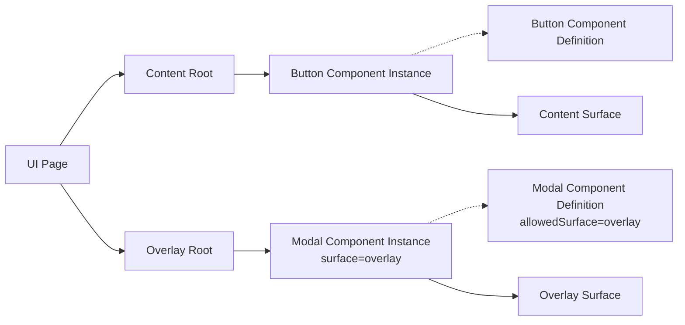
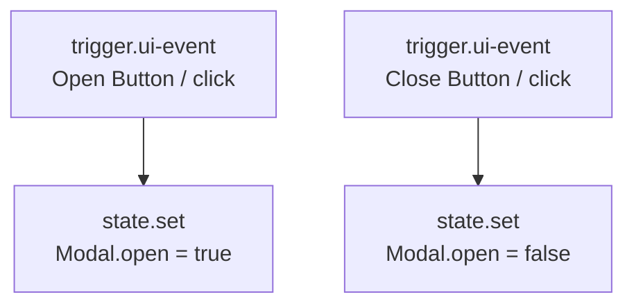
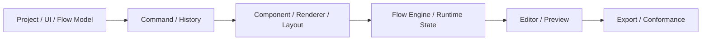
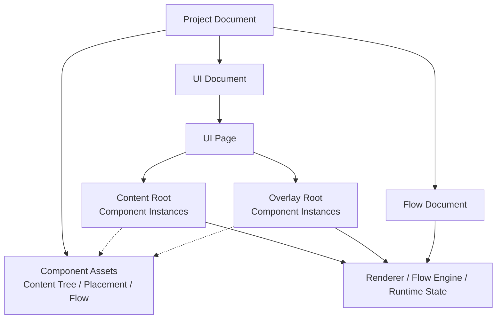

# Architecture: Examples, Roadmap, and Decisions

> [Architecture Index](./README.md) · Previous: [Export, Validation, and Integration](./09-export-validation-and-integration.md) · Next: [Index](./README.md)
>
> Covers: Section 19, Section 20, Section 21, Section 22

---

## 19. End-to-End Example

### 19.1 ButtonからModalを開閉するProject

```text
Project: project-user-app # Application全体のSource of Truth
├─ UI Document
│  └─ UI Page: ui-page-users
│     ├─ Content Root
│     │  └─ Button Component Instance: component-instance-open
│     └─ Overlay Root
│        └─ Modal Component Instance: component-instance-modal
│           ├─ surface = overlay # Overlay Root直下であることを明示
│           ├─ overlay.alignment = center # 画面中央へ配置
│           ├─ overlay.contentBlock = true # 背景幕で背面操作を遮る
│           ├─ state[content-node-modal].open = false # 初期表示状態
│           └─ Footer Named Slot
│              └─ Button Component Instance: component-instance-close
├─ Components
│  ├─ Button Component # 単一Content Treeを持つ
│  └─ Modal Component # 単一Content TreeとallowedSurface=overlayを持つ
└─ Flow Document
   ├─ Open Modal
   │  └─ Open Button.click → state.set Modal.open = true
   └─ Close Modal
      └─ Close Button.click → state.set Modal.open = false
```

Modalは別のOverlay実体に包まれない。LibraryのModal Component、Page上のModal Component Instance、Modal Root UI Nodeの`open` Stateをそれぞれ1つだけ持つ。

### 19.2 Logical OwnershipとRender Result



Content RootとOverlay Rootは同じComponent Instance形式を所有する。違いは配置先SurfaceとOverlay表示設定だけである。

### 19.3 Modal Flow



Flow Graphは各Component InstanceをGraph Local Variableへ登録し、UI Node IDとState Fieldを指定する。FlowはModalの配置Surfaceを参照しない。

### 19.4 Modal Component

```text
Modal Component
├─ id / name / version
├─ allowedSurface = overlay # Overlay Root直下だけに配置できる
├─ contentTree # Modalの単一UI Tree
│  └─ Modal Window UI Node
│     ├─ state.open # 表示状態
│     ├─ Header Named Slot
│     ├─ Content Named Slot
│     └─ Footer Named Slot
└─ flowGraphs # 必要なComponent固有Flow。0個以上
```

Modalは外部Buttonと初期接続しない。利用側がProject Flowで任意のButtonと接続する。Default Slotは使用せず、子Component Instanceの配置先をNamed Slotで明示する。

## 20. Delivery Scope and Roadmap

### 20.1 MVP

| Area | Included |
|---|---|
| Project Model | UI Document、UI Page、Component、Component Instance、Flow Document |
| Component Library | FlagShip Baseを含むInstalled Library、Project固有Local |
| Component | Content Tree 1、配置制約、Flow Graph 0..n |
| UI | Container、Text、Button、Input、Card、Modal |
| Overlay | Component InstanceのSurface、9点Alignment、Content Block |
| Layout | Vertical Stack、Horizontal Stack、Simple Grid、Named Slot |
| Flow Trigger | click、page-load、schedule |
| Flow Action | State Set |
| Runtime | Renderer、Flow Engine、State Store |
| Editor | Library、Layers、Canvas、Flow、Inspector、Preview |

### 20.2 Explicitly Out of MVP

```text
Responsive Breakpoint Editor
Public Library Publishing
Reusable Flow Authoring
OpenAPI Import
Flow Compiler
Advanced Type Checking
Parallel / Retry / For Each
Flow Debugger
Mock Profile Editor
WebSocket / SSE
Authentication Helper
Collaboration
Version History
Autosave
```

### 20.3 Delivery Order



## 21. Decision and Invariant Index

| Decision / Invariant | Canonical Section |
|---|---|
| Project DocumentをSource of Truthとする | [3.1](./02-core-principles.md#31-project-documentを唯一のapplication-source-of-truthとする) |
| Componentは単一Content TreeとFlowを束ねる | [7.3](./05-ui-and-responsive-model.md#73-component-definitionはlibraryだけが持つ) |
| Content／Overlay Rootは同じComponent Instance形式を使う | [7.2](./05-ui-and-responsive-model.md#72-ui-pageは2つのrootを持つ) |
| OverlayはComponent Instanceの配置方法である | [7.7](./05-ui-and-responsive-model.md#77-overlayはcomponent-instanceの配置方法である) |
| Modalの表示状態はUI Node Stateで管理する | [7.9](./05-ui-and-responsive-model.md#79-overlayの表示状態はui-node-stateで管理する) |
| Default Slotを禁止する | [7.6](./05-ui-and-responsive-model.md#76-named-slotだけを子instanceの挿入先にする) |
| FlowはComponent Instance Variableを介してUIを参照する | [8](./06-flow-and-execution-model.md#8-flow-document-model) |
| PreviewとProductionで同一Semanticsを使う | [17.1](./08-editor-preview-and-debugging.md#171-runtime-equivalence) |

## 22. Final Architecture Summary


