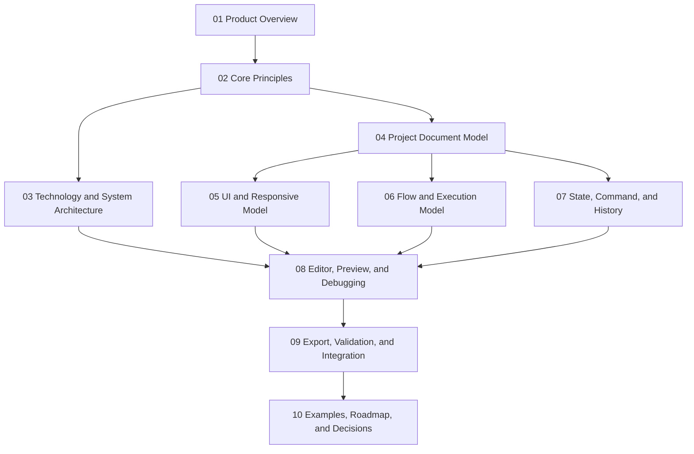

# Architecture Index

> Status: Draft / Architecture Baseline
>
> Project: [FlagShip README](../../README.md)

## 1. Document Map

Architecture本文は、次の10個のDomain別ファイルで構成する。章番号は全ファイルを通して既存の`1`〜`22`を維持する。

- [01 Product Overview](./01-product-overview.md) — Sections 1–2
  - Productの目的、代表Application、Product Concept
- [02 Core Principles](./02-core-principles.md) — Section 3
  - Source of Truth、Ownership、Contract、Mutation、Normalization
- [03 Technology and System Architecture](./03-technology-and-system-architecture.md) — Sections 4–5
  - Technology selection、Layer、Module、Runtime path
- [04 Project Document Model](./04-project-document-model.md) — Section 6
  - Project全体のCanonical Schema、Reference、Migration
- [05 UI and Responsive Model](./05-ui-and-responsive-model.md) — Sections 7, 9
  - UI Document、Slot、Overlay、Responsive Layout
- [06 Flow and Execution Model](./06-flow-and-execution-model.md) — Sections 8, 15
  - Flow graph、Expression、Execution Context、Runtime
- [07 State, Command, and History](./07-state-command-and-history.md) — Sections 10–11
  - State scope、Command、Undo / Redo
- [08 Editor, Preview, and Debugging](./08-editor-preview-and-debugging.md) — Sections 12, 17
  - Editor lifecycle、Preview parity、Debugging
- [09 Export, Validation, and Integration](./09-export-validation-and-integration.md) — Sections 13–14, 16, 18
  - Export boundary、Validation、Extensions、Integration
- [10 Examples, Roadmap, and Decisions](./10-examples-roadmap-and-decisions.md) — Sections 19–22
  - End-to-End example、Roadmap、Decisions、Summary

## 2. Concept Relationships

## 3. Reading Paths

### 3.1 Product and UX

[01 Product Overview](./01-product-overview.md) → [02 Core Principles](./02-core-principles.md) → [05 UI and Responsive Model](./05-ui-and-responsive-model.md)

### 3.2 Canonical Data Model and Runtime

[02 Core Principles](./02-core-principles.md) → [04 Project Document Model](./04-project-document-model.md) → [05 UI Model](./05-ui-and-responsive-model.md) → [06 Flow Model](./06-flow-and-execution-model.md) → [07 State Model](./07-state-command-and-history.md)

### 3.3 Editor and Export Implementation

[03 System Architecture](./03-technology-and-system-architecture.md) → [08 Editor and Debugging](./08-editor-preview-and-debugging.md) → [09 Export and Validation](./09-export-validation-and-integration.md)

### 3.4 Planning and Architecture Decisions

[10 Examples, Roadmap, and Decisions](./10-examples-roadmap-and-decisions.md)

## 4. Navigation and Maintenance

- 各本文ファイルの冒頭と末尾に、Index・前ファイル・次ファイルへのNavigationを置く。
- 見出しは`Section.Subsection`形式を維持し、ファイル分割後も章番号を再採番しない。
- 概念の定義はOwnerとなる1ファイルに置き、他ファイルからは相対リンクで参照する。
- Mermaid図とSchema例は、その概念のCanonical Definitionを持つファイルに置く。
