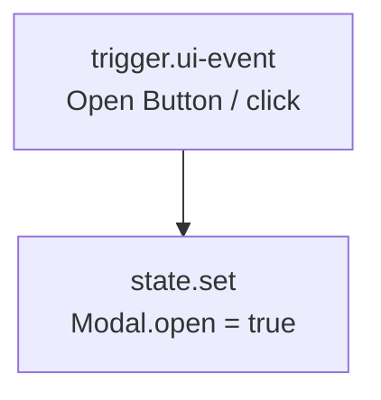
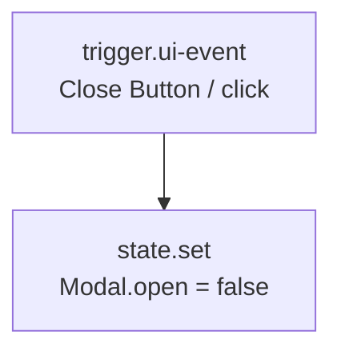

# Flowの使い方

通常のFlow追加操作から、ButtonのclickでModalを開閉する手順を示す。Modal専用のFlow作成機能は使用しない。

## 1. ButtonとModalを配置する

1. Libraryの`Button`をContent SurfaceへDrag and Dropする。
2. Libraryの`Modal`をOverlay SurfaceへDrag and Dropする。
3. Layersの`Overlay Surface > Modal`を展開する。
4. Libraryの`Button`をModalの`Footer` Named SlotへDrag and Dropする。

Content側のButtonを開くButton、Modal Footer内のButtonを閉じるButtonとして使用する。必要ならInspectorで各Buttonの`label`を変更する。

## 2. Flow変数を登録する

Flow欄の`+ Flow`を押す。作成したFlowの`Variables`で次のInstanceを1つずつ追加する。

- Content SurfaceのButton: `component-instance`
- Overlay SurfaceのModal: `component-instance`
- Modal Footer内のButton: `component-instance`

変数はPage上の実体を指す。LibraryのComponent DefinitionやDOM Selectorは指さない。

## 3. Modalを開くFlowを作る

1. `trigger.ui-event` Nodeを追加する。
2. `Component variable`にContent SurfaceのButtonを指定する。
3. `UI node`にButton Nodeを指定する。
4. `state.set` Nodeを追加する。
5. `Component variable`にModal Component Instanceを指定する。
6. `UI node`にModal Windowを指定する。
7. `State field`に`open`を指定する。
8. `Value`を有効にする。

## 4. Modalを閉じるFlowを作る

別のFlowを追加し、同じ手順で次を指定する。

- `trigger.ui-event`: Modal Footer内のButton変数、Button Node、`click`
- `state.set`: Modal Component Instance、Modal Window、`open = false`

## 5. Overlayを設定する

LayersでModalを選択し、Inspectorの`Overlay`で次を設定できる。

- `Position`: 左上・上中央・右上・左中央・中央・右中央・左下・下中央・右下
- `Content block`: 有効時は灰色の背景幕を表示し、背面Contentの操作を遮る

## 6. Previewで確認する

1. Headerの`プレビュー`を押す。
2. Content SurfaceのButtonを押し、Modalが表示されることを確認する。
3. Modal Footer内のButtonを押し、Modalが非表示になることを確認する。

`trigger.ui-event`を持つFlowはPreview上のEventから実行する。Flow欄の実行Buttonは使用しない。

## 7. Modalの初期状態

Modalの`open`初期値は`false`である。Applicationを再読み込みするとRuntime Stateが破棄され、初期値から再開するためModalは非表示になる。

Layersの眼アイコンは`open` Stateではなく、そのInstance自体を描画対象にするかを設定する。FlowからModalを開く場合は、眼アイコンを表示状態に保つ。

## 8. 現在のFlow Node

| Node | 役割 | 現在の実行可否 |
|---|---|---|
| `trigger.ui-event` | Component Instance内のUI Nodeで発生した`click`をFlowの開始点にする | Previewで実行可能 |
| `trigger.page-load` | PreviewでPageを表示した直後にFlowを1回開始する | Previewで実行可能 |
| `trigger.schedule` | Previewを表示している間、指定秒数ごとにFlowを開始する | Previewで実行可能 |
| `state.set` | Component Instance内のUI Node Stateへ文字列または真偽値を書き込む | 実行可能 |
| `resource.request` | REST API等のResourceへRequestを送る | 未実装 |

`trigger.schedule`はBrowserでApplicationを開いている間だけ実行するForeground Scheduleである。Browserを閉じている間の実行は保証しない。

## 9. ModalのFlow変数

Modalも他のUIと同じComponent InstanceとしてFlow変数へ表示する。FlowはOverlay Surfaceへの配置を参照せず、Modal Component Instance内のUI Nodeと`open` Stateを`state.set`で更新する。

Modalは単一の`contentTree`と単一のComponent Instanceを持つ。`allowedSurface: "overlay"`は配置先だけを制約し、Modal専用のInstanceやStateを追加しない。
